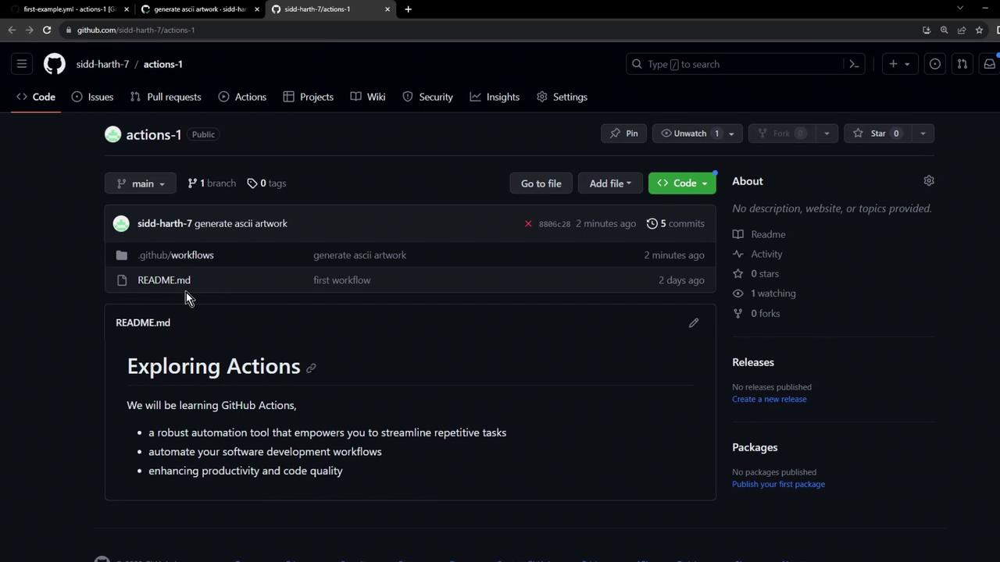

# Workflow to Generate ASCII Artwork

Source: https://notes.kodekloud.com/docs/GitHub-Actions/GitHub-Actions-Core-Concepts/Workflow-to-Generate-ASCII-Artwork/page

Automate ASCII art creation on every push using a GitHub Actions workflow with `cowsay` to generate and display art in CI logs.

Automate ASCII art creation on every push with a dedicated GitHub Actions workflow. Using `cowsay`, you’ll generate and display art in your CI logs, verify its output, and explore how ephemeral runners handle generated files.

## 1. Create the Workflow File

Under `.github/workflows`, create `generate-ascii.yaml`:

```yaml theme={null}
name: Generate ASCII Artwork
on:
  push:

jobs:
  ascii_job:
    runs-on: ubuntu-latest
    steps:
      - name: Checkout Repo
        uses: actions/checkout@v4

      - name: Install Cowsay
        run: sudo apt-get update && sudo apt-get install cowsay -y

      - name: Execute Cowsay
        run: cowsay -f dragon "Run for cover, I am a DRAGON....RAWR" >> dragon.txt

      - name: Verify Output
        run: grep -i "dragon" dragon.txt

      - name: Display Artwork
        run: cat dragon.txt

      - name: List Repository Files
        run: ls -ltra
```

## 2. Workflow Steps Overview

| Step               | Purpose                              | Command                                                 |
| ------------------ | ------------------------------------ | ------------------------------------------------------- |
| Checkout Repo      | Fetch code from GitHub               | `actions/checkout@v4`                                   |
| Install Cowsay     | Add ASCII-art generator to runner    | `sudo apt-get update && sudo apt-get install cowsay -y` |
| Generate ASCII Art | Create the dragon artwork            | `cowsay -f dragon "..." >> dragon.txt`                  |
| Verify Output      | Confirm “dragon” appears in the file | `grep -i "dragon" dragon.txt`                           |
| Display Artwork    | Print the generated ASCII art        | `cat dragon.txt`                                        |
| List Repo Files    | Inspect runner workspace contents    | `ls -ltra`                                              |

<Callout icon="lightbulb">
  Installing `cowsay` is crucial. Without it, any `cowsay` commands will fail.
</Callout>

## 3. Workflow Execution & Results

Once you commit and push, GitHub Actions triggers all workflows on `push`. In our example:

<Frame>
  
</Frame>

* The legacy workflow fails because it skips the `cowsay` install.
* **Generate ASCII Artwork** completes successfully.

### Installation Logs

```bash theme={null}
Run sudo apt-get update && sudo apt-get install cowsay -y
Reading package lists...
Building dependency tree...
Reading state information...
Suggested packages:
  filters cowsay-off
The following NEW packages will be installed:
  cowsay
0 upgraded, 1 newly installed, 0 to remove and 30 not upgraded.
Need to get 18.6 kB of archives.
...
```

### Generate & Verify Art

```bash theme={null}
cowsay -f dragon "Run for cover, I am a DRAGON....RAWR" >> dragon.txt
grep -i "dragon" dragon.txt
cat dragon.txt
```

### List Workspace Files

```bash theme={null}
ls -ltra
total 24
drwxr-xr-x 3 runner docker 4096 Oct 11 11:04 .
-rw-r--r-- 1 runner docker  227 Oct 11 11:04 README.md
drwxr-xr-x 8 runner docker 4096 Oct 11 11:04 .github
drwxr-xr-x 4 runner docker 4096 Oct 11 11:04 .git
-rw-r--r-- 1 runner docker 1017 Oct 11 11:04 dragon.txt
```

## 4. Ephemeral Runner Environment

<Callout icon="triangle-alert">
  Art files like `dragon.txt` exist only on the runner VM. Once the job ends, the VM is torn down and all generated files are lost.
</Callout>

<Frame>
  
</Frame>

## 5. Disabling Unused Workflows

If you have multiple workflows on the same event, disable any you don’t need:

1. Go to your repo’s **Actions** tab.
2. Select the workflow to disable.
3. Click **Disable workflow**.

This saves CI minutes and reduces clutter.

## Links and References

* [GitHub Actions Documentation](https://docs.github.com/actions)
* [actions/checkout](https://github.com/actions/checkout)
* [Cowsay on Wikipedia](https://en.wikipedia.org/wiki/Cowsay)

<CardGroup>
  <Card title="Watch Video" icon="video" href="https://learn.kodekloud.com/user/courses/github-actions/module/0ac6c98f-7100-471e-b9aa-037f25cb58d7/lesson/d4195049-5a87-418b-8deb-38ee9f083393" />
</CardGroup>
