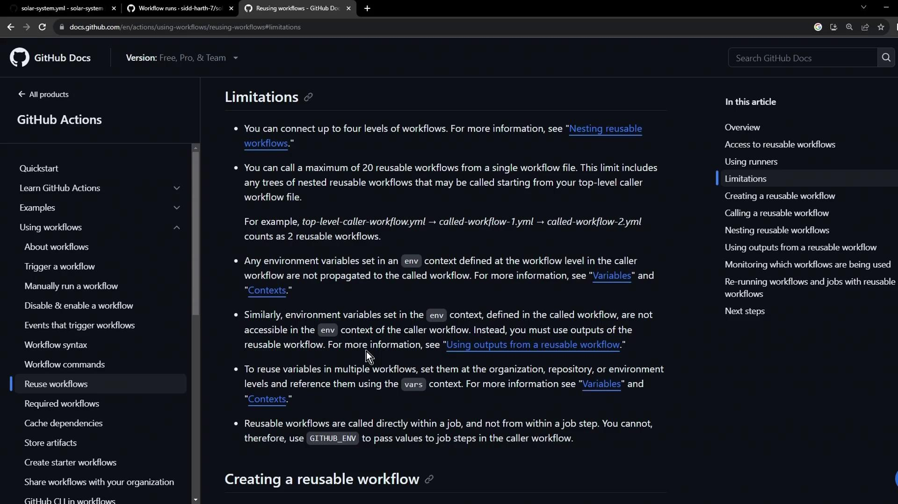

# Step 1 Configure new Reusable Workflow

Source: https://notes.kodekloud.com/docs/GitHub-Actions/Reusable-Workflows-and-Reporting/Step-1-Configure-new-Reusable-Workflow/page

Learn to refactor GitHub Actions workflows by creating reusable workflows for common deployment steps, reducing duplication and simplifying maintenance across repositories.

In this lesson, you’ll learn how to refactor your GitHub Actions workflows by extracting common deployment steps into a reusable workflow. This approach reduces duplication, ensures consistency, and simplifies maintenance across multiple repositories.

## 1.1 The “Solar System” Workflow: Before Refactoring

Imagine you have a single workflow handling everything from testing to deploying in both development and production. The deployment steps for `dev-deploy` and `prod-deploy` are identical—this is a maintenance headache:

```yaml theme={null}
name: Solar System Workflow

on:
  workflow_dispatch:
    branches:
      - main
      - 'feature/*'

env:
  MONGO_URI: 'mongodb+srv://supercluster.d83jj.mongodb.net/superData'
  MONGO_USERNAME: ${{ vars.MONGO_USERNAME }}
  MONGO_PASSWORD: ${{ secrets.MONGO_PASSWORD }}

jobs:
  unit-testing:
    # ...
  code-coverage:
    # ...
  docker:
    # ...
  dev-deploy:
    # duplicate deployment steps
  dev-integration-testing:
    # ...
  prod-deploy:
    # duplicate deployment steps
  prod-integration-testing:
    # ...
```

As your organization grows, you might copy these same steps into every project, leading to even more duplication.

## 1.2 Review Official Documentation

Before you begin, consult the GitHub Actions guide on reusing workflows. It details supported triggers, inputs, outputs, and known limitations:

<Frame>
  
</Frame>

<Callout icon="lightbulb">
  See [Reusing workflows](https://docs.github.com/en/actions/using-workflows/reusing-workflows) for all details on `workflow_call` triggers and scopes.
</Callout>

## 1.3 Create the Reusable Deployment Workflow

Create a new file `.github/workflows/reuse-deployment.yml` that declares a `workflow_call` trigger. Define all required inputs and secrets up front:

### Inputs and Secrets

| Name       | Description              | Required | Type   |
| ---------- | ------------------------ | -------- | ------ |
| namespace  | Kubernetes namespace     | true     | string |
| kubeconfig | Kubeconfig file contents | true     | string |

| Secret     | Description                  | Required |
| ---------- | ---------------------------- | -------- |
| KUBECONFIG | Kubernetes kubeconfig secret | true     |

### Workflow Definition

```yaml theme={null}
