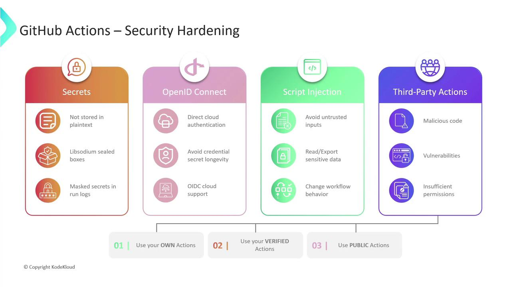

# Security hardening for GitHub Actions

Source: https://notes.kodekloud.com/docs/GitHub-Actions/Security-Guide/Security-hardening-for-GitHub-Actions/page

This guide covers best practices to secure GitHub Actions workflows, including encrypting secrets, using OIDC, sanitizing inputs, and vetting third-party actions.

In this guide, we’ll cover essential best practices to secure your [GitHub Actions workflows]. By implementing these measures—encrypting secrets, leveraging OIDC, sanitizing inputs, and vetting third-party actions—you’ll greatly reduce your CI/CD attack surface.

## 1. Secure Storage of Sensitive Information

Never commit credentials or tokens in plaintext. Instead, store them in [GitHub Secrets], which are encrypted at rest and in transit using [Libsodium sealed boxes]. Secrets can be defined at the organization, repository, or environment level. GitHub also masks secret values in workflow logs to prevent accidental exposure.

<Callout icon="triangle-alert">
  Avoid embedding any sensitive data directly in your YAML. Always reference secrets using `${{ secrets.YOUR_SECRET_NAME }}`.
</Callout>

## 2. OpenID Connect (OIDC)

Rather than managing long-lived cloud credentials, configure your workflows to request short-lived tokens via [OpenID Connect (OIDC)]. When you trust GitHub’s OIDC issuer in AWS, Azure, or GCP, your jobs can assume roles or service accounts on the fly—without secrets.

<Callout icon="lightbulb">
  Before enabling OIDC, update your cloud trust policies to accept tokens from `token.actions.githubusercontent.com`.
</Callout>

## 3. Mitigating Script Injection Attacks

Workflows often process inputs from environment variables, third-party services, or user parameters. Malicious actors can exploit improper handling to inject commands or scripts.

* Sanitize and validate all external inputs.
* Avoid building shell commands via string concatenation.
* Use strongly typed inputs in custom actions (e.g., `boolean`, `integer`).
* Run untrusted code inside containerized steps to provide isolation.

<Callout icon="triangle-alert">
  Never pass unescaped variables directly into `run:` blocks. Use parameterized inputs instead.
</Callout>

## 4. Evaluating Third-Party Actions

While reusable actions streamline your workflows, they can introduce risks:

* **Malicious logic**: Hidden backdoors or exfiltration code
* **Undisclosed vulnerabilities**: Bugs exploitable after installation
* **Excessive permissions**: Actions requesting more scopes than necessary

| Action Source               | Risk                                    | Mitigation                                                  |
| --------------------------- | --------------------------------------- | ----------------------------------------------------------- |
| Community (unverified)      | Malicious code, unknown vulnerabilities | Review source, pin to commit SHA, grant minimal scopes      |
| GitHub-verified Marketplace | Lower review risk                       | Confirm blue check, pin versions, audit permissions         |
| Custom internal actions     | Full control                            | Maintain code, update dependencies, enforce least privilege |

### Best Practices

1. Author and maintain your own actions when possible.
2. Combine internal actions with **verified** Marketplace actions.
3. Pin action versions to a specific tag or commit SHA to prevent unexpected changes.

<Frame>
  
</Frame>

***

## Links and References

* [GitHub Actions workflows]: https://docs.github.com/actions/using-workflows
* [GitHub Secrets]: https://docs.github.com/actions/security-guides/encrypted-secrets
* [Libsodium sealed boxes]: https://libsodium.gitbook.io/doc/public-key_cryptography/sealed_boxes
* [OpenID Connect (OIDC)]: https://openid.net/connect/

<CardGroup>
  <Card title="Watch Video" icon="video" href="https://learn.kodekloud.com/user/courses/github-actions/module/48b4f34c-9ebb-4049-baa1-40490c46d2eb/lesson/a3fb3f4e-da9b-434b-9cb1-ccc8ab790857" />
</CardGroup>
