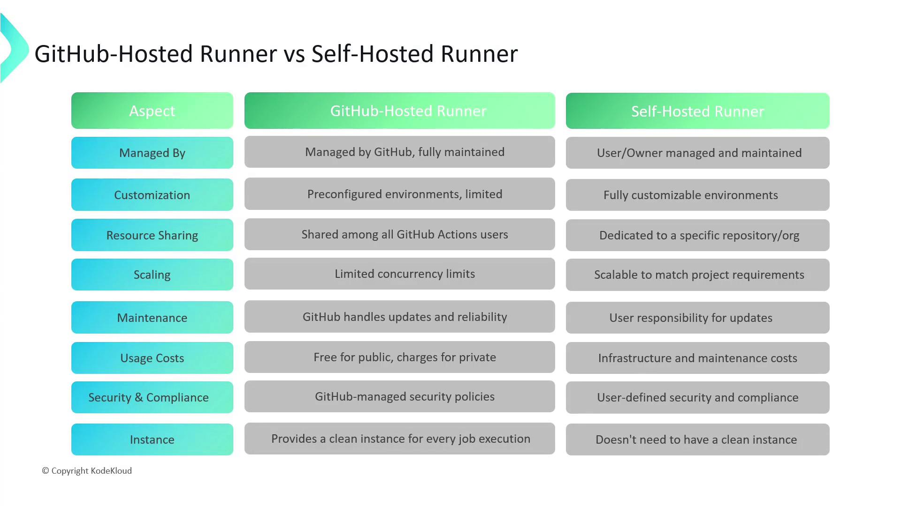
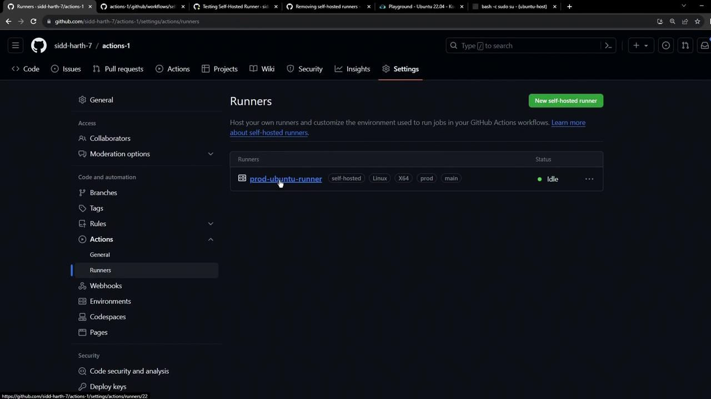
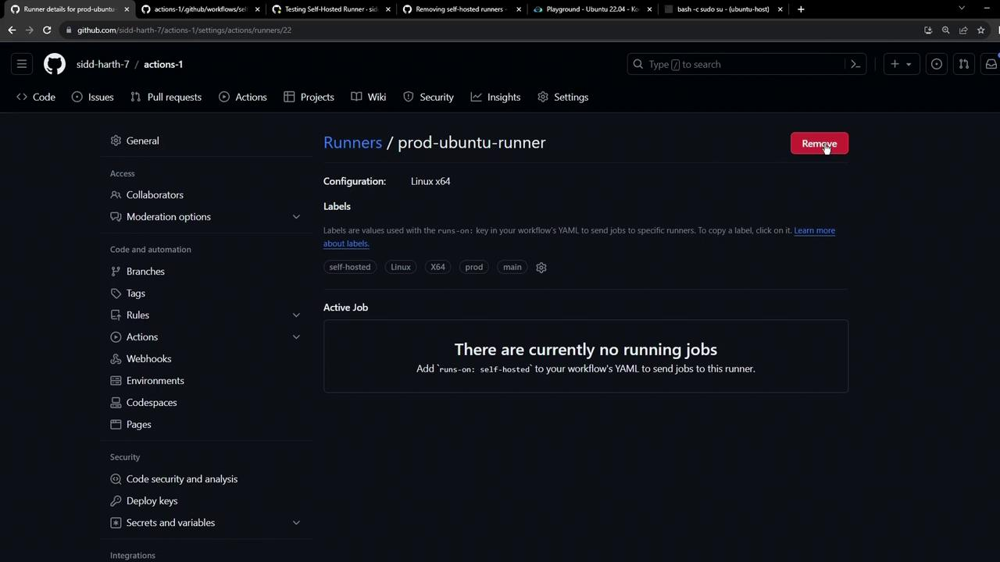
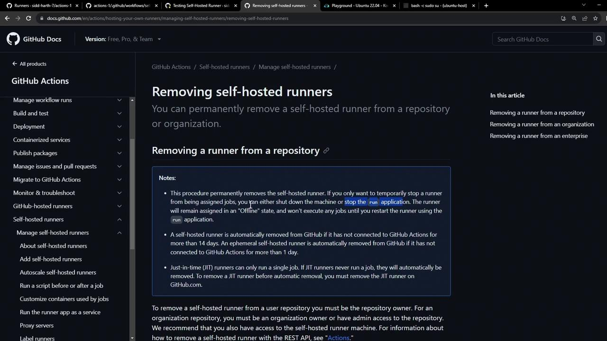
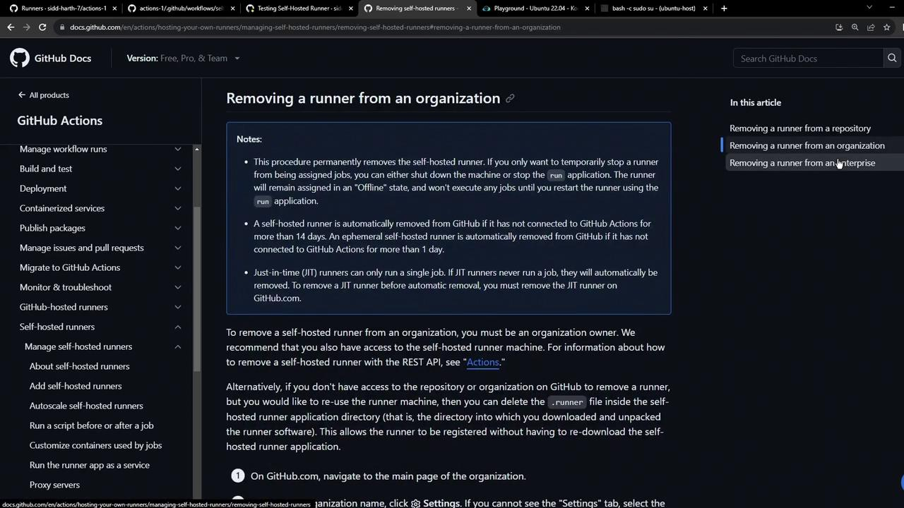

# 1. Create and navigate to the runner directory
mkdir actions-runner && cd actions-runner

# 2. Download the runner package
curl -L https://github.com/actions/runner/releases/download/v2.309.0/actions-runner-linux-x64-2.309.0.tar.gz \
     --output actions-runner-linux-x64-2.309.0.tar.gz

# 3. Extract the archive
tar xzf actions-runner-linux-x64-2.309.0.tar.gz

# 4. Configure the runner (replace placeholders)
./config.sh --url https://github.com/OWNER/REPOSITORY --token YOUR_TOKEN

# Follow prompts to:
# - Select runner group (press Enter for Default)
# - Name the runner (e.g., linux-gpu-runner)
# 5. Start the runner
./run.sh
```

Sample output:

```text theme={null}
√ Connected to GitHub
Current runner version: '2.309.0'
2023-09-15 07:04:23Z: Listening for Jobs
```

To use your self-hosted runner in a workflow, specify its labels in the `runs-on` field:

```yaml theme={null}
jobs:
  build:
    runs-on: [self-hosted, Linux, X64, gpu]
    steps:
      - uses: actions/checkout@v3
      - run: echo "Running on a self-hosted GPU runner"
```

<Callout icon="triangle-alert">
  Maintaining self-hosted runners requires you to manage updates, security patches, and uptime. Ensure you have monitoring and backup strategies in place.
</Callout>

## Comparison: GitHub-Hosted vs. Self-Hosted

<Frame>
  
</Frame>

| Feature               | GitHub-Hosted                            | Self-Hosted                         |
| --------------------- | ---------------------------------------- | ----------------------------------- |
| Management            | Maintained by GitHub                     | Managed by you or your organization |
| Customization         | Predefined environments                  | Fully customizable                  |
| Resource Sharing      | Shared pool with concurrency limits      | Dedicated resources                 |
| Scaling               | Fixed concurrency                        | Dynamic scaling                     |
| Maintenance           | Automatic updates by GitHub              | Manual updates and patching         |
| Usage Costs           | Free for public, paid quotas for private | Infrastructure & maintenance costs  |
| Security & Compliance | GitHub’s security policies               | Your own security measures          |
| Instance Handling     | Fresh VM per job                         | Persistent runner for multiple jobs |

## Links and References

* [GitHub Actions Runners Documentation][gh-docs]
* [Hosting your own runners][gh-self-hosted]
* [Job Matrices in GitHub Actions][job-matrices]
* [GPU Beta Program][gpu-beta]

[gh-docs]: https://docs.github.com/en/actions

[gh-self-hosted]: https://docs.github.com/en/actions/hosting-your-own-runners

[job-matrices]: https://docs.github.com/en/actions/using-jobs/using-a-matrix-for-your-jobs

[gpu-beta]: https://docs.github.com/en/actions/hosting-your-own-runners/about-self-hosted-runners#gpu-enabled-runners

<CardGroup>
  <Card title="Watch Video" icon="video" href="https://learn.kodekloud.com/user/courses/github-actions/module/8d91a711-49f5-449c-9531-393bfdc7d9b5/lesson/1b09154d-00d9-4dd3-91d3-d3685e1c29f8" />
</CardGroup>


# Uninstalling Self Hosted Runner

Source: https://notes.kodekloud.com/docs/GitHub-Actions/Self-Hosted-Runner/Uninstalling-Self-Hosted-Runner/page

This guide explains how to uninstall a GitHub Actions self-hosted runner at various levels using the GitHub UI or configuration script.

In this guide, you’ll learn how to remove a GitHub Actions self-hosted runner at the repository, organization, or enterprise level. You can either delete it via the GitHub UI or clean up directly on the runner host using the configuration script.

## Removing a Runner via the GitHub UI

1. Navigate to your repository’s **Settings** > **Actions** > **Runners**.
2. Click the runner you want to remove.

<Frame>
  
</Frame>

3. On the runner details page, click **Remove**.

<Frame>
  
</Frame>

<Callout icon="lightbulb">
  If you have MFA enabled, GitHub will prompt you for your authentication code. Once verified, the runner is permanently removed from the repository.
</Callout>

## Cleaning Up the Runner Host

After deleting the runner in the UI, you may want to wipe its local installation, especially if you plan to repurpose the machine.

### Using the Configuration Script

Run the `config.sh remove` command on the host. Replace `<TOKEN>` with the token shown in your runner settings.

```bash theme={null}
./config.sh remove --token BDEP64UGVZVU2AQTIMJUN3FG7ZKU --unattended
```

This command will:

* Uninstall the runner application
* Remove configuration files
* Unregister the runner from GitHub

<Callout icon="triangle-alert">
  Ensure you copy the exact token from your repository’s runner settings. An invalid token will prevent the runner from unregistering.
</Callout>

### Stopping the Runner Process Manually

If you skip the config script, simply terminate the running service or process (e.g., `run.sh`). The runner will appear as **offline** in GitHub and will not accept new jobs.

According to the [GitHub documentation](https://docs.github.com/en/actions/hosting-your-own-runners/managing-self-hosted-runners/removing-self-hosted-runners), any self-hosted runner offline for over 14 days is automatically removed.

<Frame>
  
</Frame>

## Removing a Runner at Organization or Enterprise Level

The steps are identical for organization or enterprise runners:

1. Go to **Organization Settings** or **Enterprise Settings** > **Actions** > **Runners**.
2. Select the runner and click **Remove**.
3. On the runner host, run the same `config.sh remove` command or stop the service.

<Frame>
  
</Frame>

## Comparison of Removal Methods

| Method                     | Scope                 | Effect                                         | Command                              |
| -------------------------- | --------------------- | ---------------------------------------------- | ------------------------------------ |
| GitHub UI                  | Repo, Org, Enterprise | Immediate UI removal                           | N/A                                  |
| config.sh remove           | Runner host           | Uninstalls & unregisters runner                | `./config.sh remove --token <TOKEN>` |
| Manual process termination | Runner host           | Marks runner offline, auto-prune after 14 days | `kill <PID>` or stop service         |

## References

* [GitHub Actions: Removing Self-Hosted Runners](https://docs.github.com/en/actions/hosting-your-own-runners/managing-self-hosted-runners/removing-self-hosted-runners)
* [GitHub Actions Administration](https://docs.github.com/en/actions/learn-github-actions/managing-actions-workflows)

<CardGroup>
  <Card title="Watch Video" icon="video" href="https://learn.kodekloud.com/user/courses/github-actions/module/8d91a711-49f5-449c-9531-393bfdc7d9b5/lesson/3898b06b-fbfe-4b71-a3e6-95711c9a4028" />

  <Card title="Practice Lab" icon="installation" href="https://learn.kodekloud.com/user/courses/github-actions/module/8d91a711-49f5-449c-9531-393bfdc7d9b5/lesson/e719e9ed-b770-408e-a5c4-e55725fd7ef5" />
</CardGroup>
