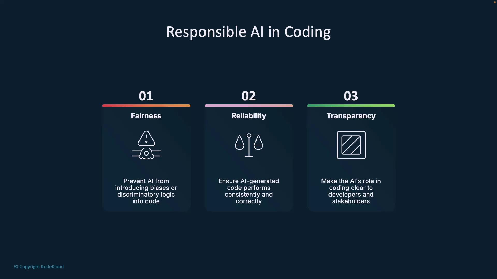

# [AI-Generated] Reviewed for SQL injection vulnerabilities
```

Use commit messages like:

```bash theme={null}
git commit -m "[AI-generated] Add input sanitization"
```

<Callout icon="lightbulb">
  An audit trail simplifies compliance reporting and future code health checks.
</Callout>

<Frame>
  
</Frame>

### 3. Apply Human Oversight

Treat Copilot like a junior engineer. Integrate static-analysis tools (e.g., [SonarQube](https://www.sonarqube.org/)) and unit-testing frameworks (e.g., [PyTest](https://docs.pytest.org/)) into your CI/CD pipeline to catch security flaws and regressions before merging.

***

## Responsible AI Principles

Embedding ethics and quality controls into AI-assisted development ensures your code remains fair, reliable, and transparent.

| Principle    | Implementation                                                  |
| ------------ | --------------------------------------------------------------- |
| Fairness     | Run bias detection (e.g., [Fairlearn](https://fairlearn.org/)). |
| Reliability  | Validate edge cases and performance under load.                 |
| Transparency | Label AI-generated code and document reviews.                   |

<Frame>
  
</Frame>

***

## Additional Best Practices

* Use bias-detection tools to scan AI-written logic for discriminatory patterns.
* Apply the same testing rigor to Copilot suggestions as to human-written code.
* Keep shared documentation of AI contributions for team visibility.
* Provide training on ethical AI use and potential pitfalls.
* Always validate AI code in a sandbox before production deployment.

<Frame>
  
</Frame>

***

## Tools and Implementation Examples

| Tool            | Purpose                          | Example Usage                                   |
| --------------- | -------------------------------- | ----------------------------------------------- |
| Fairlearn       | Bias detection                   | `fairlearn.metrics.MetricFrame(...)`            |
| PyTest          | Unit & integration testing       | `pytest tests/`                                 |
| SonarQube       | Code quality & security analysis | Integrate via GitHub Actions or Jenkins         |
| Git Commit Tags | Trace AI contributions           | `git commit -m "[AI-generated] Validate input"` |

***

## Summary

Generative AI like GitHub Copilot offers significant productivity gains but also introduces opacity, bias, and security risks. By enforcing a governance framework, maintaining transparency, and applying rigorous human oversight, you can harness Copilot’s potential and keep your codebase secure, fair, and maintainable.

***

## Links and References

* [GitHub Copilot](https://github.com/features/copilot)
* [SonarQube Documentation](https://docs.sonarqube.org/)
* [PyTest Documentation](https://docs.pytest.org/)
* [Fairlearn](https://fairlearn.org/)
* [GDPR Compliance Overview](https://gdpr.eu/)
* [CI/CD Best Practices](https://docs.github.com/en/actions)

<CardGroup>
  <Card title="Watch Video" icon="video" href="https://learn.kodekloud.com/user/courses/github-copilot-certification/module/3d32a217-aca3-450a-882e-c9304c497387/lesson/4eb05950-aba6-4a36-90a4-ae2e9d8df768" />
</CardGroup>


# Comment driven Development

Source: https://notes.kodekloud.com/docs/GitHub-Copilot-Certification/Introduction/Comment-driven-Development/page

Leverage descriptive comments to auto-generate boilerplate classes, methods, and tests in Python using GitHub Copilot for faster development and consistency.

Leverage descriptive comments to auto-generate boilerplate classes, domain-specific methods, and tests in Python using GitHub Copilot. This workflow speeds up development and enforces consistency across your codebase.

## Table of Contents

1. [Overview](#overview)
2. [Prerequisites](#prerequisites)
3. [Generate a Python Class from Comments](#generate-a-python-class-from-comments)
4. [Extend with Domain-Specific Methods](#extend-with-domain-specific-methods)
5. [Comment-Driven Function Generation](#comment-driven-function-generation)
6. [Auto-Generate Unit Tests](#auto-generate-unit-tests)
7. [Resources & References](#resources--references)

***

## Overview

Comment-driven development (CDD) lets you write plain-English comments that describe the code you need. GitHub Copilot reads these comments and generates the corresponding implementation, including:

* Classes with type hints and validation
* Data-processing methods
* Standalone functions
* `pytest` unit tests

CDD reduces boilerplate and keeps your focus on business logic.

***

## Prerequisites

Before you begin, ensure the following are installed:

| Tool                     | Purpose                | Install Command                                                        |
| ------------------------ | ---------------------- | ---------------------------------------------------------------------- |
| GitHub Copilot extension | AI code completion     | Available via VS Code Marketplace                                      |
| Python ≥ 3.8             | Language runtime       | [https://www.python.org/downloads/](https://www.python.org/downloads/) |
| pandas                   | Data processing        | `pip install pandas`                                                   |
| pytest                   | Unit testing framework | `pip install pytest`                                                   |

***

## Generate a Python Class from Comments

Open `main.py` and write a high-level description of the class you want:

```python theme={null}
