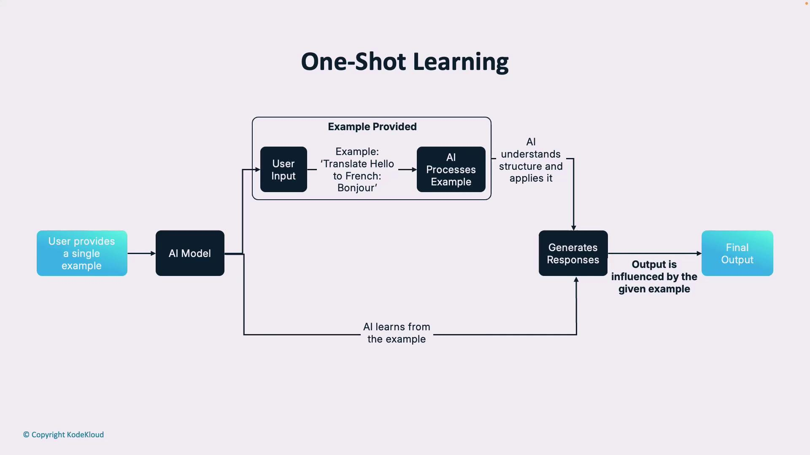
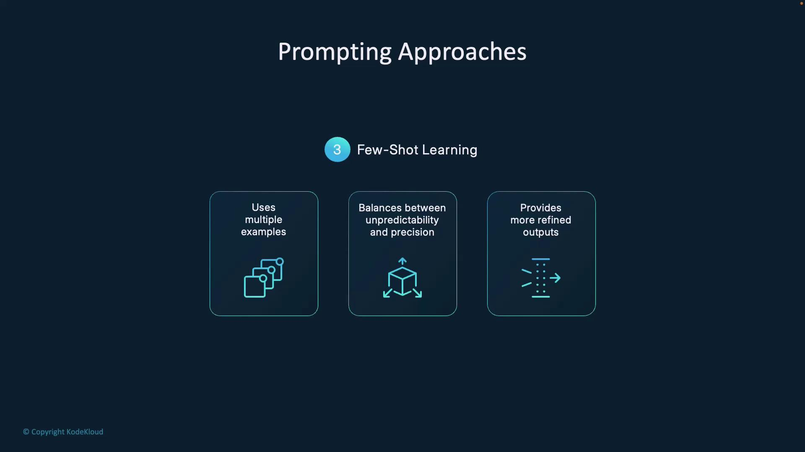
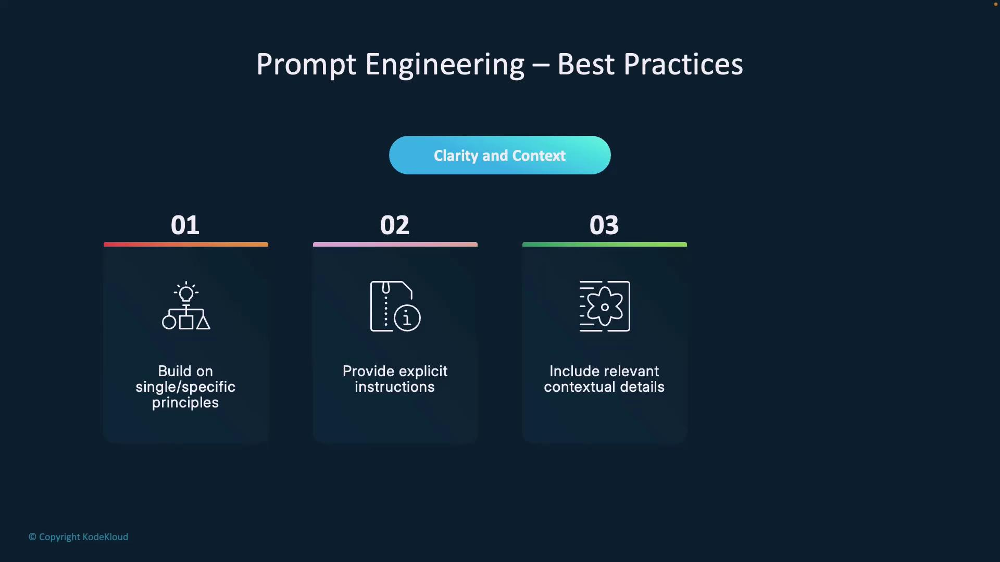
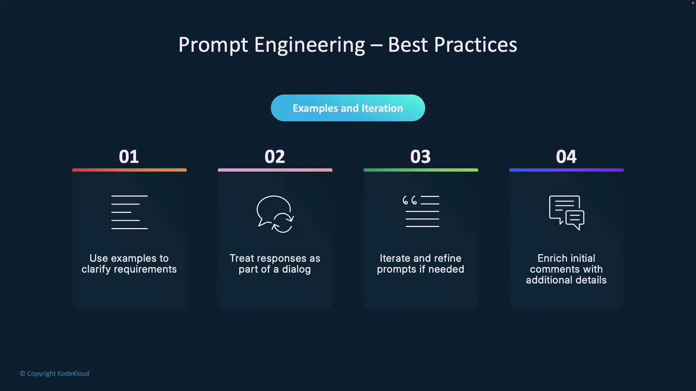
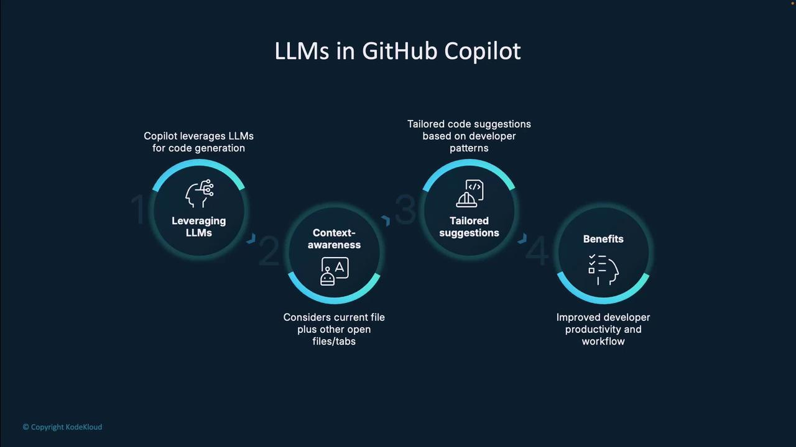
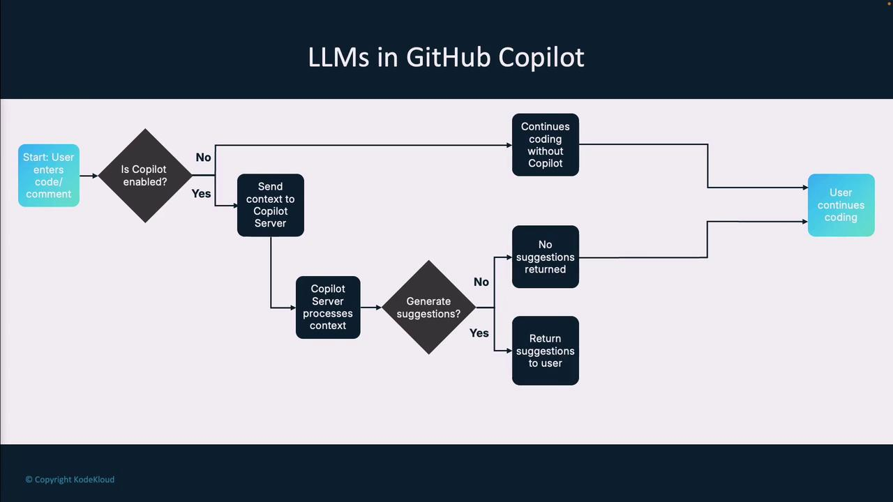
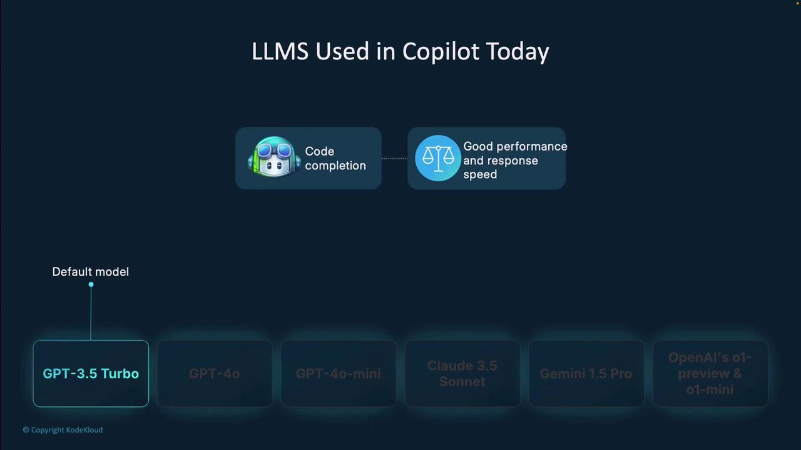
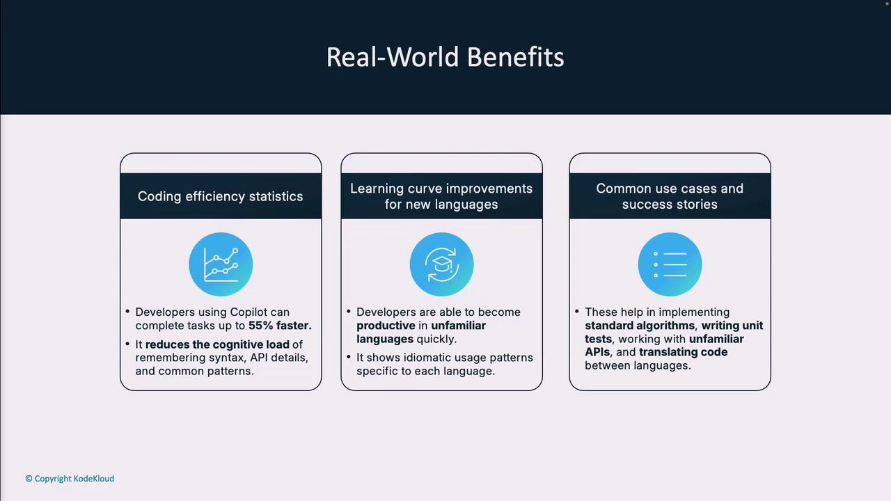

# Example:
# Input: 3
# Output: 6
Write a Python function that calculates the factorial of a given number.
```

<Frame>
  
</Frame>

***

### Few-Shot Learning

<Frame>
  
</Frame>

By supplying several examples—covering error handling, patterns, or architectural styles—you help the AI generalize reliably for new scenarios.

***

## Best Practices

### Clarity & Context

* Build on **Single** and **Specific**.
* Include frameworks, coding standards, and performance goals.
* Annotate with comments to clarify intent.

<Frame>
  
</Frame>

### Examples & Iteration

* Use illustrative examples whenever possible.
* Treat prompts as a back-and-forth conversation.
* Refine and enrich prompts based on feedback.

<Frame>
  
</Frame>

With practice, you’ll build intuition for choosing the right prompting approach and crafting instructions that consistently yield high-quality AI outputs.

***

## Links and References

* [GitHub Copilot Documentation](https://docs.github.com/en/copilot)
* [OpenAI API Reference](https://platform.openai.com/docs/api-reference)
* [AI Prompt Engineering Best Practices](https://developers.google.com/machine-learning/guides/text-classification/prompt-design)

<CardGroup>
  <Card title="Watch Video" icon="video" href="https://learn.kodekloud.com/user/courses/github-copilot-certification/module/a78afa07-cb17-4076-996d-b7ecebb64ef3/lesson/4d068aaa-bf5e-4e38-a647-b19986b514a6" />
</CardGroup>


# GitHub LLMs

Source: https://notes.kodekloud.com/docs/GitHub-Copilot-Certification/Prompt-Engineering-with-Copilot/GitHub-LLMs/page

Learn how GitHub Copilot uses large language models to enhance developer productivity through code completion, documentation, and adaptive learning.

Learn how GitHub Copilot harnesses large language models (LLMs) to boost developer productivity. We’ll dive into LLM fundamentals, Copilot’s integration, workflow, model options, real-world advantages, upcoming features, and how your feedback drives continuous improvement.

## What Are Large Language Models (LLMs)?

Large language models are AI-driven systems trained on massive corpora of text and code. They learn statistical patterns to generate and understand language, making them invaluable for code completion, documentation, and more.

Key characteristics:

* **Massive Training Data**\
  Trained on trillions of tokens from books, docs, websites, and public code.
* **Contextual Understanding**\
  Predicts tokens based on surrounding text and code, enabling accurate completions.
* **Scale of Parameters**\
  From hundreds of millions to trillions of parameters—more parameters yield richer reasoning.
* **Versatility**\
  The same model architecture can handle Python, JavaScript, natural language docs, and beyond.

<Frame>
  
</Frame>

<Callout icon="lightbulb">
  LLMs power features like intelligent code completion, automated documentation, and natural language query support.
</Callout>

## How GitHub Copilot Leverages LLMs

GitHub Copilot is fine-tuned on billions of lines of public source code. This narrow specialization equips it to understand syntax, design patterns, and library usage across multiple languages.

Core capabilities:

* **Context Awareness**\
  Analyzes open files, project structure, comments, and imports to tailor suggestions.
* **Adaptive Learning**\
  Refines recommendations by learning your coding style and project conventions.
* **End-to-End Assistance**\
  From single-line completions to full function scaffolding, complex algorithm stubs, and inline docs.

<Frame>
  
</Frame>

## GitHub Copilot Workflow

1. Start typing code or a natural language comment.
2. Copilot (if enabled) streams the current editor context to the server.
3. The server evaluates whether to generate suggestions.
4. If suggestions are available:
   * **Accept** inserts the code and updates context.
   * **Reject** leaves your code unchanged and refocuses on your edit.
5. If no suggestions are found, continue coding as normal.

<Frame>
  
</Frame>

<Callout icon="triangle-alert">
  Ensure you review generated code for security and correctness before merging into production.
</Callout>

## LLM Options in GitHub Copilot

Choose the best model for speed, accuracy, or cost-efficiency. Below is a summary:

| Model                | Strength                             | Use Case                              |
| -------------------- | ------------------------------------ | ------------------------------------- |
| GPT-3.5 Turbo        | Fast, cost-effective                 | General-purpose coding assistance     |
| GPT-4.0              | Deep context, more accurate          | Complex algorithms, larger codebases  |
| GPT-4.0 Mini         | Compact version of GPT-4             | Quick completions with high quality   |
| Claude 3.5 Sonnet    | Alternative architecture (Anthropic) | Diverse perspectives on code patterns |
| Gemini Pro           | Google’s advanced LLM                | Multimodal tasks, mixed-language docs |
| O1 Preview & O1 Mini | Cutting-edge code-specialized models | Latest research-backed features       |

<Frame>
  
</Frame>

## Real-World Benefits

Developers report significant gains when using Copilot:

| Benefit                  | Impact                                                                 |
| ------------------------ | ---------------------------------------------------------------------- |
| Coding Efficiency        | Up to 55% faster task completion                                       |
| Learning Curve Reduction | Rapid onboarding for new languages and frameworks                      |
| Common Use Cases         | Boilerplate generation, unit tests, API exploration, refactoring, docs |

<Frame>
  
</Frame>

## Future Developments

GitHub is evolving Copilot with:

* **Specialized Model Variants**\
  Fine-tuned for specific languages and frameworks.
* **Expanded Context Windows**\
  Enabling models to consider entire repositories.
* **Advanced Reasoning**\
  Understanding program behavior, not just syntax.
* **Multimodal Capabilities**\
  Generating diagrams, code, tests, and documentation from a single prompt.
* **Architectural Guidance**\
  Tools to design and review large-scale system structures.

<Frame>
  
</Frame>

## Feedback & Model Refinement

Every accept, edit, or rejection you make helps Copilot learn via reinforcement learning from human feedback (RLHF). This loop drives continuous improvement in suggestion relevance, accuracy, and safety.

<Frame>
  
</Frame>

***

By integrating powerful LLMs into your editing workflow, GitHub Copilot transforms the coding experience—boosting productivity, reducing errors, and accelerating learning. Keep providing feedback to shape the next generation of AI-powered coding assistants!

## Links and References

* [GitHub Copilot Documentation](https://docs.github.com/copilot)
* [Kubernetes Basics](https://kubernetes.io/docs/concepts/overview/what-is-kubernetes/)
* [Docker Hub](https://hub.docker.com/)
* [Terraform Registry](https://registry.terraform.io/)

<CardGroup>
  <Card title="Watch Video" icon="video" href="https://learn.kodekloud.com/user/courses/github-copilot-certification/module/a78afa07-cb17-4076-996d-b7ecebb64ef3/lesson/9e15a8f4-e41f-4905-aa3a-ada6be9880e5" />
</CardGroup>
