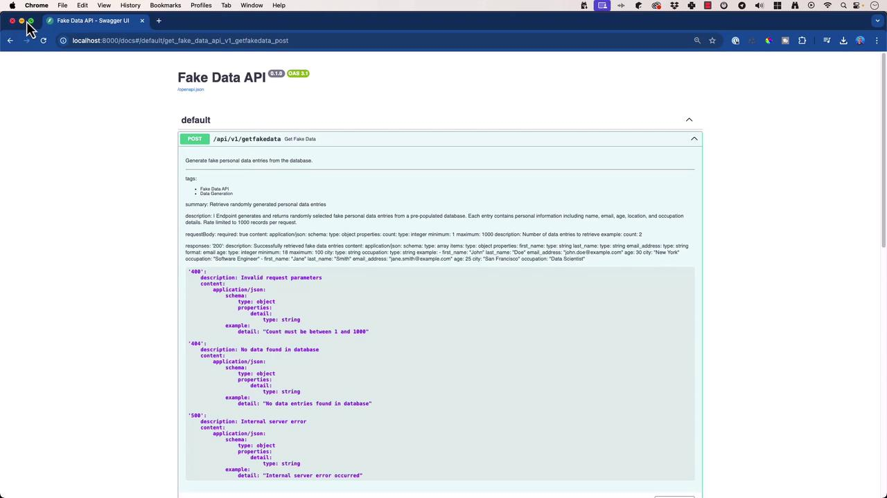

# main.py
from fastapi import FastAPI, HTTPException
from pydantic import BaseModel
import sqlite3
from typing import List, Dict
from contextlib import contextmanager
from pathlib import Path

app = FastAPI(
    title="Fake Data API",
    description="Generate and retrieve random personal data entries via RESTful endpoints",
    version="1.0.0",
)

class DataRequest(BaseModel):
    count: int

BASE_DIR = Path(__file__).resolve().parent
DATA_DIR = BASE_DIR / "data" / "db"
DB_PATH = DATA_DIR / "fakedata.db"

# Ensure database directory exists
DATA_DIR.mkdir(parents=True, exist_ok=True)
```

## 3. Database Context Manager

```python theme={null}
# main.py (continued)
@contextmanager
def get_db_connection():
    """
    Manage SQLite connections with row_factory for dict-like access.

    Yields:
        sqlite3.Connection: Active database connection.

    Raises:
        sqlite3.Error: On connection failures.
    """
    conn = sqlite3.connect(DB_PATH)
    conn.row_factory = sqlite3.Row
    try:
        yield conn
    finally:
        conn.close()
```

## 4. Fetching Fake Data

```python theme={null}
# main.py (continued)
def fetch_fake_data(count: int) -> List[Dict]:
    """
    Retrieve a random selection of fake data entries.

    Args:
        count (int): Number of records (1–1000).

    Returns:
        List[Dict]: Fake data entries.

    Raises:
        HTTPException(400): If count is out of range.
        HTTPException(404): If no records are found.
    """
    if not (1 <= count <= 1000):
        raise HTTPException(status_code=400, detail="Count must be between 1 and 1000")

    with get_db_connection() as conn:
        cursor = conn.cursor()
        cursor.execute(
            """
            SELECT first_name, last_name, email_address, age, city, occupation
            FROM fake_data
            ORDER BY RANDOM()
            LIMIT ?
            """,
            (count,),
        )
        rows = cursor.fetchall()
        if not rows:
            raise HTTPException(status_code=404, detail="No data entries found")
        return [dict(row) for row in rows]
```

<Callout icon="triangle-alert">
  Requests exceeding 1000 entries will return a **400 Bad Request**. Always validate `count` before calling the endpoint.
</Callout>

## 5. Defining the API Endpoint

```python theme={null}
# main.py (continued)
from fastapi.responses import JSONResponse

@app.post(
    "/api/v1/getfakedata",
    response_model=List[Dict],
    tags=["Fake Data Generation"],
    summary="Generate random fake personal data entries",
)
async def get_fake_data(request: DataRequest):
    """
    Generate and return fake personal data.

    - **count**: Number of entries (min: 1, max: 1000)

    **Responses**  
    - 200: Successfully retrieved data  
    - 400: Invalid parameters  
    - 404: No records found  
    - 500: Internal server error  
    """
    data = fetch_fake_data(request.count)
    return JSONResponse(content=data)
```

| Status Code | Description                      |
| ----------- | -------------------------------- |
| 200         | Successfully retrieved fake data |
| 400         | Invalid request parameters       |
| 404         | No data entries found            |
| 500         | Internal server error            |

## 6. Running the Server

```python theme={null}
# main.py (continued)
if __name__ == "__main__":
    import uvicorn
    uvicorn.run(app, host="0.0.0.0", port=8000)
```

Start your server:

```bash theme={null}
(venv) $ python main.py
INFO:     Started server process [12345]
INFO:     Uvicorn running on http://127.0.0.1:8000 (Press CTRL+C to quit)
```

Visit:

* Swagger UI: [http://127.0.0.1:8000/docs](http://127.0.0.1:8000/docs)
* Redoc:       [http://127.0.0.1:8000/redoc](http://127.0.0.1:8000/redoc)
* OpenAPI JSON: [http://127.0.0.1:8000/openapi.json](http://127.0.0.1:8000/openapi.json)

## 7. Swagger UI & Redoc Interfaces

<Frame>
  
</Frame>

The interactive Swagger UI provides parameter descriptions, request/response examples, and error schemas.

<Frame>
  
</Frame>

## 8. Fine-Tuning Your OpenAPI Schema

* **Docstring Conventions**: Follow [PEP 257](https://peps.python.org/pep-0257/) and embed OpenAPI YAML blocks for richer metadata.
* **Examples & Schemas**: Include `example` sections for request/response payloads.
* **Error Documentation**: Clearly list possible HTTP error codes and messages.
* **Security & Rate Limits**: Add `securitySchemes` and rate-limit info under `components` and endpoint descriptions.

FastAPI updates your docs in real time as you refine docstrings—no extra tooling required!

## 9. Links and References

* [FastAPI Documentation](https://fastapi.tiangolo.com/)
* [Uvicorn — The Lightning-Fast ASGI Server](https://www.uvicorn.org/)
* [Pydantic Documentation](https://pydantic-docs.helpmanual.io/)
* [SQLite Official Docs](https://www.sqlite.org/docs.html)

<CardGroup>
  <Card title="Watch Video" icon="video" href="https://learn.kodekloud.com/user/courses/github-copilot-certification/module/a8b1c2a2-f3f7-4470-9347-0ad31f2ab3cc/lesson/52ce8950-a550-4bb4-97c1-26a848f1d591" />
</CardGroup>


# Creating In code Documentation

Source: https://notes.kodekloud.com/docs/GitHub-Copilot-Certification/Using-Copilot-Efficiently/Creating-In-code-Documentation/page

Learn to write clear, maintainable documentation in Python code for FastAPI services, covering comments, docstrings, Pydantic models, and README generation.

In this guide, you’ll learn how to write clear, maintainable documentation directly inside your Python code. We’ll cover:

* Inline comments
* Structured docstrings (PEP 257)
* Leveraging [GitHub Copilot][copilot]
* Documenting [Pydantic][pydantic] models
* Generating a `README.md` automatically

Our running example is a simple FastAPI service that generates fake data.

## Table of Contents

1. [Basic FastAPI Endpoint](#1-basic-fastapi-endpoint)
2. [Adding Inline Comments](#2-adding-inline-comments)
3. [Writing Comprehensive Docstrings](#3-writing-comprehensive-docstrings)
4. [Using GitHub Copilot to Generate Comments](#4-using-github-copilot-to-generate-comments)
5. [Documenting Your Pydantic Models](#5-documenting-your-pydantic-models)
6. [Generating a README with Copilot](#6-generating-a-readme-with-copilot)
7. [Summary & Best Practices](#7-summary--best-practices)
8. [Links and References](#links-and-references)

***

## 1. Basic FastAPI Endpoint

Start with a minimal router in `router.py`:

```python theme={null}
from fastapi import APIRouter
from ..models.fake_data_request import FakeDataRequest
from ...data.fake_data_repository import get_fake_data

router = APIRouter()

@router.post("/getfakedata")
async def generate_fake_data(request: FakeDataRequest) -> dict:
    data = get_fake_data(request.data_type, request.count)
    return {"data": data}
```

Run the server:

```plaintext theme={null}
INFO:     Uvicorn running on http://0.0.0.0:8000 (Press CTRL+C to quit)
127.0.0.1:56608 - "POST /getfakedata HTTP/1.1" 200 OK
```

***

## 2. Adding Inline Comments

Inline comments help readers follow the code flow without jumping to external docs:

```python theme={null}
@router.post("/getfakedata")
async def generate_fake_data(request: FakeDataRequest) -> dict:
    # Fetch fake data based on request parameters
    data = get_fake_data(request.data_type, request.count)
    # Return JSON response with the data list
    return {"data": data}
```

<Callout icon="lightbulb">
  Keep inline comments concise—explain **why**, not **what**. The code itself should reveal the “what.”
</Callout>

***

## 3. Writing Comprehensive Docstrings

Use PEP 257-style docstrings to detail arguments, return values, and examples:

```python theme={null}
@router.post("/getfakedata")
async def generate_fake_data(request: FakeDataRequest) -> dict:
    """
    Generate fake data according to the provided request.

    Args:
        request (FakeDataRequest):
            - data_type (str): Type of data (e.g., "user", "email").
            - count (int): Number of items to generate.

    Returns:
        dict:
            JSON response with a "data" key containing the list of results.

    Example:
        POST /getfakedata
        {
            "data_type": "user",
            "count": 5
        }
    """
    data = get_fake_data(request.data_type, request.count)
    return {"data": data}
```

```plaintext theme={null}
127.0.0.1:56599 - "POST /getfakedata HTTP/1.1" 422 Unprocessable Entity
127.0.0.1:56599 - "POST /getfakedata HTTP/1.1" 200 OK
```

***

## 4. Using GitHub Copilot to Generate Comments

Let Copilot accelerate your documentation:

1. Open `router.py` in VS Code (or your editor).
2. Place cursor above the function.
3. Type:

   ```text theme={null}
   # Please generate a docstring explaining this function
   ```

Copilot will suggest a structured docstring and inline notes:

```python theme={null}
@router.post("/getfakedata")
async def generate_fake_data(request: FakeDataRequest) -> dict:
    """
    Generate a list of fake data items.

    Args:
        request (FakeDataRequest):
            Contains 'data_type' (str) and 'count' (int).

    Returns:
        dict:
            - data (List): Generated fake data.
    """
    # Retrieve fake data
    data = get_fake_data(request.data_type, request.count)
    # Return JSON-serializable response
    return {"data": data}
```

<Callout icon="triangle-alert">
  Review Copilot’s suggestions carefully—AI-generated docs may need tweaks to match your project conventions.
</Callout>

***

## 5. Documenting Your Pydantic Models

Enhance your request schema with docstrings for automatic API docs (Swagger UI):

```python theme={null}
from pydantic import BaseModel
from typing import Optional

class FakeDataRequest(BaseModel):
    """
    Request model for the fake data generator.

    Attributes:
        data_type (str): The category of data to produce (e.g., "name", "email").
        count (int): Number of records to generate.
        locale (Optional[str]): Locale for formatting (default: "en_US").
    """
    data_type: str
    count: int
    locale: Optional[str] = "en_US"
```

```plaintext theme={null}
127.0.0.1:8000 - "POST /getfakedata HTTP/1.1" 200 OK
```

***

## 6. Generating a README with Copilot

Use Copilot to scaffold a `README.md`:

```text theme={null}
