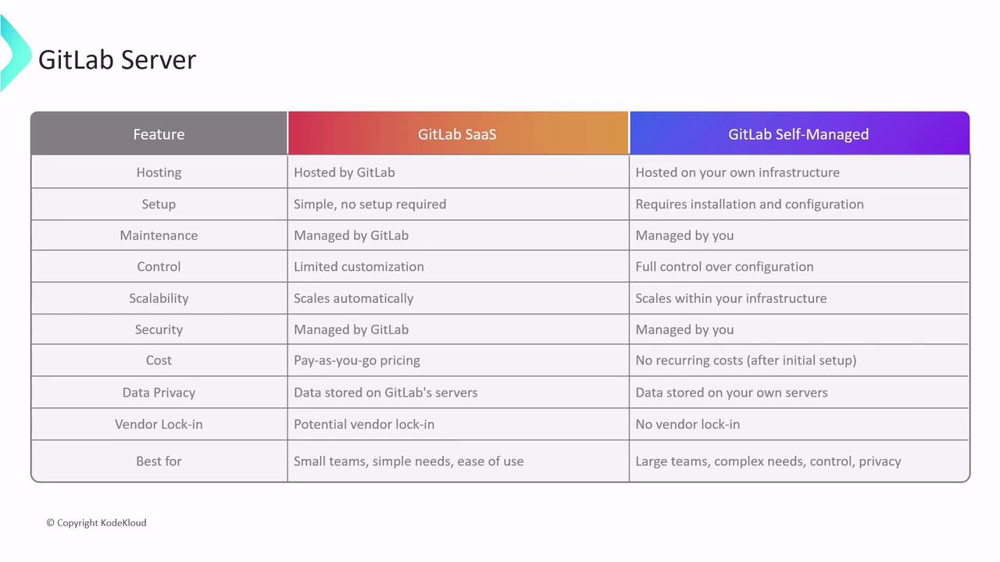
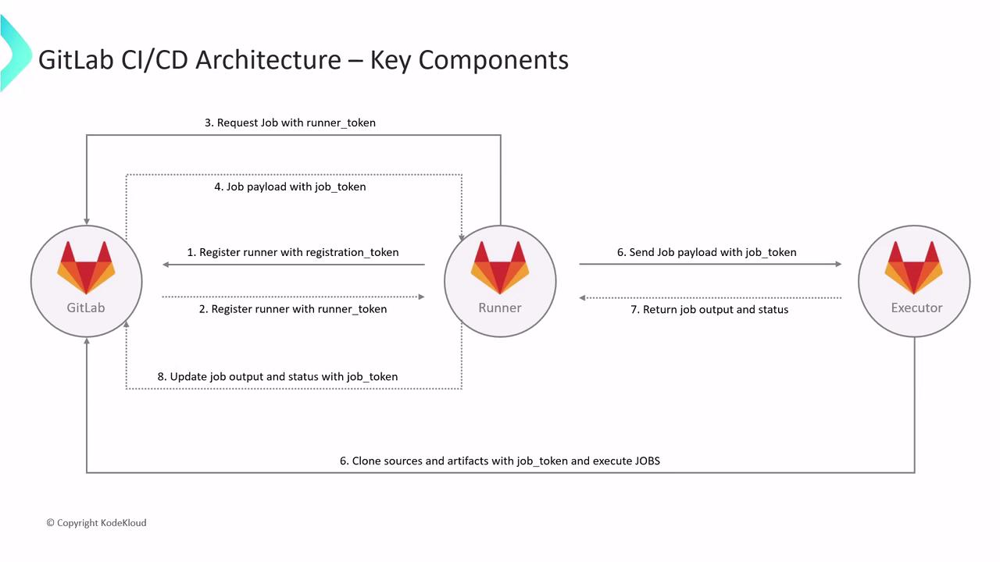

# GitLab CICD Architecture SaaS

Source: https://notes.kodekloud.com/docs/GitLab-CICD-Architecting-Deploying-and-Optimizing-Pipelines/Architecture-Core-Concepts/GitLab-CICD-Architecture-SaaS/page

This guide explores GitLab CI/CD pipelines, comparing SaaS and self-managed environments, focusing on deployment options, core components, and automated workflows.

In this guide, we’ll dive into how GitLab CI/CD pipelines leverage Runners and Executors in both SaaS and self-managed environments. You’ll learn deployment options, core components, and the end-to-end workflow powering your automated builds and deployments.

## GitLab Server Overview

GitLab Server is an open-source DevOps platform that centralizes the entire software development lifecycle:

* **Git repository management** with fine-grained access controls
* **Issue tracking** and project planning
* **Built-in CI/CD pipelines** for automated testing and deployment
* **Container & package registries** for Docker, Helm, npm, and more
* **Security & compliance** scanning, auditing, and reporting

GitLab is available as:

* **GitLab SaaS** (hosted by GitLab.com)
* **GitLab Self-Managed** (on your infrastructure)

Both share the same core features but differ in control, customization, and operational responsibilities.

## SaaS vs Self-Managed: A Side-by-Side Comparison

Choosing the right deployment model is critical for scaling, security, and cost management:

<Frame>
  
</Frame>

### GitLab SaaS

**Key Benefits**

* **Zero infrastructure overhead**: No servers to install or maintain.
* **Quick setup**: Start CI/CD in minutes, even without DevOps expertise.
* **Elastic scalability**: Automatic scaling and pay-as-you-go pricing.
* **High availability**: SLA-backed uptime and redundancy managed by GitLab.com.
* **Automatic updates**: Always on the latest version with security patches.
* **Built-in security**: Vulnerability scanning, dependency checks, and DAST/SAST as a service.

**Considerations**

* Limited platform customization and plugin support.
* Data residency and privacy depend on GitLab.com’s infrastructure.
* Potential cost growth for large teams or high-load pipelines.

<Callout icon="lightbulb">
  GitLab SaaS is ideal for small to medium teams that prefer minimal operational overhead. Check [GitLab.com Pricing](https://about.gitlab.com/pricing/) for details.
</Callout>

### GitLab Self-Managed

**Key Benefits**

* **Full control & customization**: Configure runners, storage, and plugins as needed.
* **Complete data ownership**: Host code, metadata, and artifacts on your hardware.
* **No vendor lock-in**: Freedom to migrate between clouds or on-premises.
* **Cost efficiency at scale**: More predictable costs for large enterprises.

**Considerations**

* Requires in-house expertise for installation, upgrades, and security.
* Infrastructure must be provisioned and scaled by your team.
* You are responsible for patching, backup, and disaster recovery.

<Callout icon="triangle-alert">
  Self-managed GitLab transfers all security and maintenance responsibilities to your team. Ensure you have proper patch management and monitoring in place.
</Callout>

***

## GitLab CI/CD Workflow Architecture

The following diagram shows how the GitLab Server, Runner, and Executor collaborate to process a CI/CD job:

<Frame>
  
</Frame>

### Workflow Phases

#### 1. Registration Phase

1. Runner sends a POST to `/runners/register` with the **registration token**.
2. GitLab Server validates and returns a **runner token**.
3. Runner stores this token for all future interactions.

#### 2. Job Request Phase

1. Registered Runner polls `/jobs/request`, authenticated with its **runner token**.
2. Server responds with a **job payload** containing a **job token** for that execution.

#### 3. Job Execution Phase

1. Runner passes the payload to the **Executor**.
2. Executor uses the **job token** to:
   * Clone the repository
   * Download dependencies and artifacts
   * Execute the CI/CD script in an isolated environment (Docker, VM, shell)
3. Isolation prevents cross-job interference and secures the runner host.

#### 4. Job Reporting Phase

1. Executor gathers logs, artifacts, and exit status.
2. It POSTs back to `/jobs/:id/trace` using the **job token**.
3. GitLab Server records results and updates the pipeline UI.

### Token Exchange Summary

| Phase        | Tokens Exchanged         | Purpose                                  |
| ------------ | ------------------------ | ---------------------------------------- |
| Registration | registration → runner    | Authenticate Runner to GitLab Server     |
| Job Request  | runner token → job token | Assign and authorize a specific job      |
| Execution    | job token                | Secure access to repo, artifacts, cache  |
| Reporting    | job token                | Send status updates and upload artifacts |

***

By understanding these components—Server, Runner, Executor—and their interactions, you can design scalable, secure CI/CD pipelines on either GitLab SaaS or Self-Managed. Optimize runner tagging, parallelism, and caching to accelerate builds and reduce costs.

## Links and References

* [GitLab Runner Documentation](https://docs.gitlab.com/runner/)
* [Installing GitLab Self-Managed](https://docs.gitlab.com/ee/install/)
* [GitLab CI/CD Pipelines](https://docs.gitlab.com/ee/ci/pipelines/)
* [GitLab Security Features](https://docs.gitlab.com/ee/user/application_security/)

<CardGroup>
  <Card title="Watch Video" icon="video" href="https://learn.kodekloud.com/user/courses/gitlab-ci-cd-architecting-deploying-and-optimizing-pipelines/module/fbf7cb8d-dcca-444e-a547-7bdb8b725634/lesson/4fff1a87-3532-4dc1-8a46-42817215ba93" />
</CardGroup>
