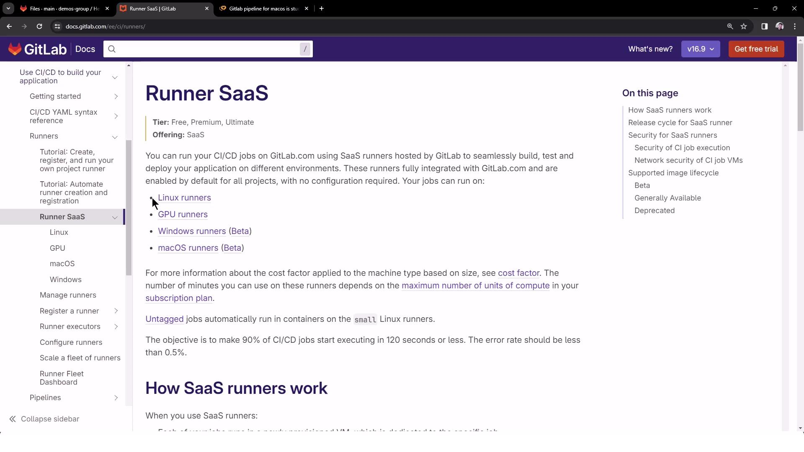
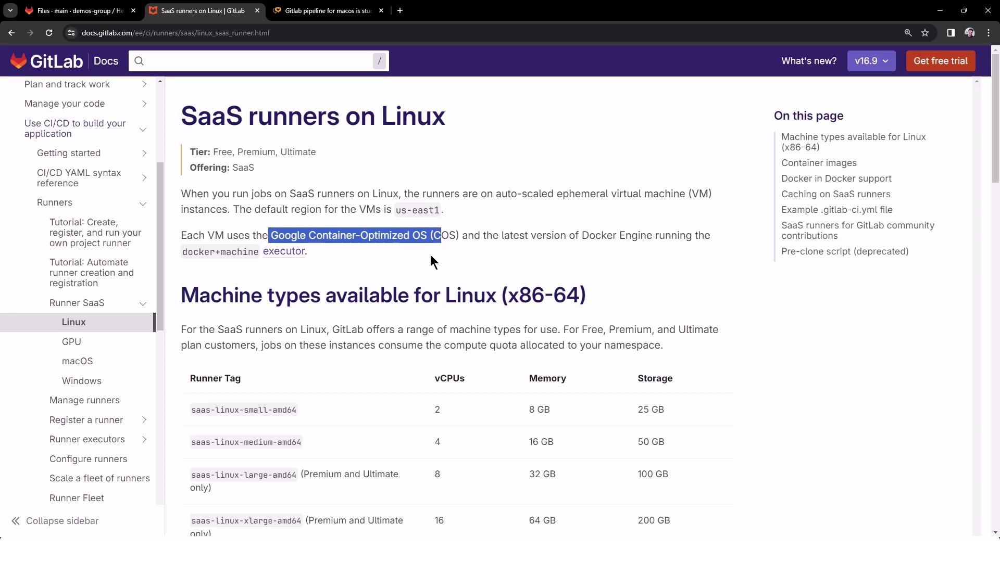
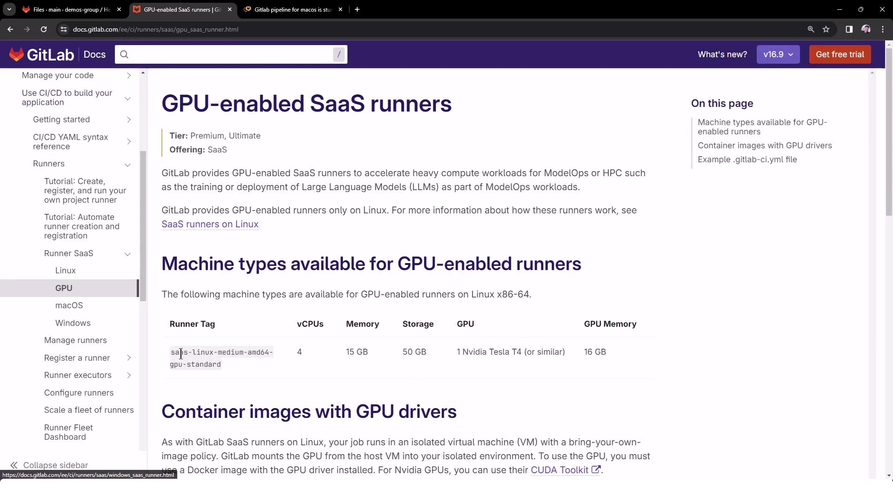
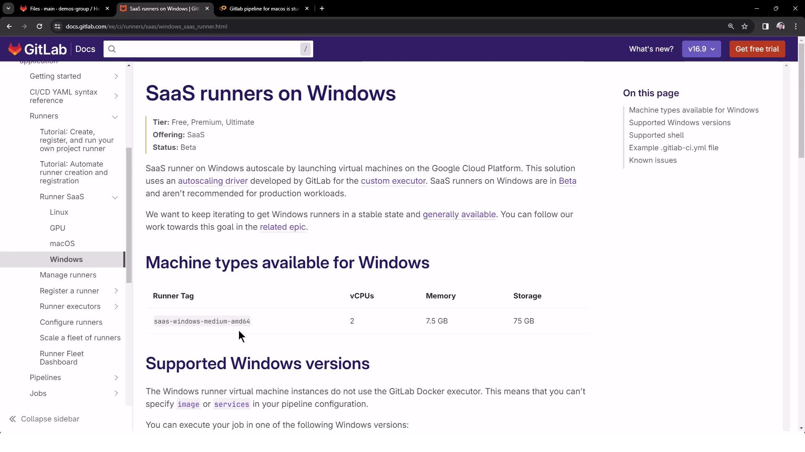
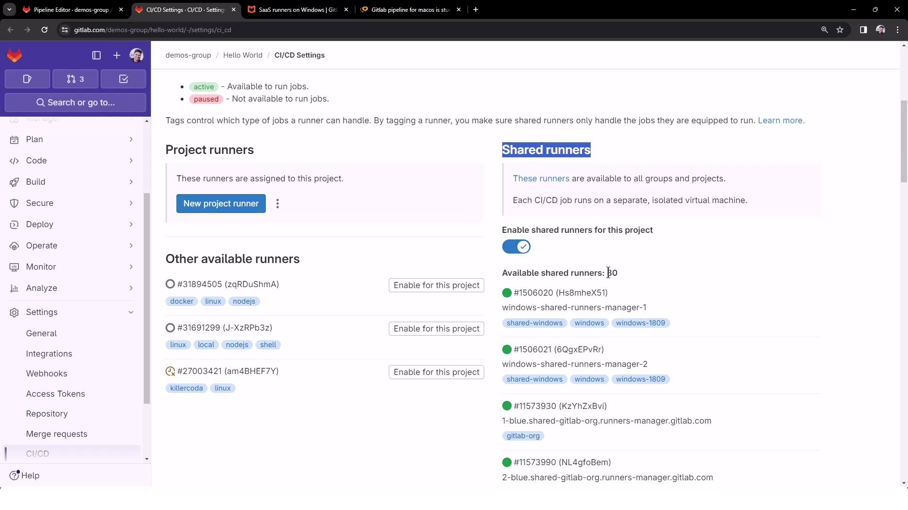
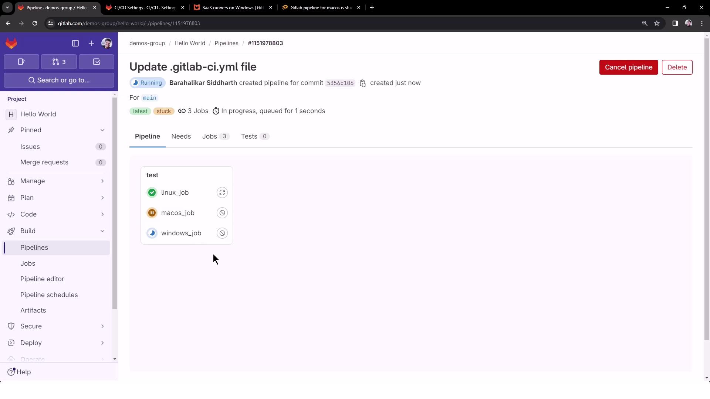
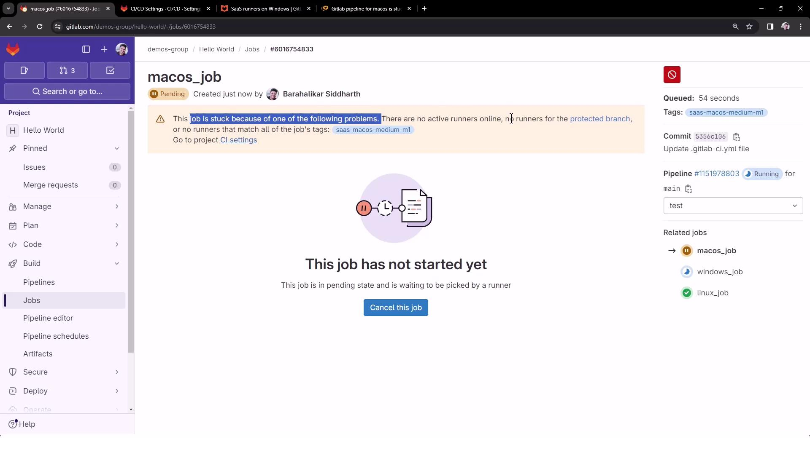
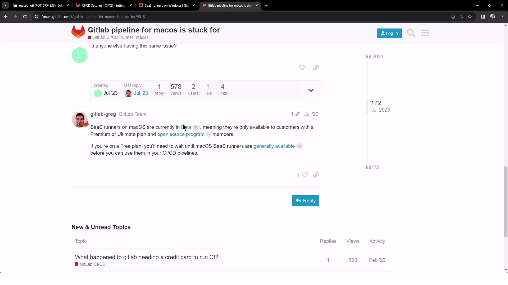
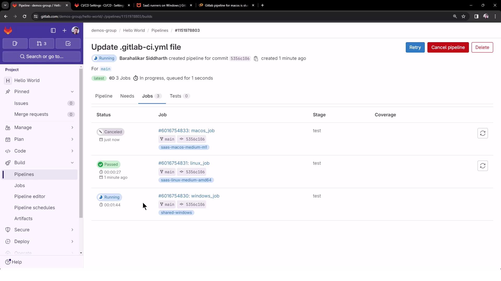

# Run Jobs with Shared Runners

Source: https://notes.kodekloud.com/docs/GitLab-CICD-Architecting-Deploying-and-Optimizing-Pipelines/Architecture-Core-Concepts/Run-Jobs-with-Shared-Runners/page

This guide explains how to configure GitLab CI/CD jobs to run on GitLab-hosted shared runners across various operating systems.

In this guide, you'll learn how to configure GitLab CI/CD jobs to run on GitLab-hosted shared runners for Linux, GPU, Windows, and macOS. This approach leverages GitLab’s [SaaS runners][runner-docs] to simplify maintenance and reduce infrastructure overhead.

| Runner Type | Tag Example             | Availability |
| ----------- | ----------------------- | ------------ |
| Linux       | saas-linux-medium-amd64 | Stable       |
| GPU         | saas-gpu-medium         | Stable       |
| Windows     | shared-windows          | Beta         |
| macOS       | saas-macos-medium-m1    | Beta         |

[runner-docs]: https://docs.gitlab.com/ee/ci/runners/README.html

<Frame>
  
</Frame>

<Callout icon="lightbulb">
  Windows and macOS shared runners are currently in beta and may have limited capacity. Linux runners run on Google Container-Optimized OS VMs with predefined machine specs.
</Callout>

## Shared Runner Specifications

GitLab provides detailed specs for each runner type:

<Frame>
  
</Frame>

GPU-enabled runners include GPU drivers and libraries:

<Frame>
  
</Frame>

Windows runners support specific OS versions in beta:

<Frame>
  
</Frame>

## Configuring `.gitlab-ci.yml`

To target these shared runners, add `tags` in your pipeline definition. Create or update `.gitlab-ci.yml` at the project root:

```yaml theme={null}
windows_job:
  tags:
    - shared-windows
  script:
    - echo "Windows OS Version"
    - systeminfo

linux_job:
  tags:
    - saas-linux-medium-amd64
  script:
    - echo "Linux OS Version"
    - cat /etc/os-release

macos_job:
  tags:
    - saas-macos-medium-m1
  script:
    - echo "MacOS Version"
    - system_profiler SPSoftwareDataType
```

<Callout icon="lightbulb">
  The `tags` keyword ensures each job is picked up by the corresponding shared runner. To see all available shared runners, go to [Settings → CI/CD → Runners][runners-settings].
</Callout>

[runners-settings]: https://docs.gitlab.com/ee/ci/runners/#shared-runners

<Frame>
  
</Frame>

## Triggering the Pipeline

Commit your changes to the default branch (e.g., `main`) to launch the pipeline. You should see three jobs queued in parallel:

<Frame>
  
</Frame>

<Callout icon="triangle-alert">
  The macOS job may remain pending if there are no active runners. SaaS macOS runners are in beta and reserved for Premium/Ultimate plans.
</Callout>

<Frame>
  
</Frame>

<Frame>
  
</Frame>

You can cancel the pending macOS job to let the Linux and Windows jobs finish. The pipeline view updates to show job statuses:

<Frame>
  
</Frame>

## Viewing Job Logs

### Linux Job Logs

The Linux job runs on a medium VM using the Docker+machine executor:

```bash theme={null}
$ echo "Linux OS Version"
Linux OS Version
$ cat /etc/os-release
PRETTY_NAME="Debian GNU/Linux 12 (bookworm)"
NAME="Debian GNU/Linux"
VERSION_ID="12"
VERSION="12 (bookworm)"
ID=debian
```

### Windows Job Logs

The Windows job spins up a custom VM executor and then runs your commands:

```bash theme={null}
Running with gitlab-runner 16.5.0 (83330f9) on windows-shared-runners-manager...
Preparing the "custom" executor
Getting source from Git repository
Executing "step_script" stage of the job script
Cleaning up project directory and file based variables
Job succeeded
```

```bash theme={null}
$ echo "Windows OS Version"
Windows OS Version
$ systeminfo
```

<Frame>
  
</Frame>

## Conclusion

By applying runner tags in your `.gitlab-ci.yml`, you can precisely target GitLab’s shared runner environments for Linux, GPU, Windows, and macOS. This setup streamlines cross-platform CI/CD workflows and offloads infrastructure maintenance to GitLab.

<CardGroup>
  <Card title="Watch Video" icon="video" href="https://learn.kodekloud.com/user/courses/gitlab-ci-cd-architecting-deploying-and-optimizing-pipelines/module/fbf7cb8d-dcca-444e-a547-7bdb8b725634/lesson/51fab92b-abd7-4de9-b0a1-8901b29311b5" />
</CardGroup>
