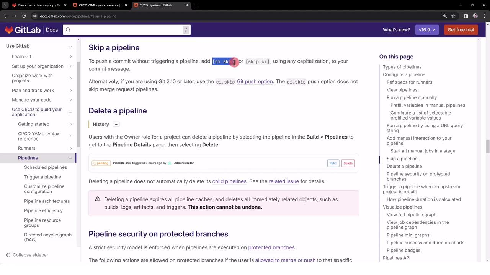
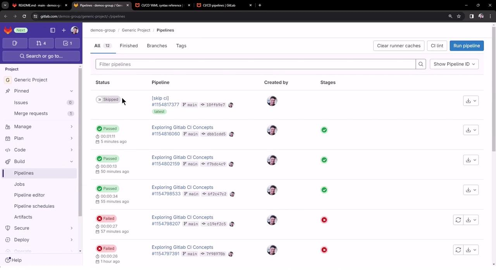

# Skipping Pipeline Trigger

Source: https://notes.kodekloud.com/docs/GitLab-CICD-Architecting-Deploying-and-Optimizing-Pipelines/Architecture-Core-Concepts/Skipping-Pipeline-Trigger/page

This article explains how to skip unnecessary pipeline runs in GitLab CI/CD for non-functional changes using specific commit message directives.

When working with GitLab CI/CD, every push by default starts a new pipeline run. However, for non-functional changes—like updating documentation or fixing typos—you can prevent an unnecessary pipeline execution by appending a skip directive to your commit message.

## Why Skip CI/CD Pipelines?

Skipping pipelines saves valuable runner minutes and reduces clutter in your pipeline dashboard. Typical use cases include:

* Documentation updates (`README.md`, `CHANGELOG.md`)
* Configuration tweaks that don’t affect build/test logic
* Minor formatting or comment changes

## Example `.gitlab-ci.yml` Configuration

Below is a sample CI configuration. Even pure documentation changes will trigger this pipeline unless skipped explicitly:

```yaml theme={null}
workflow:
  name: Exploring GitLab CI Concepts
  rules:
    - if: '$CI_COMMIT_BRANCH == "main"'

variables:
  DEPLOY_VARIABLE: "PRODUCTION"

deploy-job:
  resource_group: production
  parallel:
    matrix:
      RUNNER_MACHINES:
        - saas-linux-small-amd64
        - saas-linux-medium-amd64
      NODE_TAGS:
        - '20-alpine3.18'
        - '18-alpine3.18'
        - '21-alpine3.18'
  tags:
    - $RUNNER_MACHINES
  image: node:$NODE_TAGS
  script:
    - echo "Deploying to production environment"
```

## Skip Directives Overview

You can use either `[ci skip]` or `[skip ci]` in your commit message:

| Skip Directive | Effect                             |
| -------------- | ---------------------------------- |
| `[ci skip]`    | Prevents the pipeline from running |
| `[skip ci]`    | Alias for `[ci skip]`              |

<Callout icon="lightbulb">
  Both directives are recognized by GitLab. Choose the one you prefer—case-insensitive.
</Callout>

## Committing with a Skip Directive

To skip the pipeline for a documentation-only change:

```bash theme={null}
git add README.md
git commit -m "docs: improve installation steps [ci skip]"
git push origin main
```

<Frame>
  
</Frame>

Once pushed, GitLab marks the pipeline as **Skipped** immediately—no jobs are queued or executed.

<Frame>
  
</Frame>

## Verifying the Skipped Pipeline

Navigate to **CI/CD > Pipelines** in your project’s sidebar. You will see the latest push marked as **Skipped**:

* No jobs are run.
* Pipeline minutes are preserved.
* Dashboard remains uncluttered.

<Callout icon="triangle-alert">
  Do **not** use skip directives for commits that modify build scripts, tests, or production code. Skipping critical changes can lead to undetected failures.
</Callout>

## Additional Resources

* [GitLab CI/CD Pipelines](https://docs.gitlab.com/ee/ci/pipelines/)
* [Skipping Jobs in GitLab CI/CD](https://docs.gitlab.com/ee/ci/yaml/#skipping-jobs)
* [GitLab Workflow Reference](https://docs.gitlab.com/ee/ci/yaml/)

<CardGroup>
  <Card title="Watch Video" icon="video" href="https://learn.kodekloud.com/user/courses/gitlab-ci-cd-architecting-deploying-and-optimizing-pipelines/module/fbf7cb8d-dcca-444e-a547-7bdb8b725634/lesson/fc1a216b-77e6-4956-916c-ff4e91ff8827" />

  <Card title="Practice Lab" icon="installation" href="https://learn.kodekloud.com/user/courses/gitlab-ci-cd-architecting-deploying-and-optimizing-pipelines/module/fbf7cb8d-dcca-444e-a547-7bdb8b725634/lesson/d50943d7-3e62-4858-8668-c85132790710" />
</CardGroup>
