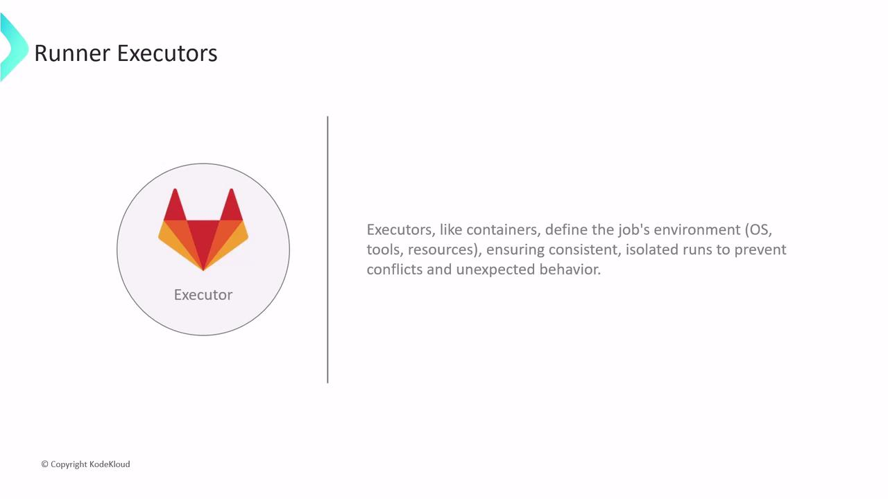
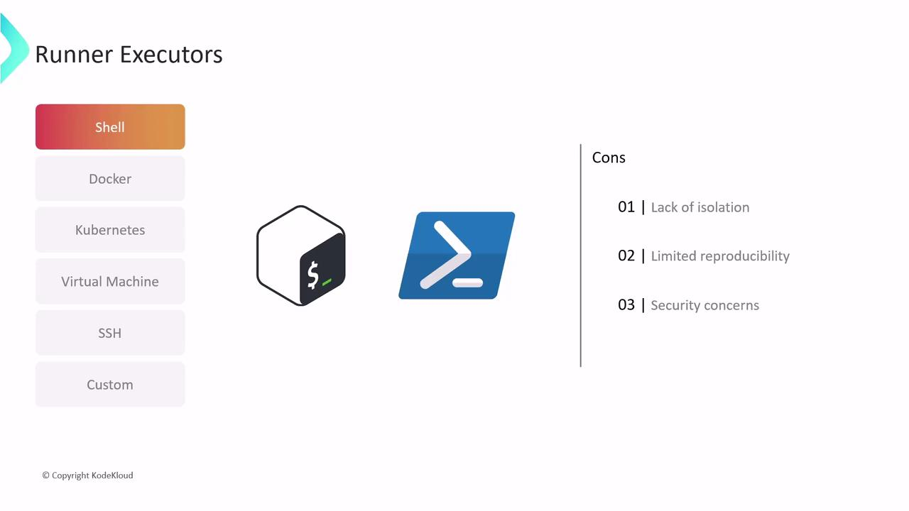
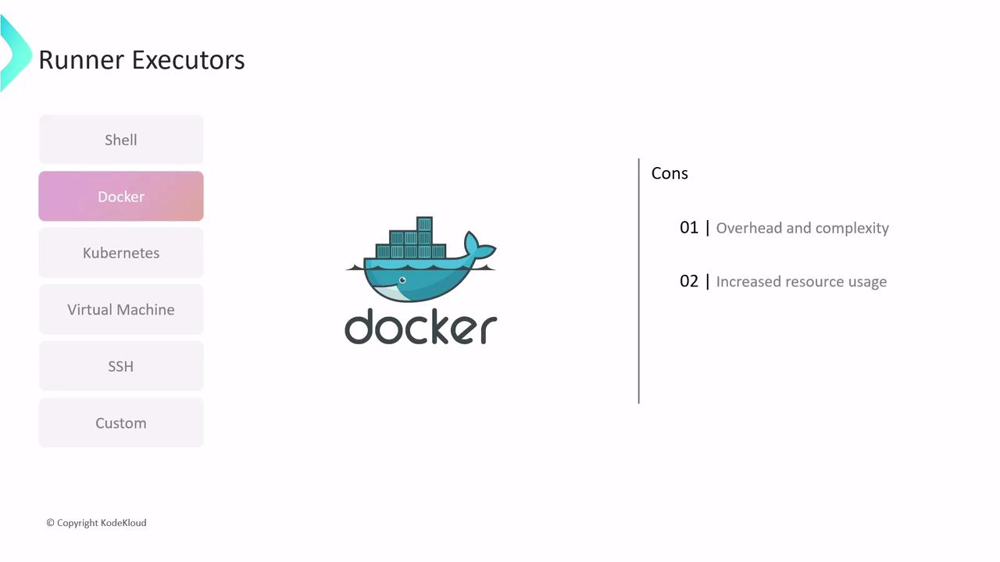
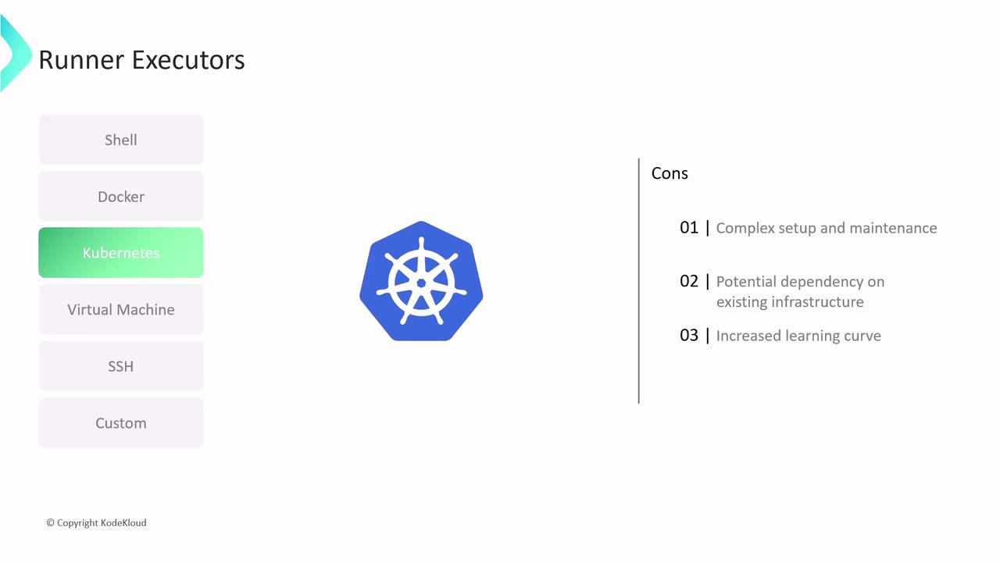
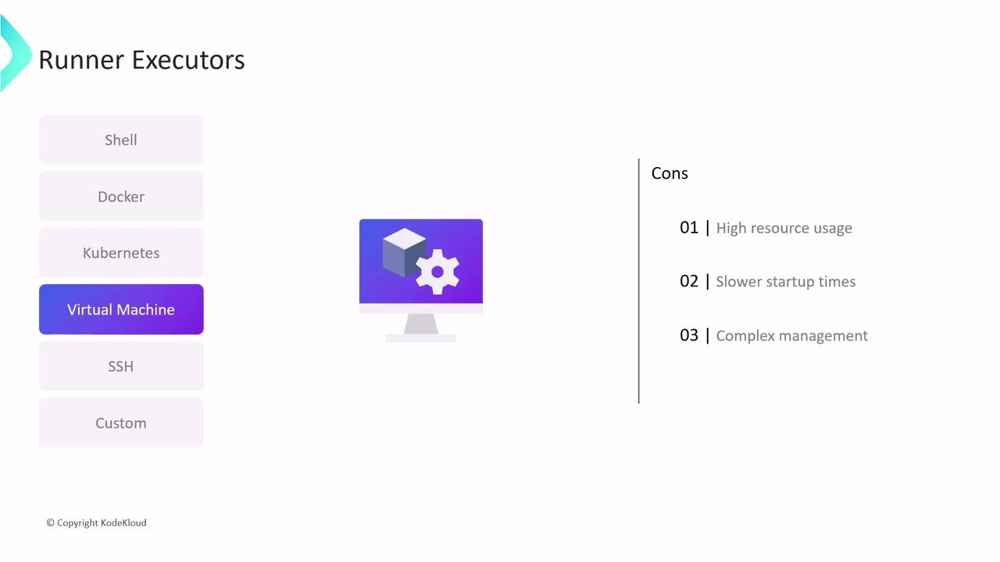
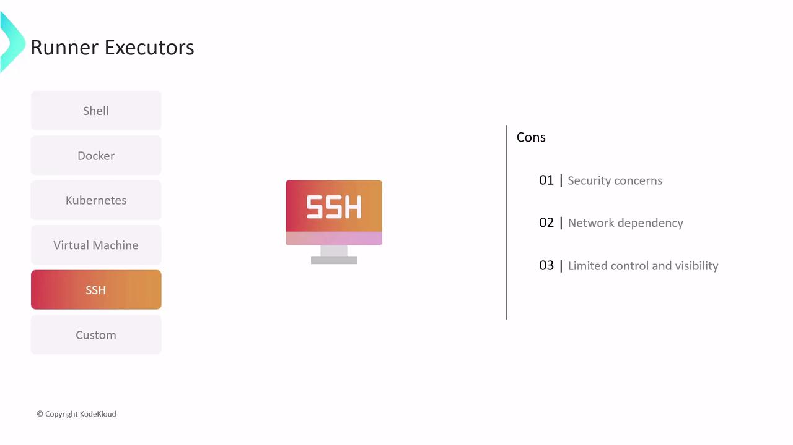
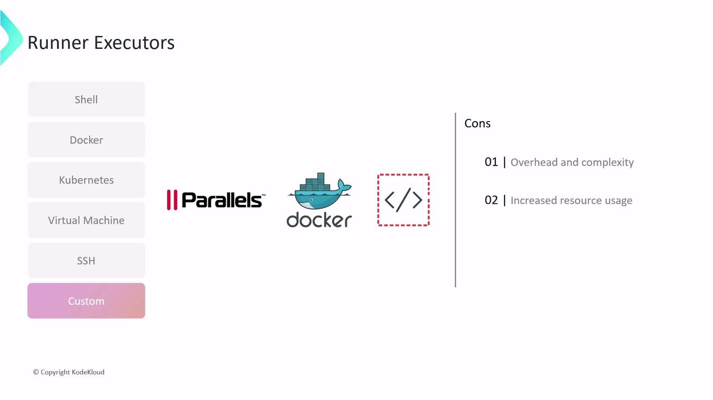

# Types of Executors

Source: https://notes.kodekloud.com/docs/GitLab-CICD-Architecting-Deploying-and-Optimizing-Pipelines/Architecture-Core-Concepts/Types-of-Executors/page

GitLab CI/CD runners use executors to define isolated environments for pipeline jobs, ensuring consistency and repeatability across different runner hosts.

GitLab CI/CD runners rely on executors to provide the isolated environments where your pipeline jobs run. An executor defines the operating system, tools, and resources available to each job, ensuring consistency and repeatability across different runner hosts.

<Frame>
  
</Frame>

<Callout icon="lightbulb">
  Selecting the appropriate executor is essential for performance, security, and maintainability. Consider factors like isolation level, resource overhead, and integration with your existing infrastructure.
</Callout>

## Executor Comparison at a Glance

| Executor        | Best For                       | Isolation Level |
| --------------- | ------------------------------ | --------------- |
| Shell           | Quick local scripts            | Low             |
| Docker          | Reproducible builds            | High            |
| Kubernetes      | Scalable, parallel workloads   | High            |
| Virtual Machine | Complete OS-level isolation    | Very High       |
| SSH             | Specialized or legacy hardware | Moderate        |
| Custom          | Custom orchestration workflows | Varies          |

Below are the most commonly used GitLab Runner executors. Each has its own trade-offs in terms of setup complexity, performance, and security.

## Shell Executor

Runs jobs directly on the runner host using the native shell (e.g., Bash or PowerShell).\
Ideal for quick scripts or simple commands without containerization.

**Pros:**

* Minimal setup and dependencies
* No container or VM overhead
* Direct access to host tools and filesystem

**Cons:**

* No isolation—jobs share host OS and resources
* Results depend on the host’s installed tools
* Elevated access can pose security risks

<Frame>
  
</Frame>

## Docker Executor

Launches each job inside a Docker container pulled from a registry. Guarantees clean, reproducible environments tailored to your language or toolchain.

**Pros:**

* Strong isolation between jobs
* Reproducible builds via Docker images
* Easy dependency management and caching

**Cons:**

* Requires Docker daemon and configuration
* Container overhead on CPU and memory
* Limited default access to host resources

<Frame>
  
</Frame>

## Kubernetes Executor

Schedules each job as a pod in your Kubernetes cluster, leveraging its scheduling, scaling, and resource-management features.

**Pros:**

* Automatic scaling and load balancing
* Leverages existing Kubernetes infrastructure
* Pod-level security policies for isolation

**Cons:**

* Requires a running Kubernetes cluster
* More complex setup and maintenance
* Higher learning curve for Kubernetes best practices

<Frame>
  
</Frame>

## Virtual Machine Executor

Spins up a fresh VM per job, providing a pristine, OS-level isolated environment.

**Pros:**

* Full OS isolation and clean state
* Complete control over guest OS configuration

**Cons:**

* Significant resource usage (CPU, memory, disk)
* Slower startup times versus containers
* Requires VM orchestration expertise

<Frame>
  
</Frame>

## SSH Executor

Executes jobs on a remote machine over SSH. Useful for leveraging specialized hardware (e.g., GPUs) or integrating legacy systems.

**Pros:**

* Access to remote or proprietary hardware
* No additional container or VM setup

**Cons:**

* Must securely manage SSH credentials
* Network reliability can affect job runs
* Limited monitoring and resource isolation

<Callout icon="triangle-alert">
  Be sure to rotate and securely store your SSH keys. Unsecured credentials can lead to unauthorized access.
</Callout>

<Frame>
  
</Frame>

## Custom Executor

Build your own execution logic to integrate with any environment or orchestration system. GitLab also provides specialized variants like Parallels and Docker Machine.

**Pros:**

* Fully customizable to fit unique workflows
* Integrates with proprietary or niche systems

**Cons:**

* Higher development and maintenance effort
* Potential resource overhead
* May limit access to low-level system internals

<Frame>
  
</Frame>

Below is the official feature comparison table to guide your selection. For detailed configuration options, refer to the [GitLab Runner Executors Documentation][1].

<Frame>
  
</Frame>

***

## Links and References

* [GitLab Runner Executors Documentation][1]
* [Docker Documentation](https://docs.docker.com/)
* [Kubernetes Documentation](https://kubernetes.io/docs/)

[1]: https://docs.gitlab.com/runner/executors/

<CardGroup>
  <Card title="Watch Video" icon="video" href="https://learn.kodekloud.com/user/courses/gitlab-ci-cd-architecting-deploying-and-optimizing-pipelines/module/fbf7cb8d-dcca-444e-a547-7bdb8b725634/lesson/1c376b5b-7128-4b5c-ac47-3df21107fc05" />
</CardGroup>
