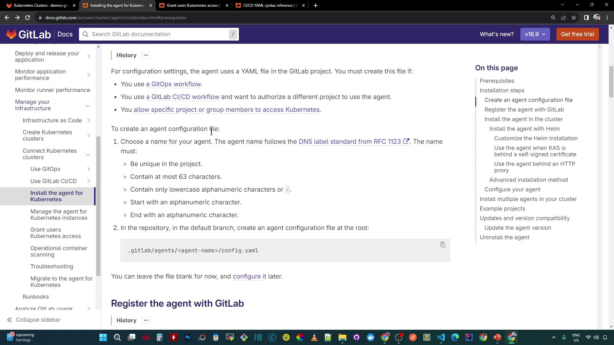
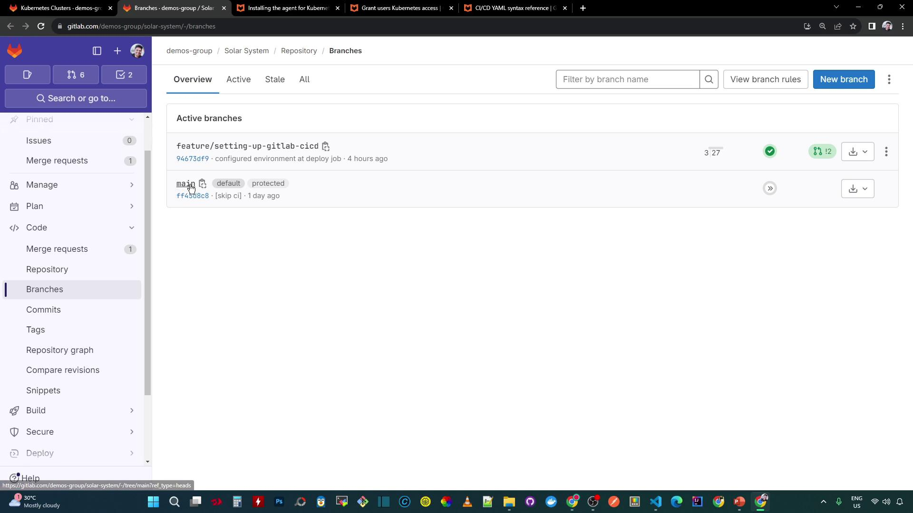
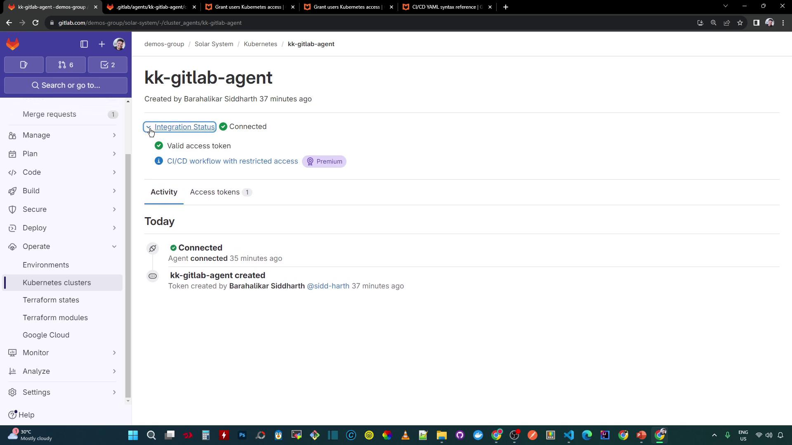
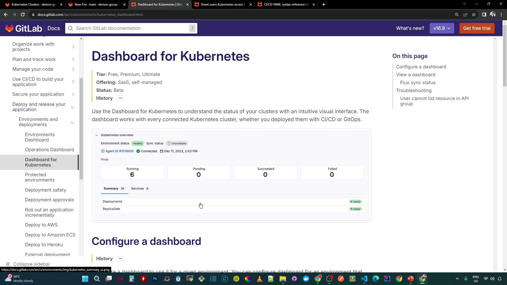
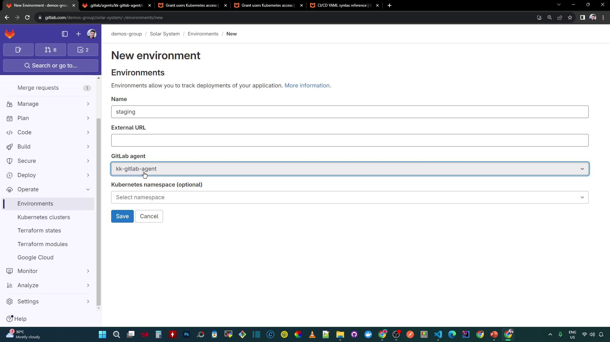
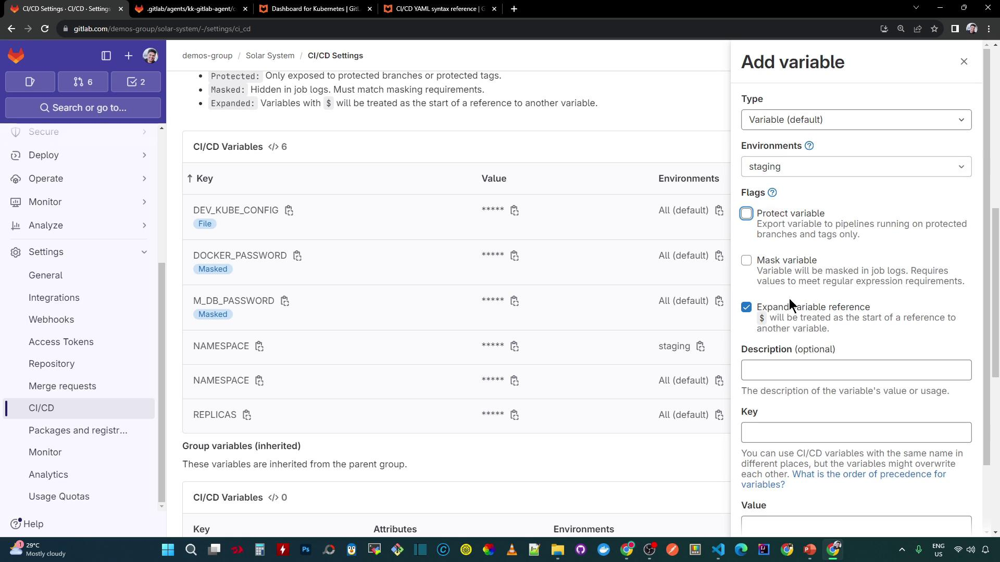

# Remote development (GitLab EE only)
workspaces:
  enabled: true
  # configure workspace settings here
```

| Configuration Block       | Description                                                           |
| ------------------------- | --------------------------------------------------------------------- |
| gitops.manifest\_projects | List of repositories with Kubernetes manifests and target namespaces. |
| gitops.ci\_access         | Projects allowed to use this agent in CI/CD pipelines.                |
| workspaces                | Remote development settings (Enterprise Edition).                     |

<Callout icon="lightbulb">
  Modify `config.yaml` as code and push changes to your default branch. AgentK watches this file and applies updates automatically.
</Callout>

## References

* [GitLab Kubernetes Agent Documentation](https://docs.gitlab.com/ee/user/clusters/agent/)
* [GitOps with GitLab](https://docs.gitlab.com/ee/topics/gitops/)
* [Helm Charts for GitLab](https://gitlab.com/gitlab-org/charts/gitlab-agent)

<CardGroup>
  <Card title="Watch Video" icon="video" href="https://learn.kodekloud.com/user/courses/gitlab-ci-cd-architecting-deploying-and-optimizing-pipelines/module/df17ec22-8cda-4af7-af44-10f9f061d4a8/lesson/77853dab-0db9-4d81-b56c-20b02956feca" />
</CardGroup>


# Customize Agent Config and Staging Environment

Source: https://notes.kodekloud.com/docs/GitLab-CICD-Architecting-Deploying-and-Optimizing-Pipelines/Continuous-Deployment-with-GitLab/Customize-Agent-Config-and-Staging-Environment/page

This guide explains how to customize GitLab Kubernetes agent configuration, set up a staging environment, and scope CI/CD variables for efficient deployments.

In this guide, you'll learn how to tailor your GitLab Kubernetes agent configuration, set up a staging environment, and scope CI/CD variables to streamline deployments. By the end, your CI jobs will use `kubectl` against your cluster, and your team can view the Kubernetes dashboard directly in GitLab.

## 1. Configure the GitLab Agent

First, create a `config.yaml` for your Kubernetes agent to enable GitOps workflows, CI/CD deployments, and dashboard access. Place this file in your repository’s default branch under:

```text theme={null}
.gitlab/agents/<agent-name>/config.yaml
```

<Callout icon="lightbulb">
  Replace `<agent-name>` with your actual agent identifier, and ensure you commit to the branch marked as **default** in your project's **Branches** page.
</Callout>

<Frame>
  
</Frame>

Check which branch is set as default (commonly **main**):

<Frame>
  
</Frame>

Add the following content to `config.yaml`:

```yaml theme={null}
ci_access:
  projects:
    # Allow CI jobs to deploy manifests in this project
    - id: demos-group/solar-system

user_access:
  access_as:
    agent: {}
  projects:
    # Permit users to view the Kubernetes dashboard in this project
    - id: demos-group/solar-system
```

Commit and push to your default branch. After the push, confirm the agent status:

<Frame>
  
</Frame>

Now, CI jobs receive a `kubeconfig` context for `kubectl` commands, and users can access the Kubernetes dashboard within GitLab environments.

You can verify the available contexts in any job script:

```bash theme={null}
kubectl config get-contexts
CURRENT   NAME
*         vke-479a34c5-9e64-4042-aee3-8af8df9686dc
```

## 2. Enable the Kubernetes Dashboard

To visualize cluster resources, enable the Kubernetes dashboard in GitLab:

[Dashboard for Kubernetes](https://docs.gitlab.com/ee/user/environment/dashboard/)

<Frame>
  
</Frame>

1. In your project, go to **Operations > Environments** and click **New environment**.

<Frame>
  
</Frame>

2. Set the **Environment name** to `staging`, select your GitLab agent, and optionally specify a Kubernetes namespace (leave blank to display all).
3. Click **Save**. The **Overview** dashboard now lists your Kubernetes services:

<Frame>
  
</Frame>

4. After deploying workloads, the dashboard reflects the live status and health:

<Frame>
  
</Frame>

On paid GitLab tiers, you’ll also see the extended **Monitoring** view:

<Frame>
  
</Frame>

## 3. Scope CI/CD Variables to Staging

Isolate settings for your staging environment by defining environment-scoped variables:

1. Navigate to **Settings > CI/CD > Variables**.
2. Click **Add variable**.
3. Enter your keys and values, then set **Environment scope** to `staging`:

```text theme={null}
Key: NAMESPACE
Value: staging

Key: REPLICAS
Value: "4"
```

<Frame>
  
</Frame>

<Callout icon="triangle-alert">
  Scoped variables only apply to jobs that target the **staging** environment. Ensure your `.gitlab-ci.yml` uses the correct environment name.
</Callout>

With these steps complete, your agent is configured, your staging environment is ready, and your CI/CD variables are scoped for targeted deployments.

## References

* [GitLab Kubernetes Agent](https://docs.gitlab.com/ee/user/clusters/agents/)
* [Dashboard for Kubernetes](https://docs.gitlab.com/ee/user/environment/dashboard/)

<CardGroup>
  <Card title="Watch Video" icon="video" href="https://learn.kodekloud.com/user/courses/gitlab-ci-cd-architecting-deploying-and-optimizing-pipelines/module/df17ec22-8cda-4af7-af44-10f9f061d4a8/lesson/dad4f790-9f0c-411c-b754-a82b8bac5fa4" />
</CardGroup>
