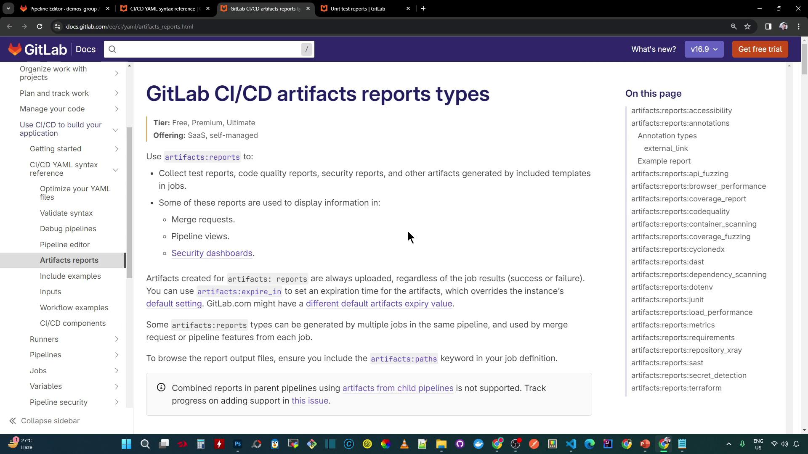
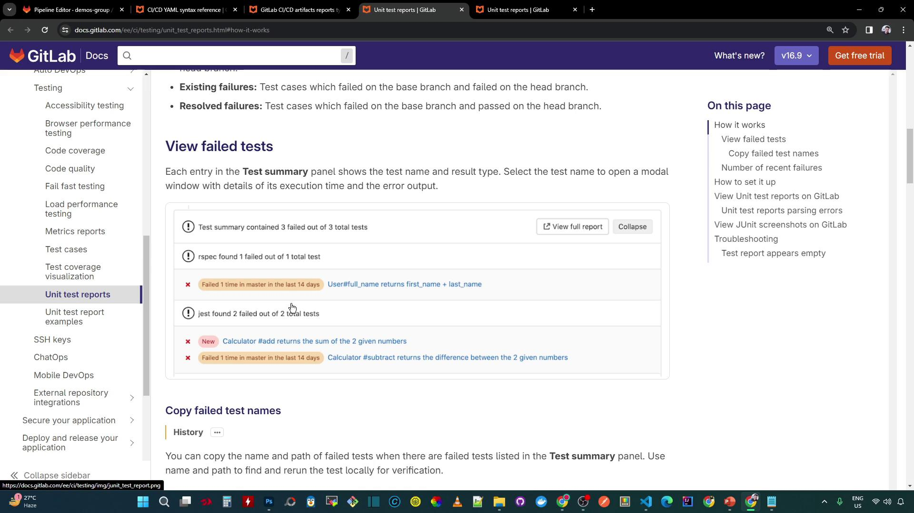
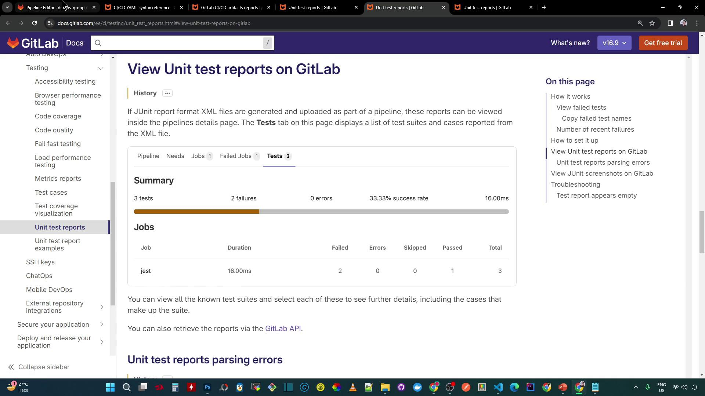
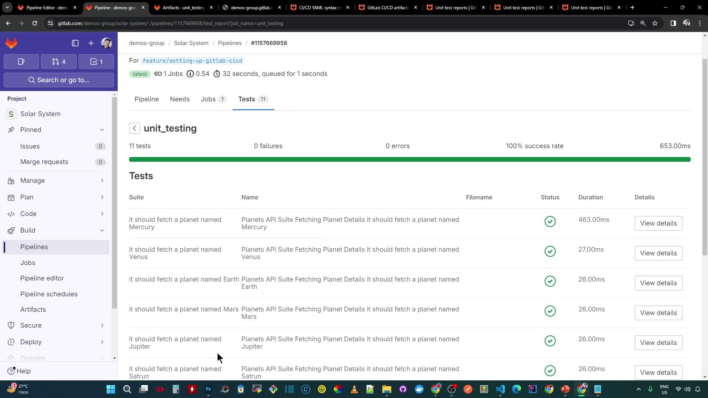
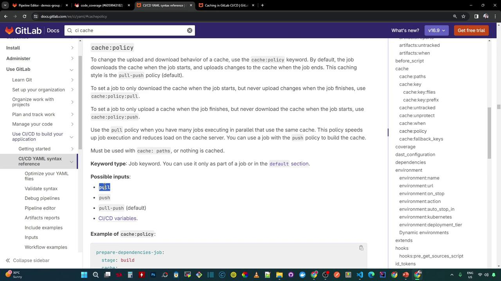
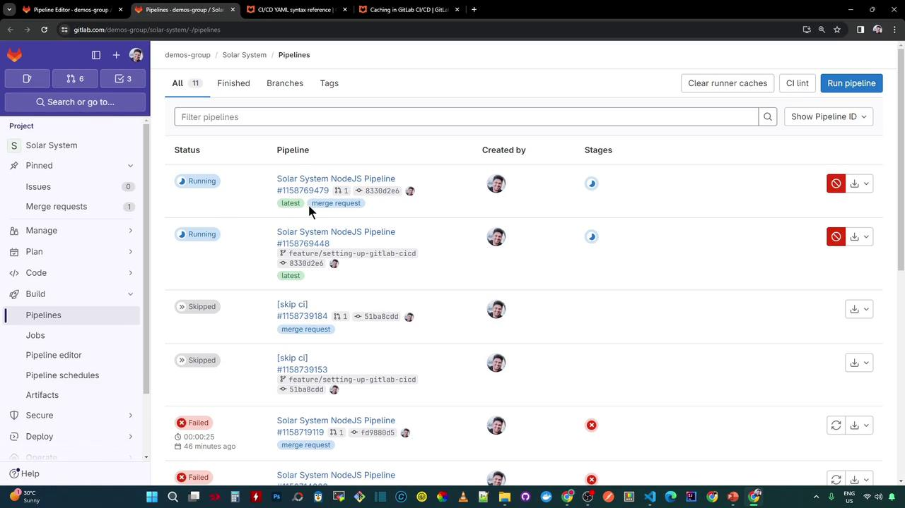
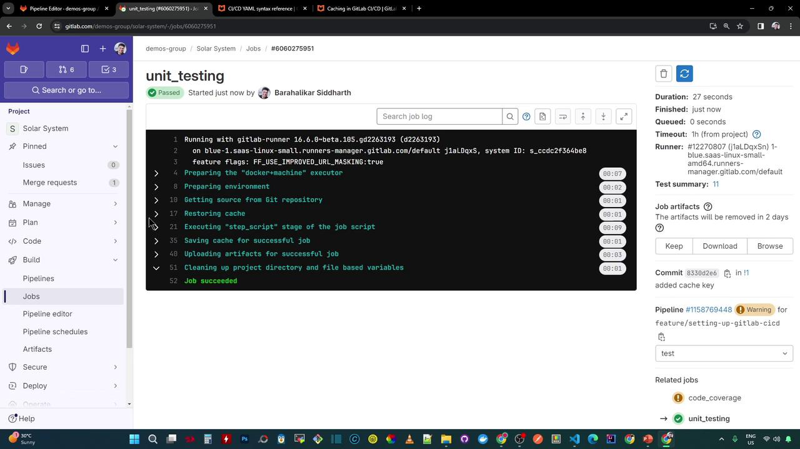
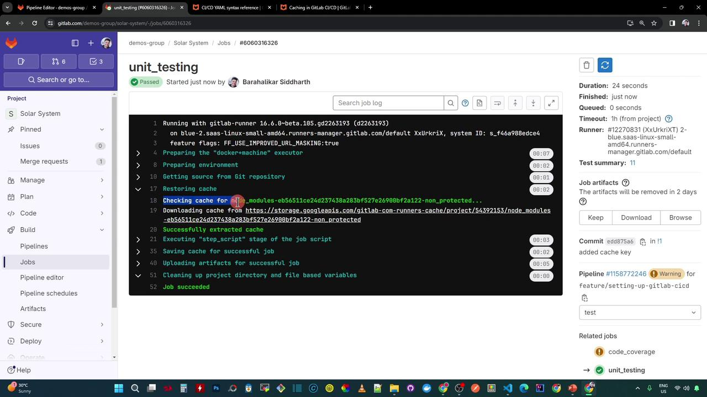

# Output:
> mocha app-test.js --timeout 10000 --reporter mocha-junit-reporter --exit
```

A sample `test-results.xml`:

```xml theme={null}
<?xml version="1.0" encoding="UTF-8"?>
<testsuite name="Mocha Tests" time="4.968" tests="11" failures="0">
  <testsuite name="Root Suite" timestamp="2024-01-30T13:59:59" tests="0" time="0.000" failures="0">
    <testcase name="Planets API Suite" timestamp="2024-01-30T13:59:59" tests="8">
      <testcase name="it should fetch a planet named Mercury" time="3.383"/>
      <!-- more testcases... -->
    </testcase>
  </testsuite>
</testsuite>
```

***

## 3. Registering JUnit Reports with `artifacts:reports`

GitLab can parse JUnit XML and display it natively in merge requests and pipeline views. Extend your job:

```yaml theme={null}
unit_testing:
  stage: test
  image: node:17-alpine3.14
  before_script:
    - npm install
  script:
    - npm test
  artifacts:
    when: always
    expire_in: 3 days
    name: "Mocha-Test-Result"
    paths:
      - test-results.xml
  reports:
    junit: test-results.xml
```

This enables the **Test Reports** tab in merge requests and shows detailed test metrics in the pipeline.

***

## 4. Available Artifact Report Types

GitLab supports a variety of built-in report types that surface in Merge Request widgets and the pipeline UI:

| Report Type         | Use Case                         | File Format   |
| ------------------- | -------------------------------- | ------------- |
| junit               | Unit test results                | JUnit XML     |
| cobertura           | Code coverage metrics            | Cobertura XML |
| sast                | Static Application Security Test | SARIF         |
| dast                | Dynamic Application Security     | HTML / JSON   |
| codequality         | Code Quality analysis            | JSON          |
| license\_management | Dependency license scanning      | JSON          |

<Frame>
  
</Frame>

***

## 5. Viewing Failures in a Merge Request

When tests fail, GitLab surfaces a summary of the failures directly in the Merge Request:

<Frame>
  
</Frame>

***

## 6. Checking Test Summaries in the Pipeline

In the pipeline’s **Tests** tab, you’ll see:

* Total tests run
* Number of failures
* Success rate (%)
* Average test duration

<Frame>
  
</Frame>

After job completion, artifact upload logs appear:

```bash theme={null}
Uploading artifacts...
test-results.xml: found 1 matching artifact files and directories
Uploading artifacts as "archive" to coordinator... 201 Created
Uploading artifacts as "junit" to coordinator... 201 Created
Cleaning up project directory and file based variables
Job succeeded
```

You can browse or download the raw XML:

```bash theme={null}
Browsing artifacts…
test-results.xml
```

Or view it visually:

<Frame>
  
</Frame>

***

## References

* [GitLab CI/CD Pipelines](https://docs.gitlab.com/ee/ci/pipelines/)
* [Artifacts](https://docs.gitlab.com/ee/ci/pipelines/job_artifacts.html)
* [JUnit Test Reports in GitLab](https://docs.gitlab.com/ee/user/project/pipelines/test_reports.html)
* [mocha-junit-reporter on npm](https://www.npmjs.com/package/mocha-junit-reporter)
* [GitLab CI/CD YAML Configuration](https://docs.gitlab.com/ee/ci/yaml/)

<CardGroup>
  <Card title="Watch Video" icon="video" href="https://learn.kodekloud.com/user/courses/gitlab-ci-cd-architecting-deploying-and-optimizing-pipelines/module/3a1c2306-8091-4dfe-b40f-e2ca53918553/lesson/20c65bbd-2d75-42be-b0cc-02bb346d6512" />
</CardGroup>


# Caching Dependencies

Source: https://notes.kodekloud.com/docs/GitLab-CICD-Architecting-Deploying-and-Optimizing-Pipelines/Continuous-Integration-with-GitLab/Caching-Dependencies/page

This article explains how to cache npm packages in GitLab CI to improve pipeline efficiency and reduce installation time.

When your project grows, installing dozens or hundreds of npm packages on every CI run can easily add minutes to your pipeline. By caching the `node_modules` directory in GitLab CI, you can reduce install time from \~7 s to \~1 s per job and save runner resources.

## Example package.json for “Solar System” App

Here’s a simplified `package.json` for our Node.js service:

```json theme={null}
{
  "name": "Solar System",
  "version": "6.7.6",
  "author": "Siddharth Barahalikar <barahalikar.siddharth@gmail.com>",
  "license": "MIT",
  "scripts": {
    "start": "node app.js",
    "test": "mocha app-test.js --timeout 10000 --reporter mocha-junit-reporter --exit",
    "coverage": "nyc --reporter cobertura --reporter lcov --reporter text --reporter json-summary mocha"
  },
  "dependencies": {
    "cors": "^2.8.5",
    "express": "^4.18.2",
    "mongoose": "^5.13.20",
    "nodemon": "^3.0.2",
    "nyc": "^15.1.0"
  },
  "devDependencies": {
    "chai": "*",
    "chai-http": "*",
    "mocha": "*"
  }
}
```

Running `npm install` generates `package-lock.json` and populates `node_modules`. In GitLab CI, each job running `npm install` repeats this process:

```bash theme={null}
$ npm install
added 364 packages in 7s
2 vulnerabilities (1 high, 1 critical)

$ npm test
> Solar System@6.7.6 test
> mocha app-test.js …
```

## Cache vs. Artifacts

GitLab CI offers both **cache** and **artifacts**, but they serve different purposes:

| Feature  | Cache                                                           | Artifacts                                                |
| -------- | --------------------------------------------------------------- | -------------------------------------------------------- |
| Use Case | External dependencies (e.g., `node_modules`)                    | Build outputs or reports (e.g., test results)            |
| Lifetime | Shared across jobs and pipelines—expires based on your settings | Passed between jobs in the same pipeline                 |
| Storage  | Can be stored externally (e.g., AWS S3)                         | Stored in GitLab (default)                               |
| Policy   | `pull`, `push`, `pull-push`                                     | Always uploaded on job success or failure (configurable) |

## Configuring `cache:policy`

Use the `policy` keyword to control download/upload behavior:

* `pull` – only restore an existing cache
* `push` – only upload a new cache
* `pull-push` (default) – restore first, then upload after job success

<Frame>
  
</Frame>

## Adding Cache to `.gitlab-ci.yml`

Below is a minimal configuration that caches `node_modules` for `unit_testing` and `code_coverage` jobs:

```yaml theme={null}
stages:
  - test

.default_cache: &default_cache
  key:
    files:
      - package-lock.json
    prefix: node_modules
  paths:
    - node_modules
  policy: pull-push
  when: on_success

unit_testing:
  stage: test
  image: node:17-alpine3.14
  cache: *default_cache
  before_script:
    - npm install
  script:
    - npm test
  artifacts:
    when: always
    expire_in: 3 days
    name: Mocha-Test-Result
    paths:
      - test-results.xml
    reports:
      junit: test-results.xml

code_coverage:
  stage: test
  image: node:17-alpine3.14
  cache: *default_cache
  before_script:
    - npm install
  script:
    - npm run coverage
```

<Callout icon="lightbulb">
  Using `package-lock.json` in the cache key ensures the cache is invalidated automatically whenever your dependencies change.
</Callout>

## Viewing the Pipeline

After committing `.gitlab-ci.yml`, GitLab triggers a pipeline. The **Pipelines** page shows status and stages:

<Frame>
  
</Frame>

Within the project view you’ll see jobs like `unit_testing` and `code_coverage`:

<Frame>
  
</Frame>

### First Run: Cache Miss

On the initial run, no cache exists. The pipeline installs dependencies and then uploads the cache:

<Frame>
  
</Frame>

```plaintext theme={null}
Restoring cache
  No cache found for key: node_modules-<sha256-of-package-lock.json>
$ npm install
added 364 packages in 7s
$ npm test …
Saving cache for successful job
  Created cache node_modules-<sha>-non_protected
Uploading cache.zip to GitLab Runner storage...
```

### Subsequent Run: Cache Hit

With no changes to `package-lock.json`, the cache restores instantly and `npm install` completes in \~1 s:

<Frame>
  
</Frame>

```plaintext theme={null}
Restoring cache
  Found cache: node_modules-<sha256> ...
$ npm install
up to date, audited 365 packages in 1s
$ npm test …
```

## Clearing or Invalidating Cache

You can manually clear caches via **Settings → CI/CD → Clear runner caches**.\
To automate invalidation, use `package-lock.json` in your `cache:key` as shown above.

<Callout icon="triangle-alert">
  Clearing caches too frequently may negate performance gains. Only clear when dependencies are truly out of sync.
</Callout>

## Links and References

* [GitLab CI/CD Caching Documentation](https://docs.gitlab.com/ee/ci/caching/)
* [Node.js Official Site](https://nodejs.org/)
* [npm CLI Install Command](https://docs.npmjs.com/cli/v9/commands/npm-install)

<CardGroup>
  <Card title="Watch Video" icon="video" href="https://learn.kodekloud.com/user/courses/gitlab-ci-cd-architecting-deploying-and-optimizing-pipelines/module/3a1c2306-8091-4dfe-b40f-e2ca53918553/lesson/efb48dc1-13a6-4929-932d-083b91931ab2" />
</CardGroup>
