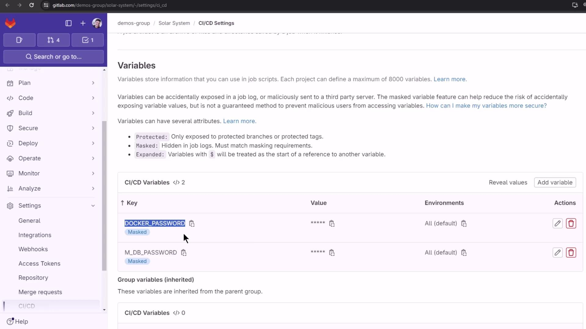
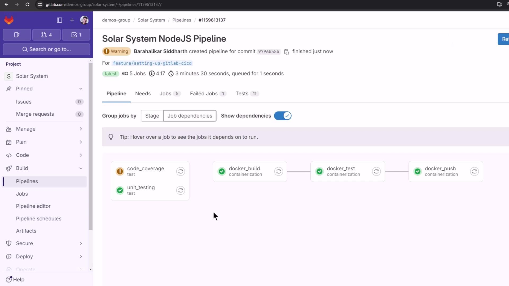

# Docker Push

Source: https://notes.kodekloud.com/docs/GitLab-CICD-Architecting-Deploying-and-Optimizing-Pipelines/Continuous-Integration-with-GitLab/Docker-Push/page

This guide explains how to add a docker_push job to a GitLab CI/CD pipeline for automating image uploads to Docker Hub.

In this guide, we’ll extend our GitLab CI/CD pipeline by adding a **docker\_push** job that uploads your built image to Docker Hub. By the end, you’ll have a fully automated workflow—from unit tests to containerization and Docker pushes.

## 1. Existing Pipeline Overview

Here’s the current `.gitlab-ci.yml` with four jobs: `unit_testing`, `code_coverage`, `docker_build`, and `docker_test`. We run these on the `main` branch or any `feature/*` branch, including merge requests.

```yaml theme={null}
name: Solar System NodeJS Pipeline

rules:
  - if: $CI_COMMIT_BRANCH == 'main' || $CI_COMMIT_BRANCH =~ /^feature/
    when: always
  - if: $CI_MERGE_REQUEST_SOURCE_BRANCH_NAME =~ /^feature/ && $CI_PIPELINE_SOURCE == 'merge_request_event'
    when: always

stages:
  - test
  - containerization

variables:
  DOCKER_USERNAME: siddharth67
  IMAGE_VERSION: $CI_PIPELINE_ID

unit_testing:
  # …

code_coverage:
  # …

docker_build:
  # …

docker_test:
  # …
```

## 2. Adding the `docker_push` Job

We’ll append a fifth stage, **docker\_push**, under `containerization`. This job will:

* Depend on `docker_build` and `docker_test` via `needs`
* Leverage Docker-in-Docker (`dind`) for pushing images
* Load the previously saved artifact
* Authenticate to Docker Hub using CI/CD variables
* Push the image tagged with `$IMAGE_VERSION`

```yaml theme={null}
docker_push:
  stage: containerization
  needs:
    - docker_build
    - docker_test
  image: docker:24.0.5
  services:
    - docker:24.0.5-dind
  script:
    # 1. Load the saved Docker image artifact
    - docker load -i image/solar-system-image-$IMAGE_VERSION.tar

    # 2. Authenticate with Docker Hub
    - docker login --username=$DOCKER_USERNAME --password=$DOCKER_PASSWORD

    # 3. Push the image to Docker Hub
    - docker push $DOCKER_USERNAME/solar-system:$IMAGE_VERSION
```

<Callout icon="triangle-alert">
  Ensure your `DOCKER_PASSWORD` is masked and protected in GitLab. Never hard-code credentials in your `.gitlab-ci.yml`.
</Callout>

## 3. Defining CI/CD Variables

Navigate to **Settings → CI/CD → Variables** in your GitLab project and add:

| Variable Name    | Value             | Masked | Description                              |
| ---------------- | ----------------- | ------ | ---------------------------------------- |
| DOCKER\_USERNAME | `siddharth67`     | No     | Your Docker Hub username                 |
| DOCKER\_PASSWORD | `<your_password>` | Yes    | Your Docker Hub password or access token |
| M\_DB\_PASSWORD  | `<mongodb_pass>`  | Yes    | MongoDB connection password (if needed)  |

<Frame>
  
</Frame>

<Callout icon="lightbulb">
  You can also set pipeline-level variables via the GitLab API or include them in a protected group for reuse across multiple projects.
</Callout>

## 4. Pipeline Visualization

After pushing the updated `.gitlab-ci.yml`, GitLab will display five jobs in sequence. The **docker\_push** job runs last, once image build and tests complete.

<Frame>
  
</Frame>

## 5. Sample `docker_push` Logs

Below is an example of a successful Docker push in your CI logs:

```bash theme={null}
$ docker load -i image/solar-system-image-123.tar
Loaded image: solar-system:123

$ docker login --username=siddharth67 --password=$DOCKER_PASSWORD
Login Succeeded

$ docker push siddharth67/solar-system:123
The push refers to repository [docker.io/siddharth67/solar-system]
6bb3b914256b: Pushed
27ef56b51525: Pushed
cd949f4c979d: Pushed
f37b283f479c: Pushed
d324172c3753: Pushed
617df26c92eb: Pushed
ec438b31218: Pushed
1159613137: digest: sha256:55191c68759f6b36e12b0d3667c1b629d2947b25b297c7e05aed021971c09df5 size: 1997
Cleaning up project directory and file based variables
Job succeeded
```

Once the job completes successfully, visit your Docker Hub repository (`siddharth67/solar-system`) to confirm the newly pushed tags.

## Further Reading

* [GitLab CI/CD Variables Documentation](https://docs.gitlab.com/ee/ci/variables/)
* [Docker CLI Reference: `docker push`](https://docs.docker.com/engine/reference/commandline/push/)
* [Docker Hub Repository Management](https://docs.docker.com/docker-hub/repos/)

<CardGroup>
  <Card title="Watch Video" icon="video" href="https://learn.kodekloud.com/user/courses/gitlab-ci-cd-architecting-deploying-and-optimizing-pipelines/module/3a1c2306-8091-4dfe-b40f-e2ca53918553/lesson/cf7231a4-d73a-4588-bb89-11abf5b0ad9e" />
</CardGroup>
