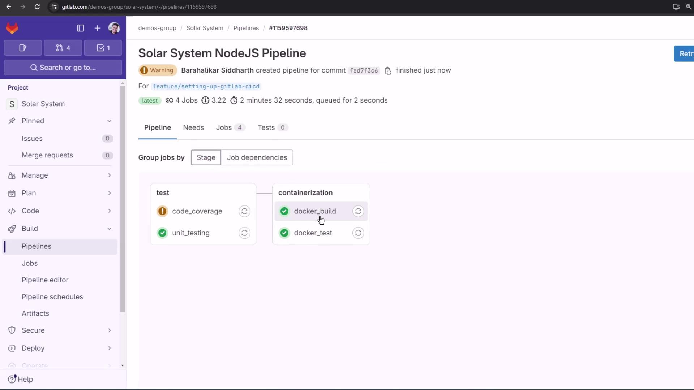

# Docker Test

Source: https://notes.kodekloud.com/docs/GitLab-CICD-Architecting-Deploying-and-Optimizing-Pipelines/Continuous-Integration-with-GitLab/Docker-Test/page

This guide explains how to validate Docker images in GitLab CI/CD by adding a testing job to ensure containers are production-ready.

In robust CI/CD workflows, validating your Docker image before pushing to a registry helps catch runtime issues early. This guide shows you how to extend a GitLab CI pipeline with a `docker_test` job that consumes the image built by `docker_build`, verifies the `/live` endpoint, and ensures your container is production-ready.

## CI/CD Pipeline Overview

Define your basic stages and shared variables in `.gitlab-ci.yml`:

```yaml theme={null}
stages:
  - test
  - containerization

variables:
  DOCKER_USERNAME: siddharth67
  IMAGE_VERSION: $CI_PIPELINE_ID
  MONGO_URI: 'mongodb+srv://supercluster.d83jji.mongodb.net/superData'
  MONGO_USERNAME: superuser
  MONGO_PASSWORD: $M_DB_PASSWORD

unit_testing:
  stage: test
  # …

code_coverage:
  stage: test
  # …
```

| Stage            | Job Name       | Purpose                                         |
| ---------------- | -------------- | ----------------------------------------------- |
| test             | unit\_testing  | Execute unit tests                              |
| test             | code\_coverage | Generate code coverage reports                  |
| containerization | docker\_build  | Build Docker image and save as artifact         |
| containerization | docker\_test   | Load the image, run container, and test `/live` |

## Building and Archiving Docker Images

The `docker_build` job builds your Node.js app into a Docker image, then saves it as a tarball artifact for downstream jobs.

```yaml theme={null}
docker_build:
  stage: containerization
  image: docker:24.0.5
  services:
    - docker:24.0.5-dind
  script:
    - docker build -t $DOCKER_USERNAME/solar-system:$IMAGE_VERSION .
    - docker images $DOCKER_USERNAME/solar-system:$IMAGE_VERSION
    - mkdir -p image
    - docker save $DOCKER_USERNAME/solar-system:$IMAGE_VERSION \
        -o image/solar-system-image-$IMAGE_VERSION.tar
  artifacts:
    paths:
      - image
    when: on_success
    expire_in: 3 days
```

<Callout icon="lightbulb">
  Artifacts are retained for 3 days by default. Adjust `expire_in` to suit your retention policy.
</Callout>

<Callout icon="triangle-alert">
  Make sure sensitive environment variables (like `MONGO_PASSWORD`) are stored in [GitLab CI/CD variables](/docs/ci/variables/), not hard-coded.
</Callout>

## Testing the Docker Image Before Push

The `docker_test` job retrieves the saved image artifact, runs the container, and probes the `/live` endpoint using an Alpine container with `wget`.

```yaml theme={null}
docker_test:
  stage: containerization
  image: docker:24.0.5
  needs:
    - docker_build
  services:
    - docker:24.0.5-dind
  script:
    - docker load -i image/solar-system-image-$IMAGE_VERSION.tar
    - docker run --name solar-system-app -d -p 3000:3000 \
        $DOCKER_USERNAME/solar-system:$IMAGE_VERSION
    - export IP=$(docker inspect -f \
        '{{range .NetworkSettings.Networks}}{{.IPAddress}}{{end}}' solar-system-app)
    - echo "App IP: $IP"
    - docker run --rm alpine \
        wget -qO- http://$IP:3000/live | grep -q '"live"'
```

Steps in `docker_test`:

1. **docker load**: Imports the tarball into Docker.
2. **docker run**: Starts the container on port 3000 in detached mode.
3. **docker inspect**: Extracts the container’s IP address.
4. **wget**: From an Alpine image, requests `http://$IP:3000/live` and checks for `"live"` in the response.

## Node.js Health Check Endpoints

Below is the simplified `app.js`. The `/live` endpoint returns `{ status: "live" }` for liveness probes.

```javascript theme={null}
const express = require('express');
const path = require('path');
const OS = require('os');
const bodyParser = require('body-parser');
const mongoose = require('mongoose');
const cors = require('cors');

const app = express();
app.use(bodyParser.json());
app.use(express.static(path.join(__dirname, '/')));
app.use(cors());

mongoose.connect(process.env.MONGO_URI, {
  user: process.env.MONGO_USERNAME,
  pass: process.env.MONGO_PASSWORD,
  useNewUrlParser: true,
  useUnifiedTopology: true
}, err => {
  if (err) console.error("MongoDB connection error:", err);
});

app.get('/', (req, res) => {
  res.sendFile(path.join(__dirname, 'index.html'));
});

app.get('/os', (req, res) => {
  res.json({ os: OS.hostname(), env: process.env.NODE_ENV });
});

app.get('/live', (req, res) => {
  res.json({ status: "live" });
});

app.get('/ready', (req, res) => {
  res.json({ status: "ready" });
});

app.listen(3000, () => {
  console.log("Server running on port 3000");
});

module.exports = app;
```

## Pipeline Visualization

<Frame>
  
</Frame>

With this setup, `docker_test` will only run once `docker_build` successfully produces and archives the image. A successful liveness check means the container is ready to be pushed.

## Links and References

* [GitLab CI/CD Documentation](https://docs.gitlab.com/ee/ci/)
* [Docker Official Images](https://hub.docker.com/_/docker)
* [Express.js Guide](https://expressjs.com/)

<CardGroup>
  <Card title="Watch Video" icon="video" href="https://learn.kodekloud.com/user/courses/gitlab-ci-cd-architecting-deploying-and-optimizing-pipelines/module/3a1c2306-8091-4dfe-b40f-e2ca53918553/lesson/cab88472-e3f0-43b4-a515-44cbd7fcce05" />
</CardGroup>
