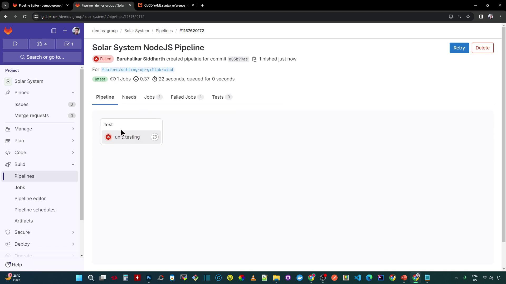
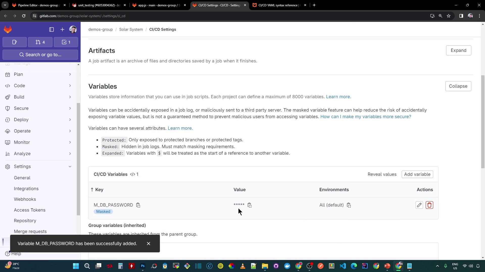
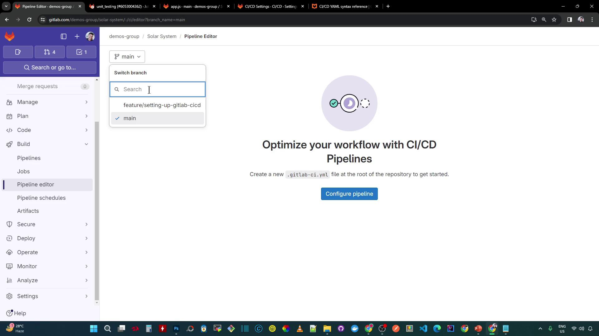

# Pipeline Configure Unit Testing

Source: https://notes.kodekloud.com/docs/GitLab-CICD-Architecting-Deploying-and-Optimizing-Pipelines/Continuous-Integration-with-GitLab/Pipeline-Configure-Unit-Testing/page

This guide configures GitLab CI/CD for a NodeJS project and adds a unit testing job with environment variable management.

In this guide, we’ll configure GitLab CI/CD for the Solar System NodeJS project and add a robust unit testing job. You’ll learn how to create a structured `.gitlab-ci.yml`, manage sensitive MongoDB credentials via CI/CD variables, and ensure your NodeJS tests run reliably.

## 1. Initialize GitLab CI/CD Configuration

Start by creating a new file named `.gitlab-ci.yml` at your repository root. Define the pipeline stages and add a placeholder build job:

```yaml theme={null}
stages:
  # Define the execution order of pipeline stages
  - build
  - test
  - deploy

build-job:
  stage: build
  script:
    - echo "Building the project..."
```

<Callout icon="lightbulb">
  Explicit stages improve readability and make it easier to extend the pipeline with additional jobs.
</Callout>

## 2. Define Workflow Rules

Specify when the pipeline should trigger by adding a `workflow` section with conditional rules:

```yaml theme={null}
workflow:
  name: Solar System NodeJS Pipeline
  rules:
    # Run on pushes to main or feature branches
    - if: $CI_COMMIT_BRANCH == "main" || $CI_COMMIT_BRANCH =~ /^feature/
      when: always
    # Run on merge request events from feature branches
    - if: $CI_MERGE_REQUEST_SOURCE_BRANCH_NAME =~ /^feature/ && $CI_PIPELINE_SOURCE == "merge_request_event"
      when: always

stages:
  - test
```

## 3. Add the Unit Testing Job

Next, define the `unit_testing` job in the `test` stage. This job uses the official NodeJS Docker image, installs dependencies, and runs tests with Mocha:

```yaml theme={null}
unit_testing:
  stage: test
  image: node:17-alpine3.14
  before_script:
    - npm install
  script:
    - npm test
```

Commit these changes to a new feature branch:

```bash theme={null}
git checkout -b feature/setup-gitlab-ci
git add .gitlab-ci.yml
git commit -m "chore: add GitLab CI/CD pipeline with unit testing"
git push -u origin feature/setup-gitlab-ci
```

Pushing to `feature/*` will trigger a pipeline run.

<Frame>
  
</Frame>

## 4. Diagnose the Test Failure

Inspect the job logs. The runner pulls the NodeJS image and installs packages, but `npm test` fails with a Mongoose connection error. Our application code in `app.js` relies on environment variables:

```javascript theme={null}
const mongoose = require('mongoose');

mongoose.connect(process.env.MONGO_URI, {
  user: process.env.MONGO_USERNAME,
  pass: process.env.MONGO_PASSWORD,
  useNewUrlParser: true,
  useUnifiedTopology: true,
}, err => {
  if (err) {
    console.error("Connection error:", err);
  } else {
    console.log("MongoDB Connection Successful");
  }
});
```

Without the MongoDB credentials, tests cannot connect.

## 5. Supply Environment Variables

Add a `variables` section at the top of your `.gitlab-ci.yml` to inject the connection details:

```yaml theme={null}
variables:
  MONGO_URI: 'mongodb+srv://supercluster.d83jj.mongodb.net/superData'
  MONGO_USERNAME: superuser
  MONGO_PASSWORD: $M_DB_PASSWORD

stages:
  - test

unit_testing:
  stage: test
  image: node:17-alpine3.14
  before_script:
    - npm install
  script:
    - npm test
```

<Callout icon="triangle-alert">
  Never expose plain-text passwords in your repository. Always use masked CI/CD variables for credentials.
</Callout>

Here’s a quick reference for these variables:

| Variable Name   | Purpose                   | Example                       |
| --------------- | ------------------------- | ----------------------------- |
| MONGO\_URI      | MongoDB connection string | `mongodb+srv://.../superData` |
| MONGO\_USERNAME | Database user name        | `superuser`                   |
| MONGO\_PASSWORD | Masked variable reference | `$M_DB_PASSWORD`              |

## 6. Configure Masked Variables in GitLab

In your GitLab project, navigate to **Settings > CI/CD > Variables**. Create a new variable:

* **Key:** `M_DB_PASSWORD`
* **Value:** *(your database password)*
* **Masked:** ✔
* **Protected:** as required

<Frame>
  
</Frame>

Return to the Pipeline Editor on your feature branch and commit the updated `.gitlab-ci.yml`:

<Frame>
  
</Frame>

## 7. Verify the Successful Pipeline

A new pipeline should start automatically. This time, the `unit_testing` job completes successfully:

<Frame>
  
</Frame>

## 8. Review the Test Logs

The job log confirms the install and test steps:

```bash theme={null}
$ npm install
added 364 packages, and audited 365 packages in 8s
44 packages are looking for funding
Run `npm fund` for details
vulnerabilities (1 high, 1 critical)
To address all issues, run:
  npm audit fix

$ npm test
> Solar System@6.7.6 test
> mocha app-test.js --timeout 10000 --reporter mocha-junit-reporter --exit
Server successfully running on port 3000
  ✓ should return all planets
  ✓ should return planet by ID
  ...
```

Now that unit tests are passing, the next step is to collect test reports using the `artifacts` keyword.

## References

* [GitLab CI/CD Documentation](https://docs.gitlab.com/ee/ci/)
* [Node.js Docker Images](https://hub.docker.com/_/node)
* [Mocha Test Framework](https://mochajs.org/)
* [Environment Variables in GitLab CI/CD](https://docs.gitlab.com/ee/ci/variables/)

<CardGroup>
  <Card title="Watch Video" icon="video" href="https://learn.kodekloud.com/user/courses/gitlab-ci-cd-architecting-deploying-and-optimizing-pipelines/module/3a1c2306-8091-4dfe-b40f-e2ca53918553/lesson/6e87f160-c269-4e1a-836e-2018a30ab6b5" />
</CardGroup>
