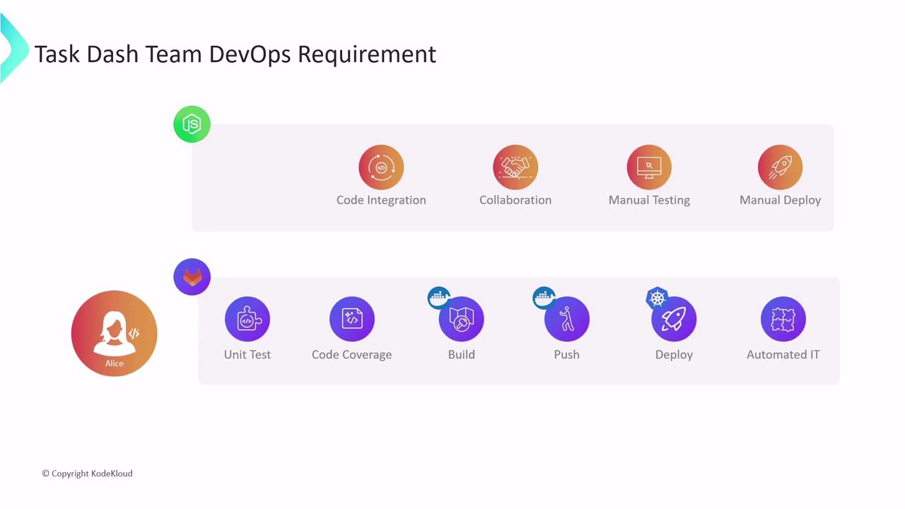
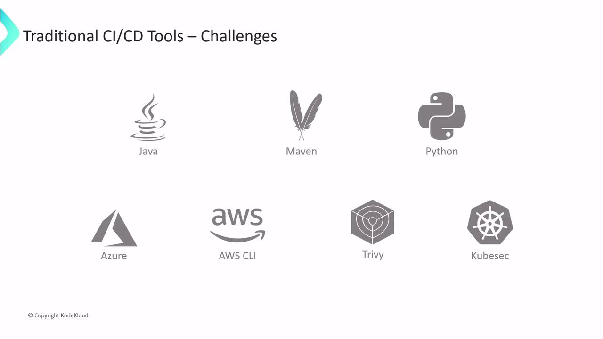
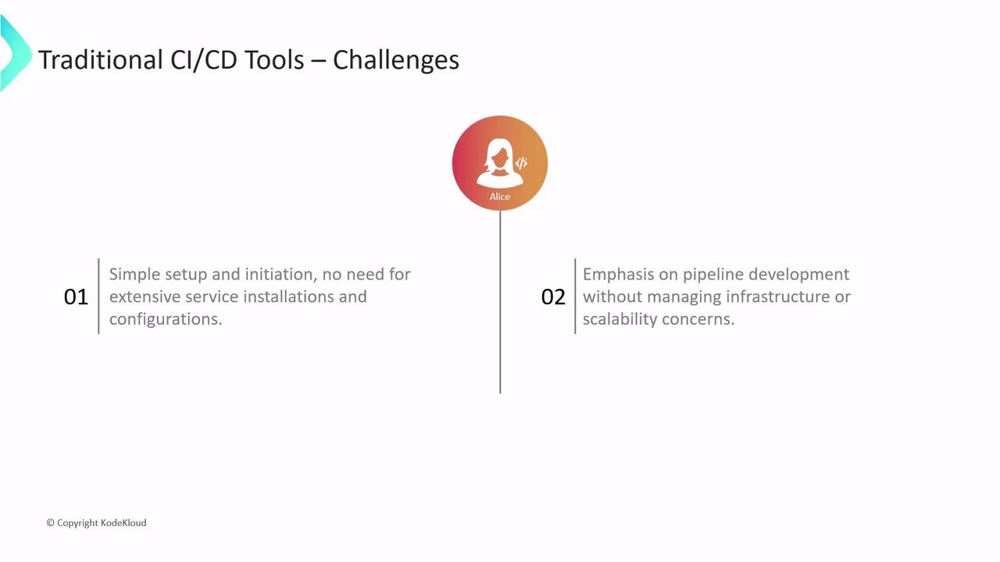

# .gitlab-ci.yml
workflow:
  name: My Awesome App Pipeline
  rules:
    - if: $CI_COMMIT_BRANCH == 'main'

unit_test_job:
  parallel:
    matrix:
      - OPERATING_SYSTEM:
          - saas-linux-small-amd64
          - shared-windows
          - saas-macos-medium-m1
  tags:
    - $OPERATING_SYSTEM
  image: node:17-alpine3.14
  script:
    - npm install
    - npm test
```

In this example:

* The pipeline runs only on the `main` branch
* `unit_test_job` executes in parallel on Linux, Windows, and macOS Runners
* Each job uses the `node:17-alpine3.14` Docker image and runs `npm install` followed by `npm test`

When triggered, GitLab provisions three isolated environments, runs each script in sequence, and reports success or failure. The pipeline succeeds only when all parallel jobs pass.

## Viewing Logs and Artifacts

Inspect job logs or download generated artifacts via the GitLab UI or REST API:

1. Go to **CI/CD > Pipelines**
2. Select a pipeline to view stages and jobs
3. Click a job to see console output and download artifacts (e.g., test reports, binaries)

```console theme={null}
$ git clone --depth 20 "$CI_REPOSITORY_URL" .
$ git checkout -f 7e0b6435c3  # detached HEAD (main)
$ npm install
> npm install completed
$ npm test
> npm test passed
Cleaning up project directory and file-based variables
Job succeeded
```

## Next Steps

You’ve now learned how to:

* Configure CI/CD pipelines in GitLab
* Choose and use SaaS Runners
* Define jobs, parallel execution, and view logs

Advanced topics—caching strategies, custom Runner setups, multi-project pipelines—are covered in our [CI/CD optimization guides](https://docs.gitlab.com/ee/ci/).

## Links and References

* [GitLab CI/CD Documentation](https://docs.gitlab.com/ee/ci/)
* [`.gitlab-ci.yml` Reference](https://docs.gitlab.com/ee/ci/yaml/)
* [GitLab Runners Overview](https://docs.gitlab.com/runner/)

***

Continue exploring DevOps best practices and unlock the full power of GitLab CI/CD for your projects.

<CardGroup>
  <Card title="Watch Video" icon="video" href="https://learn.kodekloud.com/user/courses/gitlab-ci-cd-architecting-deploying-and-optimizing-pipelines/module/75db752f-09a3-4df6-a1ac-3a1fa506eb65/lesson/4ab5154c-f48c-40bf-89b1-1c4e1b65a32b" />
</CardGroup>


# Problem Statement Meeting with XYZ Team

Source: https://notes.kodekloud.com/docs/GitLab-CICD-Architecting-Deploying-and-Optimizing-Pipelines/Introduction/Problem-Statement-Meeting-with-XYZ-Team/page

This article explores DevOps prerequisites and demonstrates how GitLab CI/CD can streamline workflows for a software providers cloud migration and container strategy.

In this article, we’ll explore the key DevOps prerequisites for a software provider and demonstrate how [GitLab CI/CD](https://docs.gitlab.com/ee/ci/) can address these requirements with a streamlined, scalable workflow.

Dasher Technology offers a platform that connects data, applications, and devices across on-premises environments. Their R\&D team is investigating a cloud migration and container strategy—starting with a [Node.js](https://nodejs.org/) project and later extending to [Java](https://www.oracle.com/java/) and [Python](https://www.python.org/) applications.

Alice leads the new DevOps team tasked with building the CI/CD pipeline from the ground up. Their multi-cloud architecture will use [Docker](https://www.docker.com/) for containerization and [Kubernetes](https://kubernetes.io/) for orchestration.

Alice’s initial assessment uncovered several pain points:

* No version control or branch management
* Manual code integration and testing
* Slow, unreliable test runs with low coverage
* Infrequent merges that elevate release risk
* Manual deployments to development, staging, and production

To overcome these challenges, the team will implement a CI/CD pipeline consisting of:

1. Version control and collaboration on [GitLab](https://about.gitlab.com/)
2. Automated unit tests with code coverage
3. Docker image builds and registry pushes
4. Deployment to Kubernetes clusters
5. Automated integration tests before production rollout

<Frame>
  
</Frame>

***

## Evaluating CI/CD Tools

The team evaluated several popular CI/CD platforms:

| Tool           | Pros                                         | Cons                                        |
| -------------- | -------------------------------------------- | ------------------------------------------- |
| Jenkins        | Highly extensible, large plugin ecosystem    | Complex setup, infrastructure management    |
| GitLab CI/CD   | Integrated with GitLab, auto-scaling runners | Fewer community plugins compared to Jenkins |
| Travis CI      | Simple YAML-based configuration              | Limited concurrency, slower enterprise tier |
| CircleCI       | Fast container performance, Docker support   | Usage limits on free tier                   |
| GitHub Actions | Native to GitHub, rich marketplace           | Requires GitHub ecosystem                   |
| Spinnaker      | Advanced deployment strategies               | Steep learning curve                        |
| Bamboo         | Tight Atlassian integration                  | Licensing costs, less community-driven      |

Alice initially chose Jenkins due to its maturity and active community. However, setting up and maintaining a Jenkins server for a single Node.js project proved time-consuming:

* Provision virtual machines with sufficient CPU, memory, and disk
* Install Java JDK, Jenkins, and required plugins
* Configure firewall rules and security groups
* Install and manage multiple Node.js versions and npm
* Install Docker for container builds
* Add Kubernetes tooling: `kubectl`, [Helm](https://helm.sh/)
* Integrate external testing/reporting CLIs

Extending this setup for Java or Python on AWS/Azure adds layers of complexity:

* Java: Maven or Gradle
* Python: virtualenv, pip
* Cloud CLIs: [AWS CLI](https://aws.amazon.com/cli/), [Azure CLI](https://learn.microsoft.com/cli/azure/)
* DevSecOps: vulnerability scanners like [Trivy](https://github.com/aquasecurity/trivy) and KubeSec

<Frame>
  
</Frame>

<Callout icon="lightbulb">
  Managing your own CI/CD infrastructure means spending more time on setup and maintenance rather than on writing pipelines.
</Callout>

Because many team members are new to this tool ecosystem, Alice needed a solution that would:

* Require minimal infrastructure setup
* Let the team focus on pipeline authoring
* Provide built-in scalability and security

<Frame>
  
</Frame>

After evaluating multiple platforms, Alice selected **GitLab CI/CD**. In the following sections, we’ll build and optimize a GitLab CI/CD pipeline for a real-world Node.js application—covering:

* Version control and merge request workflows
* Automated testing and code coverage
* Docker image creation and registry hosting
* Kubernetes deployments and rollbacks
* Integration testing and monitoring

Let’s get started!

## Links and References

* [GitLab CI/CD Documentation](https://docs.gitlab.com/ee/ci/)
* [Docker Official Site](https://www.docker.com/)
* [Kubernetes Documentation](https://kubernetes.io/docs/)
* [Node.js Homepage](https://nodejs.org/)
* [Java SE Downloads](https://www.oracle.com/java/technologies/javase-jdk-downloads.html)
* [Python.org](https://www.python.org/)

<CardGroup>
  <Card title="Watch Video" icon="video" href="https://learn.kodekloud.com/user/courses/gitlab-ci-cd-architecting-deploying-and-optimizing-pipelines/module/75db752f-09a3-4df6-a1ac-3a1fa506eb65/lesson/85bc6a69-1c17-46e3-9e5e-2206f9ada981" />
</CardGroup>
