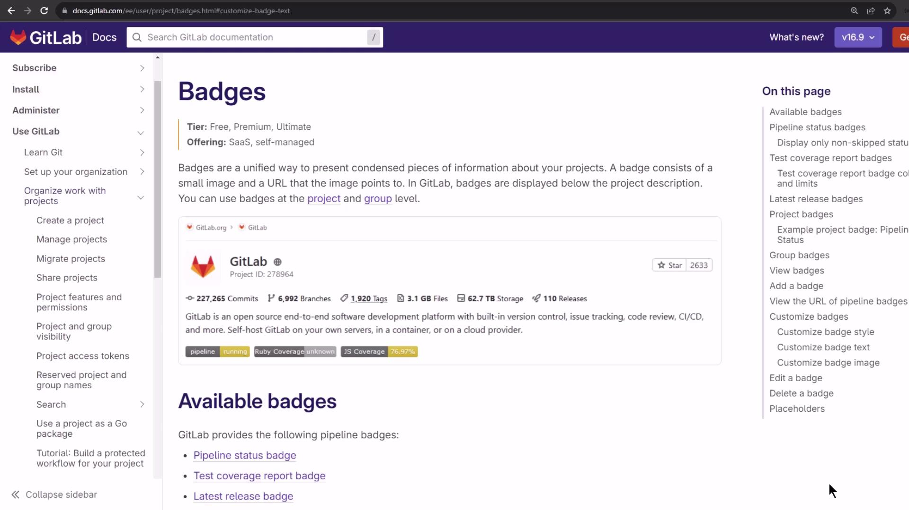
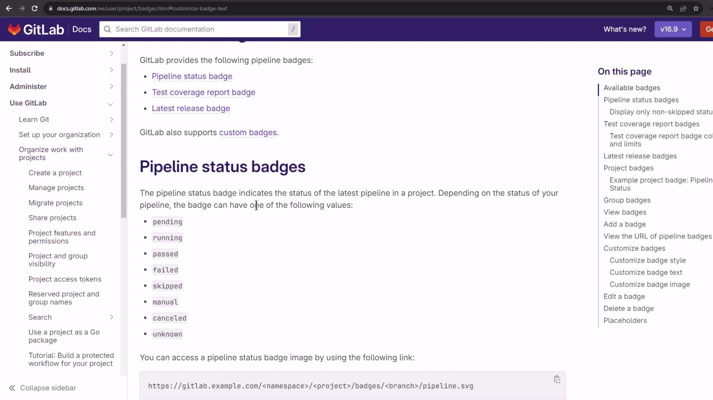
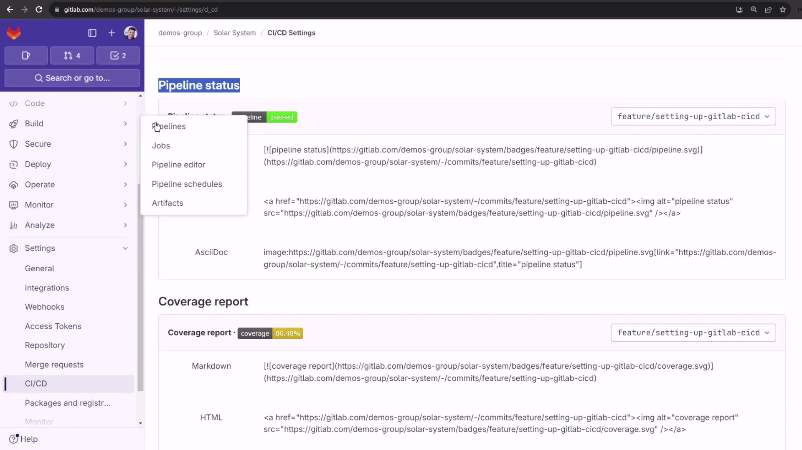
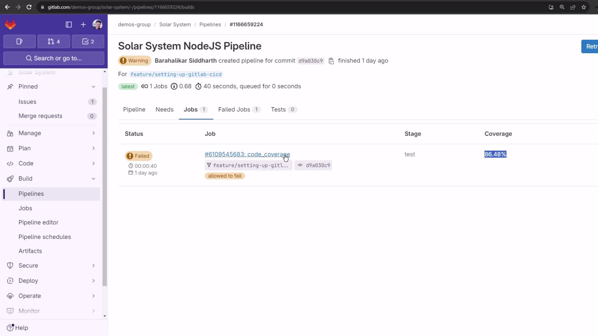
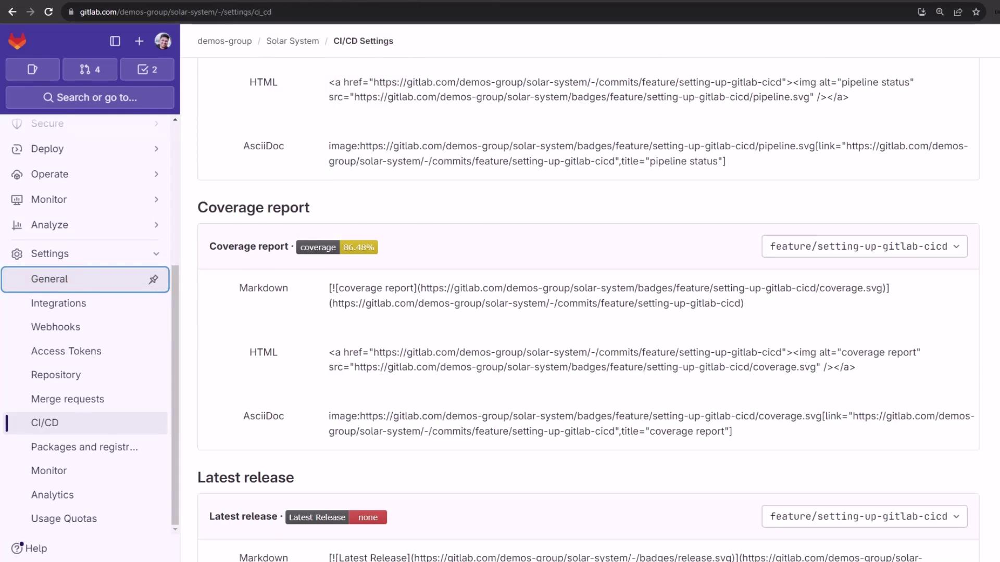
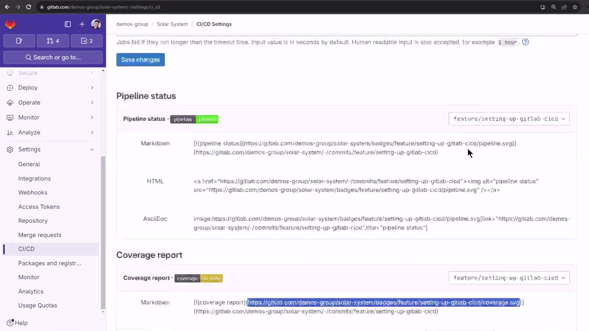
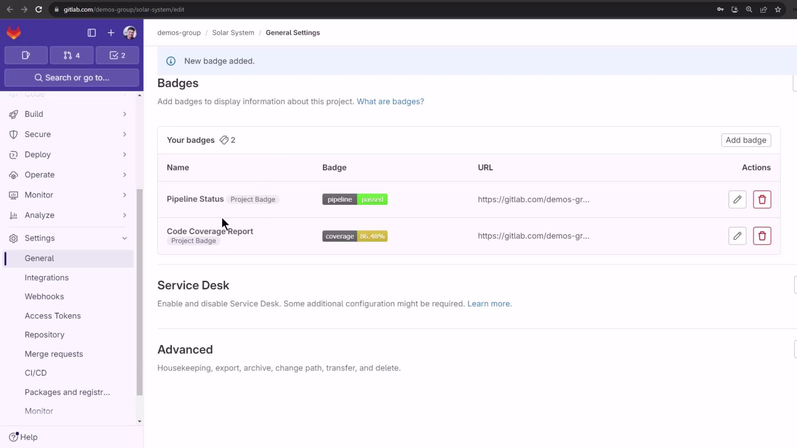
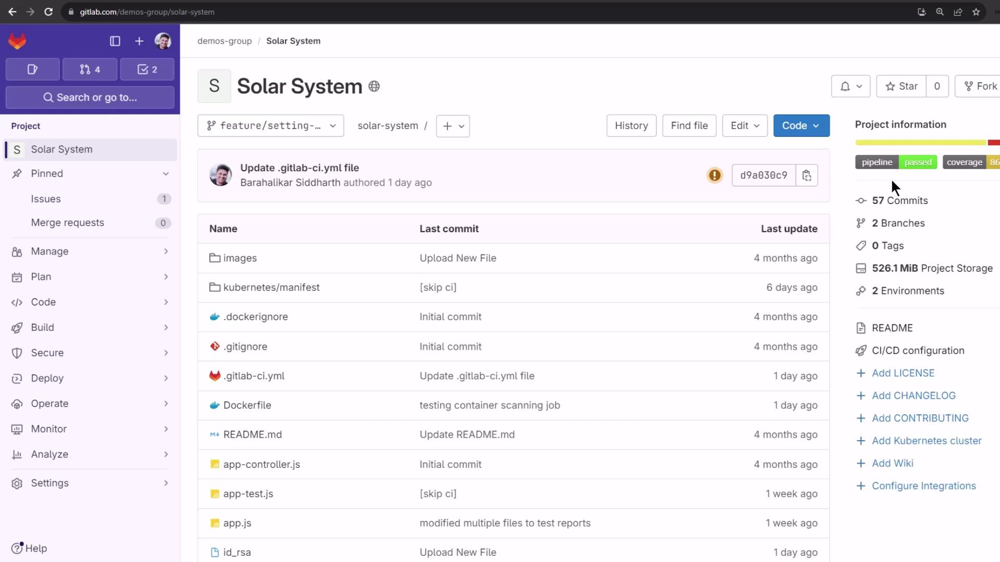

# Adding a Pipeline status amp Code Coverage Badge

Source: https://notes.kodekloud.com/docs/GitLab-CICD-Architecting-Deploying-and-Optimizing-Pipelines/Optimization-Security-and-Monitoring/Adding-a-Pipeline-status-amp-Code-Coverage-Badge/page

This article explains how to add pipeline status and code coverage badges in GitLab to display project metrics visually.

Badges in GitLab offer a concise, visual way to display essential project metrics—such as build health and test coverage—directly in your repository. Each badge is a small image that links to a URL, and you can define them at either the project or group level. They appear right below your project description, keeping stakeholders informed at a glance.

<Frame>
  
</Frame>

## Types of GitLab Badges

Use GitLab’s built-in badges or roll your own to surface the data your team cares about:

| Badge Type           | Description                                                                          |
| -------------------- | ------------------------------------------------------------------------------------ |
| Pipeline status      | Shows the latest pipeline state (pending, running, passed, failed, etc.).            |
| Test coverage report | Displays the percentage of code covered by tests, based on your coverage job output. |
| Latest release       | Indicates your project’s most recent release version.                                |
| Custom badge         | Let you specify any image URL and link for other metrics (e.g., security scan).      |

You can also adjust badge colors and styles to match your organization’s branding.

<Frame>
  
</Frame>

## Badge URL Example

If you prefer hosting your own SVG badges in the repository, reference them with a raw file URL:

```text theme={null}
https://gitlab.example.com/<project_path>/-/raw/<default_branch>/my-image.svg
```

<Callout icon="lightbulb">
  Hosting badges in your repo makes them versioned alongside your code. Just ensure the branch name and file path are correct.
</Callout>

## Configuring Pipeline Status & Coverage Badges

1. Navigate to **Settings ➔ CI/CD** in your project.
2. Expand the **General pipelines** section.
3. Scroll down to **Pipeline status** and **Coverage report**.

GitLab will automatically generate two badge URLs:

* **Pipeline status**: Reflects the last pipeline’s outcome.
* **Coverage report**: Shows the test coverage percentage only if a coverage job exists.

<Frame>
  
</Frame>

<Callout icon="triangle-alert">
  The coverage badge will appear only when your pipeline includes a job that outputs a coverage metric. Ensure you’ve configured a `coverage: /regex/` in your job definition.
</Callout>

<Frame>
  
</Frame>

## Badge Formats & Customization

Badges support Markdown, HTML, and AsciiDoc embed formats. You can also target specific branches by appending `?ref=<branch>` to the badge URL. Coverage badges change color based on percentage thresholds—up to five levels—which you can customize via URL parameters.

<Frame>
  
</Frame>

## Adding Badges to Your Project

To add badges under your project description:

1. Go to **Settings ➔ General**.
2. Find the **Badges** section and click **Add badge**.
3. Complete the fields:
   * **Name**: A descriptive label (e.g., `Pipeline Status`).
   * **Link URL**: Destination when the badge is clicked.
   * **Badge image URL**: The SVG endpoint generated by GitLab.
4. Click **Add badge** to save and preview.

<Frame>
  
</Frame>

### Example Configuration

1. **Pipeline Status**
   * **Name**: Pipeline Status
   * **Link**: `https://gitlab.example.com/<project_path>/pipelines`
   * **Image**: Paste your pipeline status `.svg` URL.

2. **Code Coverage**
   * **Name**: Code Coverage
   * **Link**: `https://gitlab.example.com/<project_path>/pipelines`
   * **Image**: Paste your coverage report `.svg` URL.

After saving, you’ll see a live preview. Confirm and you’re done!

<Frame>
  
</Frame>

## Viewing Badges in Your Project

Return to your project’s main page. The badges now appear beneath the project description, instantly communicating your build health and code coverage to every visitor.

<Frame>
  
</Frame>

***

## Links and References

* [GitLab Badges Documentation](https://docs.gitlab.com/ee/user/project/badges.html)
* [GitLab CI/CD Settings](https://docs.gitlab.com/ee/ci/)

<CardGroup>
  <Card title="Watch Video" icon="video" href="https://learn.kodekloud.com/user/courses/gitlab-ci-cd-architecting-deploying-and-optimizing-pipelines/module/1573bc2e-563a-424a-a558-2081416601b3/lesson/ce3251cc-2474-416b-b51b-dbe382bf029b" />

  <Card title="Practice Lab" icon="installation" href="https://learn.kodekloud.com/user/courses/gitlab-ci-cd-architecting-deploying-and-optimizing-pipelines/module/1573bc2e-563a-424a-a558-2081416601b3/lesson/73db6476-ded7-4eae-a407-1ffe0ddd0915" />
</CardGroup>
