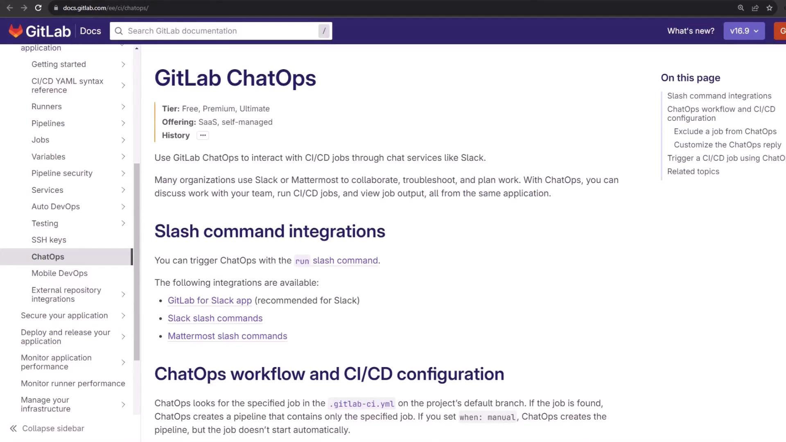
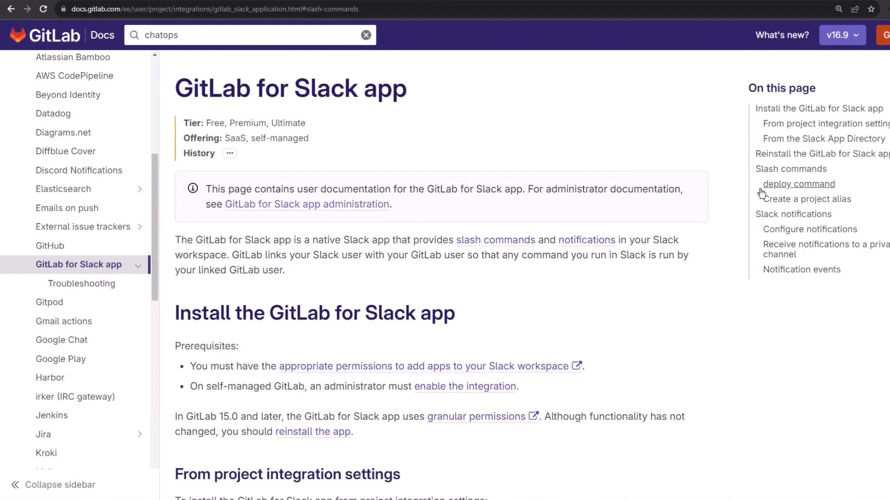
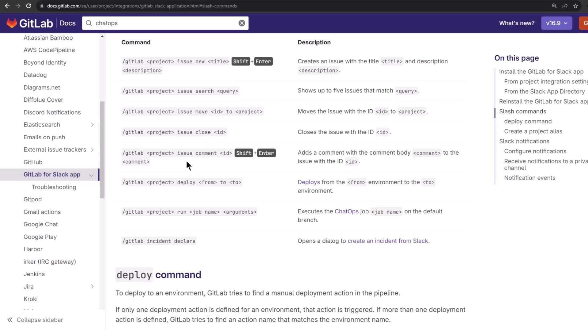
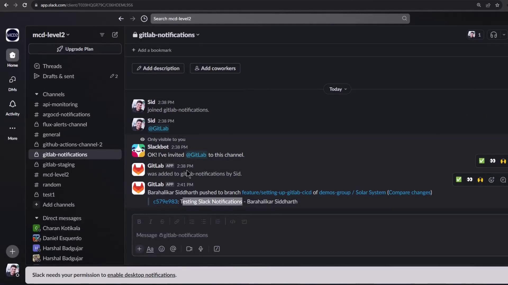
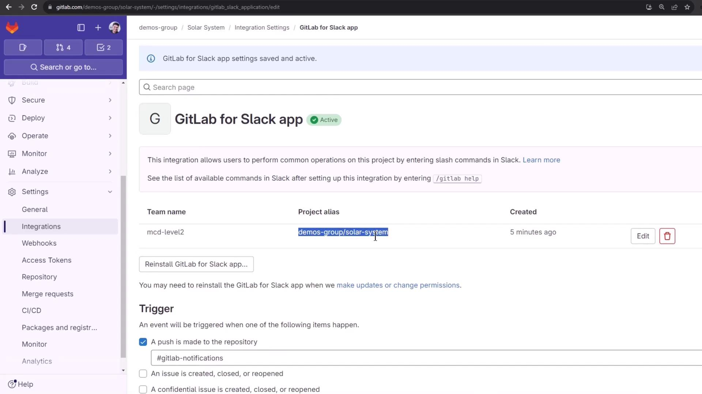
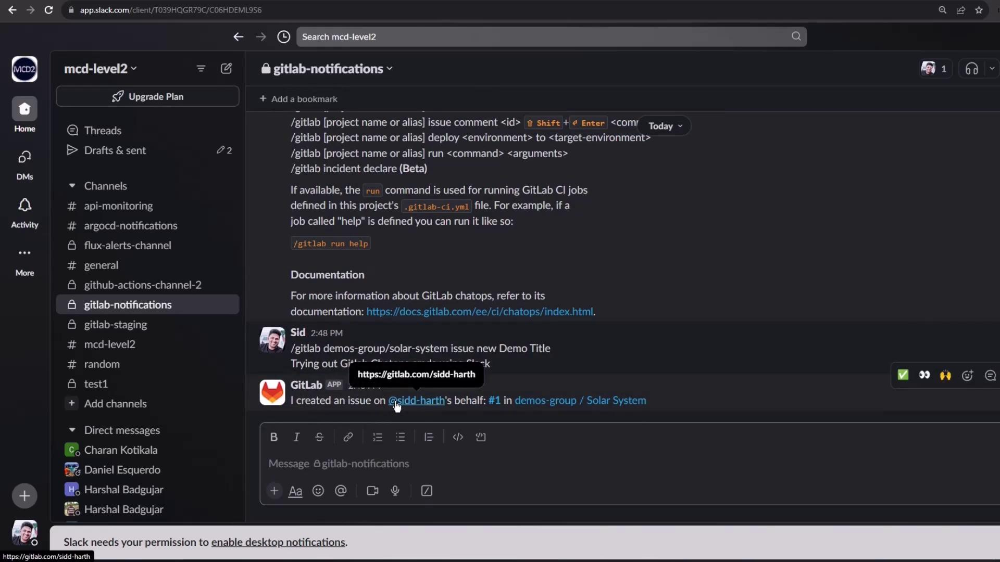
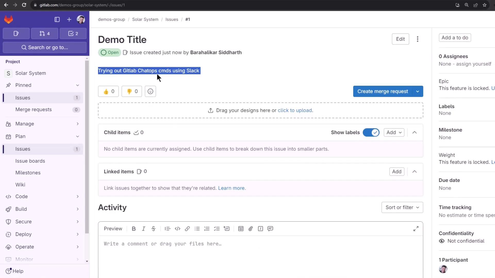
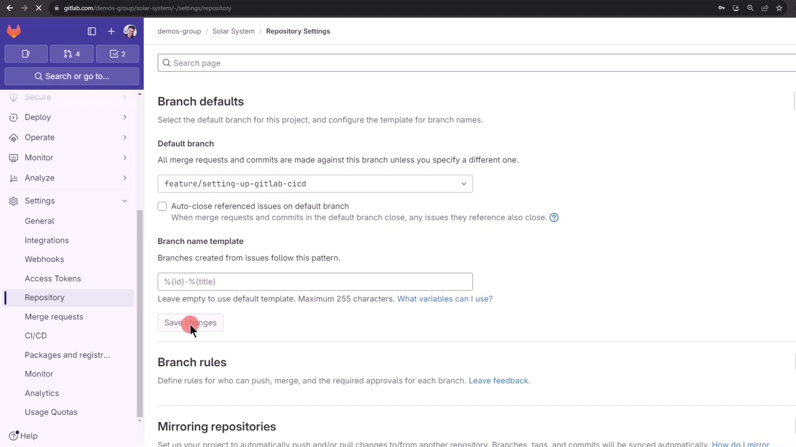
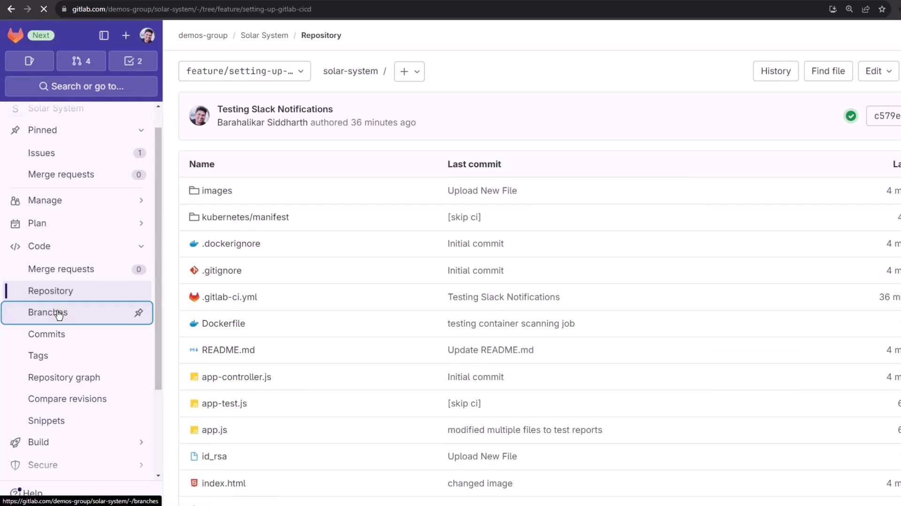

# ChatOps with Slack

Source: https://notes.kodekloud.com/docs/GitLab-CICD-Architecting-Deploying-and-Optimizing-Pipelines/Optimization-Security-and-Monitoring/ChatOps-with-Slack/page

This guide demonstrates integrating GitLab ChatOps into Slack for triggering CI/CD pipelines, managing issues, and reviewing job outputs.

In this guide, we’ll demonstrate how to integrate GitLab ChatOps into your Slack workspace. With GitLab ChatOps, you can trigger CI/CD pipelines, manage issues, and review job outputs—all without leaving Slack.

<Frame>
  
</Frame>

## Requirements

* A GitLab project with the **GitLab for Slack** app installed and configured
* Enabled slash commands in Slack (Mattermost uses different commands)

## Available Slash Commands

Use the `/gitlab help` command to list all supported GitLab ChatOps slash commands in your workspace.

<Frame>
  
</Frame>

<Frame>
  
</Frame>

| Slash Command                                        | Description           | Example                                                   |
| ---------------------------------------------------- | --------------------- | --------------------------------------------------------- |
| `/gitlab [alias] issue show <id>`                    | Display issue details | `/gitlab demo-group/solar-system issue show 42`           |
| `/gitlab [alias] issue new <title> <description>`    | Create a new issue    | `/gitlab demo-group/solar-system issue new "Bug" "Steps"` |
| `/gitlab [alias] issue close <id>`                   | Close an issue        | `/gitlab demo-group/solar-system issue close 42`          |
| `/gitlab [alias] run <job-name> [--branch=<branch>]` | Trigger a CI job      | `/gitlab demo-group/solar-system run test-suite`          |
| `/gitlab [alias] deploy <env> to <target-env>`       | Deploy environment    | `/gitlab demo-group/solar-system deploy staging to prod`  |

### List Commands in Slack

In your GitLab notification channel (e.g., `#gitlab-notifications`), type:

```bash theme={null}
/gitlab help
```

<Frame>
  
</Frame>

## Creating an Issue via ChatOps

You can quickly create issues directly in Slack:

1. Identify your **project alias** (group/project) set up during Slack integration.
2. Run the new-issue command:

   ```shell theme={null}
   /gitlab demos-group/solar-system issue new "Demo Title" <<Shift+Enter>>
   Trying out GitLab ChatOps commands using Slack.
   ```

<Frame>
  
</Frame>

<Frame>
  
</Frame>

Slack will confirm the issue creation. You can verify it in GitLab:

<Frame>
  
</Frame>

## Running CI Jobs via ChatOps

Assuming your `.gitlab-ci.yml` defines a `unit_testing` job:

```yaml theme={null}
unit_testing:
  stage: test
  extends: .prepare_nodejs_environment
  script:
    - npm test
  artifacts:
    when: always
    expire_in: 3 days
    name: Moca-Test-Result
    paths:
      - test-results.xml
    reports:
      junit: test-results.xml
```

Trigger this job in Slack:

```shell theme={null}
/gitlab demos-group/solar-system run unit_testing
```

If you need to run the job on a feature branch:

```shell theme={null}
/gitlab demos-group/solar-system run unit_testing --branch="feature/setting-up-gitlab-ci"
```

<Callout icon="triangle-alert">
  If escaping special characters in branch names fails, you may temporarily change your project’s default branch in GitLab.

  1. Go to **Settings > Repository > Default branch**
  2. Select your feature branch and save
</Callout>

<Frame>
  
</Frame>

<Frame>
  
</Frame>

Once the default branch is updated, rerun without `--branch`:

```shell theme={null}
/gitlab demos-group/solar-system run unit_testing
```

Back in GitLab you’ll see the new pipeline logs:

```plaintext theme={null}
Using docker image sha256:[SECRET_REDACTED] for node:17-alpine3.14 ...
$ npm install
up to date, audited 385 packages in 2s
45 packages are looking for funding
run `npm fund` for details
2 vulnerabilities (1 high, 1 critical)
...
$ npm test
> Solar System@6.7.6 test
> mocha app-test.js --timeout 10000 --reporter mocha-junit-reporter --exit
Server successfully running on port - 3000
```

You’ll also receive job-completion notifications directly in Slack, keeping you informed without context switching.

## References

* [GitLab ChatOps Documentation](https://docs.gitlab.[AWS_SECRET_ACCESS_KEY].html)
* [Slack Apps Integration Guide](https://api.slack.com/apps)
* [GitLab CI/CD Overview](https://docs.gitlab.com/ee/ci/)

<CardGroup>
  <Card title="Watch Video" icon="video" href="https://learn.kodekloud.com/user/courses/gitlab-ci-cd-architecting-deploying-and-optimizing-pipelines/module/1573bc2e-563a-424a-a558-2081416601b3/lesson/2b348ddc-3550-4672-85a1-6bce061d53d7" />
</CardGroup>
