# Example output:
# production-canary-77cbf87488-2x5jm   1/1 Running
# production-defd6d64cf-4qgl7          1/1 Running
```

Traffic splits according to ingress weights configured in each rollout step.

<Frame>
  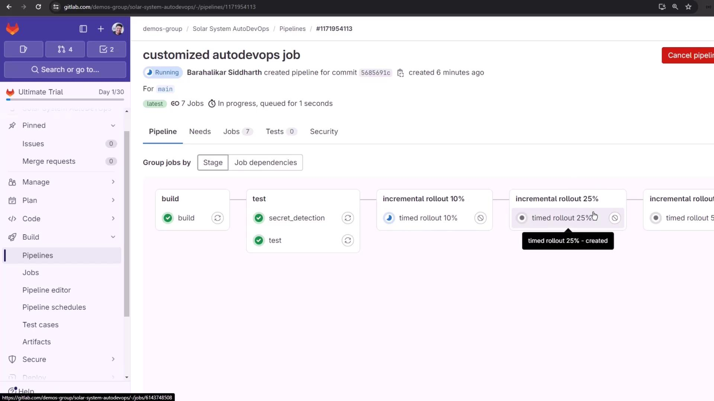
</Frame>

## Approving Protected Deployments

Protected environments halt deployments until manual approval:

<Frame>
  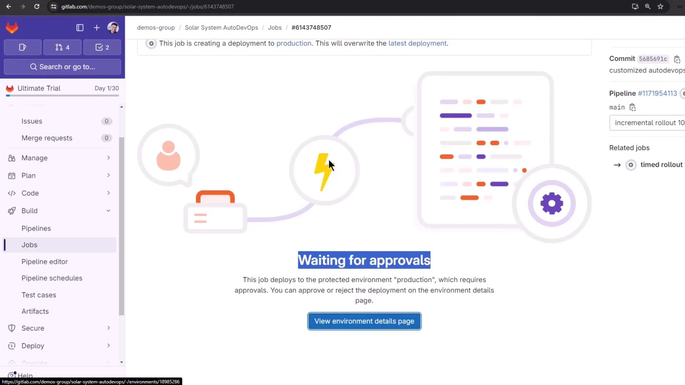
</Frame>

Click **Approve** in the confirmation dialog:

<Frame>
  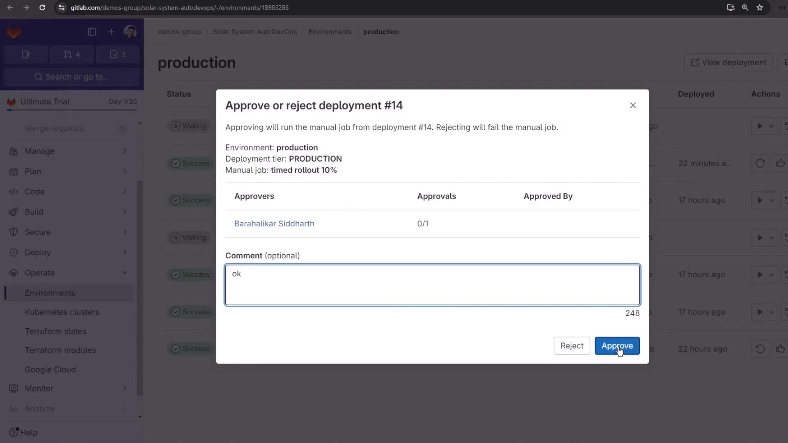
</Frame>

Then trigger any manual rollout jobs if required:

<Frame>
  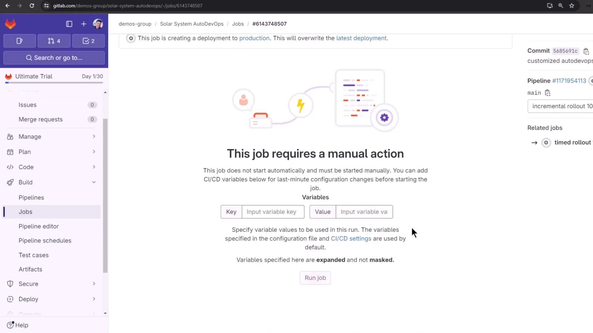
</Frame>

Or use an unscheduled manual action:

<Frame>
  
</Frame>

## Monitoring Environments

View all deployments and their statuses under **Operations > Environments**:

<Frame>
  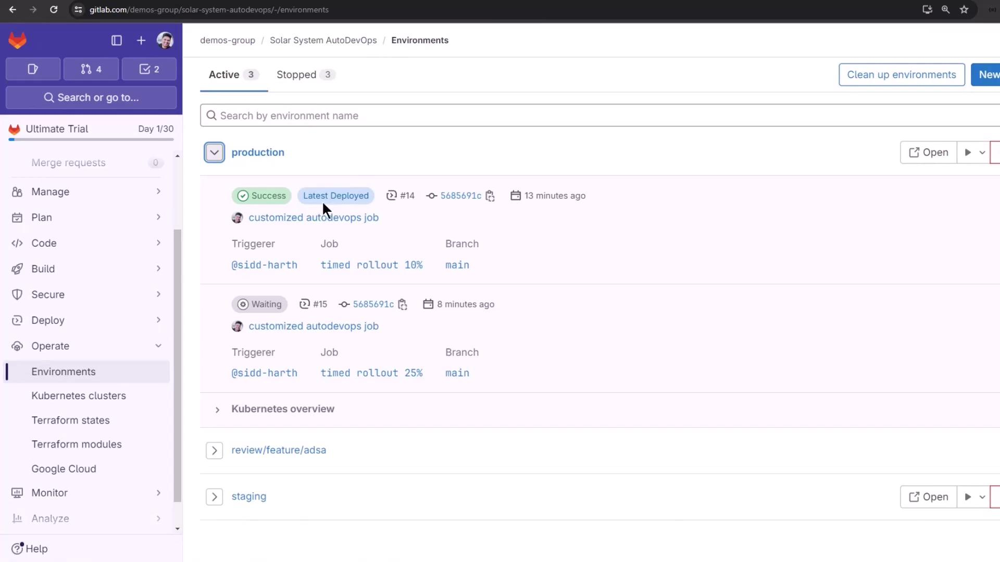
</Frame>

***

For more details, see the [Auto DevOps documentation](/help/topics/autodevops) or explore these resources:

* [GitLab CI/CD Variables](https://docs.gitlab.com/ee/ci/variables/)
* [Kubernetes CLI Overview](https://kubernetes.io/docs/reference/kubectl/overview/)

<CardGroup>
  <Card title="Watch Video" icon="video" href="https://learn.kodekloud.com/user/courses/gitlab-ci-cd-architecting-deploying-and-optimizing-pipelines/module/a6a5540f-e7d1-4820-afc8-2be1d6e3061a/lesson/4dd5f4d8-cfc4-402e-a785-0ced134f1a6b" />
</CardGroup>


# Automatic Deployment to Production Environment

Source: https://notes.kodekloud.com/docs/GitLab-CICD-Architecting-Deploying-and-Optimizing-Pipelines/Auto-DevOps/Automatic-Deployment-to-Production-Environment/page

This article explains how to automate application deployment to a production environment using GitLabs CI/CD pipelines.

In this lesson, we’ll automate the deployment of our application to the `production` environment by merging a feature branch into `main`. Previously, we ran the pipeline in the feature branch and verified deployment to the review stage using Auto DevOps. Now, accepting the merge request will trigger a new pipeline on `main`.

## 1. Merge Feature Branch into Main

First, confirm that all review jobs have passed:

<Frame>
  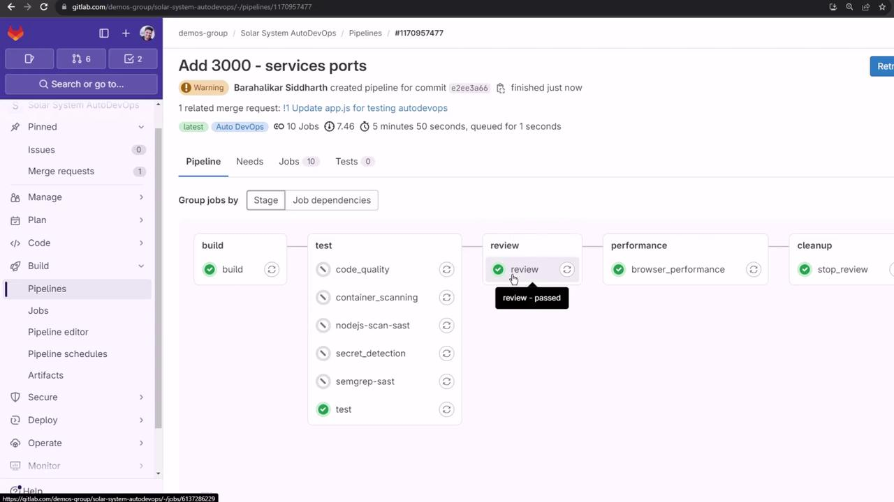
</Frame>

Open the merge request, uncheck **Delete source branch**, and click **Merge** to push your changes to `main`:

<Frame>
  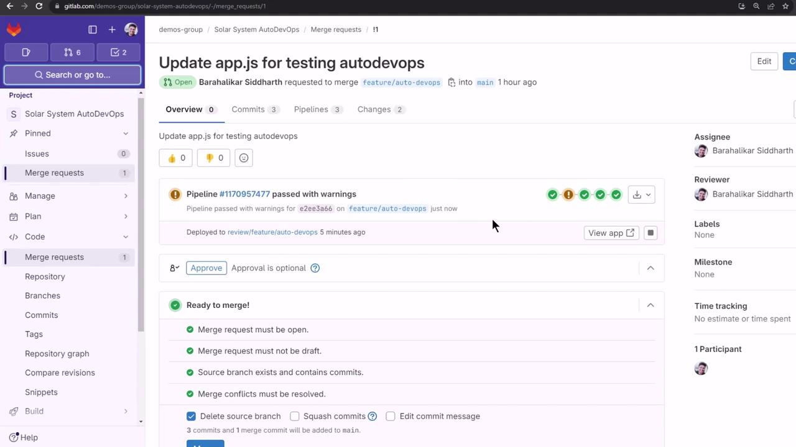
</Frame>

## 2. Monitor the Pipeline on Main

Navigate to **CI/CD > Pipelines** to see the new run:

<Frame>
  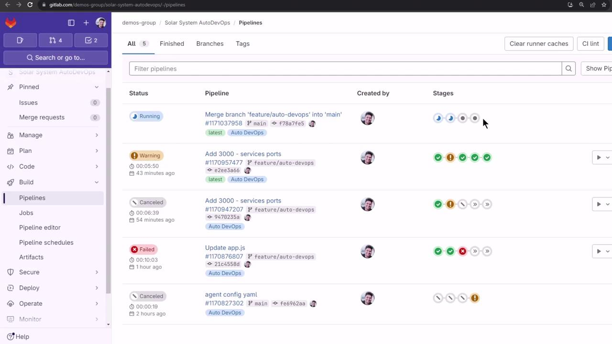
</Frame>

The `main` pipeline executes the following stages:

| Stage       | Purpose                            |
| ----------- | ---------------------------------- |
| build       | Compile code and build artifacts   |
| test        | Run unit and integration tests     |
| production  | Deploy to the production namespace |
| performance | Execute browser performance tests  |

<Callout icon="lightbulb">
  To speed up demos, cancel the test jobs manually once they start.
</Callout>

## 3. Validate Production Deployment

Ensure that the `production` namespace is empty before deployment:

```bash theme={null}
kubectl get all -n production
```

When the **production** stage completes, you’ll see logs indicating Helm deployment and artifact uploads:

```bash theme={null}
$ auto-deploy delete canary
WARNING: Kubernetes configuration file is group-readable. This is insecure. Location: /builds/.../KUBECONFIG
WARNING: Kubernetes configuration file is world-readable. This is insecure. Location: /builds/.../KUBECONFIG

$ auto-deploy persist_environment_url
Uploading artifacts for successful job
environment_url.txt: found 1 matching artifact files and directories
WARNING: tiller.log: no matching files. Ensure that the artifact path is relative to the working directory (/builds/...)
Uploading artifacts as "archive" to coordinator... 201 Created
Job succeeded
```

<Callout icon="triangle-alert">
  The warnings above show that your `KUBECONFIG` file has overly permissive access. Restrict file permissions to prevent security issues.
</Callout>

Next, verify that 10 replicas are running (the count is driven by a CI/CD variable):

```bash theme={null}
kubectl get all -n production
```

```plaintext theme={null}
NAME                                           READY   STATUS    RESTARTS   AGE
pod/production-df6dd64cf-2p8b6                 1/1     Running   0          2m22s
… (8 more pods) …

NAME                              TYPE        CLUSTER-IP   PORT(S)    AGE
service/production-auto-deploy    ClusterIP   10.104.1.52  3000/TCP   2m22s

NAME                         READY   UP-TO-DATE   AVAILABLE   AGE
deployment.apps/production   10/10   10           10          2m22s

NAME                                      DESIRED   CURRENT   READY   AGE
replicaset.apps/production-df6dd64cf       10        10        10      2m22s
```

## 4. Test Load Balancing

Confirm traffic distribution across all replicas by curling the `/os` endpoint repeatedly:

```bash theme={null}
while true; do
  curl -sk https://demos-group-solar-system-autodevops.139.84.208.48.nip.io/os \
    | grep --color -E 'production|canary'
done
```

You’ll see different pod names in the responses, verifying round-robin load balancing.

## 5. Performance Testing

After **production**, the pipeline automatically runs browser performance benchmarks and archives the results:

<Frame>
  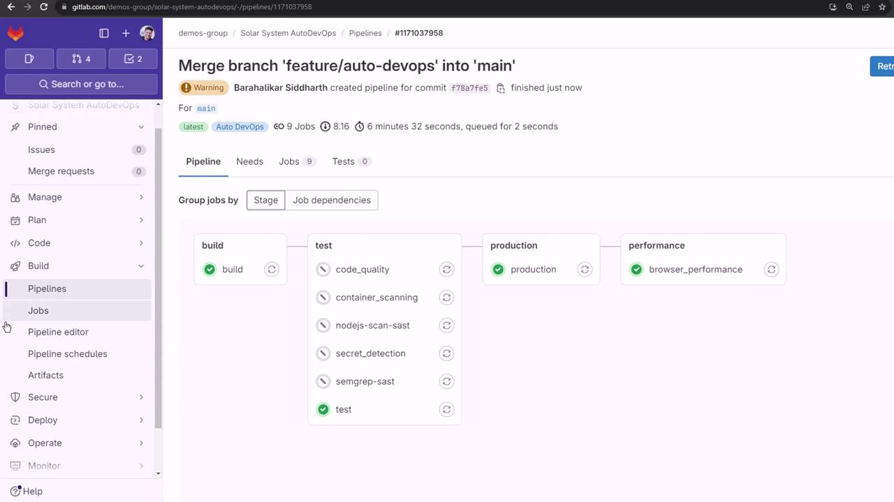
</Frame>

## 6. Reviewing Auto DevOps Settings

In your project, go to **Settings > CI/CD**, then expand **Auto DevOps** to review deployment strategies. We used Continuous Deployment to production in this lesson:

<Frame>
  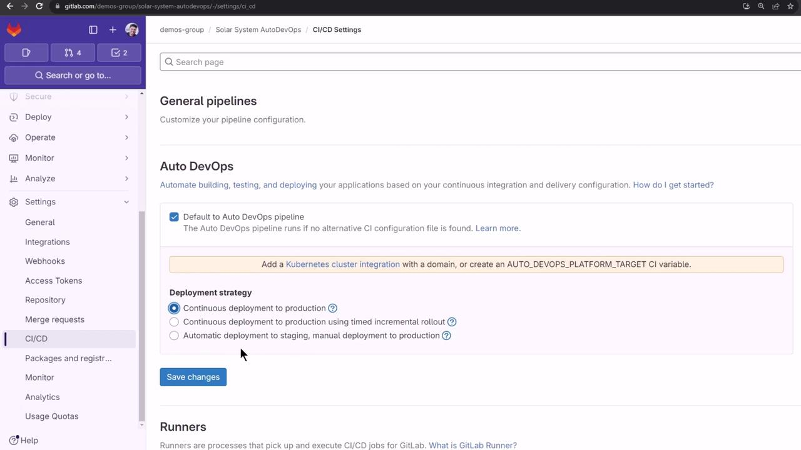
</Frame>

## 7. Exploring Dashboards and Reports

Auto DevOps generates code quality, SAST, and secret detection artifacts. On the free tier, download these from **Job Artifacts**. With [Premium/Ultimate plans](https://about.gitlab.com/pricing/), you can view reports directly:

* **Security Dashboard**: Aggregated vulnerability findings
* **Operations Dashboard**: Live environment and deployment status

### Vulnerability Report

From the top menu, choose **Security & Compliance > Vulnerability report**:

<Frame>
  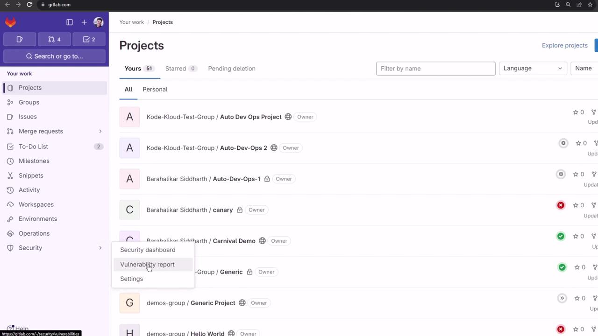
</Frame>

### Environments Dashboard

Add multiple projects to an **Environments Dashboard** (Premium/Ultimate only):

<Frame>
  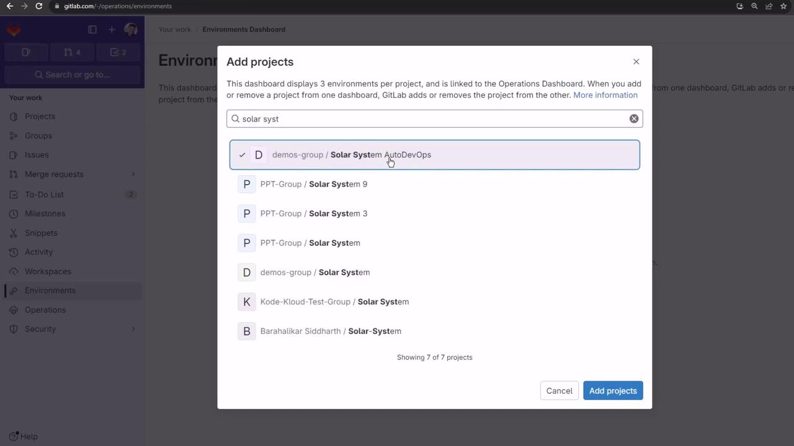
</Frame>

Attempting to include private projects on the free tier results in an error:

<Frame>
  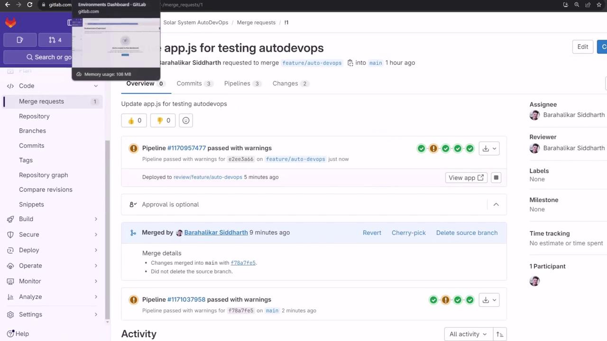
</Frame>

We recommend exploring these dashboards with a trial Ultimate account and configuring manual approvals for production deployments.

## Links and References

* [GitLab Auto DevOps](https://docs.gitlab.com/ee/topics/autodevops/)
* [GitLab CI/CD Pipelines](https://docs.gitlab.com/ee/ci/pipelines/)
* [Kubernetes Documentation](https://kubernetes.io/docs/)

<CardGroup>
  <Card title="Watch Video" icon="video" href="https://learn.kodekloud.com/user/courses/gitlab-ci-cd-architecting-deploying-and-optimizing-pipelines/module/a6a5540f-e7d1-4820-afc8-2be1d6e3061a/lesson/3cea8695-94eb-4224-908d-7519cf739f3e" />
</CardGroup>
