# Configuring AutoDevOps

Source: https://notes.kodekloud.com/docs/GitLab-CICD-Architecting-Deploying-and-Optimizing-Pipelines/Auto-DevOps/Configuring-AutoDevOps/page

Automate the CI/CD pipeline for your Node.js Solar System application using GitLab Auto DevOps for end-to-end detection, building, testing, and deployment.

Automate the CI/CD pipeline for your Node.js Solar System application with **GitLab Auto DevOps**. Since this repository contains only source code—no Dockerfile, Kubernetes manifests, or `.gitlab-ci.yml`—Auto DevOps will detect, build, test, and deploy your app end to end.

## 1. Importing the Project

1. In GitLab, click **+ New project** → **Import project** → **Repo by URL**.
2. Paste your repository URL.
3. Under **Select namespace**, pick **demos**. Set **Project name** to `solar-system-auto-devops`, choose **Public**, then click **Create project**.

<Frame>
  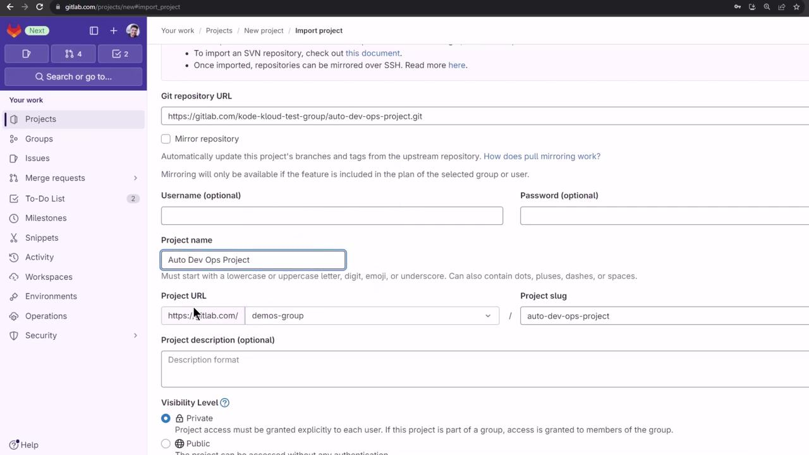
</Frame>

After import, you'll see your project without a Dockerfile, Kubernetes manifests, or `.gitlab-ci.yml`.

<Frame>
  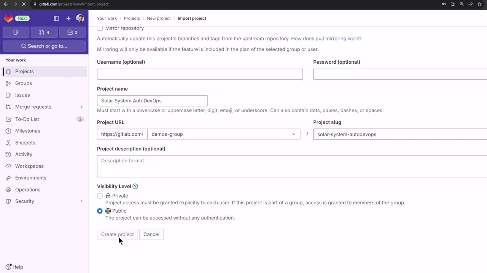
</Frame>

<Frame>
  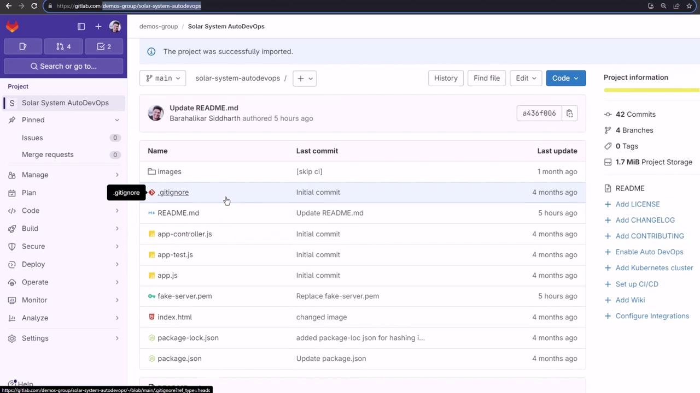
</Frame>

## 2. Reviewing Auto DevOps Documentation

GitLab’s [Auto DevOps docs](https://docs.gitlab.com/ee/topics/autodevops/) cover its features, stages, and integration points.

<Frame>
  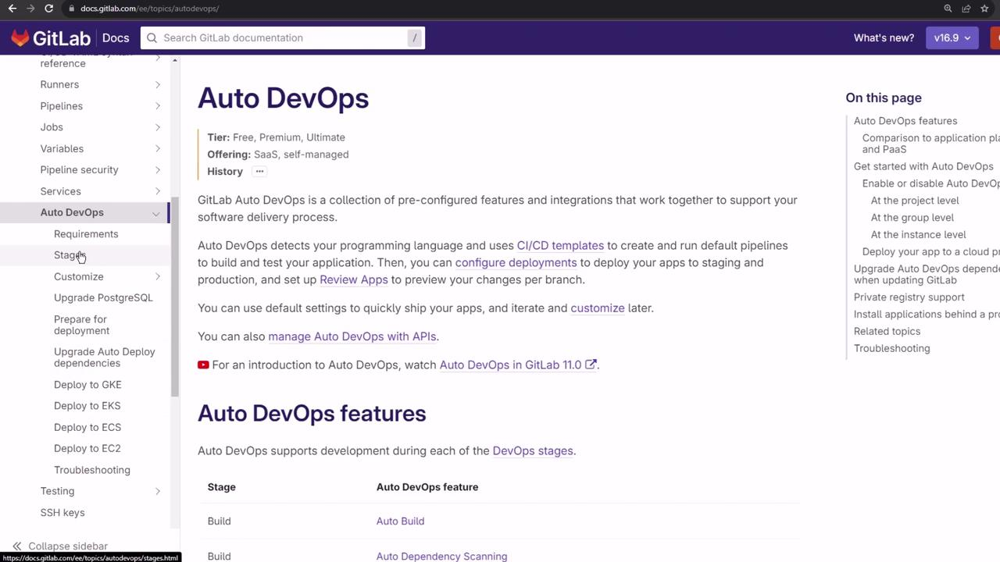
</Frame>

### 2.1 Requirements

To build and test, no Kubernetes is needed. For automated deployment you must have:

* Kubernetes cluster (v1.12+)
* Wildcard DNS (e.g., `nip.io`)
* GitLab Agent or cluster integration

<Frame>
  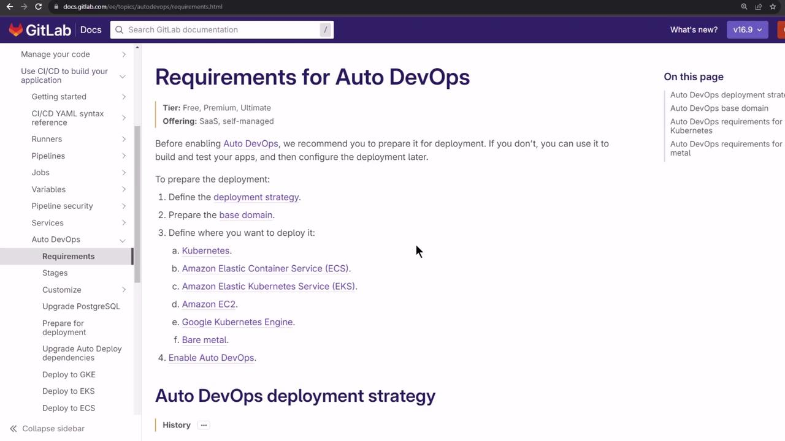
</Frame>

### 2.2 Deployment Strategies

Auto DevOps supports:

| Strategy                            | Description                                          |
| ----------------------------------- | ---------------------------------------------------- |
| Continuous Deployment to Production | Deploy every successful pipeline to production       |
| Continuous Deployment with Canary   | Gradual traffic shift for safer rollouts             |
| Manual Promotion                    | Requires explicit approval before production release |

We’ll use **Continuous Deployment to Production**.

<Frame>
  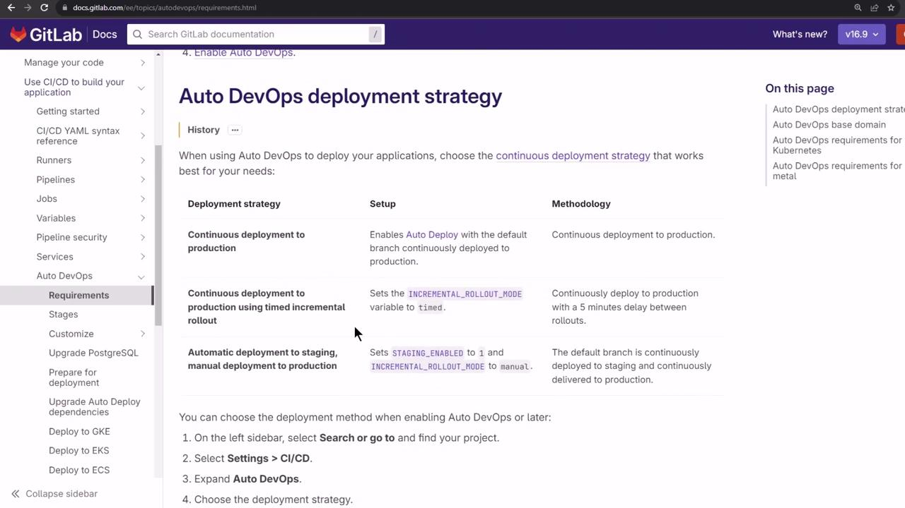
</Frame>

## 3. Enabling Auto DevOps

1. Go to **Settings > CI/CD > Auto DevOps**.
2. Toggle **Enable Auto DevOps** on.

You'll choose the deployment strategy after configuring your cluster.

## 4. Connecting a Kubernetes Cluster

1. Navigate to **Operate > Kubernetes clusters**.
2. Click **Connect cluster** → **Create GitLab Agent**.
3. Name it `auto-devops-agent` and click **Register**.

<Frame>
  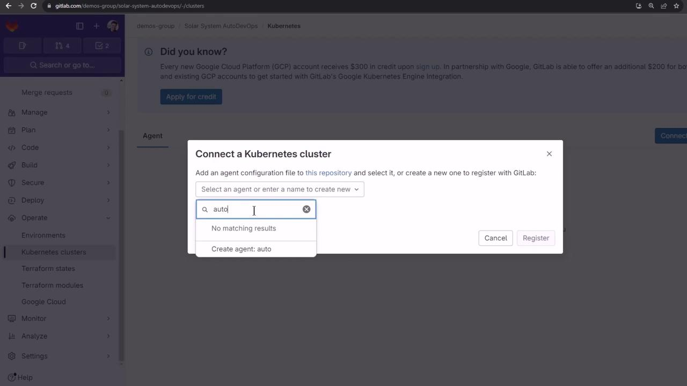
</Frame>

4. Install the agent via Helm:

```bash theme={null}
helm repo add gitlab https://charts.gitlab.io
helm repo update

helm upgrade --install auto-devops-agent gitlab/gitlab-agent \
  --namespace gitlab-agent-auto-devops-agent \
  --create-namespace \
  --set image.tag=v16.9.0-rc2 \
  --set config.token=glagent-rthdvds1zyCnME14AM8tdE5HVzy7iZJ9Avr~Bg_epySyxtbw \
  --set config.kasAddress=wss://kas.gitlab.com
```

5. Confirm the namespace and pods:

```bash theme={null}
kubectl get namespaces | grep gitlab-agent-auto-devops-agent
kubectl get pods -n gitlab-agent-auto-devops-agent
```

Once connected, your cluster appears in GitLab.

<Frame>
  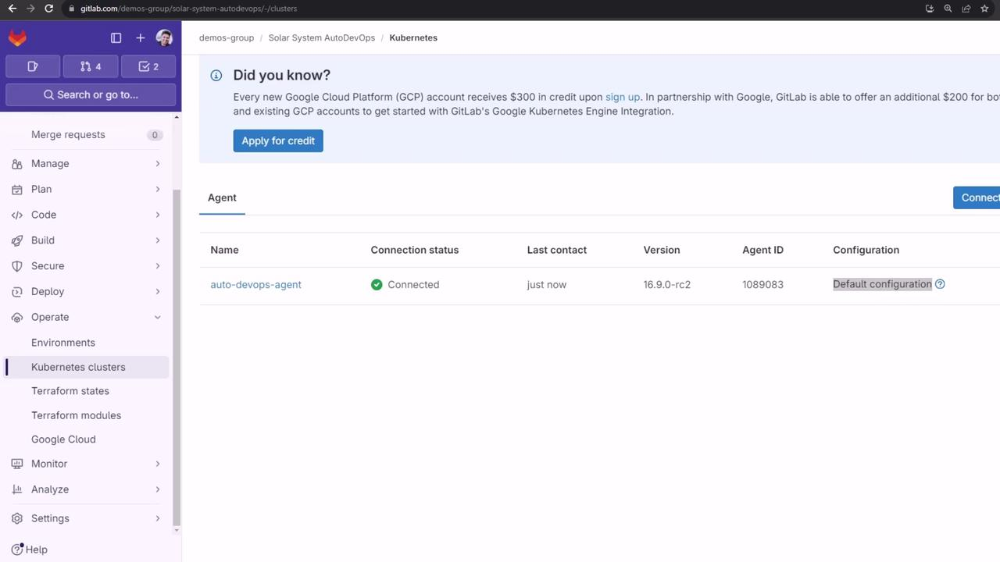
</Frame>

## 5. Configuring the Agent

Add the configuration at `.gitlab/agents/auto-devops-agent/config.yaml`:

```yaml theme={null}
user_access:
  access_as:
    agent: {}
  projects:
    - id: demos-group/solar-system-auto-devops

ci_access:
  projects:
    - id: demos-group/solar-system-auto-devops
```

Commit to `main`. GitLab will apply these permissions automatically.

## 6. Defining Environments

We’ll target two namespaces: **staging** and **production**.

1. **Staging**
   * Go to **Environments > New environment**.
   * Name: `staging`
   * Kubernetes agent: `auto-devops-agent`
   * Namespace: **All namespaces**
   * Click **Save**.

<Frame>
  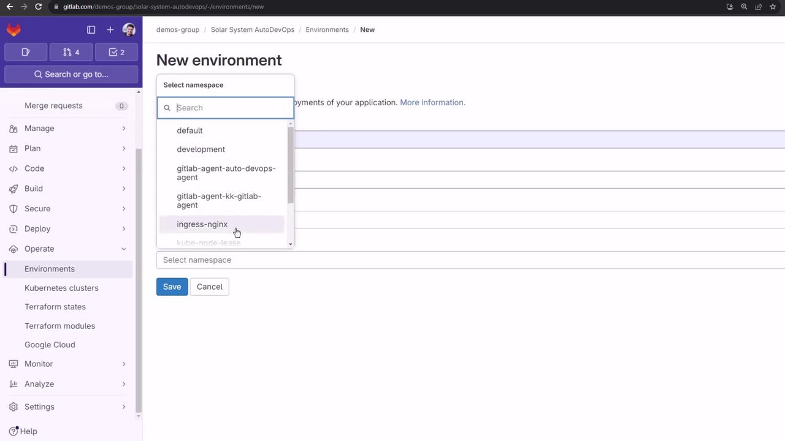
</Frame>

2. **Production**

   * Create the namespace:

   ```bash theme={null}
   kubectl create namespace production
   ```

   * In **Environments > New environment**:
     * Name: `production`
     * Agent: `auto-devops-agent`
     * Namespace: `production`
   * Click **Save**.

<Frame>
  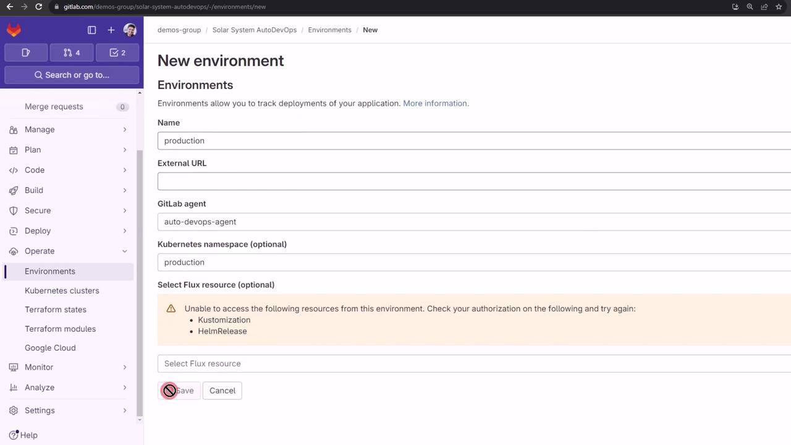
</Frame>

After setup, the **Kubernetes** overview lists your workloads:

<Frame>
  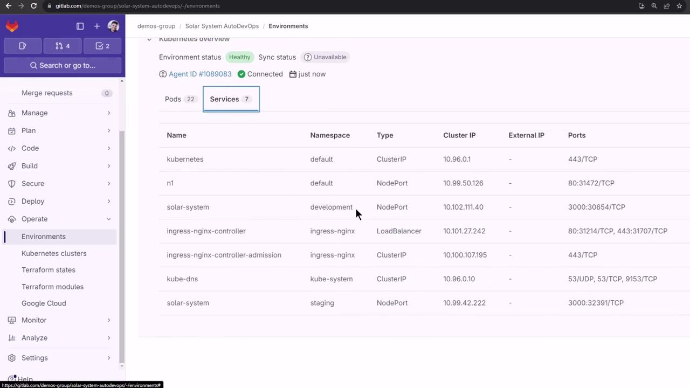
</Frame>

## 7. Setting CI/CD Variables

Retrieve your Ingress load balancer IP:

```bash theme={null}
kubectl -n ingress-nginx get svc ingress-nginx-controller \
  -o json | jq -r '.status.loadBalancer.ingress[0].ip'
```

In **Settings > CI/CD > Variables**, add:

| Variable                    | Value                                                    | Environment |
| --------------------------- | -------------------------------------------------------- | ----------- |
| KUBE\_INGRESS\_BASE\_DOMAIN | `<LOAD_BALANCER_IP>.nip.io`                              | all         |
| KUBE\_CONTEXT               | `demos-group/solar-system-auto-devops:auto-devops-agent` | all         |
| KUBE\_NAMESPACE             | `staging`                                                | staging     |
| KUBE\_NAMESPACE             | `production`                                             | production  |
| PRODUCTION\_REPLICAS        | `10`                                                     | production  |

<Frame>
  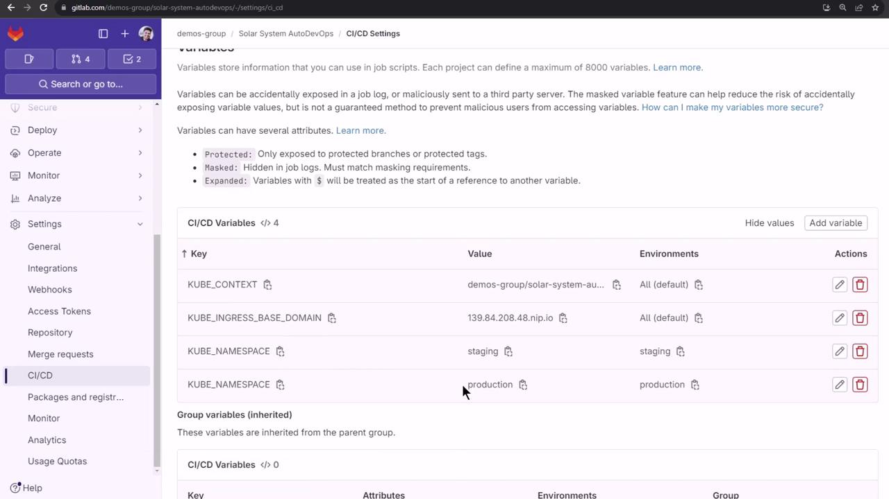
</Frame>

<Callout icon="lightbulb">
  Variable names are case-sensitive. Double-check the values before running your pipeline.
</Callout>

Refer to the [Auto DevOps CI/CD variables documentation](https://docs.gitlab.com/ee/ci/variables/predefined_variables.html) for more options.

<Frame>
  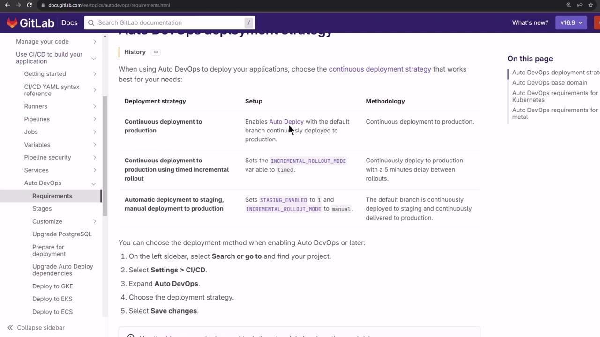
</Frame>

## 8. Selecting Deployment Strategy

Back in **Settings > CI/CD > Auto DevOps**, choose **Continuous Deployment to Production** and click **Save**. A new pipeline will start automatically.

<Frame>
  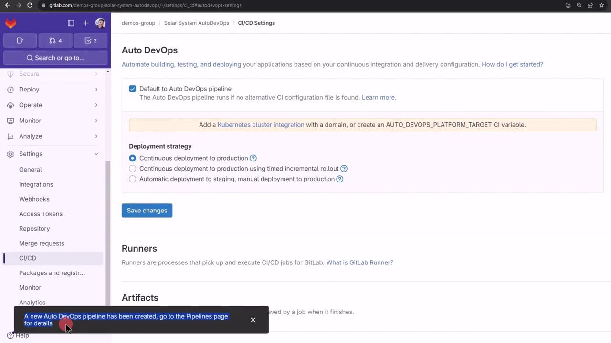
</Frame>

Go to **CI/CD > Pipelines** to track progress:

<Frame>
  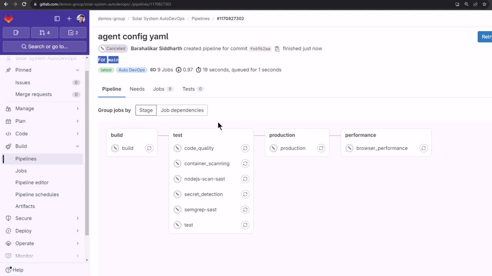
</Frame>

<Callout icon="lightbulb">
  Test feature branches before merging into `main` to avoid production issues.
</Callout>

***

* [GitLab Auto DevOps Documentation](https://docs.gitlab.com/ee/topics/autodevops/)
* [GitLab CI/CD Variables](https://docs.gitlab.com/ee/ci/variables/predefined_variables.html)
* [Kubernetes Basics](https://kubernetes.io/docs/concepts/overview/what-is-kubernetes/)
* [Helm Charts for GitLab Agent](https://docs.gitlab.com/charts/)

<CardGroup>
  <Card title="Watch Video" icon="video" href="https://learn.kodekloud.com/user/courses/gitlab-ci-cd-architecting-deploying-and-optimizing-pipelines/module/a6a5540f-e7d1-4820-afc8-2be1d6e3061a/lesson/23193b3a-e8a9-4a5e-82e2-1f56f83fda43" />
</CardGroup>
