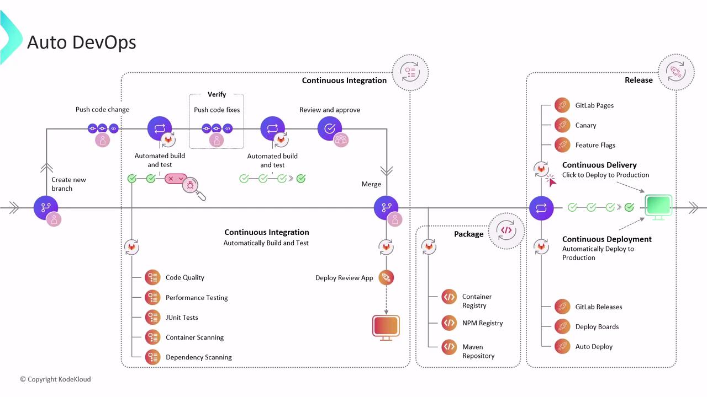
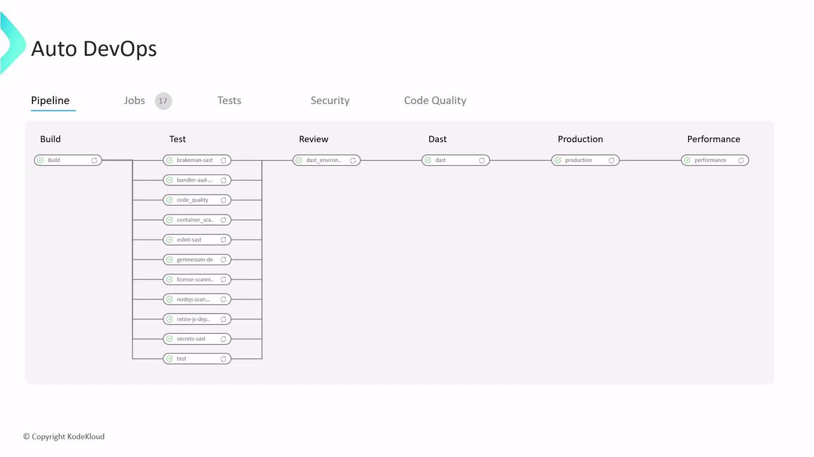

# What is Auto DevOps

Source: https://notes.kodekloud.com/docs/GitLab-CICD-Architecting-Deploying-and-Optimizing-Pipelines/Auto-DevOps/What-is-Auto-DevOps/page

GitLab Auto DevOps is a CI/CD feature that automates pipeline generation, integrating best practices for build, test, and deployment stages.

GitLab Auto DevOps is a built-in CI/CD feature that automatically detects your project’s language, framework, and configuration to generate a complete pipeline. It follows best practices across build, test, and deployment stages—integrating security scans, code quality checks, and container analysis—so you can focus on writing code instead of maintaining CI/CD scripts.

Auto DevOps provides:

* Automated build and containerization
* Comprehensive testing (unit, integration, security)
* Review Apps for testing merge request changes
* Continuous delivery or deployment after merge

<Callout icon="lightbulb">
  Auto DevOps offers sensible defaults, but you can [customize the pipeline](https://docs.gitlab.com/ee/topics/autodevops/customize_deployment.html) via CI/CD templates or project-specific `.gitlab-ci.yml` overrides.
</Callout>

<Frame>
  
</Frame>

## How Auto DevOps Works at the Project Level

When you enable Auto DevOps in **Settings > CI/CD**, GitLab inspects your repository and applies predefined CI/CD templates. The default pipeline includes three core stages:

### 1. Build Stage

* Detects a `Dockerfile` in your repo and builds a container image.
* Falls back to [Heroku buildpacks](https://devcenter.heroku.com/articles/buildpacks) if no Dockerfile is found.
* Outputs a ready-to-use Docker image for subsequent stages.

### 2. Test Stage

Runs your test suite and adds built-in checks:

| Check Type                                 | Description                                                                |
| ------------------------------------------ | -------------------------------------------------------------------------- |
| Code Quality                               | Analyzes source code for maintainability and style issues.                 |
| Static Application Security Testing (SAST) | Scans code for common vulnerabilities.                                     |
| Secret Detection                           | Searches for accidentally committed credentials.                           |
| Dependency Scanning                        | Reviews `Gemfile.lock`, `package.json`, etc., for vulnerable dependencies. |
| Container Scanning                         | Scans the built Docker image for OS-level vulnerabilities.                 |

Supported languages include Ruby, Node.js, Java (Maven/Gradle), Python, Go, and more. All reports appear in the pipeline UI for immediate feedback.

### 3. Kubernetes Deployment

If you register a [Kubernetes cluster](https://kubernetes.io/) in **Operations > Kubernetes**, Auto DevOps can deploy your app automatically. Supported cluster providers include:

* [Amazon EKS (Elastic Kubernetes Service)](https://docs.aws.amazon.com/eks/latest/userguide/what-is-eks.html)
* [Google Kubernetes Engine (GKE)](https://cloud.google.com/kubernetes-engine)
* Self-managed (Bare Metal) clusters

## Review Apps and Security Testing

When a merge request is opened, Auto DevOps spins up a **Review App**—a temporary, live environment to validate changes before merge. This deployment uses the [Helm Auto Deploy chart](https://docs.gitlab.com/ee/topics/autodevops/deploy_with_helm.html), which you can customize.

Once the Review App is live, Auto DevOps runs Dynamic Application Security Testing (DAST) using [OWASP ZAP](https://www.zaproxy.org/). ZAP crawls the application, identifies vulnerabilities, and produces a comprehensive report with severity levels and remediation advice.

<Frame>
  
</Frame>

## Post-Merge Deployment and Performance Testing

After you merge to the default branch, Auto DevOps can deploy your application to staging or production based on your configuration. Post-deployment, it executes browser-based performance tests to benchmark page load times against previous releases—ensuring optimal user experience.

## Deployment Strategies

Choose from three release workflows to match your team’s requirements:

| Strategy                                     | Behavior                                                                                                                |
| -------------------------------------------- | ----------------------------------------------------------------------------------------------------------------------- |
| Continuous Deployment to Production          | Deploys every successful pipeline run directly to production without manual steps.                                      |
| Automatic Staging + Manual Production Deploy | Automatically updates staging; requires manual approval to promote changes to production (e.g., click the play button). |
| Timed Incremental Rollout                    | Performs staged deployments automatically with configurable delays (default: 5 minutes between stages).                 |

<Callout icon="triangle-alert">
  Ensure your rollback procedures are tested and documented. Timed rollouts reduce risk but require proper monitoring and alerts.
</Callout>

<Frame>
  
</Frame>

## Links and References

* [GitLab Auto DevOps documentation](https://docs.gitlab.com/ee/topics/autodevops/)
* [GitLab CI/CD Overview](https://docs.gitlab.com/ee/ci/)
* [Kubernetes Basics](https://kubernetes.io/docs/concepts/overview/what-is-kubernetes/)
* [OWASP ZAP Proxy](https://www.zaproxy.org/)
* [Heroku Buildpacks](https://devcenter.heroku.com/articles/buildpacks)

<CardGroup>
  <Card title="Watch Video" icon="video" href="https://learn.kodekloud.com/user/courses/gitlab-ci-cd-architecting-deploying-and-optimizing-pipelines/module/a6a5540f-e7d1-4820-afc8-2be1d6e3061a/lesson/09845029-32ca-4040-8341-0f07281c1a61" />
</CardGroup>
