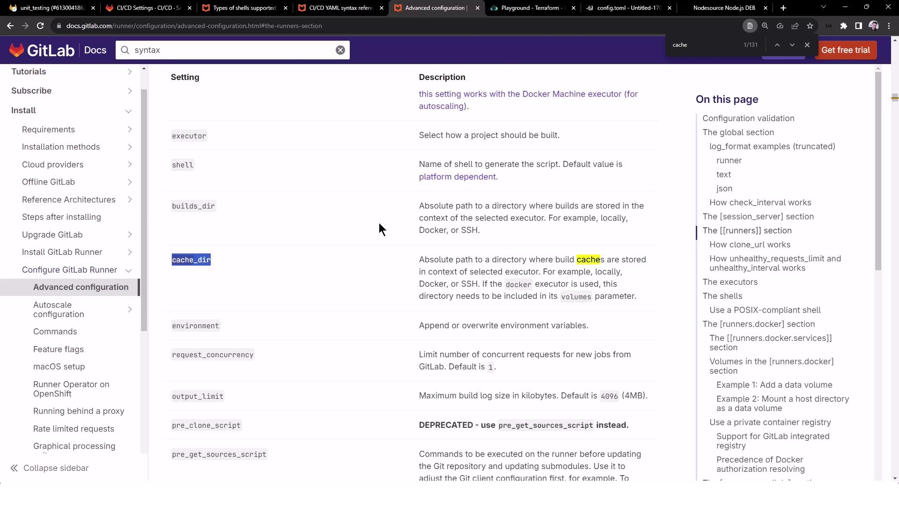
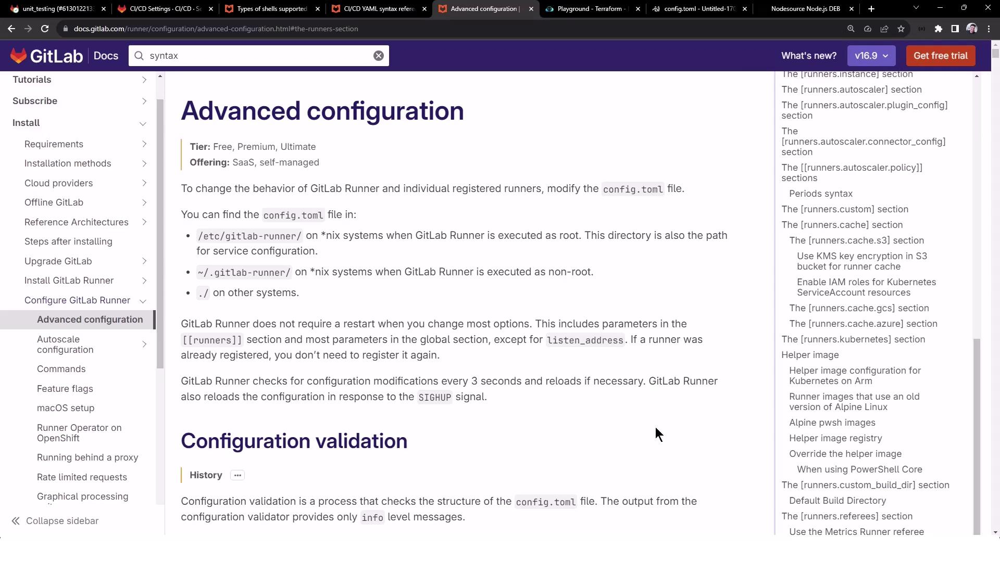
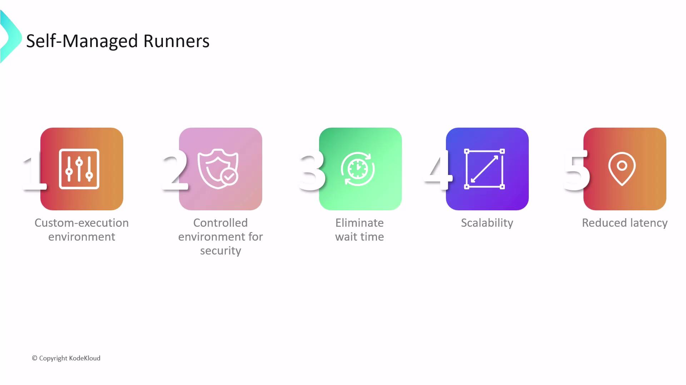
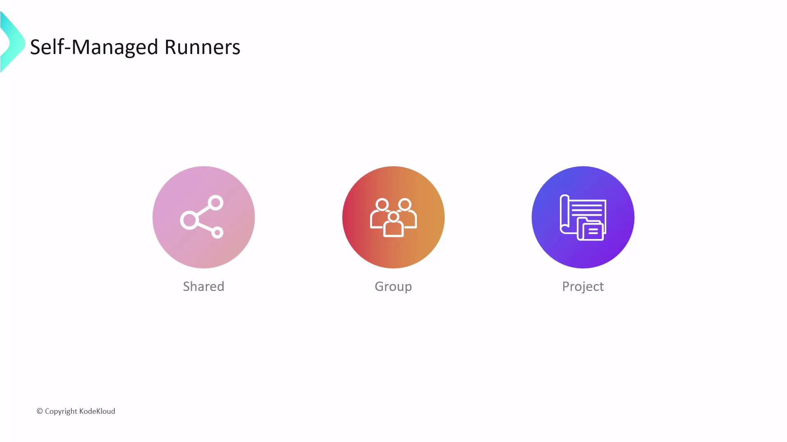
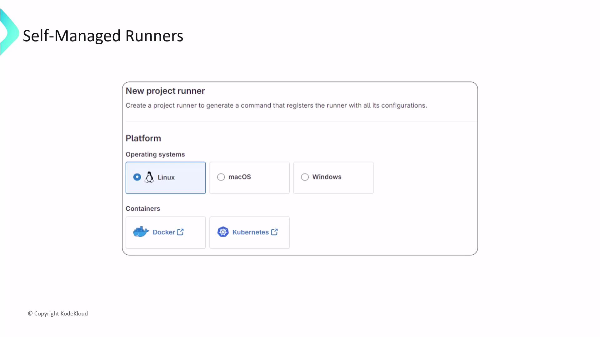
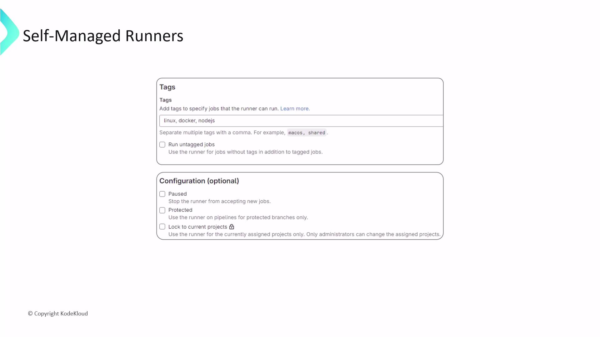

# ~/.bash_logout: executed when a login shell exits
# if [ "$SHLVL" -eq '1' ]; then
#   [ -x /usr/bin/clear_console ] && /usr/bin/clear_console -q
# fi
```

Comment out any `clear_console` lines, commit the update, and rerun the pipeline.

<Callout icon="triangle-alert">
  Modifying shell profiles on production runners can affect all jobs. Always back up files before editing.
</Callout>

***

## 4. Installing Node.js on the Runner

Since the Shell executor uses your VM’s environment, you must install Node.js globally:

```bash theme={null}
sudo apt-get update && sudo apt-get install -y ca-certificates curl gnupg

# Add NodeSource repository (replace 'nodistro' with your distro codename, e.g., 'jammy')
curl -fsSL https://deb.nodesource.com/gpgkey/nodesource-repo.gpg.key \
  | sudo gpg --dearmor -o /etc/apt/keyrings/nodesource.gpg
NODE_MAJOR=20
echo "deb [signed-by=/etc/apt/keyrings/nodesource.gpg] \
  https://deb.nodesource.com/node_${NODE_MAJOR}.x nodistro main" \
  | sudo tee /etc/apt/sources.list.d/nodesource.list

sudo apt-get update && sudo apt-get install -y nodejs
```

Verify:

```bash theme={null}
node -v    # e.g., v20.x.x
npm -v     # e.g., 9.x.x
```

Rerun your pipeline—`npm install` and `npm test` should now succeed.

***

## 5. Caching Dependencies for Faster Builds

Your pipeline’s cache settings will automatically save `node_modules` on success:

```plaintext theme={null}
Saving cache for successful job
Creating cache node-modules-<hash>-protected...
node_modules: found 5735 matching files
Created cache locally
```

Inspect the runner’s cache directory:

```bash theme={null}
cd /home/gitlab-runner/cache/<project-path>/node-modules-<hash>-protected
unzip cache.zip
ls node_modules
```

On future runs, the cache is restored:

```plaintext theme={null}
Restoring cache
Successfully extracted cache
$ npm install
up to date in 1s
```

| Cache Phase | Description                                       |
| ----------- | ------------------------------------------------- |
| pull-push   | Downloads & uploads cache for every job run       |
| key         | Uniquely identifies cache based on `package-lock` |
| paths       | Directories to cache (e.g., `node_modules`)       |

***

## 6. Customizing the Runner’s Cache Directory

By default, caches live under GitLab Runner’s home folder. To change it, update `/etc/gitlab-runner/config.toml`:

```toml theme={null}
[[runners]]
  name       = "nodejs-runner"
  url        = "https://gitlab.com"
  id         = 32418121
  token      = "glrt-..."
  executor   = "shell"
  cache_dir  = "/home/gitlab-runner/builds"  # custom path

[runners.cache]
  MaxUploadedArchiveSize = 0
```

Restart the service:

```bash theme={null}
sudo gitlab-runner restart
```

Subsequent cache archives will appear under your new `cache_dir`:

<Frame>
  
</Frame>

For a deep dive into advanced runner settings, consult the official docs:

<Frame>
  
</Frame>

***

## Links and References

* [GitLab Runner Shell Executor](https://docs.gitlab.com/runner/executors/shell.html)
* [Shell Profile Loading](https://docs.gitlab.com/runner/shells/index.html#shell-profile-loading)
* [Advanced Runner Configuration](https://docs.gitlab.com/runner/configuration/advanced-configuration.html)

<CardGroup>
  <Card title="Watch Video" icon="video" href="https://learn.kodekloud.com/user/courses/gitlab-ci-cd-architecting-deploying-and-optimizing-pipelines/module/270646a2-73ad-4be3-90c9-9b4448aa8517/lesson/4dc6db13-c89e-4120-83ce-9bd2a5004f14" />
</CardGroup>


# Self Managed Runners

Source: https://notes.kodekloud.com/docs/GitLab-CICD-Architecting-Deploying-and-Optimizing-Pipelines/Self-Managed-Runners/Self-Managed-Runners/page

This article explains self-managed runners in GitLab CI/CD, detailing their benefits, setup, installation, registration, and configuration.

Runners are virtual machines that execute jobs in a GitLab CI/CD pipeline. They clone your repository, install dependencies, and run your build, test, and deploy commands. While GitLab.com offers [hosted SAST runners](https://docs.gitlab.com/ee/user/application_security/sast/) out of the box, self-managed runners let you deploy and control your own infrastructure.

<Callout icon="lightbulb">
  GitLab’s shared hosted runners spin up fresh VMs on Linux, Windows, macOS, or GPU-enabled instances with zero configuration.
</Callout>

Self-managed runners provide:

* Fully customizable execution environments (OS, tools, libraries).
* Dedicated capacity with no queue delays.
* Horizontal scaling for parallel workflows.
* Geographic placement for low latency and data residency.
* Enforced security and compliance controls.

<Frame>
  
</Frame>

While GitLab-hosted runners are easy to start, self-managed runners give you full control over performance, security, and cost.

## Runner Scopes

You can register self-managed runners at three levels:

| Scope          | Availability                     | Use Case                        | Registration Location              |
| -------------- | -------------------------------- | ------------------------------- | ---------------------------------- |
| Shared runner  | All groups and projects          | General-purpose CI/CD workloads | Admin Area > CI/CD > Runners       |
| Group runner   | All projects in a specific group | Team-based resource sharing     | Group Settings > CI/CD > Runners   |
| Project runner | A single project                 | Project-specific pipelines      | Project Settings > CI/CD > Runners |

<Frame>
  
</Frame>

## Project-Level Runner Setup

To register a runner for one project:

1. Navigate to **Settings > CI/CD** in your project.
2. Under **Runners**, optionally disable any existing shared runners.
3. Click **Expand** next to **Set up a specific Runner manually**, then select **New project runner**.

<Frame>
  
</Frame>

During setup you can:

* Choose OS and architecture (Linux, Windows, macOS).
* Add **tags** to route jobs (`docker`, `linux`, `nodejs`).
* Enable **Run untagged jobs** for broader job assignment.
* Configure protection, pausing, and other advanced options.

<Frame>
  
</Frame>

Click **Create runner** to generate your registration token and get platform-specific installation steps.

## Installing GitLab Runner

Install the GitLab Runner binary on your host before registering:

```bash theme={null}
