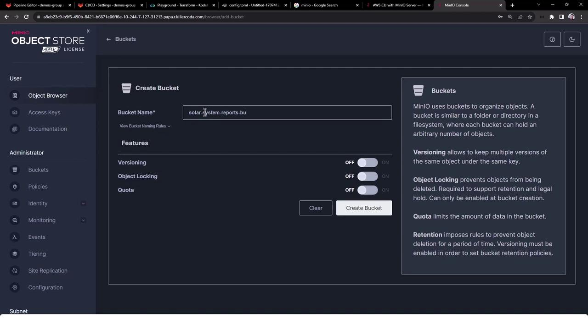
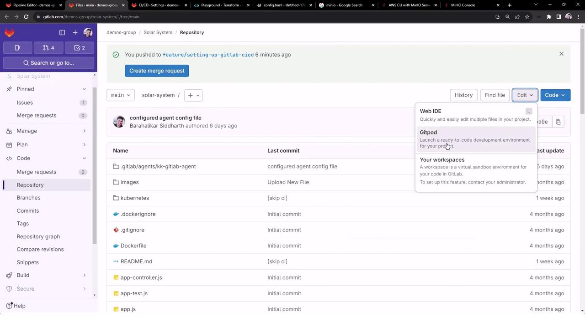
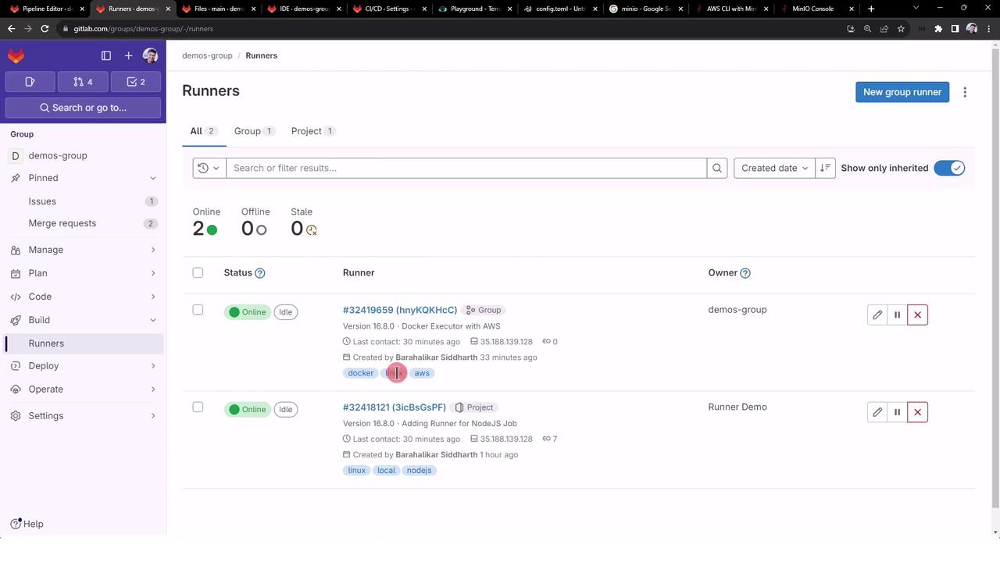
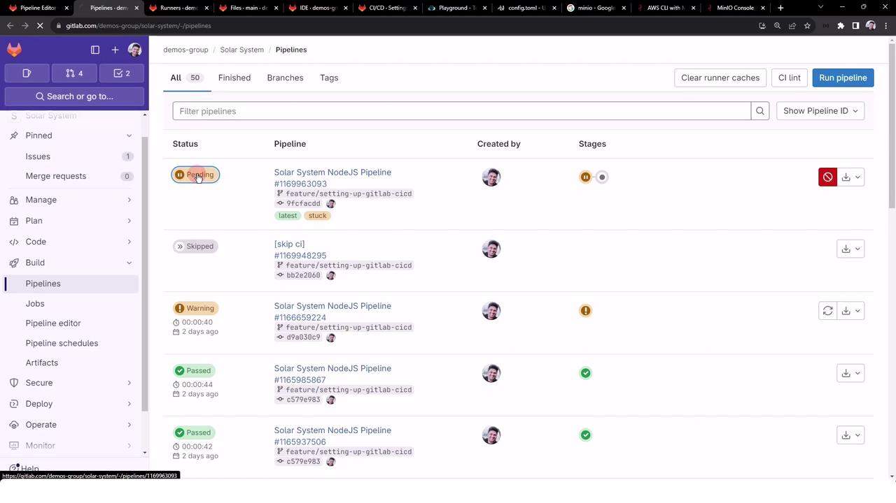
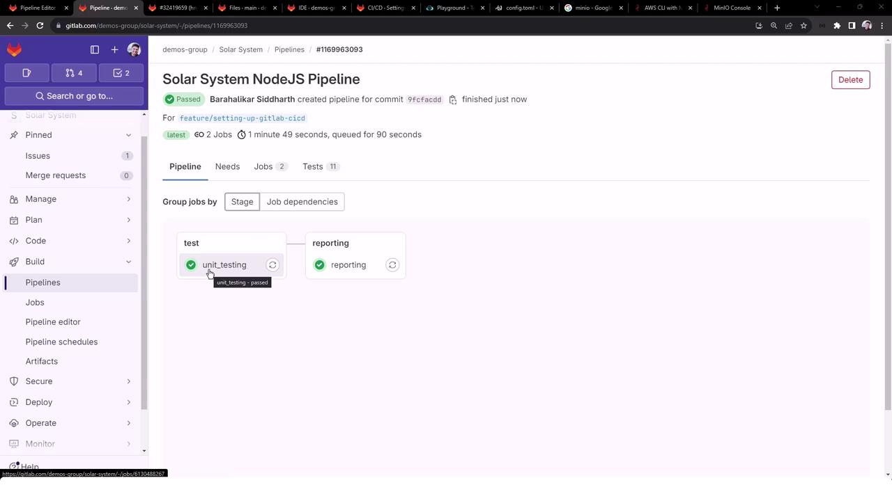
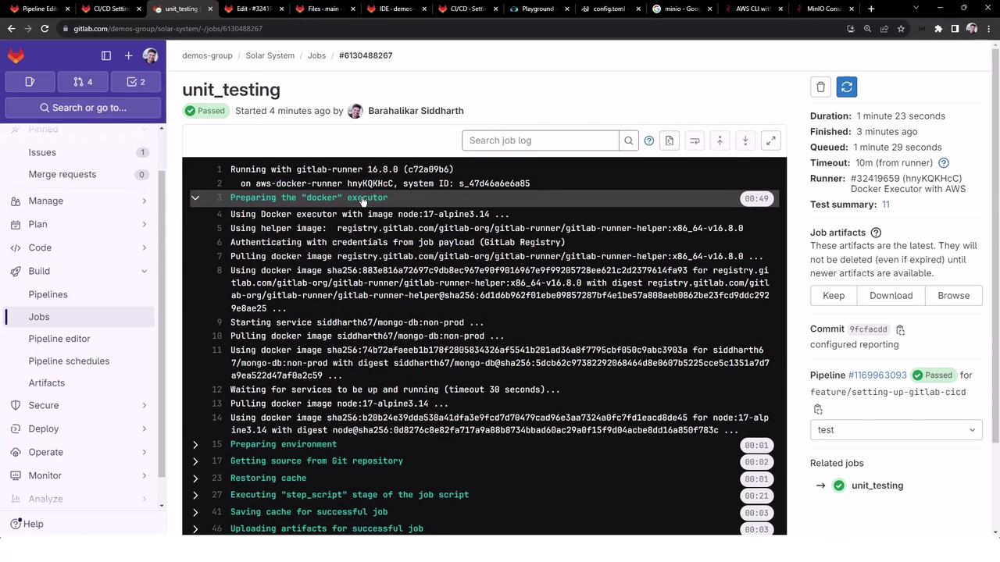
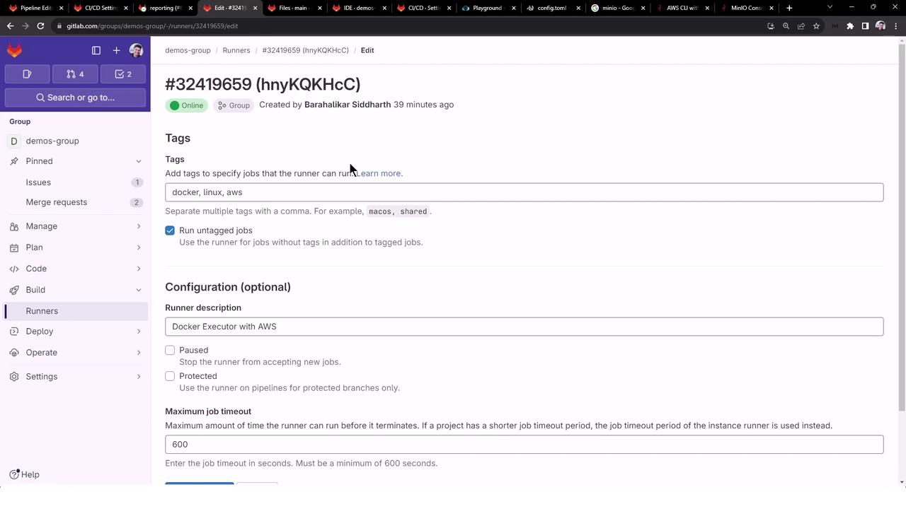

# 1. Download the Linux AMD64 binary
sudo curl -L "https://gitlab-runner-downloads.s3.amazonaws.com/latest/binaries/gitlab-runner-linux-amd64" \
  -o /usr/local/bin/gitlab-runner

# 2. Make it executable
sudo chmod +x /usr/local/bin/gitlab-runner

# 3. Create a dedicated service user
sudo useradd --comment 'GitLab Runner' --create-home gitlab-runner --shell /bin/bash

# 4. Install and start as a system service
sudo gitlab-runner install --user=gitlab-runner --working-directory=/home/gitlab-runner
sudo gitlab-runner start
```

<Callout icon="triangle-alert">
  Ensure `/usr/local/bin/gitlab-runner` has correct ownership and permissions to prevent privilege escalation.
</Callout>

## Registering the Runner

Run the interactive registration command:

```bash theme={null}
sudo gitlab-runner register \
  --url "https://gitlab.com/" \
  --registration-token "GLRT-xxxxxxxxxxxxxxxxxxxx"
```

You’ll be prompted for:

* **Runner name** (e.g., `ci-nodejs-linux`).
* **Executor** (`shell`, `docker`, `kubernetes`).
* Additional settings: default Docker image, tags, locked/unlocked status.

Successful registration writes all details to `/etc/gitlab-runner/config.toml`.

<Callout icon="triangle-alert">
  Keep your registration token secret. Do not commit it to source control or share publicly.
</Callout>

## Customizing `config.toml`

Open `/etc/gitlab-runner/config.toml` to tailor your runner:

* `name` and `tags` for job routing.
* `executor` block to configure Docker images, volumes, and networks.
* Resource limits: `cpu`, `memory`, and disk quotas.
* Environment variables (`[[runners.environment]]`).
* Cache and artifact paths for faster CI/CD runs.

## Using Tags in `.gitlab-ci.yml`

Target specific runners by matching tags:

```yaml theme={null}
workflow:
  name: Self-Managed Runner Tags

unit_tests:
  stage: test
  tags:
    - docker
    - nodejs
    - linux
  script:
    - npm install
    - npm test
```

Return to **Settings > CI/CD** in your project to monitor runner status, job history, and registered tags.

## Links and References

* [GitLab SAST Runners](https://docs.gitlab.com/ee/user/application_security/sast/)
* [GitLab Runner Documentation](https://docs.gitlab.com/runner/)
* [GitLab CI/CD Basics](https://docs.gitlab.com/ee/ci/)

<CardGroup>
  <Card title="Watch Video" icon="video" href="https://learn.kodekloud.com/user/courses/gitlab-ci-cd-architecting-deploying-and-optimizing-pipelines/module/270646a2-73ad-4be3-90c9-9b4448aa8517/lesson/ec6768e7-3890-436d-a1df-eaa790446074" />
</CardGroup>


# Use Local Template to Upload Reports to AWSMinio S3 Bucket

Source: https://notes.kodekloud.com/docs/GitLab-CICD-Architecting-Deploying-and-Optimizing-Pipelines/Self-Managed-Runners/Use-Local-Template-to-Upload-Reports-to-AWSMinio-S3-Bucket/page

This guide explains how to configure a GitLab CI/CD job to upload test reports to an S3-compatible object store.

In this guide, you’ll learn how to configure a [GitLab CI/CD job](https://docs.gitlab.com/ee/ci/) that uploads your test reports (`test-results.xml`) to an S3-compatible object store (AWS S3 or [MinIO](https://min.io)). We’ll define a reusable local template and then include it in our pipeline.

## 1. Review Existing Test Jobs

In the **Solar System** repository, two jobs already generate test artifacts:

```yaml theme={null}
unit_testing:
  stage: test
  extends: .prepare_nodejs_environment
  script:
    - npm test
  artifacts:
    when: always
    expire_in: 3 days
    name: Moca-Test-Result
    paths:
      - test-results.xml
  reports:
    junit: test-results.xml

code_coverage:
  stage: test
  extends: .prepare_nodejs_environment
  script:
    - npm run coverage
  artifacts:
    when: always
    expire_in: 3 days
    name: Code-Coverage-Result
    paths:
      - coverage/
```

We want to pick up `test-results.xml` from the `unit_testing` job and push it into our S3-compatible bucket.

## 2. Set Up MinIO

[MinIO](https://min.io) is an open-source, high-performance object storage compatible with AWS S3 APIs. After installing and starting MinIO:

* Sign in at the browser UI\
  Username: `minioadmin`\
  Password: `minioadmin`

* Create a bucket named `solar-system-reports-bucket`:

<Frame>
  
</Frame>

Once the bucket exists, it’s initially empty:

<Frame>
  
</Frame>

<Callout icon="lightbulb">
  Keep your MinIO credentials (`minioadmin:minioadmin`) and endpoint (`https://<MINIO_SERVER_API>:<PORT>`) secure. Consider using [GitLab CI/CD variables](/docs/variables/).
</Callout>

## 3. Create a Local Template

We’ll define a reusable job in `templates/aws-reports.yml`. Open your Web IDE, create the `templates/` folder, and add:

```yaml theme={null}
variables:
  MINIO_URL: https://<MINIO_SERVER_API>:<PORT>
  BUCKET_NAME: solar-system-reports-bucket
  AWS_ACCESS_KEY_ID: minioadmin
  AWS_SECRET_ACCESS_KEY: minioadmin

.reporting_job:
  stage: reporting
  needs:
    - unit_testing
  image:
    name: amazon/aws-cli:latest
    entrypoint:
      - /usr/bin/env
  before_script:
    - ls -ltr
    - mkdir reports-$CI_PIPELINE_ID
    - mv test-results.xml reports-$CI_PIPELINE_ID/
    - ls -ltr reports-$CI_PIPELINE_ID/
  script:
    - aws configure set default.s3.signature_version s3v4
    - aws --endpoint-url=$MINIO_URL s3 ls s3://$BUCKET_NAME
    - aws --endpoint-url=$MINIO_URL s3 cp ./reports-$CI_PIPELINE_ID s3://$BUCKET_NAME/reports-$CI_PIPELINE_ID --recursive
    - aws --endpoint-url=$MINIO_URL s3 ls s3://$BUCKET_NAME
```

<Frame>
  
</Frame>

<Callout icon="lightbulb">
  Replace `MINIO_URL` with your actual MinIO endpoint (including port).\
  Use [protected CI/CD variables](/docs/variables/#protected-environment-variables) for credentials.
</Callout>

## 4. Integrate the Template in `.gitlab-ci.yml`

Include and invoke the template in your main CI file:

```yaml theme={null}
workflow:
  rules:
    - if: '$CI_COMMIT_BRANCH == "main" || $CI_COMMIT_BRANCH =~ /feature/'
      when: always

stages:
  - test
  - reporting
  - containerization
  - dev-deploy
  - stage-deploy

include:
  - local: 'templates/aws-reports.yml'

variables:
  DOCKER_USERNAME: siddharth67
  IMAGE_VERSION: $CI_PIPELINE_ID
  K8S_IMAGE: $DOCKER_USERNAME/solar-system:$IMAGE_VERSION
  MONGO_URI: 'mongodb://$MONGO_USERNAME@supercluster.d83jj.mongodb.net/superData'
  MONGO_USERNAME: superuser
  MONGO_PASSWORD: $M_DB_PASSWORD
  SCAN_KUBERNETES_MANIFESTS: "true"

.prepare_nodejs_environment:
  image: node:17-alpine3.14
  services:
    - name: siddharth67/mongo-db:non-prod
  rules:
    - when: always

unit_testing:
  stage: test
  extends: .prepare_nodejs_environment
  tags:
    - docker
    - linux
    - aws
  script:
    - npm test
  artifacts:
    when: always
    expire_in: 3 days
    name: Moca-Test-Result
    paths:
      - test-results.xml
  reports:
    junit: test-results.xml

reporting:
  <<: *reporting_job
  tags:
    - docker
    - linux
    - aws
```

### Pipeline Stages

| Stage            | Purpose                                   |
| ---------------- | ----------------------------------------- |
| test             | Run unit tests and generate JUnit reports |
| reporting        | Upload reports to S3/MinIO bucket         |
| containerization | Build and push Docker images              |
| dev-deploy       | Deploy to development environment         |
| stage-deploy     | Deploy to staging environment             |

<Callout icon="triangle-alert">
  If you’re using self-managed runners, ensure the tags (`docker`, `linux`, `aws`) match your runner configuration, or enable untagged jobs.
</Callout>

## 5. Verify Your Runners

Confirm that your group-level or project runner is online and tagged correctly:

<Frame>
  
</Frame>

## 6. Execute the Pipeline

Trigger a pipeline on `main` or any `feature/*` branch. If tags or permissions are misconfigured, jobs may stay pending.

<Frame>
  
</Frame>

Once everything is set up correctly, both `unit_testing` and `reporting` will pass:

<Frame>
  
</Frame>

### Sample Job Logs

```bash theme={null}
$ ls -ltr
$ mkdir reports-$CI_PIPELINE_ID
$ mv test-results.xml reports-$CI_PIPELINE_ID/
$ aws configure set default.s3.signature_version s3v4
$ aws --endpoint-url=$MINIO_URL s3 ls s3://$BUCKET_NAME
$ aws --endpoint-url=$MINIO_URL s3 cp ./reports-$CI_PIPELINE_ID s3://$BUCKET_NAME/reports-$CI_PIPELINE_ID --recursive
upload: reports-1169963093/test-results.xml to s3://solar-system-reports-bucket/reports-1169963093/test-results.xml
$ aws --endpoint-url=$MINIO_URL s3 ls s3://$BUCKET_NAME
PRE reports-1169963093/
```

<Frame>
  
</Frame>

## 7. Verify in the MinIO Console

Open the MinIO browser again—you should now see the `reports-<pipeline_id>/test-results.xml` folder and file:

<Frame>
  
</Frame>

## 8. Runner Configuration Interface

Need to update tags, timeouts, or other settings? Visit your runner’s edit page:

<Frame>
  
</Frame>

***

You now have a reusable local template that automates uploading GitLab CI test reports to any S3-compatible storage.

## Links and References

* [GitLab CI/CD Documentation](https://docs.gitlab.com/ee/ci/)
* [AWS S3](https://aws.amazon.com/s3)
* [MinIO](https://min.io)
* [AWS CLI User Guide](https://docs.aws.amazon.com/cli/latest/userguide/)
* [JUnit Report Format](https://junit.org/)

<CardGroup>
  <Card title="Watch Video" icon="video" href="https://learn.kodekloud.com/user/courses/gitlab-ci-cd-architecting-deploying-and-optimizing-pipelines/module/270646a2-73ad-4be3-90c9-9b4448aa8517/lesson/80d521f0-9018-4379-ad8b-0d5341f2345b" />

  <Card title="Practice Lab" icon="installation" href="https://learn.kodekloud.com/user/courses/gitlab-ci-cd-architecting-deploying-and-optimizing-pipelines/module/270646a2-73ad-4be3-90c9-9b4448aa8517/lesson/0db710c2-a283-4175-8e38-f7eb53f5accf" />
</CardGroup>
