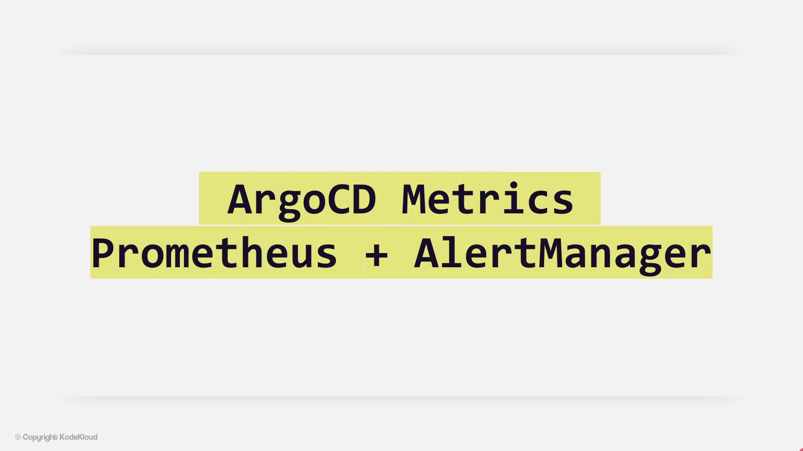

# ArgoCD Metrics Monitoring 2

Source: https://notes.kodekloud.com/docs/GitOps-with-ArgoCD/ArgoCD-AdvancedAdmin/ArgoCD-Metrics-Monitoring-2/page

This guide explains how to use Prometheus and Alertmanager to monitor ArgoCD metrics and automate alerting for synchronization issues.

In this guide, we explore how Prometheus can leverage ArgoCD metrics to raise alerts using Alertmanager—automating the detection of synchronization issues in ArgoCD applications.

<Frame>
  
</Frame>

Alertmanager handles alerts generated by client applications, such as the Prometheus server. In this article, we explain how to configure alerting rules based on ArgoCD metrics within a Prometheus instance. Previously, we examined how Prometheus scrapes these metrics; now, we will use them to define alert rules for detecting synchronization problems in ArgoCD applications.

As part of the Prometheus Operator, configuration details are maintained for both Alertmanager and Prometheus rules. The Prometheus Rules custom resource enables you to define both recording and alerting rules for your Prometheus instance.

Below is an example of a PrometheusRule configuration containing a single alerting rule:

```yaml theme={null}
apiVersion: monitoring.coreos.com/v1
kind: PrometheusRule
metadata:
  creationTimestamp: null
  labels:
    prometheus: example
    role: alert-rules
  name: prometheus-argocd-rules
spec:
- name: ArgoCD Rules
  rules:
  - alert: ArgoApplicationOutOfSync
    expr: argocd_app_info{sync_status="OutOfSync"} == 1
    for: 5m
    labels:
      severity: warning
    annotations:
      summary: "{{ $labels.name }} Application has synchronization issue"
```

To verify the applied configuration, run the following commands. These commands connect to the Prometheus pod and display the contents of the rules configuration file:

```bash theme={null}
$ kubectl exec -it prometheus-0 -c config-reloader -- /bin/sh
$ cat /etc/prometheus/rules/prometheus-rulefiles-0/argocd-app-sync
```

<Callout icon="lightbulb">
  Each alert rule configuration includes:

  * **Alert name:** The identifier for the alert (e.g., "ArgoApplicationOutOfSync").
  * **Expression:** The condition that triggers the alert. In this example, the alert fires when an ArgoCD application's synchronization status is out of sync (`argocd_app_info{sync_status="OutOfSync"} == 1`).
  * **Duration:** The period (5 minutes in this instance) the condition must persist before the alert triggers.
  * **Labels:** Metadata tags for routing and categorizing alerts, such as a `severity` level set to "warning".
  * **Annotations:** Additional information, including a summary message to describe the alert.
</Callout>

When the Prometheus rule is created, the Prometheus Operator automatically generates the corresponding configuration for Prometheus using the Prometheus Rule custom resource definition (CRD). It then uses the Config Reloader component to update the rules file accordingly.

Below is an updated version of the PrometheusRule configuration (functionally identical to the previous example but formatted properly):

```yaml theme={null}
apiVersion: monitoring.coreos.com/v1
kind: PrometheusRule
metadata:
  creationTimestamp: null
  labels:
    prometheus: example
    role: alert-rules
  name: prometheus-argocd-rules
spec:
- name: ArgoCD Rules
  rules:
  - alert: ArgoApplicationOutOfSync
    expr: argocd_app_info{sync_status="OutOfSync"} == 1
    for: 5m
    labels:
      severity: warning
    annotations:
      summary: "'{{ $labels.name }}' Application has synchronization issue"
```

You can inspect the active configuration with these commands:

```bash theme={null}
$ kubectl exec -it prometheus-0 -c config-reloader -- /bin/sh
$ cat /etc/prometheus/rules/prometheus-rulefiles-0/argocd-app-sync
```

<Callout icon="lightbulb">
  After updating the rules file, check the Rules tab in the Prometheus UI. If an ArgoCD application's synchronization status deviates from the expected state, the alert will trigger and be visible in the Alertmanager UI.
</Callout>

<CardGroup>
  <Card title="Watch Video" icon="video" href="https://learn.kodekloud.com/user/courses/gitops-with-argocd/module/ef6b6fef-0bd5-4fab-b437-b6d613fa74b4/lesson/6fb5235d-ae5a-4750-a786-61b86ee3b2fd" />
</CardGroup>
