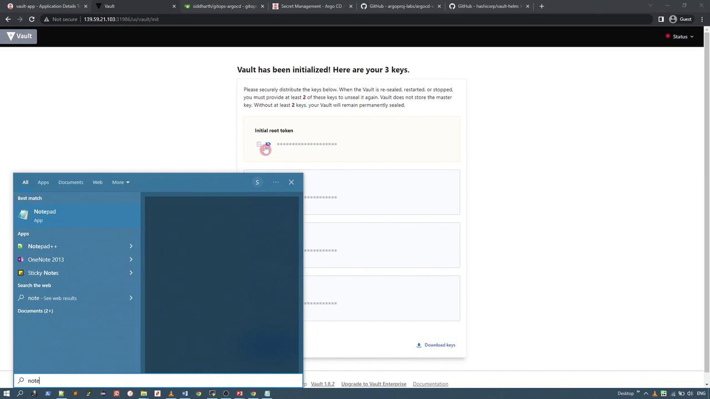
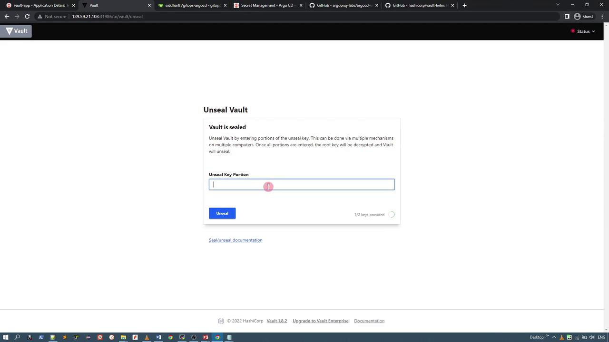
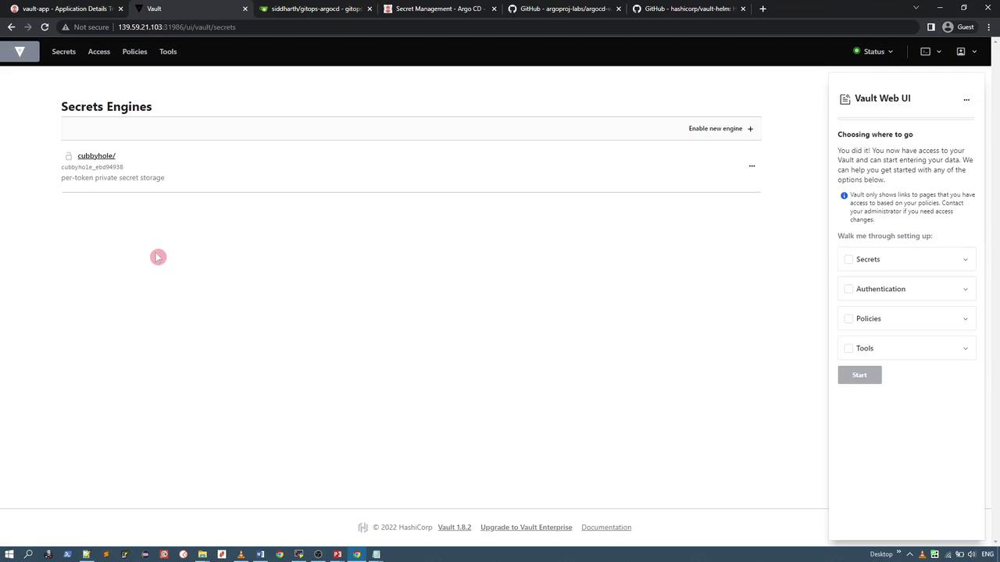
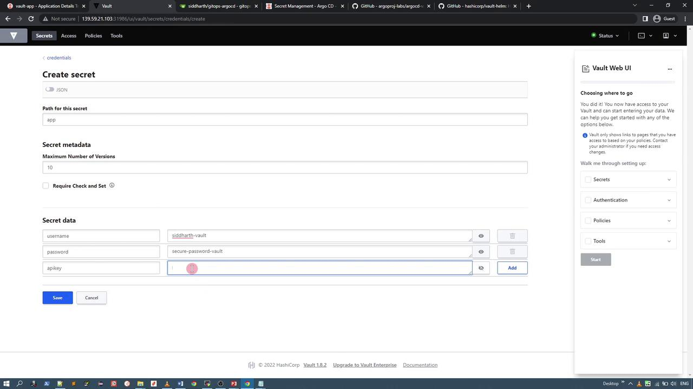
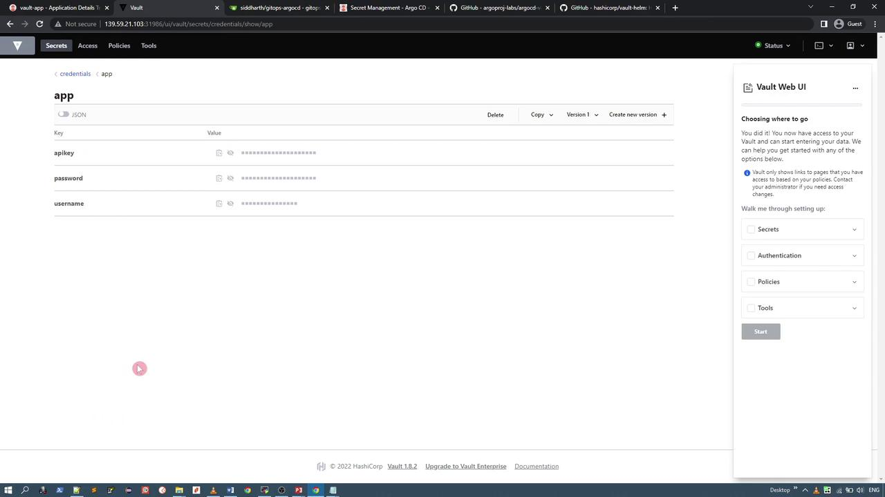
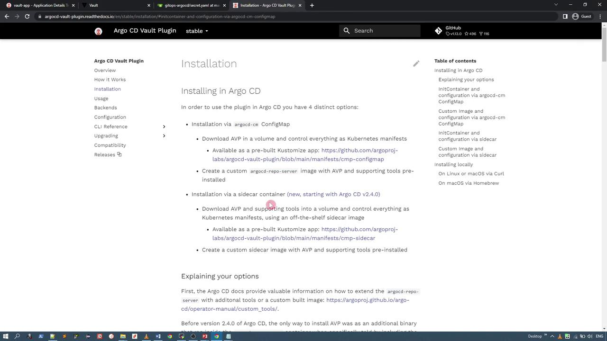

# List all resources in the vault-demo namespace
kubectl -n vault-demo get all

# Example output:
# NAME                                               READY   STATUS      RESTARTS   AGE
# pod/vault-app-0                                    0/1     Running     0          54s
# pod/vault-app-agent-injector-6947cc4648-wd9dt       1/1     Running     0          54s
#
# NAME                                               TYPE       CLUSTER-IP      EXTERNAL-IP   PORT(S)              AGE
# service/vault-app                                  ClusterIP  10.110.125.148  <none>        8200/TCP,8201/TCP      54s
# service/vault-app-agent-injector-svc              ClusterIP  10.104.23.127   <none>        443/TCP              54s
# service/vault-app-internal                        ClusterIP  None            <none>        8200/TCP,8201/TCP      54s
#
# NAME                                               READY   UP-TO-DATE   AVAILABLE   AGE
# deployment.apps/vault-app-agent-injector           1/1     1            1           54s
#
# NAME                                               DESIRED   CURRENT   READY   AGE
# replicaset.apps/vault-app-agent-injector-6947cc4648  1         1         1       54s
#
# NAME                                               READY   AGE
# statefulset.apps/vault-app                         0/1     54s
```

<Callout icon="lightbulb">
  If the Vault service does not reflect the NodePort settings, update the service manifest manually as described above. Once updated, you can access the Vault UI using the assigned NodePort (e.g., port 31986).
</Callout>

Next, initialize Vault via the UI. When initializing, choose three key shares with a threshold of at least two keys required to unseal. Save the initial root token and unseal keys securely.

<Frame>
  
</Frame>

Unseal Vault by entering two of the keys in the UI:

<Frame>
  
</Frame>

Finally, log in using the default token authentication—the root token saved earlier. By default, only the "cubbyhole" secret engine is enabled.

<Frame>
  
</Frame>

***

## Enabling a Key-Value Secret Engine and Creating Secrets

To store application credentials, enable the KV (key-value) secret engine and create a secret:

1. In the Vault UI, enable a new secret engine.
2. Choose the key-value secret engine (version 2).
3. Set the engine path to `credentials` using default configurations.

<Frame>
  
</Frame>

Within the `credentials` secret engine, add a new secret under a specific path (for example, `app`) with the following fields:

* username (e.g., your name suffixed with `-vault` for demo purposes)
* password (e.g., `secure-password-vault`)
* API key (a random string)

<Frame>
  
</Frame>

After saving, verify that the secret is stored under the `credentials/app` path:

<Frame>
  
</Frame>

***

## Using the ArgoCD Vault Plugin

Once Vault is running, initialized, unsealed, and holds your secret data, you can use the ArgoCD Vault Plugin to access these credentials.

### Defining a Kubernetes Secret Manifest

To automatically retrieve secrets, define a Kubernetes Secret manifest with an annotation that instructs the plugin where to fetch the Vault data. For example, if your secret is stored at `credentials/app`, your manifest should be configured like this:

```yaml theme={null}
kind: Secret
apiVersion: v1
metadata:
  name: app-crds
  annotations:
    avp.kubernetes.io/path: "credentials/data/app"
type: Opaque
stringData:
  apikey: <apikey>
  username: <username>
  password: <password>
```

The plugin replaces each placeholder (the values between `<` and `>`) with the actual secret data from Vault and outputs a valid manifest, encoding values in Base64 if necessary.

***

### Local Installation of the ArgoCD Vault Plugin

For local testing outside of ArgoCD, follow these steps to install the ArgoCD Vault Plugin:

1. Install via Homebrew:

   ```bash theme={null}
   brew install argocd-vault-plugin
   ```

2. Alternatively, download the Linux binary from GitHub:

   ```bash theme={null}
   wget https://github.com/argoproj-labs/argocd-vault-plugin/releases/download/v1.12.0/argocd-vault-plugin_1.12.0_linux_amd64
   chmod +x argocd-vault-plugin_1.12.0_linux_amd64
   mv argocd-vault-plugin_1.12.0_linux_amd64 /usr/local/bin/argocd-vault-plugin
   ```

3. Verify the installation:

   ```bash theme={null}
   argocd-vault-plugin version
   # Expected output:
   # argocd-vault-plugin v1.12.0 (9c7288a5b2d395fea19c1100f2cd07b547cc1ee2) BuildDate: 2022-07-08T13:27:45Z
   ```

The plugin supports commands such as `generate`, `completion`, and `help`. The `generate` command is used to replace placeholder values in your secret manifest with actual data from Vault.

### Creating the Secret Manifest

Store your Kubernetes Secret manifest into a file, for example, `secret.yaml`:

```yaml theme={null}
kind: Secret
apiVersion: v1
metadata:
  name: app-crds
  annotations:
    avp.kubernetes.io/path: "credentials/data/app"
type: Opaque
stringData:
  apikey: <apikey>
  username: <username>
  password: <password>
```

<Callout icon="lightbulb">
  Using `stringData` here allows plain text entries, which are then encoded as needed, avoiding manual Base64 encoding.
</Callout>

### Configuring Vault Connection

Create an environment file (e.g., `vault.env`) that contains the necessary Vault configuration parameters:

```plaintext theme={null}
VAULT_ADDR=http://localhost:31986
VAULT_TOKEN=s.0nqTxN3rmQcoKku7DX87bWz
AVP_TYPE=vault
AVP_AUTH_TYPE=token
```

Make sure to adjust the `VAULT_ADDR` and `VAULT_TOKEN` to match your Vault instance. The `AVP_TYPE` should be set to `vault` and `AVP_AUTH_TYPE` to `token` for this demo setup.

### Generating the Manifest

Run the following command to generate the final Kubernetes manifest with secrets fetched from Vault:

```bash theme={null}
argocd-vault-plugin generate -c vault.env - < secret.yaml
```

The output will be a complete manifest with all placeholder values replaced by the actual secrets, similar to:

```yaml theme={null}
apiVersion: v1
kind: Secret
metadata:
  annotations:
    avp.kubernetes.io/path: credentials/data/app
  name: app-crds
stringData:
  apiKey: 5FGJVasdnjl-yidis67-asdkasd
  password: secure-password-vault
  username: siddharth-vault
type: Opaque
```

This manifest is now ready for deployment into your Kubernetes cluster.

***

## Conclusion

In this guide, we covered the deployment of HashiCorp Vault using Helm, enabling a key-value secret engine, and storing application credentials. We then demonstrated how to use the ArgoCD Vault Plugin locally to generate a Kubernetes Secret manifest populated with secrets from Vault. In the next demo, you will learn how to configure ArgoCD to automatically generate these manifests when an application is created.

Thank you for following along.

<CardGroup>
  <Card title="Watch Video" icon="video" href="https://learn.kodekloud.com/user/courses/gitops-with-argocd/module/ef6b6fef-0bd5-4fab-b437-b6d613fa74b4/lesson/83cc4444-47aa-46e8-a9b2-97a3ccd39116" />
</CardGroup>


# ArgoCD Vault Plugin with ArgoCD

Source: https://notes.kodekloud.com/docs/GitOps-with-ArgoCD/ArgoCD-AdvancedAdmin/ArgoCD-Vault-Plugin-with-ArgoCD/page

Learn to install and configure the HashiCorp Vault plugin in ArgoCD for retrieving secrets during application manifest reconciliation.

In this lesson, you'll learn how to install and configure the HashiCorp Vault plugin in ArgoCD. This Vault plugin enables ArgoCD to retrieve secrets directly from HashiCorp Vault during application manifest reconciliation. We will follow the official documentation's approach using an initContainer and configuring the ArgoCD ConfigMap.

<Frame>
  
</Frame>

Below are the detailed steps and configuration examples.

***

## 1. Repository Server Deployment Configuration

The first step is to modify the ArgoCD repo server deployment. This configuration uses an initContainer that downloads the Vault plugin and makes it available to the main container through a shared volume.

### Initial Deployment Example

```yaml theme={null}
apiVersion: apps/v1
kind: Deployment
metadata:
  name: argocd-repo-server
spec:
  template:
    spec:
      containers:
        - name: argocd-repo-server
          volumeMounts:
            - name: custom-tools
              mountPath: /usr/local/bin/argocd-vault-plugin
              subPath: argocd-vault-plugin
      volumes:
        - name: custom-tools
          emptyDir: {}
      initContainers:
        - name: download-tools
          image: alpine:3.8
          command: [sh, -c]
      env:
        - name: AVP_VERSION
          value: "1.7.0"
        args:
          - >-
            wget -O argocd-vault-plugin
            https://github.com/argoproj-labs/argocd-vault-plugin/releases/download/v${AVP_VERSION}/argocd-vault-plugin
            && chmod +x argocd-vault-plugin && mv argocd-vault-plugin /custom-tools
```

In this deployment configuration, the ArgoCD repo server container mounts a volume named `custom-tools`. The initContainer called `download-tools` downloads the Vault plugin using `wget`, sets executable permission with `chmod +x`, and moves it to the shared volume.

### Detailed InitContainer Example

For clarity, here is an alternative snippet that highlights the initContainer setup:

```yaml theme={null}
initContainers:
  - name: download-tools
    image: alpine:3.8
    command: [sh, -c]
    env:
      - name: AVP_VERSION
        value: "1.7.0"
    args:
      - wget -O argocd-vault-plugin https://github.com/argoproj-labs/argocd-vault-plugin/releases/download/v${AVP_VERSION}/argocd-vault-plugin
      - chmod +x argocd-vault-plugin
      - mv argocd-vault-plugin /custom-tools/
```

This setup downloads the plugin, ensures proper permissions, and places it in `/custom-tools/`, which the repo server container will later mount.

***

## 2. Plugin Installation Using a Dockerfile

If you prefer embedding the plugin into a custom image, use a Dockerfile similar to the example below. This approach avoids using an initContainer by baking the Vault plugin directly into your image.

```dockerfile theme={null}
RUN apt-get update && \
    apt-get install -y \
    curl \
    awscli && \
    apt-get clean && \
    rm -rf /var/lib/apt/lists/* /tmp/* /var/tmp/*
