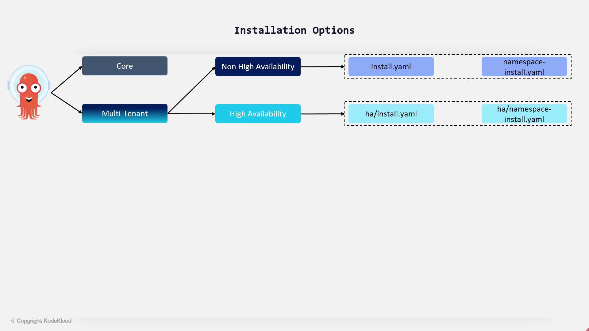

# Installation Options

Source: https://notes.kodekloud.com/docs/GitOps-with-ArgoCD/ArgoCD-Basics/Installation-Options/page

This article explores ArgoCD installation models, including core and multi-tenant options, along with installation commands and configurations for different environments.

Explore the various ArgoCD installation models to determine which best suits your deployment needs. ArgoCD can be installed in two primary modes: a core installation for single-tenant use and a multi-tenant installation for environments requiring isolated access for multiple teams.

## Core Installation

The core installation is designed for users running ArgoCD as a standalone service. This mode provides a minimal, non-high availability (non-HA) deployment, making it perfect for simpler setups that do not require multi-tenancy.

## Multi-Tenant Installation

Multi-tenant deployments are ideal for organizations with multiple application development teams, typically managed by a centralized platform team. Within the multi-tenant model, you have two installation variants:

### 1. Non-High Availability (non-HA)

This variant is excellent for evaluation, testing, and proof-of-concept deployments, even though it is not recommended for production use.

* **install.yaml:**\
  Deploys ArgoCD with cluster-admin access, making it suitable for clusters where ArgoCD also deploys applications. Additionally, the provided credentials allow for deploying to remote clusters.

* **namespace-installed.yaml:**\
  Configures ArgoCD for namespace-level access, offering restricted permissions. This option is useful when you want to limit ArgoCD’s access while still deploying applications in the same cluster if needed.

### 2. High Availability (HA)

For production environments, the high availability option is the recommended choice. It improves resilience by deploying multiple replicas for critical components. Two manifests are provided:

* **ha-install.yaml**
* **ha-namespace-installed.yaml**

<Frame>
  
</Frame>

<Callout icon="lightbulb">
  In this lesson, we will deploy ArgoCD within the `argocd` namespace using the non-HA installation manifest (install.yaml).
</Callout>

## Installing ArgoCD with Helm

In addition to the standard installation, ArgoCD can be installed using Helm through a community-maintained chart. By default, the Helm chart deploys the non-HA version of ArgoCD.

After installation, download the ArgoCD CLI from its GitHub repository and move it to your local binary directory. The CLI allows you to efficiently interact with the ArgoCD API server.

## Installation Commands

Use the following commands to install ArgoCD:

```bash theme={null}
