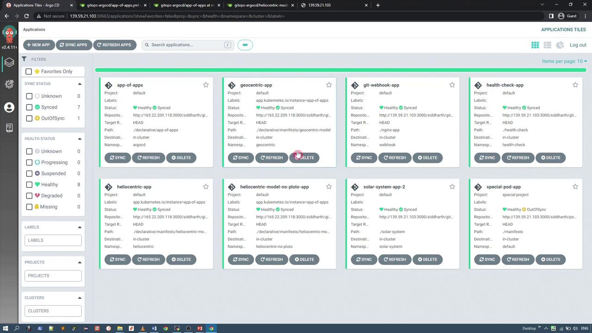

# Declarative Setup App of Apps

Source: https://notes.kodekloud.com/docs/GitOps-with-ArgoCD/ArgoCD-Intermediate/Declarative-Setup-App-of-Apps/page

Learn to deploy multiple applications using ArgoCDs app-of-apps pattern for streamlined management and deployment of services.

In this lesson, you'll learn how to extend ArgoCD’s declarative application approach by deploying multiple applications using the "app-of-apps" pattern. In this model, a single ArgoCD application manages other ArgoCD applications, streamlining the deployment and management of multiple services.

The repository structure for this setup organizes multiple ArgoCD configurations into separate directories, each containing the manifest files for individual applications.

## Multi-App ArgoCD Application

The primary multi-app ArgoCD application points to the Git repository and specifies the path containing the manifests that manage other ArgoCD applications. Its definition is shown below:

```yaml theme={null}
apiVersion: argoproj.io/v1alpha1
kind: Application
metadata:
  name: app-of-apps
  namespace: argocd
spec:
  project: default
  source:
    repoURL: http://165.22.209.118:3000/siddharth/gitops-argocd.git
    targetRevision: HEAD
    path: ./declarative/multi-app
  destination:
    server: https://kubernetes.default.svc
    namespace: argocd
  syncPolicy:
    automated:
      prune: true
      selfHeal: true
```

<Callout icon="lightbulb">
  The multi-app configuration retrieves manifests from a specific directory, providing a centralized configuration for managing nested applications.
</Callout>

## App of Apps Configuration

The primary application references the "app-of-apps" directory, where multiple ArgoCD application manifests reside. The configuration for the app-of-apps is as follows:

```yaml theme={null}
apiVersion: argoproj.io/v1alpha1
kind: Application
metadata:
  name: app-of-apps
  namespace: argocd
spec:
  project: default
  source:
    repoURL: http://165.22.209.118:3000/siddharth/gitops-argocd.git
    targetRevision: HEAD
    path: ./declarative/app-of-apps
  destination:
    server: https://kubernetes.default.svc
    namespace: argocd
  syncPolicy:
    automated:
      prune: true
      selfHeal: true
```

Inside the `declarative/app-of-apps` directory, you will find three ArgoCD application manifests:

1. **Heliocentric App** – Retrieves Kubernetes manifests from a specified manifest path.
2. **Geocentric App** – Points to a different manifest path.
3. **Additional Applications** – You can add more sub-applications to extend deployment capabilities further.

## Heliocentric App Manifest

The following example shows the manifest for the Heliocentric application:

```yaml theme={null}
apiVersion: argoproj.io/v1alpha1
kind: Application
metadata:
  name: heliocentric-app
  namespace: argocd
  finalizers:
    - resources-finalizer.argocd.argoproj.io
spec:
  project: default
  source:
    repoURL: http://165.22.209.118:3000/siddharth/gitops-argocd.git
    targetRevision: HEAD
    path: ./declarative/manifests/heliocentric-model
  destination:
    server: https://kubernetes.default.svc
    namespace: heliocentric
  syncPolicy:
    syncOptions:
      - CreateNamespace=true
    automated:
      prune: true
      selfHeal: true
```

## Geocentric App Manifest

The Geocentric application manifest is configured similarly:

```yaml theme={null}
apiVersion: argoproj.io/v1alpha1
kind: Application
metadata:
  name: geocentric-app
  namespace: argocd
  finalizers:
    - resources-finalizer.argocd.argoproj.io
spec:
  project: default
  source:
    repoURL: http://165.22.209.118:3000/siddharth/gitops-argocd.git
    targetRevision: HEAD
    path: ./declarative/manifests/geocentric-model
  destination:
    server: https://kubernetes.default.svc
    namespace: geocentric
  syncPolicy:
    syncOptions:
      - CreateNamespace=true
    automated:
      prune: true
      selfHeal: true
```

## Kubernetes Application Manifests

Beyond the ArgoCD application manifests, the `declarative` directory also contains separate Kubernetes manifests for individual applications, including deployments and services. When you create the main app-of-apps ArgoCD application, it automatically triggers the creation of three more ArgoCD applications.

For example, an alternative app-of-apps manifest with a different destination namespace might be defined as:

```yaml theme={null}
apiVersion: argoproj.io/v1alpha1
kind: Application
metadata:
  name: app-of-apps
  namespace: argocd
spec:
  project: default
  source:
    repoURL: http://165.22.209.118:3000/siddharth/gitops-argocd.git
    targetRevision: HEAD
    path: ./declarative/app-of-apps
  destination:
    server: https://kubernetes.default.svc
    namespace: kubernetes
  syncPolicy:
    automated:
      prune: true
      selfHeal: true
```

Each nested application then deploys its respective Kubernetes resources based on its individual manifest.

## Deployment Process

To deploy applications using the app-of-apps pattern, follow these steps:

1. Delete any previously deployed Geocentric model application if it exists, since it will be recreated under the new management pattern.
2. Navigate to the `multi-app` directory, which contains the `app-of-apps.yml` file.
3. Apply the manifest in the `argocd` namespace by running:

   ```bash theme={null}
   cd multi-app/
   ll
   # Ensure the app-of-apps.yml file is present here.
   k -n argocd apply -f app-of-apps.yml
   ```

After deployment, the ArgoCD UI will display multiple applications:

* app-of-apps (managing the nested applications)
* geocentric-app
* heliocentric-app
* heliocentric-app with no Pluto (an alternative variant)

<Callout icon="lightbulb">
  Ensure that no old configurations interfere with the new deployment by removing outdated applications before applying the new manifest.
</Callout>

## Viewing the Applications in the ArgoCD UI

Within the ArgoCD dashboard, clicking on any sub-application (e.g., geocentric-app or heliocentric-app) provides detailed manifest information. Below is an example manifest snippet for a syncing application:

```yaml theme={null}
status:
  health:
    status: Healthy
  history:
    deployStartDate: '2022-09-23T20:05:21Z'
    deployEndDate: '2022-09-23T20:05:24Z'
    revision: e2edb3a016b752028c38adb898d34114c1ec6
    path: ./declarative/manifests/heliocentric-model
    repoURL: http://165.22.209.118:3000/siddharth/gitops-argocd.git
  operationState:
    finishedAt: '2022-09-23T20:05:24Z'
    message: successfully synced (all tasks run)
    initiatedBy:
      automated: true
    retry:
      limit: 5
    sync:
      prune: true
      revision: e2edb3a016b752028c38adb898d34114c1ec6
      syncOptions:
        - CreateNamespace=true
    phase: Succeeded
    startedAt: '2022-09-23T20:05:21Z'
    syncResult:
      resources:
        - group: 
            hookPhase: Succeeded
            kind: Namespace
            message: namespace/heliocentric created
            namespace: heliocentric
            status: Synced
            syncPhase: PreSync
            version: v1
        - group: 
            hookPhase: Running
            kind: Service
            message: service/heliocentric-model-svc created
            name: heliocentric-model-svc
            namespace: heliocentric
            status: Sync
```

Review a consolidated list of applications on the dashboard:

<Frame>
  
</Frame>

And a detailed list view of applications:

<Frame>
  
</Frame>

## Accessing the Deployed Kubernetes Applications

Each sub-application deploys its own set of Kubernetes resources, including services that expose the applications. Below are the configuration details for these services.

### Geocentric Model Service

The Geocentric model service represents an Earth-centered view and is configured as follows:

```yaml theme={null}
apiVersion: v1
kind: Service
metadata:
  annotations:
    kubectl.kubernetes.io/last-applied-configuration: >
      {"apiVersion":"v1","kind":"Service","metadata":{"annotations":{},"labels":{"app.kubernetes.io/instance":"geocentric-app"},"name":"geocentric-model-svc","namespace":"geocentric"}}
  labels:
    app.kubernetes.io/instance: geocentric-app
  name: geocentric-model-svc
```

### Heliocentric Model Service

The Heliocentric application uses a NodePort to expose its service:

```yaml theme={null}
apiVersion: v1
kind: Service
metadata:
  annotations:
    kubectl.kubernetes.io/last-applied-configuration: >
      {"apiVersion":"v1","kind":"Service","metadata":{"annotations":{},"labels":{"app.kubernetes.io/instance":"heliocentric-app"},"name":"heliocentric-model-svc","namespace":"heliocentric"},"spec":{"clusterIP":"10.183.221.139","clusterIPs":["10.183.221.139"],"externalTrafficPolicy":"Cluster","internalTrafficPolicy":"Cluster","ipFamilies":["IPv4"],"ipFamilyPolicy":"SingleStack","ports":[{"nodePort":31334,"port":80,"protocol":"TCP","targetPort":80}],"selector":{"app":"heliocentric-model"},"sessionAffinity":"None","type":"NodePort"}}
spec:
  clusterIP: 10.183.221.139
  clusterIPs:
    - 10.183.221.139
  externalTrafficPolicy: Cluster
  internalTrafficPolicy: Cluster
  ipFamilies:
    - IPv4
  ipFamilyPolicy: SingleStack
  ports:
    - nodePort: 31334
      port: 80
      protocol: TCP
      targetPort: 80
  selector:
    app: heliocentric-model
  sessionAffinity: None
  type: NodePort
  loadBalancer: {}
```

### Heliocentric Model Service (No Pluto)

For users who prefer an application variant that excludes Pluto, use the configuration below:

```yaml theme={null}
apiVersion: v1
kind: Service
metadata:
  annotations:
    kubectl.kubernetes.io/last-applied-configuration: >
      {"apiVersion":"v1","kind":"Service","metadata":{"annotations":{},"labels":{"app.kubernetes.io/instance":"heliocentric-model-no-pluto-app"},"name":"heliocentric-model-no-pluto-svc","resourceVersion":"1964046","uid":"73603805-36c2-4296-bd9c-2f14cac42080"}}
spec:
  clusterIP: 10.180.97.241
  externalIPs:
    - 10.180.97.241
  externalTrafficPolicy: Cluster
  internalTrafficPolicy: Cluster
  ipFamily:
    - IPv4
  ipFamilyPolicy: SingleStack
  ports:
    - name: nodePort
      port: 80
      protocol: TCP
      targetPort: 80
  selector:
    app: heliocentric-model-no-pluto
  sessionAffinity: None
  type: NodePort
status:
  loadBalancer: {}
```

<Callout icon="lightbulb">
  Many users advocate that Pluto should not be classified as a planet due to its distant orbit and retrograde rotation, which is why an application variant excluding Pluto is provided.
</Callout>

***

All these applications are deployed using a single ArgoCD app-of-apps configuration. This pattern not only simplifies management but also enables centralized control over multiple applications from a single Git repository and ArgoCD instance.

For more detailed information on ArgoCD and GitOps, consider exploring the following resources:

* [ArgoCD Documentation](https://argo-cd.readthedocs.io/)
* [Kubernetes Documentation](https://kubernetes.io/docs/)

Happy deploying!

<CardGroup>
  <Card title="Watch Video" icon="video" href="https://learn.kodekloud.com/user/courses/gitops-with-argocd/module/7d158b65-58ef-432d-9d26-61e245751bfe/lesson/24ce4e6d-9f76-4e9b-b6ae-2cc70685daef" />
</CardGroup>
