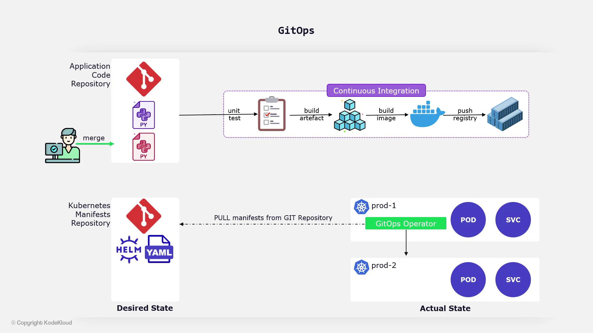
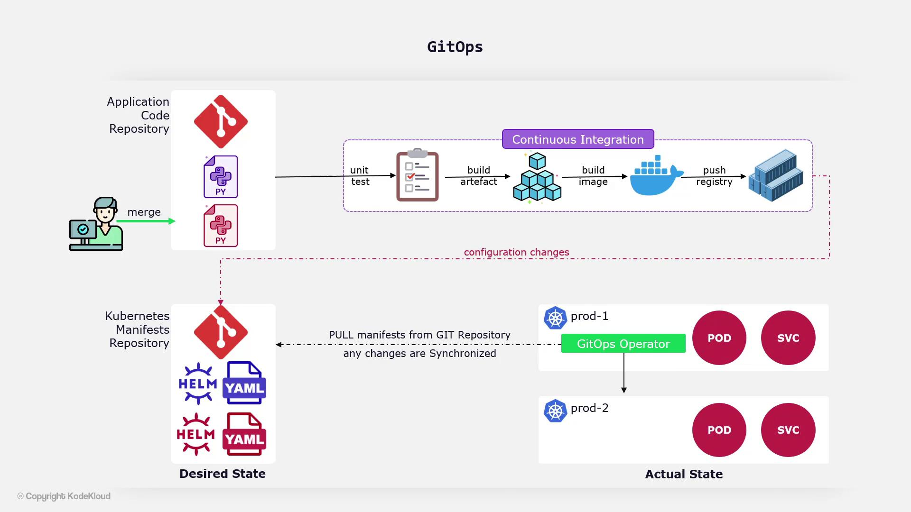
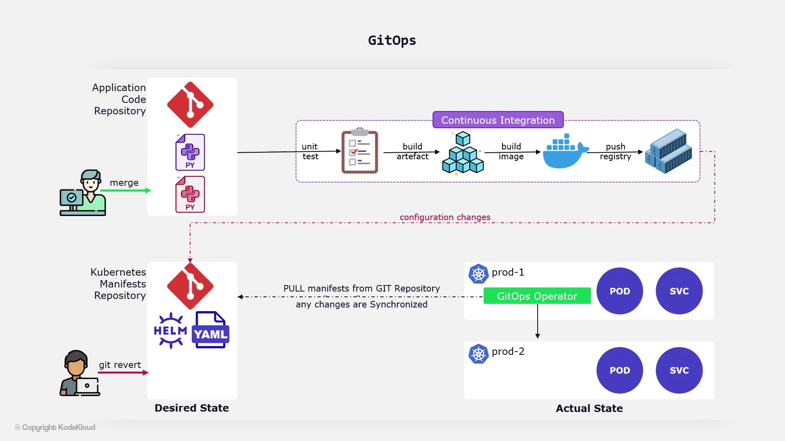

# What is GitOps

Source: https://notes.kodekloud.com/docs/GitOps-with-ArgoCD/Introduction/What-is-GitOps/page

GitOps is an operational framework using Git as the source of truth for managing infrastructure and application code, enabling automated deployments and rollbacks.

GitOps is an operational framework that leverages Git as the single source of truth for managing both infrastructure and application code. It extends the principles of Infrastructure as Code, enabling automated deployments and rollbacks by controlling the entire code delivery pipeline through Git version control.

## GitOps Workflow

Developers begin by committing their changes to a centralized Git repository. Typically, they work in feature branches created as copies of the main codebase. These branches allow teams to develop new features in isolation until they are deemed ready. A Continuous Integration (CI) service automatically builds the application and runs unit tests on the new code. Once tests pass, the changes undergo a review and approval process by relevant team members before being merged into the central repository.

The final step in the pipeline is Continuous Deployment (CD), where changes from the repository are automatically released to Kubernetes clusters.

<Frame>
  
</Frame>

At the heart of GitOps is the concept of a declaratively defined state. This involves maintaining your infrastructure, application configurations, and related components within one or more Git repositories. An automated process continuously verifies that the state stored in Git matches the actual state in the production environment. This synchronization is managed by a GitOps operator running within a Kubernetes cluster. The operator monitors the repository for updates and applies the desired changes to the cluster—or even to other clusters as needed.

When a developer merges new code into the application repository, a series of automated steps is triggered: unit tests are run, the application is built, a Docker image is created and pushed to a container registry, and finally, the Kubernetes manifests in another Git repository are updated.

<Frame>
  
</Frame>

The GitOps operator continuously compares the desired state (as defined in Git) with the actual state in the Kubernetes cluster. If discrepancies are found, the operator pulls the necessary changes to ensure that the production environment remains aligned with the desired configuration.

<Frame>
  
</Frame>

<Callout icon="lightbulb">
  One of the key benefits of GitOps is the seamless rollback process. Since the entire configuration is maintained in Git, reverting to a previous state is as simple as executing a `git revert` command. The GitOps operator detects this change and automatically rolls back the production environment to match the desired state.
</Callout>

<Frame>
  
</Frame>

<CardGroup>
  <Card title="Watch Video" icon="video" href="https://learn.kodekloud.com/user/courses/gitops-with-argocd/module/713ff34d-1afe-4f18-b1bf-2990c322469e/lesson/69da05c8-eecf-472a-9dda-231b48e3b7c3" />
</CardGroup>
