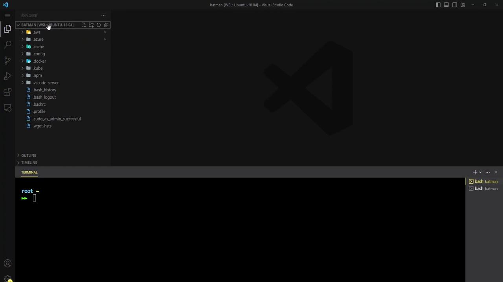
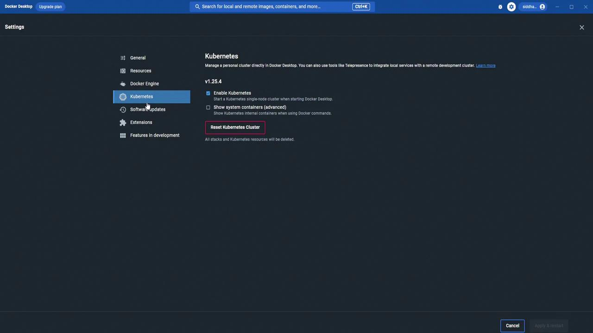

# DEMO FluxCD Installation

Source: https://notes.kodekloud.com/docs/GitOps-with-FluxCD/Flux-Overview/DEMO-FluxCD-Installation/page

This guide covers the installation of FluxCD on a Kubernetes cluster using Docker Desktop and Visual Studio Code.

In this guide, you’ll install FluxCD on a single-node Kubernetes cluster running in Docker Desktop (WSL2) using Visual Studio Code. We’ll cover:

* Installing the Flux CLI
* Bootstrapping Flux with GitHub
* Verifying in-cluster components

<Callout icon="lightbulb">
  Ensure you have the following set up:

  * Docker Desktop with **Kubernetes** enabled ([Docker Desktop Docs](https://docs.docker.com/desktop/))
  * `kubectl` configured
  * A GitHub account
  * Visual Studio Code (or your preferred editor/terminal)
</Callout>

## 1. Environment Overview

You should see something like this when you open VS Code in WSL2:

<Frame>
  
</Frame>

## 2. Start a Sample Container

First, launch a test container to ensure Docker is running:

```bash theme={null}
docker run -d -p 80:80 docker/getting-started
```

## 3. Enable Kubernetes in Docker Desktop

Open Docker Desktop settings, navigate to **Kubernetes**, and enable it:

<Frame>
  
</Frame>

Verify the single-node cluster is Ready:

```bash theme={null}
kubectl get nodes
