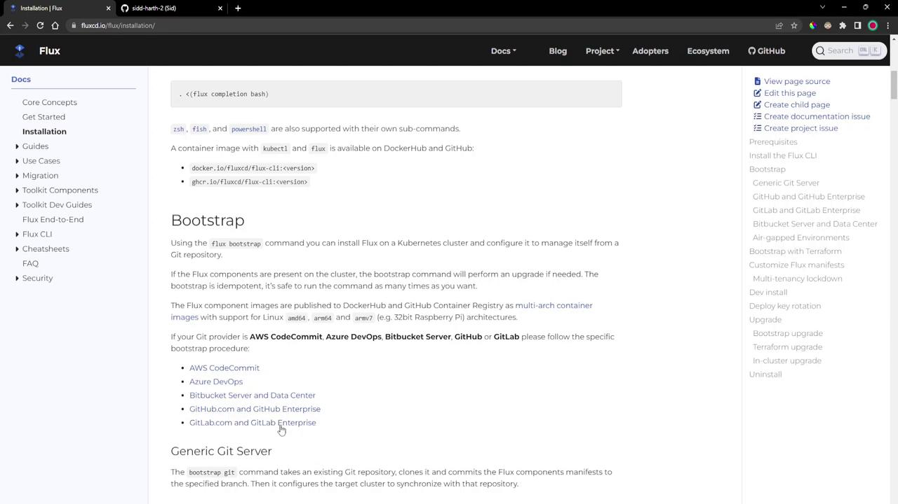
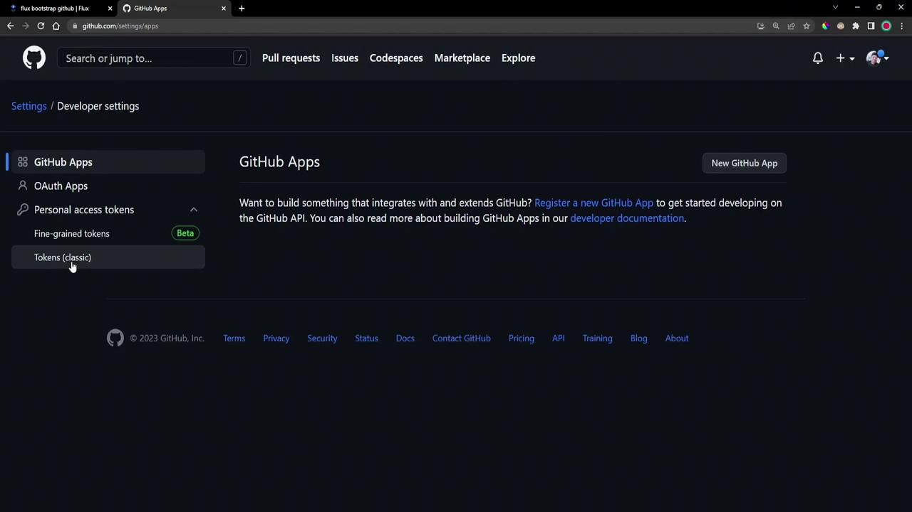
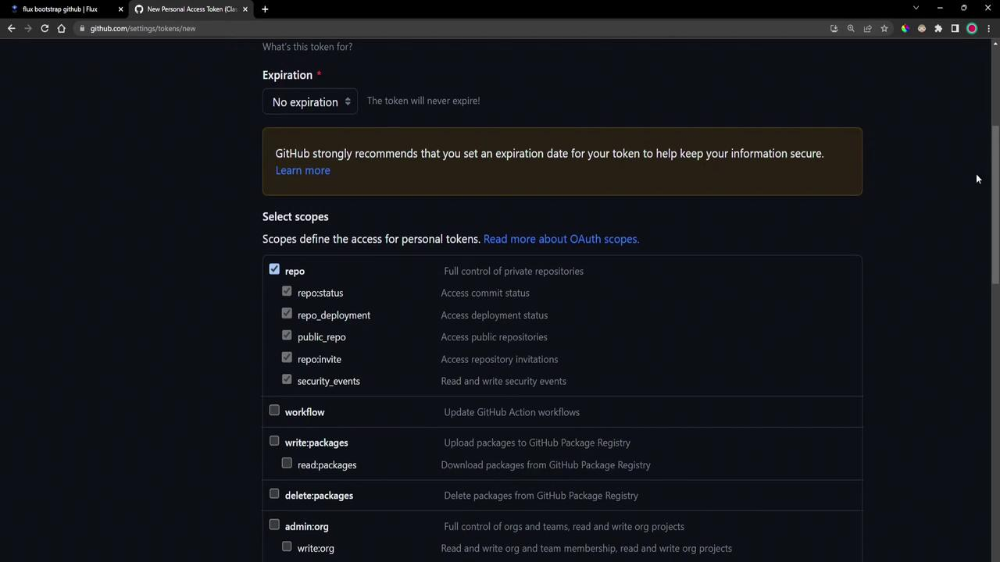
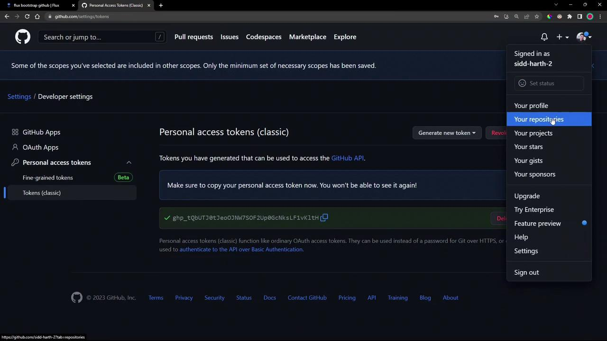
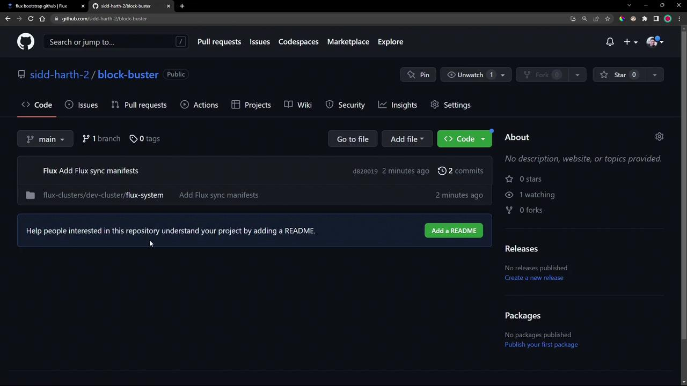
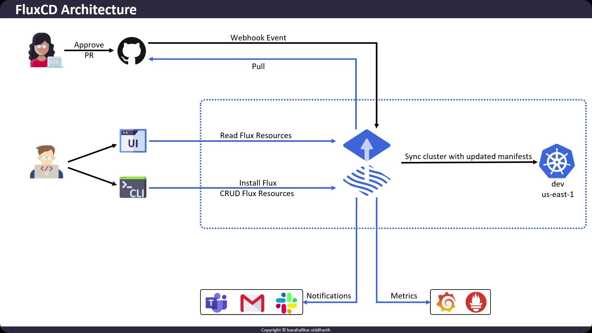

# NAME              STATUS   ROLES           AGE     VERSION
# docker-desktop    Ready    control-plane   3d22h   v1.25.4
```

## 4. Install the Flux CLI

Check if Flux is already installed:

```bash theme={null}
flux --version
# Command 'flux' not found
```

Install using the official script:

```bash theme={null}
curl -s https://fluxcd.io/install.sh | sudo bash
```

Expected output:

```text theme={null}
[INFO]  Downloading metadata https://api.github.com/repos/fluxcd/flux2/releases/latest
[INFO]  Using 0.41.2 as release
[INFO]  Installing flux to /usr/local/bin/flux
```

Confirm the CLI is available:

```bash theme={null}
flux --version
# flux version 0.41.2
```

No server components exist yet:

```bash theme={null}
flux version
# ✗ no deployments found in flux-system namespace
```

List current namespaces:

```bash theme={null}
kubectl get namespace
# NAME              STATUS   AGE
# default           Active   3d22h
# kube-node-lease   Active   3d22h
# kube-public       Active   3d22h
# kube-system       Active   3d22h
```

## 5. Bootstrap Flux on Kubernetes

Flux uses `flux bootstrap` to install controllers and generate GitOps manifests. The installation docs list several Git providers:

<Frame>
  
</Frame>

In this demo, we’ll use GitHub.

### 5.1 Create a GitHub Personal Access Token

1. Go to **Developer settings** → **Personal access tokens** → **Tokens (classic)**.
2. Click **Generate new token**, select **repo** scope, and create it:

<Frame>
  
</Frame>

<Frame>
  
</Frame>

<Callout icon="triangle-alert">
  Store your GitHub token safely. Never commit it to a public repo or share it in plaintext.
</Callout>

### 5.2 Run `flux bootstrap`

Export the token and bootstrap Flux to your GitHub repo:

```bash theme={null}
export GITHUB_TOKEN=<your-token>
flux bootstrap github \
  --owner=sidd-harth-2 \
  --repository=block-buster \
  --path=flux-clusters/dev-cluster \
  --personal=true \
  --private=false
```

What happens during bootstrap:

* Flux connects to GitHub and creates (or clones) the repo
* Component manifests install into the `flux-system` namespace
* A deploy key and Kubernetes `Secret` are created
* Sync manifests are committed to GitHub
* Flux controllers reconcile their configuration

On success, you’ll see:

```text theme={null}
✔ cloned repository
✔ generating component manifests
✔ installing components in "flux-system" namespace
✔ reconciled sync configuration
✔ confirming components are healthy
all components are healthy
```

Check your GitHub account for the new repository and the token list:

<Frame>
  
</Frame>

## 6. Clone and Inspect the Bootstrap Repository

View the GitOps manifests Flux created:

<Frame>
  
</Frame>

```bash theme={null}
git clone https://github.com/sidd-harth-2/block-buster.git
cd block-buster
```

Inside `flux-clusters/dev-cluster/flux-system`, the `gotk-components.yaml` contains definitions for the `flux-system` namespace, CRDs, and controller deployments:

```yaml theme={null}
apiVersion: v1
kind: Namespace
metadata:
  name: flux-system
  labels:
    app.kubernetes.io/part-of: flux
    app.kubernetes.io/version: v0.41.2
---
apiVersion: apiextensions.k8s.io/v1
kind: CustomResourceDefinition
metadata:
  name: alerts.notification.toolkit.fluxcd.io
...
```

## 7. Verify In-Cluster Components

Ensure everything is running properly:

```bash theme={null}
kubectl get namespace flux-system
kubectl -n flux-system get all
# Lists pods, deployments, services for source-, helm-, kustomize-, notification-controllers
kubectl -n flux-system get secret flux-system
# Contains deploy key data
kubectl get crds | grep -i flux
# alerts.notification.toolkit.fluxcd.io        2023-04-05T19:16:44Z
# gitrepositories.source.toolkit.fluxcd.io     2023-04-05T19:16:44Z
# ...
```

Finally, check the versions of the CLI and controllers:

```bash theme={null}
flux version
# flux version 0.41.2
# helm-controller: v0.31.2
# kustomize-controller: v0.35.1
# notification-controller: v0.33.0
# source-controller: v0.36.1
```

| Controller              | Version |
| ----------------------- | ------- |
| Flux CLI                | 0.41.2  |
| Helm Controller         | v0.31.2 |
| Kustomize Controller    | v0.35.1 |
| Notification Controller | v0.33.0 |
| Source Controller       | v0.36.1 |

## Next Steps

You now have Flux installed and bootstrapped with GitHub. In a future post, we’ll explore how to configure and manage GitOps sync manifests for your applications.

***

## Links and References

* [Flux CLI Installation](https://fluxcd.io/docs/installation/#install-the-flux-cli)
* [Flux Bootstrap GitHub](https://fluxcd.io/docs/installation/#bootstrap)
* [Kubernetes Basics](https://kubernetes.io/docs/concepts/overview/what-is-kubernetes/)
* [Docker Desktop Documentation](https://docs.docker.com/desktop/)

<CardGroup>
  <Card title="Watch Video" icon="video" href="https://learn.kodekloud.com/user/courses/gitops-with-fluxcd/module/44949c1c-edf6-4432-81ce-78d709c30af5/lesson/384a3004-5916-45a6-adae-a8e418373118" />

  <Card title="Practice Lab" icon="installation" href="https://learn.kodekloud.com/user/courses/gitops-with-fluxcd/module/44949c1c-edf6-4432-81ce-78d709c30af5/lesson/14105c0e-4073-4080-aebb-c8941ebc00c8" />
</CardGroup>


# FluxCD Architecture Part1

Source: https://notes.kodekloud.com/docs/GitOps-with-FluxCD/Flux-Overview/FluxCD-Architecture-Part1/page

This article explores the high-level architecture of FluxCD and its core components within a Kubernetes cluster.

In this lesson, we’ll dive into the high-level architecture of **FluxCD** and examine how its core components collaborate within a Kubernetes cluster. By the end, you’ll understand:

* How FluxCD implements GitOps for continuous delivery
* The role of Flux controllers and CLI commands
* Observability and notification integration

## How FluxCD Operates in Kubernetes

FluxCD runs as an agent inside your Kubernetes cluster. Users typically interact via the [Flux CLI](https://fluxcd.io/docs/cmd/flux/) to:

1. **Create Sources**\
   Configure Git repositories, Helm charts, or OCI registries as reconciliation sources.
2. **Define Kustomizations**\
   Apply and manage Kubernetes manifests using Kustomize.
3. **Automate Image Updates**\
   Monitor container registries to automatically bump image tags in Git.

<Callout icon="lightbulb">
  FluxCD follows the GitOps pattern:

  * The **desired state** lives in a Git repository.
  * The **live state** resides in the Kubernetes cluster.
  * FluxCD continually syncs them for drift correction.
</Callout>

## Core Flux Controllers

FluxCD comprises several controllers that reconcile resources in Kubernetes. Here’s a quick overview:

| Controller                  | Responsibility                                   | Example CLI Command                                                                  |
| --------------------------- | ------------------------------------------------ | ------------------------------------------------------------------------------------ |
| Source Controller           | Tracks Git repos, Helm repositories, OCI images  | `flux create source git podinfo --url=https://github.com/stefanprodan/podinfo`       |
| Kustomize Controller        | Applies Kustomize overlays                       | `flux create kustomization podinfo --source=GitRepository/podinfo --path="./deploy"` |
| Helm Controller             | Installs and upgrades Helm charts                | `flux create helmrelease nginx --chart=nginx --target-namespace=default`             |
| Notification Controller     | Sends events and alerts via Slack, email, GitHub | Configure via `Notification` and `Alert` custom resources                            |
| Image Automation Controller | Automates container image updates in Git         | `flux create image policy podinfo --image-ref=ghcr.io/stefanprodan/podinfo`          |

## The GitOps Workflow

FluxCD continuously monitors your Git repositories and the cluster’s live state. When a commit or pull-request merge occurs:

1. **Webhook Trigger** (optional)\
   You can configure Git webhooks to notify FluxCD of new commits immediately.
2. **Reconciliation Loop**\
   Each controller fetches the latest manifests, compares them to the live cluster state, and applies any differences.
3. **Status Reporting**\
   Flux updates resource status back to Git (e.g., annotating commits), and emits events for observability.

<Frame>
  
</Frame>

## Observability & Notifications

FluxCD offers built-in metrics and alerts to help you monitor delivery pipelines:

* **Prometheus Metrics**\
  Expose metrics from each controller; scrape with Prometheus for real-time insights.
* **Grafana Dashboards**\
  Visualize Flux health and reconcile durations.
* **Notifications Controller**\
  Send alerts on sync failures or promotion events to Slack, email, or GitHub.

<Callout icon="triangle-alert">
  Ensure your cluster’s RBAC policies allow Flux to read Secrets and apply CRDs. Misconfigured permissions can prevent controllers from reconciling.
</Callout>

## Next Steps

In the next part, we’ll walk through installing FluxCD and bootstrapping your first GitOps repository. Until then, explore these resources:

* [FluxCD Official Documentation](https://fluxcd.io/docs/)
* [Weave GitOps UI](https://github.com/weaveworks/ui)
* [Prometheus User Guide](https://prometheus.io/docs/introduction/overview/)
* [Grafana Dashboards for Flux](https://grafana.com/grafana/dashboards?search=fluxcd)

Thank you for following along—see you in Part 2!

<CardGroup>
  <Card title="Watch Video" icon="video" href="https://learn.kodekloud.com/user/courses/gitops-with-fluxcd/module/44949c1c-edf6-4432-81ce-78d709c30af5/lesson/276fdf2a-38c6-4302-9df5-4e8367f06f74" />
</CardGroup>
