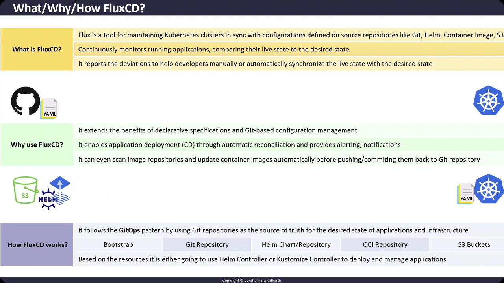

# WhatWhyHow FluxCD

Source: https://notes.kodekloud.com/docs/GitOps-with-FluxCD/Flux-Overview/WhatWhyHow-FluxCD/page

FluxCD is a project that helps teams adopt GitOps for Kubernetes deployment by automating synchronization between declared configurations and live cluster states.

FluxCD is a Cloud Native Computing Foundation (CNCF) project designed to help teams adopt GitOps for Kubernetes deployment. By treating Git repositories, Helm charts, OCI registries, and S3 buckets as the single source of truth, FluxCD automates synchronization between your declared configuration and the live state of your clusters.

## Why Use FluxCD?

Adopting FluxCD delivers multiple benefits:

* **Declarative Configuration**: Leverage Git’s versioning and audit trail for all cluster changes.
* **Automated Reconciliation**: Continuously detects and corrects drift between desired and live states.
* **Image Automation**: Monitors container registries, updates image tags based on policies, and commits changes back to Git.
* **Notifications & Alerts**: Integrates with Slack, Microsoft Teams, or email to inform you about sync status and failures.
* **Scalability**: Supports multi-cluster and multi-environment deployments with minimal overhead.

<Callout icon="lightbulb">
  Ensure that you have cluster-admin access on your Kubernetes cluster and the `flux` CLI installed locally.\
  For installation instructions, see [FluxCD Getting Started](https://fluxcd.io/docs/get-started/).
</Callout>

## What Is FluxCD?

FluxCD is a set of Kubernetes controllers and custom resources that continuously reconcile the state of a cluster with configurations stored in external sources:

* **Git Repositories**: YAML manifests, Kustomize overlays, or Helm releases.
* **OCI Registries**: Helm charts or container images.
* **Cloud Storage**: S3 buckets or other object storage for raw manifests.

By adopting a GitOps workflow, every change in your cluster must be made via pull requests, ensuring a clear history and enabling code review practices.

## How Does FluxCD Work?

FluxCD implements GitOps by actively monitoring your declared sources and the cluster’s live state. When it detects a difference, it reports the drift and—depending on your policy—reconciles automatically or waits for manual approval.

<Frame>
  
</Frame>

Below is a high-level command sequence to bootstrap FluxCD on a Git repository:

```bash theme={null}
