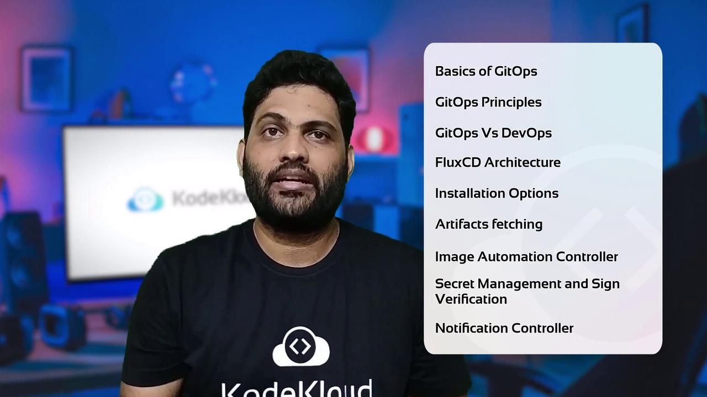

# Install Flux CLI
curl -s https://fluxcd.io/install.sh | sudo bash

# Bootstrap Flux with GitHub
flux bootstrap github \
  --owner=<your-github-user> \
  --repository=<repo-name> \
  --branch=main \
  --path=clusters/my-cluster
```

## FluxCD Controllers at a Glance

| Controller           | Source Type   | Primary Function                            | Flux CLI Example            |
| -------------------- | ------------- | ------------------------------------------- | --------------------------- |
| Kustomize Controller | Git, S3       | Applies Kustomize overlays to generate YAML | `flux create kustomization` |
| Helm Controller      | Git, OCI Rep. | Manages Helm chart releases declaratively   | `flux create helmrelease`   |

### Kustomize Controller

The Kustomize Controller is a Kubernetes operator that applies and manages manifests assembled by [Kustomize](https://kubectl.docs.kubernetes.io/references/kustomize/). It is ideal for:

* Layered environment configurations (e.g., dev, staging, prod).
* Declarative customization of base manifests without forking.

### Helm Controller

The Helm Controller enables you to synchronize Helm chart releases using standard Kubernetes manifests:

* Define `HelmRelease` custom resources to specify chart version, values, and target namespace.
* FluxCD will automatically install, upgrade, or rollback charts based on Git commits.

<Callout icon="triangle-alert">
  When using the Helm Controller, ensure your cluster can pull images from the specified OCI registries. You may need to configure image pull secrets.
</Callout>

## Further Reading

* [FluxCD Documentation](https://fluxcd.io/docs/)
* [GitOps Principles](https://www.gitops.tech/)
* [Kustomize Reference](https://kubectl.docs.kubernetes.io/references/kustomize/)
* [Helm Documentation](https://helm.sh/docs/)

<CardGroup>
  <Card title="Watch Video" icon="video" href="https://learn.kodekloud.com/user/courses/gitops-with-fluxcd/module/44949c1c-edf6-4432-81ce-78d709c30af5/lesson/49ef8037-ed73-4539-a489-4aba73a9f88b" />
</CardGroup>


# Course Introduction

Source: https://notes.kodekloud.com/docs/GitOps-with-FluxCD/GitOps-Overview/Course-Introduction/page

Learn to implement GitOps with FluxCD for streamlined Kubernetes deployments and continuous delivery in cloud-native environments.

Hello and welcome to the FluxCD course by KodeKloud! I'm Siddharth, and I'll guide you through implementing GitOps with [FluxCD](https://fluxcd.io/).

In this module, you'll discover how GitOps streamlines Kubernetes deployments and learn to leverage FluxCD for continuous delivery in cloud-native environments.

## What You Will Learn

* Core principles of **GitOps** workflow
* Key differences between **GitOps** and **DevOps**
* FluxCD **architecture** and component overview
* Multiple **installation** methods for FluxCD CLI
* Managing artifacts from Git repositories, Helm charts, S3 buckets, and OCI registries
* Automating container image updates with FluxCD Image Automation Controller
* Encrypting secrets using [Bitnami Sealed Secrets](https://github.com/bitnami-labs/sealed-secrets) and [Mozilla SOPS](https://github.com/mozilla/sops)
* Signing and verifying container images with [Cosign](https://github.com/sigstore/cosign)
* Exposing FluxCD metrics and configuring notifications with Prometheus and Grafana

<Frame>
  
</Frame>

## Course Structure

Each lesson follows a structured three-phase approach:

1. **Theory Lecture**: Understand concepts and best practices
2. **Live Demonstration**: See real-world examples in action
3. **Hands-On Lab**: Practice in a managed KodeKloud environment

Your labs come fully pre-configured—no need for a personal Kubernetes cluster or cloud account.

## Prerequisites

Before we begin, ensure you have a running Linux-based Cloud IDE or control-plane VM with internet access. No additional setup is required.

***

By the end of this course, you'll have hands-on experience with FluxCD and GitOps, enabling you to automate Kubernetes deployments confidently. Join the [KodeKloud Community Forum](https://kodekloud.com/forum) to discuss challenges and share insights.

Ready to get started? Let's dive into the first lesson!

## References

* [FluxCD Official Documentation](https://fluxcd.io/docs/)
* [Kubernetes Concepts](https://kubernetes.io/docs/concepts/overview/what-is-kubernetes/)
* [Cosign GitHub Repository](https://github.com/sigstore/cosign)

***

<CardGroup>
  <Card title="Watch Video" icon="video" href="https://learn.kodekloud.com/user/courses/gitops-with-fluxcd/module/3b5390cf-dfef-4ace-ab99-1ea5587a2cdb/lesson/c004d752-1202-4872-be66-48b95a980202" />
</CardGroup>
