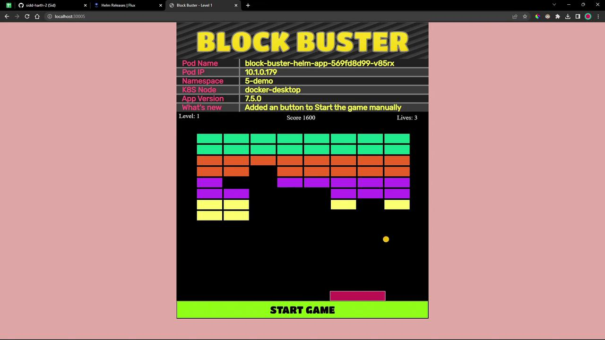

# flux-clusters/dev-cluster/5-demo-values.yaml
replicaCount: 2
service:
  type: NodePort
  nodePort: 30005
namespace:
  name: 5-demo
labels:
  app:
    name: block-buster
    version: 7.5.0
    env: dev
```

***

## Step 5: Define the HelmRelease

Create a `HelmRelease` that combines your source and values:

```bash theme={null}
flux create helmrelease 5-demo-helm-release-git-helm-bb-app \
  --chart block-buster-helm-app \
  --interval 10s \
  --target-namespace 5-demo \
  --source GitRepository/5-demo-source-git-helm-bb-app \
  --values 5-demo-values.yaml \
  --export > flux-clusters/dev-cluster/5-demo-helm-release-git-helm-bb-app.yaml
```

Save it alongside the other manifests:

```yaml theme={null}
apiVersion: helm.toolkit.fluxcd.io/v2beta1
kind: HelmRelease
metadata:
  name: 5-demo-helm-release-git-helm-bb-app
  namespace: flux-system
spec:
  interval: 10s
  targetNamespace: 5-demo
  chart:
    spec:
      chart: block-buster-helm-app
      sourceRef:
        kind: GitRepository
        name: 5-demo-source-git-helm-bb-app
  values:
    replicaCount: 2
    service:
      type: NodePort
      nodePort: 30005
    namespace:
      name: 5-demo
    labels:
      app:
        name: block-buster
        version: 7.5.0
        env: dev
```

<Callout icon="triangle-alert">
  Ensure unique manifest names across your repo to avoid reconciliation conflicts.
</Callout>

***

## Summary of Flux Resources

| Kind          | Filename                                 | Description                                   |
| ------------- | ---------------------------------------- | --------------------------------------------- |
| GitRepository | 5-demo-source-git-bb-app.yaml            | Points Flux to your Helm chart in Git         |
| Values File   | 5-demo-values.yaml                       | Overrides default chart values                |
| HelmRelease   | 5-demo-helm-release-git-helm-bb-app.yaml | Deploys the chart into the Kubernetes cluster |

***

## Step 6: Commit and Reconcile

Push your manifests to the Flux cluster repo:

```bash theme={null}
cd flux-clusters/dev-cluster
git add 5-demo-source-git-bb-app.yaml 5-demo-values.yaml 5-demo-helm-release-git-helm-bb-app.yaml
git commit -m "Add Flux HelmRelease for block-buster-helm-app"
git push
```

Verify Flux has detected the resources:

```bash theme={null}
flux get sources git 5-demo-source-git-helm-bb-app
flux get helmreleases
```

***

## Step 7: Validate in Kubernetes

Check the new namespace and resources:

```bash theme={null}
kubectl get ns
kubectl get all -n 5-demo
```

You should see two replicas and a NodePort service on port 30005:

```bash theme={null}
NAME                          READY   STATUS    RESTARTS   AGE
pod/block-buster-helm-app-xx  1/1     Running   0          2m

NAME                         TYPE       CLUSTER-IP     EXTERNAL-IP   PORT(S)          AGE
service/block-buster-helm-app NodePort   10.96.185.58   <none>        80:30005/TCP     2m
```

Confirm the overridden labels:

```bash theme={null}
kubectl get pod -n 5-demo block-buster-helm-app-xx --show-labels
```

***

## Step 8: Inspect the Packaged Helm Chart

Flux creates HelmChart artifacts—list and view them:

```bash theme={null}
flux get sources helmchart
kubectl -n flux-system get helmcharts.source.toolkit.fluxcd.io
kubectl -n flux-system get helmcharts.source.toolkit.fluxcd.io flux-system-5-demo-helm-release-git-helm-bb-app -o yaml
```

***

## Step 9: Access the Application

Point your browser to `http://<node-ip>:30005`. Version **7.5.0** includes a **Start Game** button to launch the game manually.

<Frame>
  
</Frame>

***

## References

* [Flux CD GitRepository](https://fluxcd.[SECRET_REDACTED]/)
* [Flux CD HelmRelease](https://fluxcd.io/docs/components/helm/helmreleases/)
* [Kubernetes Documentation](https://kubernetes.io/docs/)
* [Helm Chart Best Practices](https://helm.sh/docs/topics/chart_best_practices/)

<CardGroup>
  <Card title="Watch Video" icon="video" href="https://learn.kodekloud.com/user/courses/gitops-with-fluxcd/module/205ec7c7-4cb6-4ecb-9bb5-fa50419f1e68/lesson/5a8c0ef3-506e-4d48-a25d-42d22bdc4da4" />
</CardGroup>


# DEMO HELM Controller with Helm Repository as Source

Source: https://notes.kodekloud.com/docs/GitOps-with-FluxCD/Helm-Controller-and-OCI-Registry/DEMO-HELM-Controller-with-Helm-Repository-as-Source/page

This article explains how to automate the deployment of Helm artifacts using Fluxs Helm Controller and HelmRepository source.

In this walkthrough, we’ll package a Helm chart as a `.tgz` artifact, host it in a Helm repository (via GitHub Pages and [Artifact Hub](https://artifacthub.io/)), then use Flux’s **Source Controller** and **Helm Controller** to automate its deployment.

***

## 1. Helm Chart Package on GitHub Releases

We’ve bundled our application into `block-buster-helm-app-7.6.0.tgz` and published it on the [GitHub Releases](https://github.com/sidd-harth/block-buster-helm-app/releases) page. Below is an example of the default `values.yaml` included in the chart:

```yaml theme={null}
