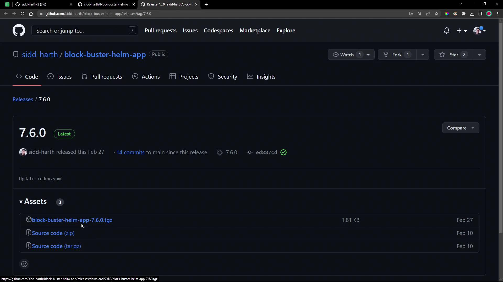
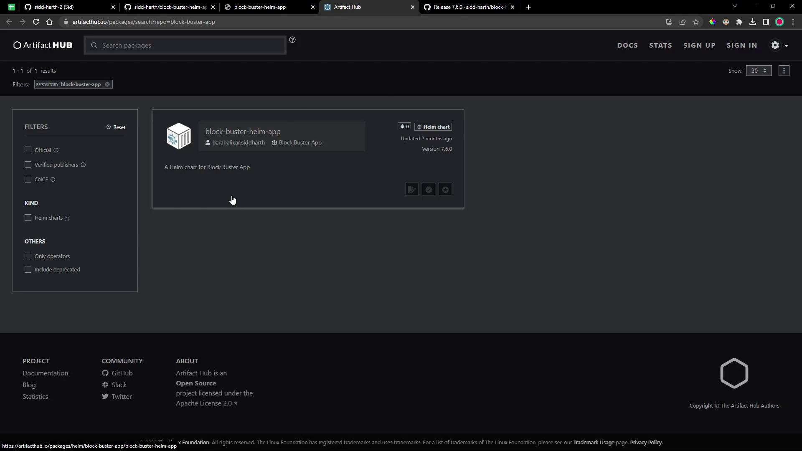
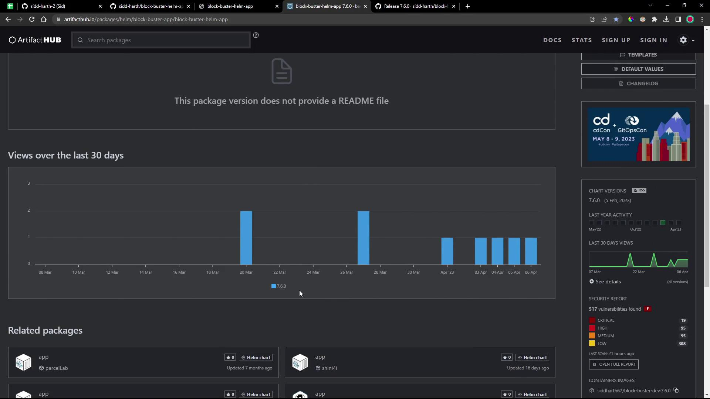
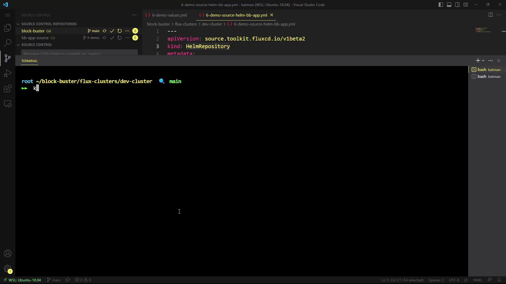
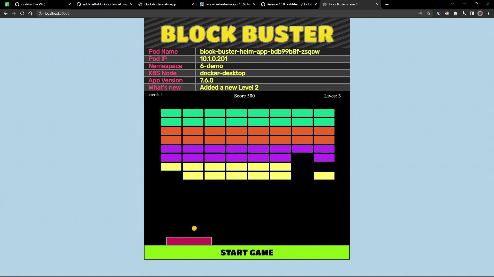
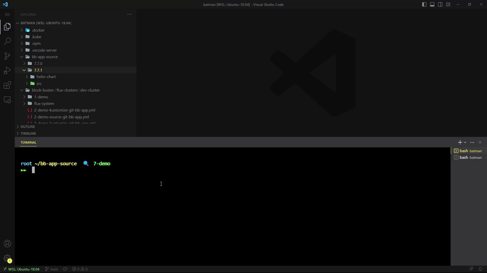

# Sample values.yaml (for reference)
replicaCount: 1

service:
  type: NodePort
  nodePort: 30006

namespace:
  name: 6-demo
```

<Frame>
  
</Frame>

***

## 2. Chart Listing on Artifact Hub

Our chart is also discoverable on [Artifact Hub](https://artifacthub.io/). Artifact Hub provides metadata, download statistics, and security reports for Helm charts.

```yaml theme={null}
# Extended sample values.yaml
replicaCount: 1

service:
  type: NodePort
  nodePort: 30006

namespace:
  name: 6-demo

labels:
  app:
    name: block-buster
    version: 7.6.0
    env: dev
```

| Feature         | Description                                            |
| --------------- | ------------------------------------------------------ |
| Repository URL  | `https://sidd-harth.github.io/block-buster-helm-app`   |
| Chart Version   | `7.6.0`                                                |
| Maintainer      | sidd-harth                                             |
| Install Command | `helm install my-app block-buster-app --version 7.6.0` |

<Frame>
  
</Frame>

<Frame>
  
</Frame>

You could install manually:

```bash theme={null}
helm repo add block-buster-app https://sidd-harth.github.io/block-buster-helm-app/
helm install my-block-buster-helm-app block-buster-app/block-buster-helm-app --version 7.6.0
```

***

## 3. Defining a HelmRepository in Flux

To automate updates, Flux’s **Source Controller** can track the Helm repository for new chart versions.

```bash theme={null}
cd block-buster/flux-clusters/dev-cluster/

flux create source helm 6-demo-source-helm-bb-app \
  --url https://sidd-harth.github.io/block-buster-helm-app \
  --interval 1m \
  --timeout 10s \
  --export > 6-demo-source-helm-bb-app.yaml
```

This generates:

```yaml theme={null}
apiVersion: source.toolkit.fluxcd.io/v1beta2
kind: HelmRepository
metadata:
  name: 6-demo-source-helm-bb-app
  namespace: flux-system
spec:
  url: https://sidd-harth.github.io/block-buster-helm-app
  interval: 1m0s
  timeout: 10s
```

<Callout icon="lightbulb">
  Adjust `--interval` and `--timeout` to suit your release cadence and network conditions.
</Callout>

***

## 4. Customizing Chart Values

Create a file named `6-demo-values.yaml` to override default settings:

```yaml theme={null}
replicaCount: 2

service:
  type: NodePort
  nodePort: 30006

namespace:
  name: 6-demo

labels:
  app:
    name: block-buster
    version: 7.6.0
    env: dev
```

Save it alongside your Flux manifests.

***

## 5. Creating a HelmRelease with Flux

Now define a `HelmRelease` to instruct Flux’s **Helm Controller** to deploy the chart:

```bash theme={null}
flux create helmrelease 6-demo-helm-release-bb-app \
  --chart block-buster-helm-app \
  --interval 10s \
  --target-namespace 6-demo \
  --source HelmRepository/6-demo-source-helm-bb-app \
  --values 6-demo-values.yaml \
  --export > 6-demo-helm-release-bb-app.yaml
```

Generated manifest:

```yaml theme={null}
apiVersion: helm.toolkit.fluxcd.io/v2beta1
kind: HelmRelease
metadata:
  name: 6-demo-helm-release-bb-app
  namespace: flux-system
spec:
  interval: 10s
  targetNamespace: 6-demo
  chart:
    spec:
      chart: block-buster-helm-app
      sourceRef:
        kind: HelmRepository
        name: 6-demo-source-helm-bb-app
      reconcileStrategy: ChartVersion
  values:
    replicaCount: 2
    service:
      type: NodePort
      nodePort: 30006
    namespace:
      name: 6-demo
    labels:
      app:
        name: block-buster
        version: 7.6.0
        env: dev
```

***

## 6. Committing to Git and Triggering Flux

```bash theme={null}
git add \
  6-demo-source-helm-bb-app.yaml \
  6-demo-helm-release-bb-app.yaml \
  6-demo-values.yaml

git commit -m "Add HelmRepository and HelmRelease for block-buster-app v7.6.0"
git push
```

Flux will detect the new manifests and begin reconciliation.

***

## 7. Verifying Flux Resources

Check the status of your `HelmRepository`:

```bash theme={null}
flux get sources helm -n flux-system

NAME                          READY  MESSAGE
6-demo-source-helm-bb-app     True   stored artifact: revision 'sha256:...'
```

List all source types:

```bash theme={null}
flux get sources -A
```

Inspect your `HelmRelease`:

```bash theme={null}
flux get helmreleases -A

NAME                          READY  MESSAGE
6-demo-helm-release-bb-app    True   Release reconciliation succeeded
```

***

## 8. Exploring Source Controller Data

Enter the `source-controller` pod to view how Flux stores chart artifacts:

<Frame>
  
</Frame>

```bash theme={null}
kubectl -n flux-system exec deploy/source-controller -- sh
/data$ ls -d */
gitrepository/  bucket/  helmchart/  helmrepository/
/data$ cd helmrepository/flux-system/6-demo-source-helm-bb-app/
/data/helmrepository/...$ cat index-*.yaml
/data$ cd ../helmchart/flux-system/6-demo-helm-release-bb-app/
/data/...$ tar -tf latest.tar.gz
# Shows Chart.yaml, values.yaml, templates/, etc.
```

| Resource       | Stored Data                              |
| -------------- | ---------------------------------------- |
| HelmRepository | Index files (versions, URLs)             |
| HelmChart      | Unpacked chart with templates & defaults |

***

## 9. Validating the Deployment

Once reconciled, Flux will create the target namespace (`6-demo`) and deploy your app:

```bash theme={null}
kubectl -n 6-demo get all
```

You should see:

* 2 Pods (as per `replicaCount`)
* A Deployment
* A NodePort Service on port 30006

Access the game in your browser:

```text theme={null}
http://<node-ip>:30006
```

<Frame>
  
</Frame>

<Callout icon="lightbulb">
  Starting with version 7.6.0, Block Buster introduces multiple levels. Complete Level One to unlock Level Two!
</Callout>

***

## Links and References

* [Flux Documentation](https://fluxcd.io/docs/)
* [Helm Documentation](https://helm.sh/docs/)
* [Artifact Hub](https://artifacthub.io/)
* [Kubernetes Basics](https://kubernetes.io/docs/concepts/overview/what-is-kubernetes/)

Congratulations—you’ve automated the deployment of a Helm chart `.tgz` artifact using Flux’s Helm Controller and Source Controller!

<CardGroup>
  <Card title="Watch Video" icon="video" href="https://learn.kodekloud.com/user/courses/gitops-with-fluxcd/module/205ec7c7-4cb6-4ecb-9bb5-fa50419f1e68/lesson/ecf68189-22e7-42cb-8d37-42c920fc6eff" />

  <Card title="Practice Lab" icon="installation" href="https://learn.kodekloud.com/user/courses/gitops-with-fluxcd/module/205ec7c7-4cb6-4ecb-9bb5-fa50419f1e68/lesson/a5be4a2b-b5d7-46ea-9b43-c41d097ba161" />
</CardGroup>


# DEMO Push Helm Chart to OCI Registry

Source: https://notes.kodekloud.com/docs/GitOps-with-FluxCD/Helm-Controller-and-OCI-Registry/DEMO-Push-Helm-Chart-to-OCI-Registry/page

Learn to package a Helm chart and publish it to the GitHub Container Registry using the OCI protocol.

In this demo, you’ll learn how to package a Helm chart from your project and publish it to the GitHub Container Registry (GHCR) using the OCI protocol. We’ll cover everything from exploring the directory layout to pulling the chart artifact.

## Inspect the Project Structure

Open your project in Visual Studio Code on the `7-demo` branch. In the Explorer pane, you’ll find a `7.7.1` directory containing your Helm chart sources alongside your application code:

<Frame>
  
</Frame>

```bash theme={null}
$ tree 7.7.1
7.7.1
└── helm-chart
    ├── Chart.yaml
    ├── values.yaml
    └── templates
        ├── NOTES.txt
        ├── _helpers.tpl
        ├── deployment.yaml
        └── service.yaml

$ tree src
src
├── Dockerfile
├── highscore.php
└── images
    ├── level1.png
    └── level2.png
```

## Prerequisite: Install Helm v3.11.2+

Make sure you have [Helm](https://helm.sh/docs/) version 3.11.2 or later:

```bash theme={null}
$ helm version
version.BuildInfo{Version:"v3.11.2", GitCommit:"...", GitTreeState:"clean", GoVersion:"go1.18.10"}
```

<Callout icon="triangle-alert">
  If you see warnings about your kubeconfig file being group- or world-readable, consider tightening permissions:

  ```bash theme={null}
  chmod 600 ~/.kube/config
  ```
</Callout>

## Step 1: Package the Helm Chart

Run the following command in your project root. This generates a compressed chart archive (`.tgz`):

```bash theme={null}
$ helm package 7.7.1/helm-chart/
Successfully packaged chart and saved it to: block-buster-helm-app-7.7.1.tgz
```

## Step 2: Authenticate to GHCR

Log in to the GitHub Container Registry using your GitHub username and a [Personal Access Token](https://docs.github.com/en/authentication/keeping-your-account-and-data-secure/creating-a-personal-access-token):

```bash theme={null}
$ helm registry login ghcr.io --username YOUR_GITHUB_USERNAME
Password: <YOUR_PERSONAL_ACCESS_TOKEN>
Login Succeeded
```

<Callout icon="lightbulb">
  Your token should have the `read:packages` and `write:packages` scopes to push and pull images.
</Callout>

## Step 3: Push the Chart to the OCI Repository

Push the packaged chart to your GHCR repository under your namespace:

```bash theme={null}
$ helm push block-buster-helm-app-7.7.1.tgz oci://ghcr.io/YOUR_GITHUB_USERNAME/bb-app
Pushed: ghcr.io/YOUR_GITHUB_USERNAME/bb-app:7.7.1
Digest: sha256:[SECRET_REDACTED]
```

## Step 4: Verify the Package in GitHub

1. Go to your GitHub repository.
2. Click on **Packages** in the sidebar.
3. You should see **block-buster-helm-app** with version **7.7.1** listed.

## Step 5: Pull the OCI Artifact

Retrieve the chart archive using Docker or any OCI-compliant client:

```bash theme={null}
$ docker pull ghcr.io/YOUR_GITHUB_USERNAME/bb-app:7.7.1
```

## Summary of Commands

| Step                 | Command                                               | Description                    |
| -------------------- | ----------------------------------------------------- | ------------------------------ |
| Verify Helm version  | `helm version`                                        | Check installed Helm version   |
| Package chart        | `helm package <chart-path>`                           | Create a `.tgz` archive        |
| Authenticate to GHCR | `helm registry login ghcr.io --username <user>`       | Log in with GitHub credentials |
| Push chart           | `helm push <archive>.tgz oci://ghcr.io/<user>/<repo>` | Upload chart to OCI registry   |
| Pull chart           | `docker pull ghcr.io/<user>/<repo>:<version>`         | Download chart artifact        |

## Links and References

* [Helm Official Documentation](https://helm.sh/docs/)
* [GitHub Container Registry (GHCR)](https://docs.github.com/en/packages/working-with-a-github-packages-registry/working-with-the-container-registry)
* [OCI Artifacts Specification](https://github.com/opencontainers/artifacts)

<CardGroup>
  <Card title="Watch Video" icon="video" href="https://learn.kodekloud.com/user/courses/gitops-with-fluxcd/module/205ec7c7-4cb6-4ecb-9bb5-fa50419f1e68/lesson/eb806cb8-3d9f-427f-bf12-058e1f3bd692" />
</CardGroup>
