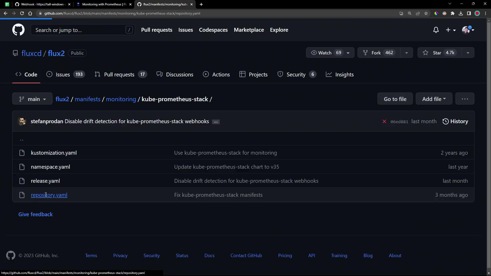

# DEMO Install Kube Prometheus Stack

Source: https://notes.kodekloud.com/docs/GitOps-with-FluxCD/Monitoring-User-Interface/DEMO-Install-Kube-Prometheus-Stack/page

This tutorial teaches deploying the Kube Prometheus Stack on Kubernetes using Flux 2 GitOps components for monitoring with Prometheus and Grafana.

In this tutorial, you'll learn how to deploy the Kube Prometheus Stack on Kubernetes using Flux 2 GitOps components. By the end, you'll have Prometheus and Grafana running on your cluster, exposed via `NodePort` services.

## Why Use Flux 2 for Monitoring?

Using Flux 2 to manage your monitoring stack as GitOps ensures:

* Declarative configuration
* Automated drift detection and remediation
* Version control of all resource definitions

## 1. Prepare the Flux Monitoring Manifests

Flux maintains example manifests for the Kube Prometheus Stack in its repository under `manifests/monitoring/kube-prometheus-stack`:

<Frame>
  
</Frame>

Here are the two key resources you will apply:

### a. HelmRepository

This resource fetches the Helm charts from the [Prometheus Community Helm Repository](https://prometheus-community.github.io/helm-charts):

```yaml theme={null}
apiVersion: source.toolkit.fluxcd.io/v1beta2
kind: HelmRepository
metadata:
  name: prometheus-community
spec:
  interval: 120m
  # OCI builds for kube-prometheus-stack have been temporarily disabled:
  # https://github.com/prometheus-community/helm-charts/issues/2940
  type: default
  url: https://prometheus-community.github.io/helm-charts
```

### b. HelmRelease

The `HelmRelease` installs version `0.45.x` of the `kube-prometheus-stack` chart into the `monitoring` namespace. It also configures custom retention and resource requests:

```yaml theme={null}
apiVersion: helm.toolkit.fluxcd.io/v2beta1
kind: HelmRelease
metadata:
  name: kube-prometheus-stack
  namespace: monitoring
spec:
  interval: 5m
  chart:
    spec:
      chart: kube-prometheus-stack
      version: "45.x"
      sourceRef:
        kind: HelmRepository
        name: prometheus-community
        interval: 60m
  install:
    crds: Create
  upgrade:
    crds: CreateReplace
  values:
    alertmanager:
      enabled: false
    prometheus:
      prometheusSpec:
        retention: 24h
        resources:
          requests:
            cpu: 200m
            memory: 200Mi
        podMonitorNamespaceSelector: {}
        podMonitorSelector:
          matchLabels:
            app.kubernetes.io/component: monitoring
```

<Callout icon="lightbulb">
  Defining `crds: Create` ensures that all CustomResourceDefinitions required by the chart are installed before the HelmRelease.
</Callout>

## 2. Deploy the Flux Resources

In your cluster Git repository (for example, `flux-clusters/dev-cluster`), create the Flux sources and kustomization:

```bash theme={null}
