# 1. Create a GitRepository source for the Flux 2 manifests
flux create source git monitoring-source-prometheus-stack \
  --url https://github.com/fluxcd/flux2 \
  --branch main \
  --interval 30m \
  --export > monitoring-source-prometheus-stack.yaml

# 2. Create a Kustomization to apply the monitoring directory
flux create kustomization monitoring-kustomization-prometheus-stack \
  --source GitRepository/monitoring-source-prometheus-stack \
  --path "./manifests/monitoring/kube-prometheus-stack" \
  --interval 1h \
  --prune \
  --export > monitoring-kustomization-prometheus-stack.yaml

# Commit and push to your Git repository
git add .
git commit -m "Add Kube Prometheus Stack monitoring with Flux 2"
git push
```

<Callout icon="triangle-alert">
  Make sure the `monitoring` namespace does not already exist or is managed by another tool, as Flux will create it.
</Callout>

| Resource       | Purpose                                           | Flux CLI Example                                               |
| -------------- | ------------------------------------------------- | -------------------------------------------------------------- |
| GitRepository  | Point Flux at a Git repo for manifests            | `flux create source git ...`                                   |
| Kustomization  | Apply resources from a source directory           | `flux create kustomization ...`                                |
| HelmRepository | Download Helm charts from an OCI or HTTP endpoint | Defined in `monitoring/kube-prometheus-stack/helmrepo.yaml`    |
| HelmRelease    | Install and manage a Helm chart                   | Defined in `monitoring/kube-prometheus-stack/helmrelease.yaml` |

## 3. Verify Deployment

After Flux syncs, confirm that the `monitoring` namespace and its resources are created:

```bash theme={null}
kubectl get ns
# ...
monitoring    Active   30s

kubectl get all -n monitoring
# Should list Deployments, StatefulSets, DaemonSets and Services for Prometheus and Grafana
```

## 4. Expose Prometheus and Grafana

By default, both Prometheus and Grafana services use `ClusterIP`. To access them externally, switch to `NodePort`:

```bash theme={null}
kubectl -n monitoring edit svc kube-prometheus-stack-prometheus
kubectl -n monitoring edit svc kube-prometheus-stack-grafana
kubectl -n monitoring get svc
```

Example output:

```bash theme={null}
NAME                             TYPE       CLUSTER-IP      PORT(S)             AGE
kube-prometheus-stack-grafana    NodePort   10.99.232.155   80:31921/TCP        5m
kube-prometheus-stack-prometheus NodePort   10.97.179.234   9090:30753/TCP      5m
# ...
```

## 5. Access the Prometheus UI

Open the Prometheus interface in your browser at `http://<node-ip>:30753`. The dashboard displays service monitor health:

<Frame>
  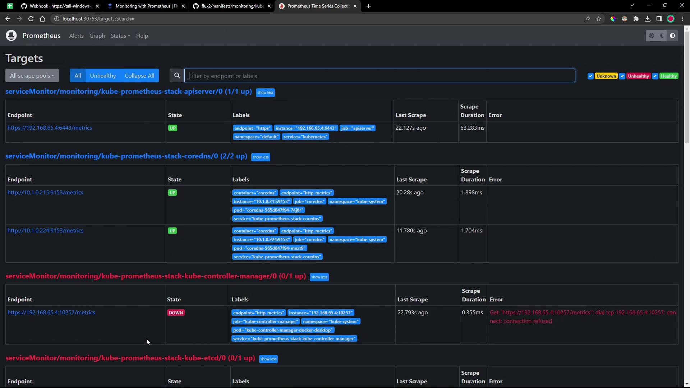
</Frame>

## 6. Access the Grafana Dashboard

Visit `http://<node-ip>:31921` and log in with credentials stored in the `kube-prometheus-stack-grafana` secret:

```bash theme={null}
kubectl -n monitoring get secret kube-prometheus-stack-grafana -o yaml
```

Decode the base64 values:

```bash theme={null}
echo <base64-admin-user>          # YWRtaW4= -> admin
echo <base64-admin-password>      # cHJvbS1hZG1pbi1vcGVyYXRvcg== -> prom-admin-operator
```

Initially, no Flux-specific dashboards are available:

<Frame>
  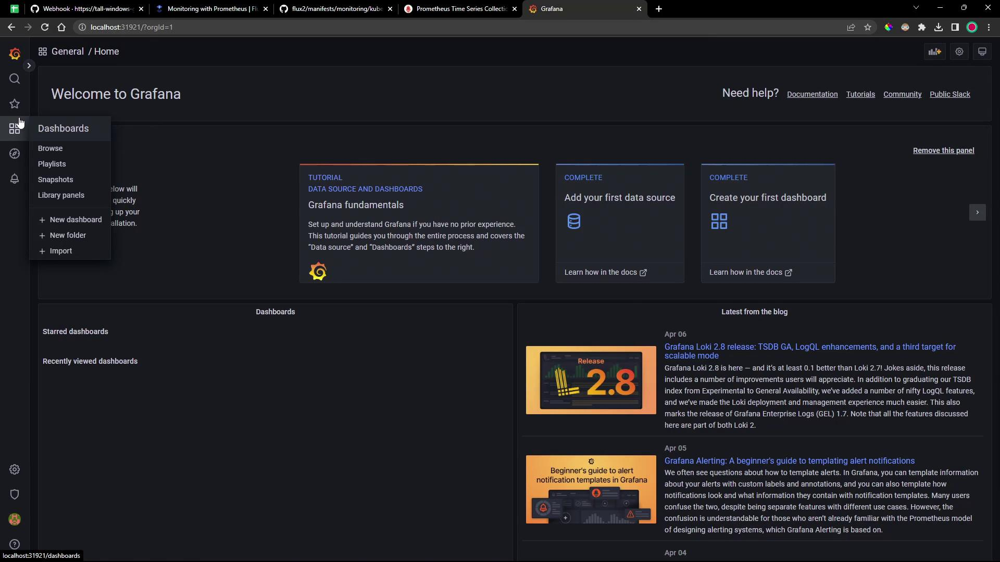
</Frame>

However, you can browse the built-in Kubernetes monitoring dashboards:

<Frame>
  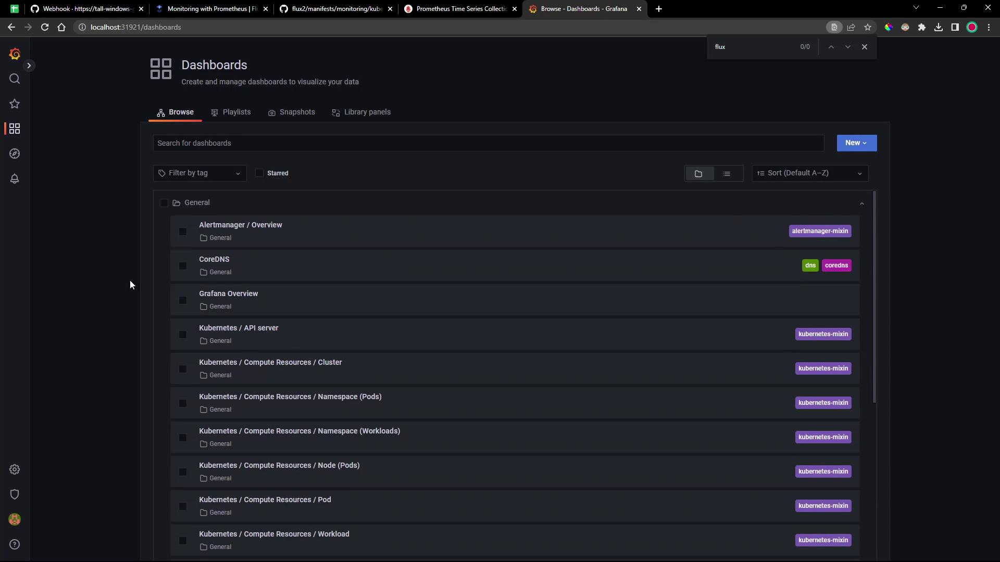
</Frame>

## 7. Explore Prometheus Targets

Check the Prometheus `/targets` page to see which endpoints are scraped:

<Frame>
  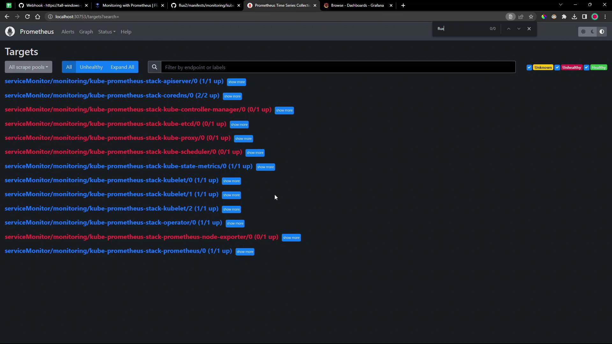
</Frame>

## Next Steps

* Configure `ServiceMonitor` resources to scrape Flux controllers.
* Deploy custom Grafana dashboards for Flux metrics.
* Integrate alerts into your incident management workflow.

## References

* [Flux GitRepository Source Documentation](https://fluxcd.io/docs/components/source/gitrepository/)
* [Flux Kustomization Documentation](https://fluxcd.io[AWS_SECRET_ACCESS_KEY]/)
* [Prometheus Community Helm Charts](https://prometheus-community.github.io/helm-charts)
* [Kube Prometheus Stack on Artifact Hub](https://artifacthub.io/packages/helm/prometheus-community/kube-prometheus-stack)

<CardGroup>
  <Card title="Watch Video" icon="video" href="https://learn.kodekloud.com/user/courses/gitops-with-fluxcd/module/fb9e59dc-9dee-4532-92a8-553d0df1df27/lesson/8402737e-1205-4320-8bf5-453600a08706" />
</CardGroup>


# DEMO Monitor Flux using Prometheus Grafana

Source: https://notes.kodekloud.com/docs/GitOps-with-FluxCD/Monitoring-User-Interface/DEMO-Monitor-Flux-using-Prometheus-Grafana/page

This guide explains how to integrate Prometheus with Flux v2 for monitoring and visualizing metrics in Grafana.

In this guide, you’ll learn how to integrate [Prometheus](https://prometheus.io/) with Flux v2 to scrape controller metrics and visualize them in [Grafana](https://grafana.com/). We’ll leverage the `monitoring` folder from the [fluxcd/flux2 GitHub repo](https://github.com/fluxcd/flux2) and deploy a `PodMonitor` CRD and Grafana dashboards via Flux Kustomizations.

## 1. Explore the monitoring directory

Clone or browse the Flux repository and locate the `monitoring` folder:

<Frame>
  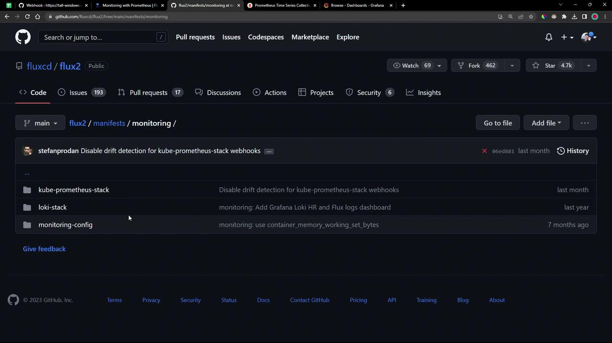
</Frame>

Inside `monitoring/` you’ll find:

* **PodMonitor** YAML for scraping all Flux controllers.
* A `dashboards/` folder with two Grafana JSON files:
  * `cluster.json`
  * `controlplane.json`

<Frame>
  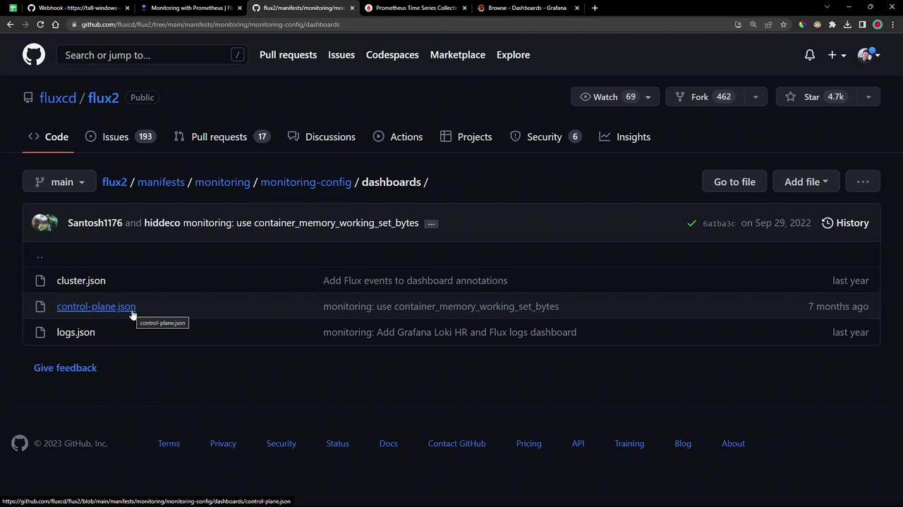
</Frame>

## 2. Apply the Flux PodMonitor

The `PodMonitor` CRD instructs Prometheus to scrape metrics from Flux controllers in the `flux-system` namespace:

```yaml theme={null}
apiVersion: monitoring.coreos.com/v1
kind: PodMonitor
metadata:
  name: flux-system
  namespace: flux-system
  labels:
    app.kubernetes.io/part-of: flux
    app.kubernetes.io/component: monitoring
spec:
  namespaceSelector:
    matchNames:
      - flux-system
  selector:
    matchExpressions:
      - key: app
        operator: In
        values:
          - helm-controller
          - source-controller
          - kustomize-controller
          - notification-controller
          - image-automation-controller
          - image-reflector-controller
  podMetricsEndpoints:
    - port: http-prom
      relabelings: []
```

<Callout icon="lightbulb">
  Ensure the Prometheus Operator and its CRDs (including `PodMonitor`) are installed (for example via the `kube-prometheus-stack`).
</Callout>

Apply it directly or via Flux:

```bash theme={null}
kubectl apply -f monitoring/manifests/monitoring-config/podmonitor.yaml
```

## 3. Create a Flux Kustomization

Automate the deployment by defining a Flux `Kustomization` that points to your Git source:

```yaml theme={null}
apiVersion: kustomize.toolkit.fluxcd.io/v1beta2
kind: Kustomization
metadata:
  name: monitoring-config
  namespace: flux-system
spec:
  dependsOn:
    - name: monitoring-kustomization-prometheus-stack
  interval: 1h0m0s
  path: ./manifests/monitoring/monitoring-config
  prune: true
  sourceRef:
    kind: GitRepository
    name: monitoring-source-prometheus-stack
```

You can export this with the Flux CLI:

```bash theme={null}
flux create kustomization monitoring-config \
  --namespace flux-system \
  --depends-on monitoring-kustomization-prometheus-stack \
  --interval 1h0m0s \
  --path "./manifests/monitoring/monitoring-config" \
  --prune=true \
  --source GitRepository/monitoring-source-prometheus-stack \
  --export > monitoring-config.yaml
```

Commit and push:

```bash theme={null}
git add manifests/monitoring/monitoring-config
git commit -m "Add Flux PodMonitor and Grafana dashboards"
git push
```

Reconcile the Git source and kustomization:

```bash theme={null}
flux reconcile source git flux-system --namespace flux-system
flux reconcile kustomization monitoring-config --namespace flux-system
```

Verify the PodMonitor is ready:

```bash theme={null}
kubectl get podmonitor -n flux-system
```

## 4. Validate in Prometheus

Open your Prometheus UI and go to **Status → Targets**. Within seconds, the Flux controller endpoints should appear as `UP`:

<Frame>
  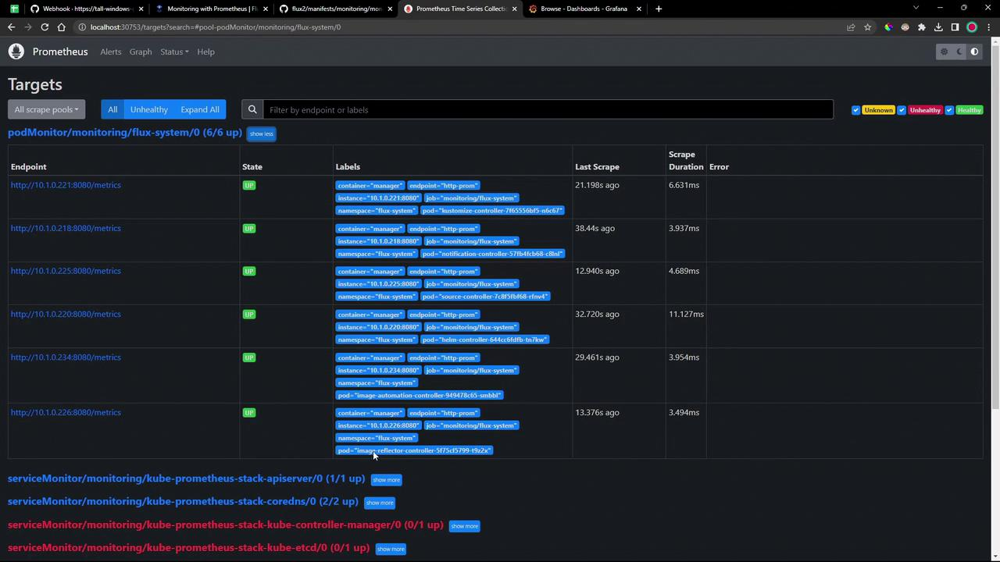
</Frame>

### Common `gotk_` Queries

| Query                                                    | Description                                 |
| -------------------------------------------------------- | ------------------------------------------- |
| `gotk_reconcile_condition{type="Ready", status="True"}`  | Count of successful reconciliations         |
| `gotk_reconcile_condition{type="Ready", status="False"}` | Count of failed reconciliations             |
| `gotk_suspend_status`                                    | Suspension state of Git sources/controllers |
| `gotk_reconcile_duration_seconds_bucket`                 | Histogram buckets for reconcile durations   |
| `gotk_reconcile_duration_seconds_sum`                    | Total reconcile duration                    |
| `gotk_reconcile_duration_seconds_count`                  | Number of reconcile operations              |

Run any query in **Graph** view to see real-time metrics:

<Frame>
  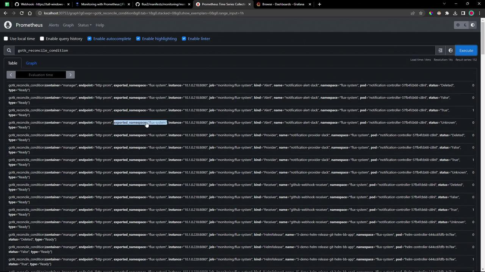
</Frame>

Switch to **Graph** mode for time-series visualization:

<Frame>
  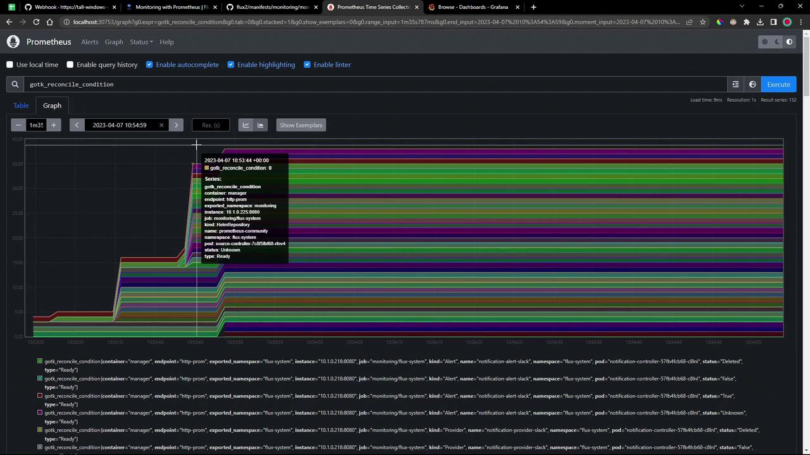
</Frame>

## 5. Explore Grafana Dashboards

After Flux applies the dashboard JSON, refresh Grafana. Two dashboards are now available:

* **Flux Control Plane**
* **Flux Cluster Stats**

### Flux Control Plane

Tracks each controller’s queue lengths, CPU/memory usage, API request rates, and reconciliation durations:

<Frame>
  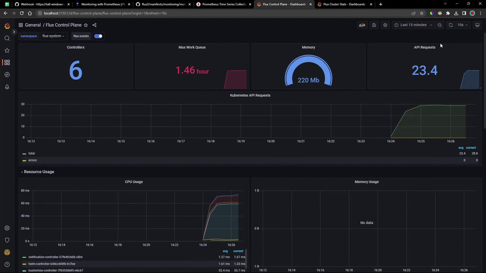
</Frame>

<Frame>
  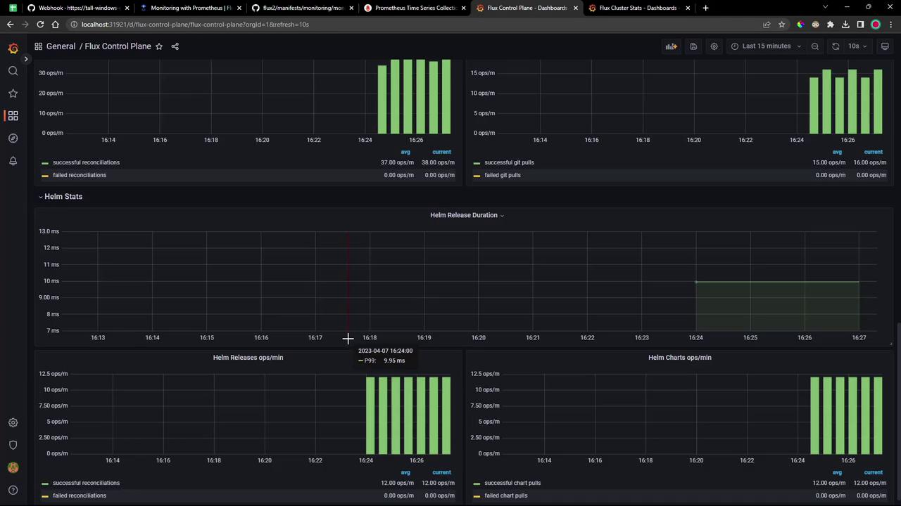
</Frame>

### Flux Cluster Stats

Provides cluster-wide health: counts of reconcilers, failing controllers, manifest source statuses, operation durations, and readiness tables:

<Frame>
  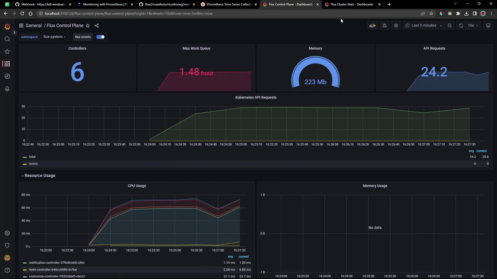
</Frame>

<Frame>
  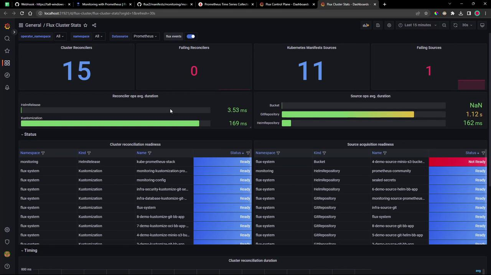
</Frame>

These dashboards ship out of the box—just apply them to get comprehensive visibility into your Flux GitOps workflows.

***

## Links and References

* [Flux v2 Documentation](https://fluxcd.io/docs/)
* [Prometheus Documentation](https://prometheus.io/docs/)
* [Grafana Dashboards](https://grafana.com/grafana/dashboards)
* [GitOps with Flux](https://fluxcd.io/)

<CardGroup>
  <Card title="Watch Video" icon="video" href="https://learn.kodekloud.com/user/courses/gitops-with-fluxcd/module/fb9e59dc-9dee-4532-92a8-553d0df1df27/lesson/64787e16-94e0-41b2-a537-b3f1fcf7023b" />

  <Card title="Practice Lab" icon="installation" href="https://learn.kodekloud.com/user/courses/gitops-with-fluxcd/module/fb9e59dc-9dee-4532-92a8-553d0df1df27/lesson/ec051c13-205b-4a16-8ceb-e1586ebbe765" />
</CardGroup>
