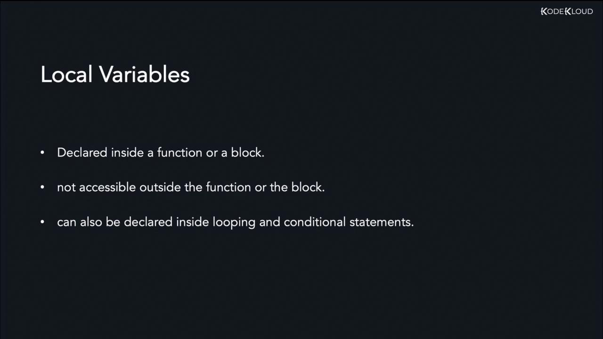
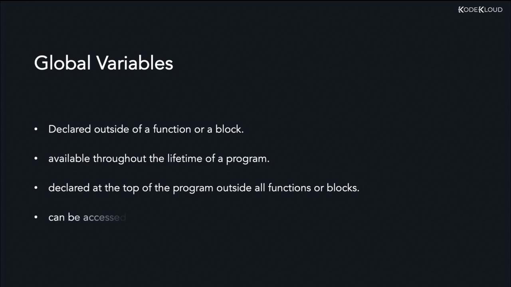

# Variable Scope

Source: https://notes.kodekloud.com/docs/Golang/Data-Types-and-Variables/Variable-Scope/page

This article explains variable scope in Go, detailing local and global variables and their accessibility within code blocks.

In Go, variable scope defines the region in a program where a variable can be accessed or referenced. Scopes in Go are determined by code blocks, which are denoted by matching pairs of curly braces `{ }`. An outer block can include one or more inner blocks. While inner blocks can use variables declared in their outer blocks, outer blocks cannot access variables declared within their inner blocks.

You can visualize nested blocks like this:

```JSON theme={null}
{
  // Outer block
  {
    // Inner block
  }
}
```

## Example of Block Scope

Consider an example using the `main` function as the outer block. Inside this function, a variable named `city` is declared. An inner block is then introduced, where another variable `country` is declared. Within this inner block, both `city` and `country` are accessible.

```go theme={null}
func main() {
    city := "London"
    {
        country := "UK"
        fmt.Println(country)
        fmt.Println(city)
    }
}
```

If you try to access the `country` variable outside the inner block, such as in the outer block of the `main` function, the program will produce an error. The following code demonstrates a working scenario where only the `city` variable is accessed outside its inner block:

```go theme={null}
func main() {
    city := "London"
    {
        country := "UK"
        fmt.Println(country)
        fmt.Println(city)
    }
    fmt.Println(city)
}
```

<Callout icon="lightbulb">
  Remember, outer blocks cannot access variables declared in their inner blocks.
</Callout>

## Local Variables

Local variables are declared within a function or any code block, including conditionals and loops. These variables are only accessible within the block or function where they are declared. The following image illustrates that local variables, when declared inside functions or blocks, are inaccessible outside and can also be defined within loops and conditional statements.

<Frame>
  
</Frame>

Consider this example where the `name` variable is declared within the `main` function:

```go theme={null}
package main
import "fmt"

func main() {
    name := "Lisa"
    fmt.Println(name)
}
```

## Global Variables

Global variables are declared outside of any function or code block, making them accessible throughout the entire program. They are often placed at the top of your source file. The diagram below shows that global variables, when declared at the top of the program, remain accessible throughout the program's lifecycle.

<Frame>
  
</Frame>

Here is an example demonstrating a global variable. Notice that the variable `name` is declared outside of the `main` function, allowing it to be accessed within `main`.

```go theme={null}
package main
import "fmt"

var name string = "Lisa"

func main() {
    fmt.Println(name)
}
```

When running the program with the command:

```bash theme={null}
>>> go run main.go
Lisa
```

the output "Lisa" confirms that the global variable is accessible within the function.

<Callout icon="lightbulb">
  Understanding the difference between local and global variable scopes is crucial for managing data access and avoiding unintended side effects in your Go programs.
</Callout>

This concludes our article on variable scope in Go. We hope you found this explanation clear and helpful. Stay tuned for our next article where we will delve into more advanced topics in Go programming.

For further reading, check out these helpful links:

* [Go Official Documentation](https://golang.org/doc/)
* [Understanding Scopes in Programming](https://en.wikipedia.org/wiki/Scope_\(computer_science\))

<CardGroup>
  <Card title="Watch Video" icon="video" href="https://learn.kodekloud.com/user/courses/golang/module/eeafa284-50db-4de2-a58a-759d3926fced/lesson/9aeac6c7-8893-4138-b3d4-038fd81c9607" />
</CardGroup>
