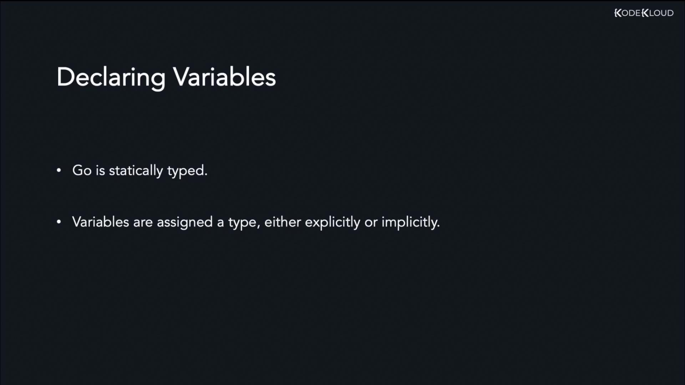
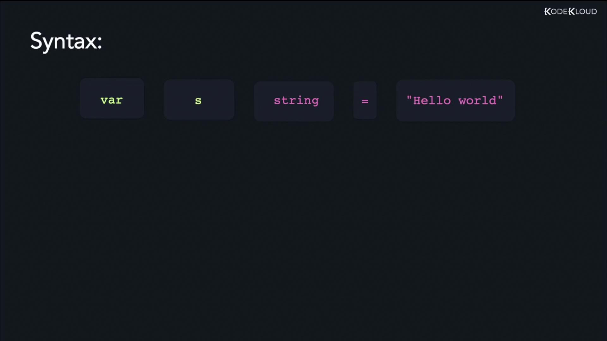

# Variables Syntax and Declaration

Source: https://notes.kodekloud.com/docs/Golang/Data-Types-and-Variables/Variables-Syntax-and-Declaration/page

This article focuses on variable declaration and syntax in Go, explaining how to store data using different data types.

In the previous lesson, we covered the various data types available in Go. In this lesson, we focus on storing data in variables by exploring variable declaration and syntax.

A variable in Go is a named storage location that holds a value. It serves as a reference to that value, forming the backbone of programming logic. Even if the value stored in a variable changes, its name remains constant.

Since Go is a statically typed language, each variable must have a data type—either explicitly stated by the programmer or inferred at compile time.

<Frame>
  
</Frame>

One common method to declare a variable in Go is by using the `var` keyword. The general steps involved in variable declaration include:

1. Using the `var` keyword.
2. Specifying the variable name.
3. Declaring the variable’s data type.
4. Using the assignment operator (`=`) to assign a value.

Below are examples of variable declarations for different data types.

## Declaring a String Variable

To declare a string variable, use the following syntax:

```go theme={null}
var s string = "Hello world"
```

In this example, the variable `s` is assigned the string value "Hello world".

<Frame>
  
</Frame>

## Declaring an Integer Variable

Similarly, you can declare an integer variable as shown below:

```go theme={null}
var i int = 100
```

Here, the variable `i` is of type `int` and stores the value 100.

## Declaring a Boolean Variable

For Boolean values, the `bool` data type is used. Always write Boolean literals in lowercase:

```go theme={null}
var b bool = false
```

This statement initializes a Boolean variable `b` with the value `false`.

## Declaring a Float Variable

Go supports two floating-point types: `float32` and `float64`. The following declaration uses `float64`:

```go theme={null}
var f float64 = 77.90
```

This creates a variable `f` of type `float64` set to the value 77.90.

<Callout icon="lightbulb">
  Variables in Go can also be declared without an initial value. In such cases, Go automatically assigns a zero value based on the type. For example, an uninitialized `int` variable gets a value of `0`.
</Callout>

## Running a Simple Example

Below is a complete program that demonstrates variable declaration and usage within the `main` function. This example uses the `fmt` package to print a variable's value.

```go theme={null}
package main

import "fmt"

func main() {
    var greeting string = "Hello World"
    fmt.Println(greeting)
}
```

To execute the program, run the following command:

```bash theme={null}
$ go run main.go
Hello World
```

In this program, the variable `greeting` is assigned the value "Hello World", which is then displayed in the console.

That concludes the discussion on variable syntax and declaration in Go—an essential concept that underpins building robust Go applications. We'll see you in the next lesson.

## References

* [Go Official Documentation](https://golang.org/doc/)
* [Go by Example](https://gobyexample.com/)

<CardGroup>
  <Card title="Watch Video" icon="video" href="https://learn.kodekloud.com/user/courses/golang/module/eeafa284-50db-4de2-a58a-759d3926fced/lesson/3181d520-6ddf-42a0-be63-924588545efc" />
</CardGroup>
