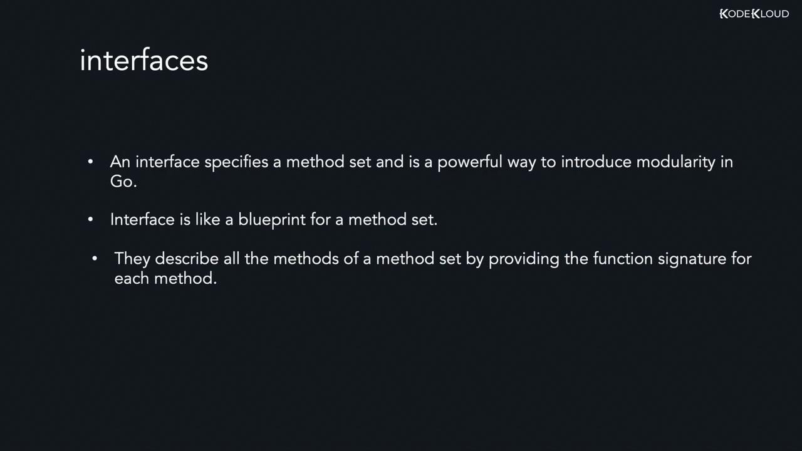
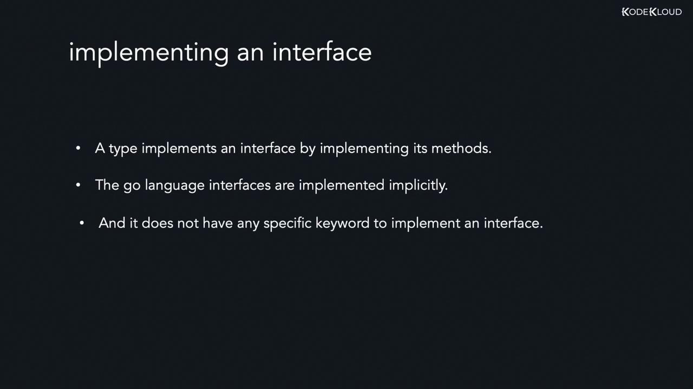

# Interfaces Introduction and Syntax

Source: https://notes.kodekloud.com/docs/Golang/Struct-Methods-and-Interfaces/Interfaces-Introduction-and-Syntax/page

This lesson focuses on interfaces in Go, a feature that enables flexible and decoupled code design through method signatures without implementations.

In previous lessons, we explored concepts such as structs, methods, and method sets. This lesson focuses on interfaces in Go—a powerful feature that enables flexible and decoupled code design.

In Go, an interface defines a set of method signatures without providing their implementations. This design paradigm creates a blueprint for functionality. Types, such as structs, implement interfaces implicitly simply by defining the required methods. This approach eliminates the need for explicit declarations or keywords such as `implements`.

<Frame>
  
</Frame>

An interface in Go is defined much like a struct, using the `type` keyword followed by the interface name and the `interface` keyword. Inside the curly braces, list the method signatures that any implementing type must provide. For example, consider the following interface:

```go theme={null}
type FixedDeposit interface {
    getRateOfInterest() float64
    calcReturn() float64
}
```

In this example:

* `getRateOfInterest` returns the interest rate as a `float64` value.
* `calcReturn` returns the calculated return as a `float64` value.

No variable declarations or method definitions are included in the interface—only method signatures.

## Implicit Implementation of Interfaces

Go’s interface implementation is implicit. This means that a type automatically implements an interface if it provides all the methods declared in the interface with matching signatures. For instance, if you have a struct that defines methods corresponding to those in the `FixedDeposit` interface, it implements that interface without any additional syntax requirements.

Golang’s design philosophy with interfaces leads to cleaner and more flexible code, as the relationship between types and interfaces is established solely based on method signatures.

<Frame>
  
</Frame>

<Callout icon="lightbulb">
  Interfaces allow for modular and decoupled code design in Go. By relying solely on method signatures, types can implement interfaces implicitly, leading to cleaner and more straightforward code.
</Callout>

That concludes our lesson on interfaces in Go. In subsequent lessons, you will see more implementation examples and detailed usage scenarios to further enhance your understanding.

<CardGroup>
  <Card title="Watch Video" icon="video" href="https://learn.kodekloud.com/user/courses/golang/module/62591a5f-ea7d-40f5-923f-5b248d6b565b/lesson/bc8745f7-98ef-4601-9535-8622aa6c2fc1" />
</CardGroup>
