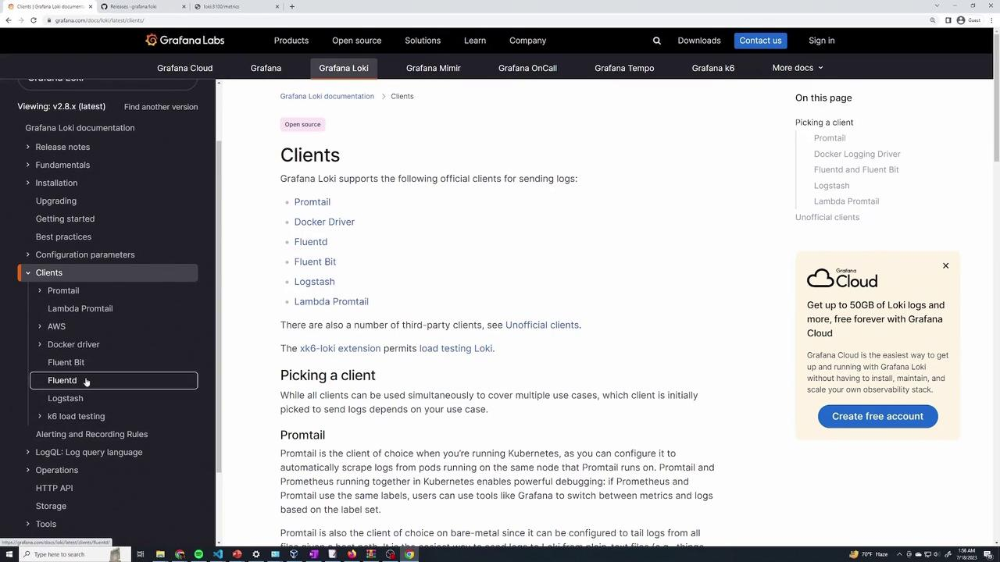
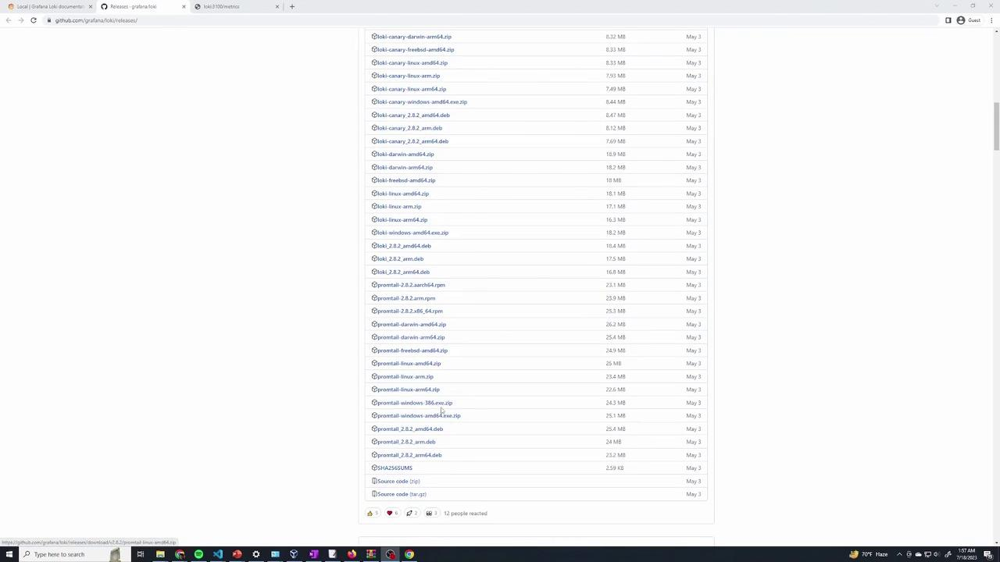

# Extract the binary
unzip loki-linux-amd64.zip
# Make the binary executable
chmod a+x loki-linux-amd64
```

After these commands, confirm the presence of the Loki binary by listing your directory contents. If the zip file has not been extracted, you can run:

```bash theme={null}
curl -O -L "https://github.com/grafana/loki/releases/download/v2.8.2/loki-linux-amd64.zip"
ls
unzip loki-linux-amd64.zip
```

You should now see the executable Loki binary in your working directory.

## 4. Reviewing the Loki Configuration File

If you haven't already obtained the configuration file, download it by running:

```bash theme={null}
wget https://raw.githubusercontent.com/grafana/loki/main/cmd/loki/loki-local-config.yaml
wget https://raw.githubusercontent.com[AWS_SECRET_ACCESS_KEY]promtail-local-config.yaml
```

You can open and inspect the configuration file using your preferred text editor. For example:

```bash theme={null}
vi loki-local-config.yaml
```

A typical configuration file includes settings for the HTTP server (port 3100), the gRPC server (port 9096), and filesystem storage for log chunks and rules. Here is an example snippet:

```yaml theme={null}
auth_enabled: false

server:
  http_listen_port: 3100
  grpc_listen_port: 9096

common:
  instance_addr: 127.0.0.1
  path_prefix: /tmp/loki
  storage:
    filesystem:
      chunks_directory: /tmp/loki/chunks
      rules_directory: /tmp/loki/rules
    replication_factor: 1
  ring:
    kvstore:
      store: inmemory

query_range:
  results_cache:
    cache:
      embedded_cache:
        enabled: true
        max_size_mb: 100

schema_config:
  configs:
    - from: 2020-10-24
```

<Callout icon="lightbulb">
  This configuration instructs Loki to use the local file system for storage. You can modify these settings or switch to another storage backend, such as S3, based on your needs. For more tailored configurations, consult the [Loki documentation](https://grafana.com/docs/loki/latest/).
</Callout>

## 5. Running Loki

Once the configuration file is ready, you can start Loki. Use the appropriate command for your operating system:

### For Windows

```bash theme={null}
.\loki-windows-amd64.exe --config.file=loki-local-config.yaml
```

### For Linux

```bash theme={null}
./loki-linux-amd64 -config.file=loki-local-config.yaml
```

When you run the executable, Loki will start up and display several log messages. Look for logs similar to the following to confirm that it has started correctly:

```plaintext theme={null}
level=info ts=2023-07-18T05:54:14.795944069Z caller=compactor.go:346 msg="waiting until compactor is ACTIVE in the ring"
level=info ts=2023-07-18T05:54:14.796194848Z caller=ingester.go:432 msg="recovered WAL checkpoint recovery finished" elapsed=1.148398ms errors=false
...
level=info ts=2023-07-18T05:54:14.972723532 caller=worker.go:209 msg="adding connection" addr=127.0.0.1:9096
```

<Callout icon="lightbulb">
  These log messages indicate that Loki is initializing its internal processes and joining the cluster ring successfully.
</Callout>

## 6. Verifying the Installation

To ensure Loki is running as expected, open your web browser and navigate to:

http\://\[LOKI\_SERVER\_IP]:3100/metrics

Replace \[LOKI\_SERVER\_IP] with the actual IP address or DNS name of your Loki server. If everything is set up correctly, you will see the metrics output similar to what is shown in the logs.

<Callout icon="lightbulb">
  Now that Loki is successfully installed, consider exploring additional configuration options and integrations with Promtail for a comprehensive logging solution. Visit the [Loki documentation](https://grafana.com/docs/loki/latest/) for further details and advanced configurations.
</Callout>

Enjoy your Loki installation and happy logging!

<CardGroup>
  <Card title="Watch Video" icon="video" href="https://learn.kodekloud.com/user/courses/grafana-loki/module/99ea0065-ea43-4058-9fef-46fbe62292ee/lesson/689b850b-e392-491a-8654-a08ab31a2102" />
</CardGroup>


# Promtail installation

Source: https://notes.kodekloud.com/docs/Grafana-Loki/Grafana-Loki-Essentials-Part-1/Promtail-installation/page

This guide covers the installation and configuration of Promtail to forward logs to a Loki server.

In this guide, we assume your Loki server is already running. Now it’s time to set up Promtail—the dedicated log collection agent—to forward logs from your nodes (node one and node two) to your Loki instance.

Begin by exploring the documentation under the Clients section. Here, you will discover several supported clients such as Promtail, Fluent Bit, Fluentd, and Logstash. For this lesson, our focus is on Promtail.

<Frame>
  
</Frame>

The documentation offers various example configurations (Docker, Helm on Kubernetes, etc.). However, we are interested in downloading a precompiled binary that corresponds to your system architecture (e.g., Promtail Linux AMD64).

<Frame>
  
</Frame>

## Downloading and Unpacking Promtail

Follow these steps on each node to download and extract the Promtail binary:

### On Node One

1. **Download the Promtail zip file using `wget`:**

   ```bash theme={null}
   vagrant@node-1:~$ wget https://github.com/grafana/loki/releases/download/v2.8.2/promtail-linux-amd64.zip
   ```

2. **List the directory to verify the download:**

   ```bash theme={null}
   vagrant@node-1:~$ ls
   LICENSE  README.md  app  flog  flog_0.4.3_linux_amd64.tar.gz  generated.log  log.gz  promtail-linux-amd64.zip
   ```

3. **Unzip the downloaded file:**

   ```bash theme={null}
   vagrant@node-1:~$ unzip promtail-linux-amd64.zip
   Archive:  promtail-linux-amd64.zip
   inflating: promtail-linux-amd64
   ```

4. **Verify the extraction:**

   ```bash theme={null}
   vagrant@node-1:~$ ls
   LICENSE  app  flog_0.4.3_linux_amd64.tar.gz  log.gz  promtail-linux-amd64.zip  promtail-linux-amd64  generated.log
   ```

### On Node Two

Repeat the download and extraction process:

1. **Download the Promtail zip file:**

   ```bash theme={null}
   vagrant@node-2:~$ wget https://github.com/grafana/loki/releases/download/v2.8.2/promtail-linux-amd64.zip
   ```

2. **Verify the download with a directory listing:**

   ```bash theme={null}
   vagrant@node-2:~$ ls
   LICENSE  README.md  app  flog  flog_0.4.3_linux_amd64.tar.gz  generated.log  log.gz  promtail-linux-amd64.zip
   ```

3. **Extract the archive:**

   ```bash theme={null}
   vagrant@node-2:~$ unzip promtail-linux-amd64.zip
   Archive:  promtail-linux-amd64.zip
   inflating: promtail-linux-amd64  
   ```

4. **Confirm the extraction:**

   ```bash theme={null}
   vagrant@node-2:~$ ls
   app  promtail-linux-amd64  promtail-linux-amd64.zip
   ```

<Callout icon="lightbulb">
  If you encounter an error on node two regarding the absence of the `unzip` command, install it using:

  ```bash theme={null}
  vagrant@node-2:~$ sudo apt install unzip
  ```

  Then, rerun the unzip command.
</Callout>

## Obtaining the Promtail Configuration File

Promtail requires a configuration file to determine how logs are collected and where to send them. Follow these steps on your node:

1. **Download the example configuration file from GitHub:**

   ```bash theme={null}
   vagrant@node-2:~$ wget https://raw.githubusercontent.com[AWS_SECRET_ACCESS_KEY]promtail-local-config.yaml
   ```

2. **Open the configuration file for review:**

   ```bash theme={null}
   vagrant@node-2:~$ vi promtail-local-config.yaml
   ```

A typical configuration looks like this:

```yaml theme={null}
server:
  http_listen_port: 9080
  grpc_listen_port: 0

positions:
  filename: /tmp/positions.yaml

clients:
  - url: http://localhost:3100/loki/api/v1/push

scrape_configs:
  - job_name: system
    static_configs:
      - targets:
          - localhost
    labels:
      job: varlogs
      __path__: /var/log/*log
```

### Customizing the Configuration

Review the key sections of the configuration:

* **Server:** Sets Promtail’s HTTP listening port.
* **Positions:** Specifies the file to store the last read positions of logs.
* **Clients:** Defines the Loki server endpoint. Change `localhost` to the actual IP address or hostname of your Loki server.
* **Scrape Configs:** Determines which log files are monitored. In the example, all files in `/var/log` ending with `"log"` are collected.

For example, after updating with your Loki server's IP address, your configuration might be:

```yaml theme={null}
server:
  http_listen_port: 9080
  grpc_listen_port: 0

positions:
  filename: /tmp/positions.yaml

clients:
  - url: http://<LOKI_IP_ADDRESS>:3100/loki/api/v1/push

scrape_configs:
  - job_name: system
    static_configs:
      - targets:
          - localhost
    labels:
      job: varlogs
      __path__: /var/log/*log
```

You can add more scrape jobs as needed to monitor and label additional log files.

## Running Promtail

To start Promtail using your configuration file, execute the following command on each node. Make sure you are in the directory containing both the Promtail binary and the configuration file.

1. **Run Promtail:**

   ```bash theme={null}
   vagrant@node-2:~$ ./promtail-linux-amd64 -config.file=promtail-local-config.yaml
   ```

You should see output indicating that Promtail has started, similar to this:

```bash theme={null}
level=info ts=2023-07-18T06:07:02.851962462Z caller=promtail.go:133 msg="Reloading configuration file" md5sum=533f93bcf05063...
level=info ts=2023-07-18T06:07:02.852876099Z caller=main.go:174 msg="Starting Promtail" version="(version=2.8.2, branch=HEAD, revision=9f809eda7)"
level=warn ts=2023-07-18T06:07:02.852991175Z caller=promtail.go:265 msg="enable watchConfig"
```

<Callout icon="triangle-alert">
  If Promtail fails to access certain log files due to permission issues (common for system logs), run Promtail with `sudo`:

  ```bash theme={null}
  vagrant@node-1:~$ sudo ./promtail-linux-amd64 -config.file=promtail-local-config.yaml
  ```
</Callout>

Here’s an example snippet of Promtail output confirming that log files like `/var/log/kern.log` and `/var/log/syslog` are being tailed:

```bash theme={null}
level=info ts=2023-07-18T06:07:58.460604359Z caller=tailer.go:143 component=tailer msg="tail routine: started" path=/var/log/kern.log
ts=2023-07-18T06:07:58.460785504Z caller=log.go:168 level=info msg="Seeked /var/log/syslog - &{Offset:3449718 Whence:0}"
```

This output confirms that Promtail is correctly reading and forwarding logs to your Loki server.

## Conclusion

Once Promtail is installed and configured on both nodes, your logs will be continuously collected and pushed to your Loki server for centralized monitoring and analysis. For additional configuration options and troubleshooting tips, refer to the [Grafana Loki Documentation](https://grafana.com/docs/loki/latest/).

<CardGroup>
  <Card title="Watch Video" icon="video" href="https://learn.kodekloud.com/user/courses/grafana-loki/module/99ea0065-ea43-4058-9fef-46fbe62292ee/lesson/cc21d8e4-53c6-4e5d-8e3c-66e601572a1a" />
</CardGroup>
