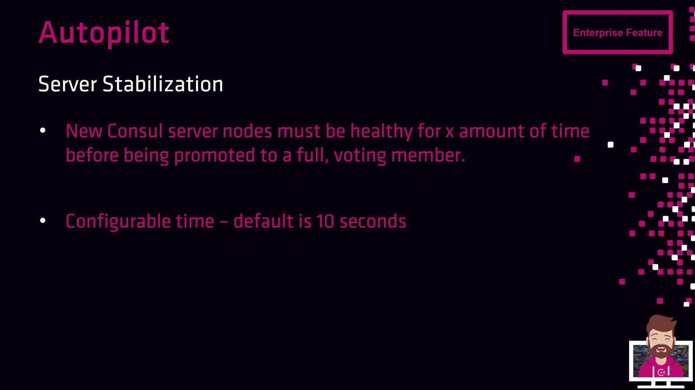
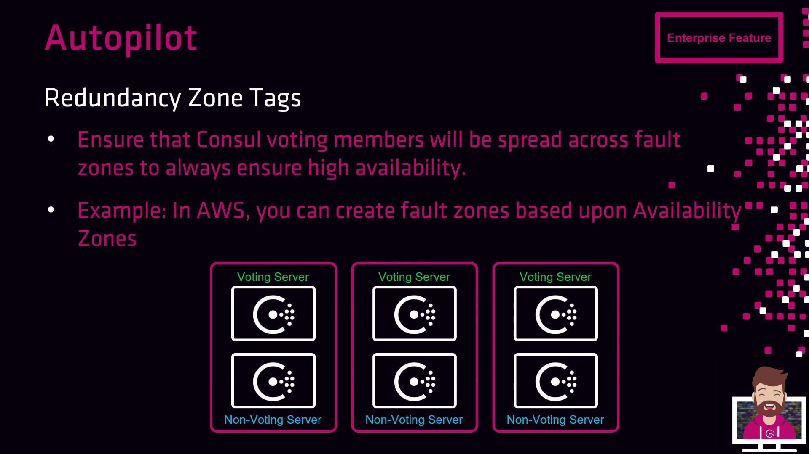

# Consul Autopilot

Source: https://notes.kodekloud.com/docs/HashiCorp-Certified-Consul-Associate-Certification/Explain-Consul-Architecture/Consul-Autopilot/page

Autopilot is a Consul feature that automates cluster operations, enhancing efficiency and stability in enterprise environments.

Autopilot is an enterprise-only Consul feature designed to streamline cluster operations by automating routine tasks. By packaging these capabilities into the enterprise binaries, HashiCorp offers:

| Feature                      | Benefit                                                        |
| ---------------------------- | -------------------------------------------------------------- |
| Dead Server Cleanup          | Automatically prunes failed servers after healthy replacements |
| Server Stabilization         | Ensures new servers heal before joining the Raft quorum        |
| Redundancy Zone Tags         | Balances voting members across fault domains                   |
| Automatic Upgrade Migrations | Orchestrates safe rolling upgrades without data loss           |

<Callout icon="triangle-alert">
  Autopilot is exclusive to the enterprise release of Consul. It is not available in the open-source distribution.
</Callout>

## Default Autopilot Configuration

When you install the enterprise binaries, Autopilot is enabled with the following defaults:

```bash theme={null}
$ consul operator autopilot get-config
CleanupDeadServers         = true
LastContactThreshold       = 200ms
MaxTrailingLogs            = 250
MinQuorum                  = 0
ServerStabilizationTime    = 10s
RedundancyZoneTag          = ""
DisableUpgradeMigration    = false
UpgradeVersionTag          = ""
```

To modify a setting, use `set-config`. For example, to turn off dead server cleanup:

```bash theme={null}
$ consul operator autopilot set-config -cleanup-dead-servers=false
$ consul operator autopilot get-config
```

## Dead Server Cleanup

When a Consul server fails unexpectedly, Autopilot prunes the dead member once its replacement reaches a healthy state. Without this feature, you would have to wait up to 72 hours for the automatic reap or manually remove the node using the CLI or API.

<Callout icon="lightbulb">
  Keep dead server cleanup enabled to prevent stale entries in your cluster membership list.
</Callout>

## Server Stabilization

Server stabilization prevents new nodes from immediately joining the Raft quorum. It requires servers to pass health checks for a configurable grace period before receiving voting rights.

<Frame>
  
</Frame>

By default, `ServerStabilizationTime` is set to 10s. Adjust this value to suit your cluster’s startup profile:

```bash theme={null}
$ consul operator autopilot set-config -server-stabilization-time=30s
```

## Redundancy Zone Tags

Use the `RedundancyZoneTag` metadata to distribute voting members across fault domains. For example, tagging each node with its AWS Availability Zone (`AZ`) ensures an even spread of voters and increases cluster resilience.

<Frame>
  
</Frame>

On non-cloud or custom environments, set this metadata manually in your provisioning scripts:

```hcl theme={null}
resource "consul_node_metadata" "example" {
  node = "consul-server-1"
  metadata {
    AZ = "us-west-2a"
  }
}
```

## Automatic Upgrade Migrations

Autopilot’s upgrade migration feature automates leadership handoff during rolling version upgrades:

1. New servers join as non-voting members.
2. Autopilot holds promotion until newer-version nodes equal the older-version count.
3. It then promotes new servers to voters and demotes the old servers.

<Frame>
  
</Frame>

After the promotion, safely decommission the older servers:

```bash theme={null}
$ consul leave
```

## Links and References

* [Consul Autopilot Documentation](https://www.consul.io/docs/enterprise/autopilot)
* [Consul Configuration](https://www.consul.io/docs/agent/options)
* [HashiCorp Enterprise Features](https://www.consul.io/docs/enterprise)

<CardGroup>
  <Card title="Watch Video" icon="video" href="https://learn.kodekloud.com/user/courses/hashicorp-certified-consul-associate-certification/module/bb95f43b-3acb-4ce2-88ae-0c79beb3e569/lesson/9bf9c185-c282-4682-943d-f94a9ceee907" />
</CardGroup>
