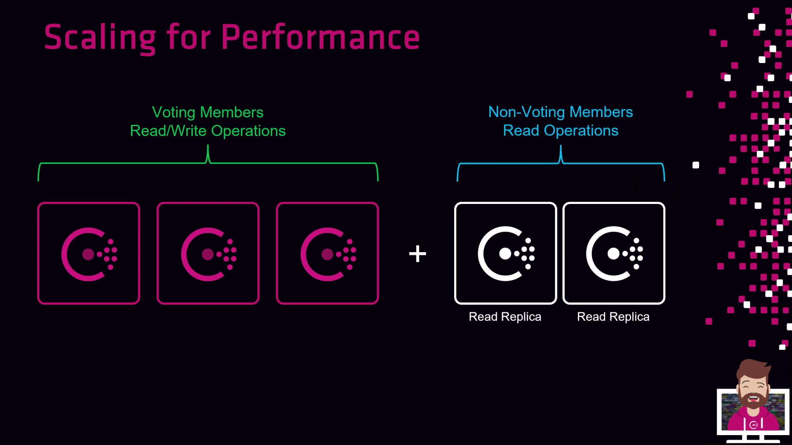
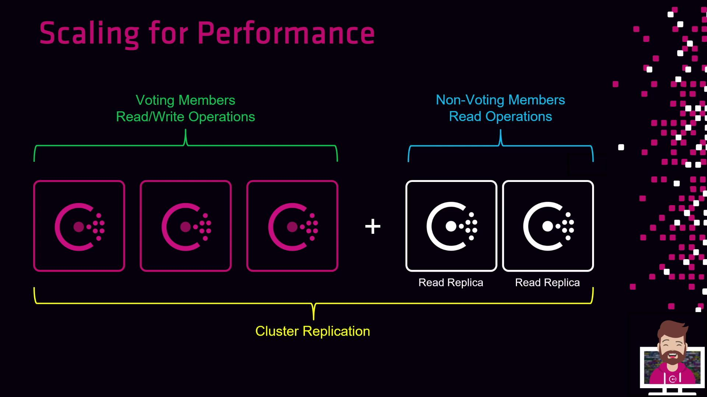

# Scaling for Performance

Source: https://notes.kodekloud.com/docs/HashiCorp-Certified-Consul-Associate-Certification/Explain-Consul-Architecture/Scaling-for-Performance/page

This article discusses the use of read replicas in Consul Enterprise to enhance performance in read-heavy environments.

In modern, read-heavy environments, offloading queries from your primary Consul cluster can dramatically boost throughput and resilience. Consul Enterprise introduces **read replicas**—non-voting members dedicated to serving read requests. This feature allows you to scale out read operations without impacting the write performance or election process of your primary servers.

## What Are Read Replicas?

Read replicas in Consul Enterprise are special server agents that:

* **Serve read-only traffic**: Respond to queries without handling writes.
* **Stay in sync via replication**: Receive updates from the primary cluster.
* **Do not vote**: Excluded from leader elections, ensuring election integrity.

By directing read clients to these replicas, you preserve the performance of your voting servers and optimize overall cluster capacity.

<Callout icon="lightbulb">
  Read replicas always reflect the latest cluster state but cannot process `acl replication up` or write-related API calls.
</Callout>

## Primary Cluster vs. Read Replicas

| Component       | Role            | Voting | Handles Writes | Handles Reads |
| --------------- | --------------- | ------ | -------------- | ------------- |
| Primary Servers | Core cluster    | Yes    | Yes            | Yes           |
| Read Replicas   | Auxiliary nodes | No     | No             | Yes           |

## Architecture Overview

A typical enhanced-read deployment includes:

1. **Primary Consul Servers**
   * Usually 3 voting nodes
   * Manage leader elections, writes, and replication
2. **Read Replica Nodes**
   * Deployed alongside or in separate datacenters
   * Subscribe to the Raft log for updates
   * Serve only read requests

When read demand increases, simply provision more read replicas and update your service configurations or DNS entries to point read-only clients to these replicas. All write operations continue on your primary cluster, while replicas keep up-to-date via streaming replication.

<Frame>
  
</Frame>

<Frame>
  
</Frame>

<Callout icon="triangle-alert">
  Ensure your network allows bidirectional communication between primary servers and read replicas. Replication requires stable connectivity to avoid replication lag.
</Callout>

## Best Practices

* Deploy at least three voting servers for high availability.
* Spread read replicas across failure domains or datacenters.
* Monitor replication lag via the Consul telemetry API.
* Use DNS split-horizon or service mesh routing to direct read traffic.

## Links and References

* [Consul Read Replicas (Enterprise)](https://www.consul.io/docs/enterprise/replication/read-replicas)
* [Consul High Availability Patterns](https://www.consul.io/docs/platform/availability)
* [HashiCorp Consul Documentation](https://www.consul.io/docs)

<CardGroup>
  <Card title="Watch Video" icon="video" href="https://learn.kodekloud.com/user/courses/hashicorp-certified-consul-associate-certification/module/bb95f43b-3acb-4ce2-88ae-0c79beb3e569/lesson/566ef4fa-7315-44f8-b590-70088ba7fb9f" />
</CardGroup>
