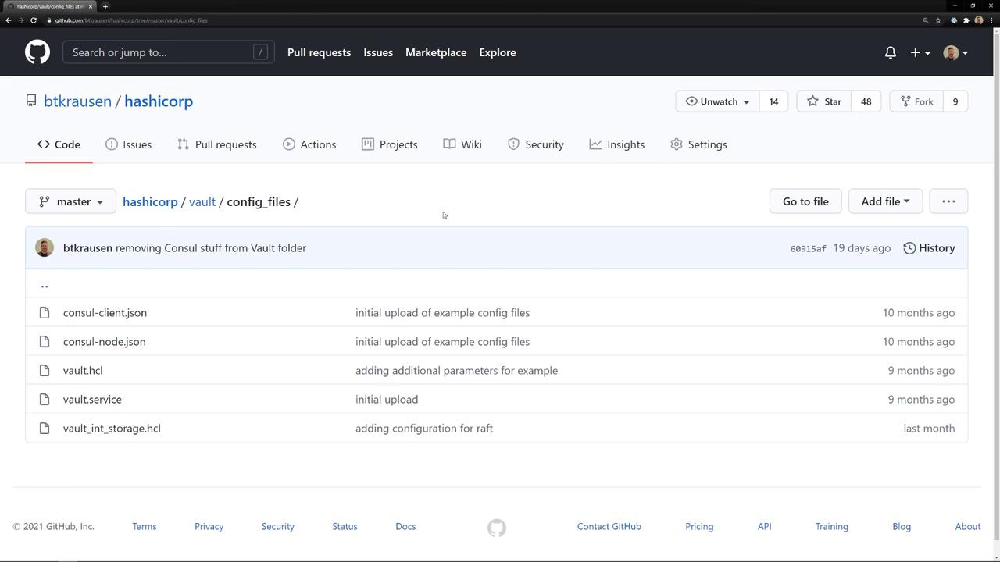

# List all cluster members
consul members

# Check Raft peer status
consul operator raft list-peers
```

Example output:

```bash theme={null}
Node            Address             Status  Type    Build       Protocol  DC         Segment
consul-node-a   10.0.101.110:8301   alive   server  1.9.3+ent   2         us-east-1  <all>
consul-node-b   10.0.101.248:8301   alive   server  1.9.3+ent   2         us-east-1  <all>
```

```bash theme={null}
Node            ID                                   Address              State     Voter  RaftProtocol
consul-node-a   9655caa5-8d6d-bb5b-b087-df7acc277d60  10.0.101.110:8300    leader    true   3
consul-node-b   7d69d582-7308-b1e8-ff51-8c4899f2df43  10.0.101.248:8300    follower  true   3
```

<Callout icon="lightbulb">
  `consul-node-a` is the Raft leader, while `consul-node-b` is a follower. Maintaining at least three servers is recommended for high availability.
</Callout>

### Cluster Members Overview

| Node          | Address           | Status | Type   | DC        | Segment |
| ------------- | ----------------- | ------ | ------ | --------- | ------- |
| consul-node-a | 10.0.101.110:8301 | alive  | server | us-east-1 | \<all>  |
| consul-node-b | 10.0.101.248:8301 | alive  | server | us-east-1 | \<all>  |

## Adding a New Client Agent

1. **Prepare the client config**\
   On your new machine (`web-server-01`), create `/etc/consul.d/config.hcl`:

   ```hcl theme={null}
   node_name  = "web-server-01"
   server     = false
   datacenter = "us-east-1"
   ```

2. **Start the Consul agent**
   ```bash theme={null}
   sudo systemctl start consul
   ```

3. **Verify local membership**

   ```bash theme={null}
   consul members
   ```

   Expected:

   ```bash theme={null}
   Node            Address             Status  Type    Build       Protocol  DC         Segment
   web-server-01   10.0.101.177:8301   alive   client  1.9.3+ent   2         us-east-1  <default>
   ```

4. **Join the cluster**

   ```bash theme={null}
   consul join 10.0.101.110
   ```

   ```bash theme={null}
   Successfully joined cluster by contacting 10.0.101.110
   ```

5. **Confirm membership across the cluster**

   ```bash theme={null}
   consul members
   ```

   All nodes:

   ```bash theme={null}
   Node            Address             Status  Type    Build       Protocol  DC         Segment
   consul-node-a   10.0.101.110:8301   alive   server  1.9.3+ent   2         us-east-1  <all>
   consul-node-b   10.0.101.248:8301   alive   server  1.9.3+ent   2         us-east-1  <all>
   web-server-01   10.0.101.177:8301   alive   client  1.9.3+ent   2         us-east-1  <default>
   ```

<Callout icon="lightbulb">
  For automatic retries, add a `retry_join` block in your client config. You can also leverage cloud auto-join or gossip keys—see [Consul auto-join][consul-join] for details.
</Callout>

## Removing a Client Agent

### Graceful Leave

On the client (`web-server-01`), run:

```bash theme={null}
consul leave
```

```bash theme={null}
==> Graceful leave complete, shutting down agent...
```

On any server, you’ll see the client marked as `left`:

```bash theme={null}
consul members
```

```bash theme={null}
Node            Address             Status  Type    Build       Protocol  DC         Segment
consul-node-a   10.0.101.110:8301   alive   server  1.9.3+ent   2         us-east-1  <all>
consul-node-b   10.0.101.248:8301   alive   server  1.9.3+ent   2         us-east-1  <all>
web-server-01   10.0.101.177:8301   left    client  1.9.3+ent   2         us-east-1  <default>
```

### Forceful Removal

If a client is unresponsive or destroyed, use `force-leave` with pruning:

```bash theme={null}
consul force-leave --prune web-server-01
```

```bash theme={null}
consul members
```

```bash theme={null}
Node            Address             Status  Type    Build       Protocol  DC         Segment
consul-node-a   10.0.101.110:8301   alive   server  1.9.3+ent   2         us-east-1  <all>
consul-node-b   10.0.101.248:8301   alive   server  1.9.3+ent   2         us-east-1  <all>
```

<Callout icon="triangle-alert">
  `force-leave` is destructive and should only be used when an agent cannot leave gracefully. It immediately prunes the node from the membership list.
</Callout>

## References

* [Consul Documentation][consul-docs]
* [consul members][consul-members]
* [consul join][consul-join]
* [consul force-leave][consul-force-leave]

[consul-docs]: https://www.consul.io/docs

[consul-members]: https://www.consul.io/docs/commands/members

[consul-join]: https://www.consul.io/docs/commands/join

[consul-force-leave]: https://www.consul.io/docs/commands/force-leave

<CardGroup>
  <Card title="Watch Video" icon="video" href="https://learn.kodekloud.com/user/courses/hashicorp-certified-consul-associate-certification/module/a1f79019-1fbb-4b11-8935-0f09bdc9da3c/lesson/90fb1417-882a-4adb-8074-aa1d32b302e2" />

  <Card title="Practice Lab" icon="installation" href="https://learn.kodekloud.com/user/courses/hashicorp-certified-consul-associate-certification/module/a1f79019-1fbb-4b11-8935-0f09bdc9da3c/lesson/8e98ff95-3956-49ad-be78-8b5a3980145f" />
</CardGroup>


# Demo Creating a Consul Agent Configuration

Source: https://notes.kodekloud.com/docs/HashiCorp-Certified-Consul-Associate-Certification/Deploy-a-Single-Datacenter/Demo-Creating-a-Consul-Agent-Configuration/page

This guide explains how to configure a HashiCorp Consul agent in server and client modes using example files from GitHub.

In this guide, you’ll learn how to configure a **HashiCorp Consul** agent—both server and client modes—using example files hosted on GitHub. Follow along by visiting the Consul folder in the repository:

[https://github.[AWS_SECRET_ACCESS_KEY]](https://github.[AWS_SECRET_ACCESS_KEY])

## Consul Server Agent Configuration (JSON)

Below is a complete JSON example for a Consul server agent. This configuration enables Raft consensus, TLS encryption, and ACL enforcement.

```json theme={null}
{
  "log_level": "INFO",
  "server": true,
  "key_file": "/etc/consul.d/cert.key",
  "cert_file": "/etc/consul.d/client.pem",
  "ca_file": "/etc/consul.d/chain.pem",
  "verify_incoming": true,
  "verify_outgoing": true,
  "verify_server_hostname": true,
  "ui": true,
  "encrypt": "xxxxxxxxxxxxxx",
  "leave_on_terminate": true,
  "data_dir": "/opt/consul/data",
  "datacenter": "us-east-1",
  "client_addr": "0.0.0.0",
  "bind_addr": "10.11.11.11",
  "advertise_addr": "10.11.11.11",
  "bootstrap_expect": 5,
  "retry_join": [
    "provider=aws tag_key=Environment-Name tag_value=consul-cluster region=us-east-1"
  ],
  "enable_syslog": true,
  "acl": {
    "enabled": true,
    "default_policy": "deny",
    "down_policy": "extend-cache",
    "tokens": {
      "agent": "xxxxxxxx-xxxx-xxxx-xxxx-xxxxxxxxxxxx"
    }
  },
  "performance": {
    "raft_multiplier": 1
  }
}
```

### Key Settings Overview

| Setting                           | Description                                                                                               | Example                                         |
| --------------------------------- | --------------------------------------------------------------------------------------------------------- | ----------------------------------------------- |
| log\_level                        | Controls log verbosity (e.g., `INFO`, `DEBUG`).                                                           | `"INFO"`                                        |
| server                            | Enables server mode; participates in Raft elections and stores cluster state.                             | `true`                                          |
| key\_file / cert\_file / ca\_file | Paths to TLS key, certificate, and CA used for mutual TLS on RPC and HTTP APIs.                           | `/etc/consul.d/cert.key`                        |
| verify\_incoming / outgoing       | Enforces mutual TLS for all RPC/API calls.                                                                | `true`                                          |
| verify\_server\_hostname          | Validates server hostname in TLS certificates.                                                            | `true`                                          |
| ui                                | Enables the built-in Consul Web UI.                                                                       | `true`                                          |
| encrypt                           | Gossip encryption key for securing cluster communication.                                                 | `"xxxxxxxxxxxxxx"`                              |
| leave\_on\_terminate              | Ensures the agent cleanly leaves the gossip pool when stopped.                                            | `true`                                          |
| data\_dir                         | Directory for storing Consul state and snapshots.                                                         | `/opt/consul/data`                              |
| datacenter                        | Logical datacenter identifier (default: `dc1`).                                                           | `"us-east-1"`                                   |
| client\_addr / bind\_addr         | Network addresses for HTTP/RPC bindings and gossip interface.                                             | `"0.0.0.0"`, `"10.11.11.11"`                    |
| advertise\_addr                   | Address announced to peers for incoming connections.                                                      | `"10.11.11.11"`                                 |
| bootstrap\_expect                 | Number of server nodes to wait for before bootstrapping the cluster.                                      | `5`                                             |
| retry\_join                       | Auto-join peers using AWS tags.                                                                           | `["provider=aws tag_key=Environment-Name ..."]` |
| enable\_syslog                    | Sends agent logs to the local syslog.                                                                     | `true`                                          |
| acl.enabled / default\_policy     | Enables ACLs with restrictive defaults—requires a token for all operations.                               | see JSON block                                  |
| down\_policy                      | Defines behavior when ACL system is down (e.g., `extend-cache`).                                          | `"extend-cache"`                                |
| performance.raft\_multiplier      | Multiplier for Raft timeouts; setting to `1` improves failure detection speed in production environments. | `1`                                             |

<Callout icon="lightbulb">
  For production clusters, configure at least 3–5 server agents and set `bootstrap_expect` accordingly to ensure high availability.
</Callout>

***

## Minimal Consul Client Agent Configuration (JSON)

Use the following JSON snippet for a lightweight Consul client that joins an existing cluster. It includes essential TLS settings, gossip encryption, and ACL tokens.

```json theme={null}
{
  "log_level": "INFO",
  "server": false,
  "node_name": "node-a.example.com",
  "key_file": "/etc/consul.d/cert.key",
  "cert_file": "/etc/consul.d/client.pem",
  "ca_file": "/etc/consul.d/chain.pem",
  "verify_incoming": true,
  "verify_outgoing": true,
  "encrypt": "xxxxxxxxxxxxxxxxxxxx",
  "data_dir": "/opt/consul/data",
  "datacenter": "us-east-1",
  "bind_addr": "10.10.10.10",
  "client_addr": "0.0.0.0",
  "retry_join": [
    "provider=aws tag_key=Environment-Name tag_value=consul-cluster region=us-east-1"
  ],
  "enable_syslog": true,
  "acl": {
    "tokens": {
      "agent": "xxxxxxxx-xxxx-xxxx-xxxx-xxxxxxxxxxxx"
    }
  }
}
```

<Callout icon="triangle-alert">
  Ensure your client node has network connectivity to the server agents and valid ACL tokens to authenticate API calls.
</Callout>

<Frame>
  
</Frame>

## Links and References

* [Consul Agent Configuration | Consul Documentation](https://www.consul.io/docs/agent/options)
* [GitHub Repository: btkrausen/hashicorp](https://github.com/btkrausen/hashicorp)
* [Terraform AWS Provider – Auto-Join Configuration](https://registry.terraform.io/providers/hashicorp/aws/latest/docs)

<CardGroup>
  <Card title="Watch Video" icon="video" href="https://learn.kodekloud.com/user/courses/hashicorp-certified-consul-associate-certification/module/a1f79019-1fbb-4b11-8935-0f09bdc9da3c/lesson/6e559769-c6ad-484f-ac9f-629b268e2969" />
</CardGroup>
