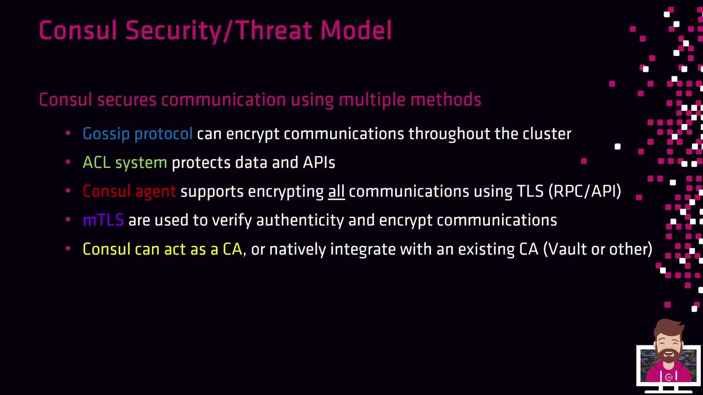

# consul.hcl
ports {
  http = 8500
}

tls {
  http      = true
  cert_file = "/path/to/consul.crt"
  key_file  = "/path/to/consul.key"
}
```

After restarting the agent, the API endpoint will require HTTPS.

## Consul as an Integrated CA

When no external CA provider is configured, Consul’s built-in CA will:

* Issue leaf certificates for servers, clients, and Connect proxies
* Automatically distribute new certificates as agents join
* Rotate certificates based on your CA configuration

<Callout icon="lightbulb">
  Consul’s integrated CA simplifies setup by removing manual renewal tasks. It’s ideal for most small-to-medium deployments.
</Callout>

<Frame>
  
</Frame>

## Operator Method: Manual Certificate Management

If you need full control or must integrate with an existing PKI, use the operator method:

1. Use your internal CA (or Consul’s CA) to generate server and client certificates.
2. Manually copy `*.crt` and `*.key` files to each Consul agent.
3. Update the agent configuration to point at your certificates.

This approach grants maximum flexibility but increases operational overhead.

## Signing and Trust Requirements

All certificates in your Consul cluster—server, client, and proxy—**must** be signed by the *same* CA. Consul only accepts a single root CA bundle for validation. Mixing certificates from multiple CAs will lead to trust failures.

<Callout icon="triangle-alert">
  If any certificate chain does not match the configured root CA bundle, Consul agents will refuse to connect, causing service disruptions.
</Callout>

## Migrating to an External CA

You can switch from the built-in CA to an external provider (e.g., Vault) without downtime:

1. Start Consul with the embedded CA.
2. Configure the external CA provider in your `consul.hcl` (e.g., Vault).
3. Restart agents one by one—Consul will re-issue certificates using the new provider.

This in-place migration ensures continuous cluster operation.

## References

* [Consul TLS Overview](https://www.consul.io/docs/security/tls)
* [Consul Connect (Service Mesh)](https://www.consul.io/docs/connect)
* [Configuring TLS for the HTTP API](https://www.consul.io/docs/agent/options#tls)
* [Vault CA Provider for Consul](https://www.consul.io/docs/enterprise/vault)

<CardGroup>
  <Card title="Watch Video" icon="video" href="https://learn.kodekloud.com/user/courses/hashicorp-certified-consul-associate-certification/module/777a613c-50bc-474c-9597-aec67eec52e0/lesson/7e48c5f6-9f5d-4e65-bcb9-692313d4c65c" />
</CardGroup>


# Consul SecurityThreat Model

Source: https://notes.kodekloud.com/docs/HashiCorp-Certified-Consul-Associate-Certification/Secure-Agent-Communication/Consul-SecurityThreat-Model/page

This article discusses securing Consul deployments through various components like encryption, ACLs, TLS, mTLS, and certificate authority integration.

In its default state, Consul transmits all RPC, API, Raft, and Gossip traffic in clear text. To harden your Consul deployment, enable and configure each of the following security components:

| Component                  | Purpose                                                         | Configuration Example                           |
| -------------------------- | --------------------------------------------------------------- | ----------------------------------------------- |
| Gossip Protocol Encryption | Encrypt Serf membership and failure-detection traffic           | `encrypt = "BASE64_KEY"`                        |
| Built-in ACL System        | Enforce fine-grained access control on KV store and APIs        | `"acl": { "enabled": true, ... }`               |
| Consul Agent TLS           | Secure agent-to-agent RPC and HTTP API                          | `"tls_cert_file": "/path/to/agent.crt", ...`    |
| Mutual TLS (mTLS)          | Encrypt and authenticate service-to-service communication       | Each service presents and verifies certificates |
| Certificate Authority (CA) | Issue and rotate certificates via Consul or external CA (Vault) | `consul tls cert create -server`                |

<Frame>
  
</Frame>

***

## 1. Gossip Protocol Encryption & ACL System

Consul uses Serf’s Gossip protocol for intra-cluster membership and failure detection. Without encryption, Serf messages are vulnerable to eavesdropping or injection.

<Callout icon="triangle-alert">
  If you skip Gossip encryption, all Serf traffic (including cluster health checks) is sent in clear text.
</Callout>

### Enable Gossip Encryption

Add a shared symmetric key to every server and client configuration:

```hcl theme={null}
