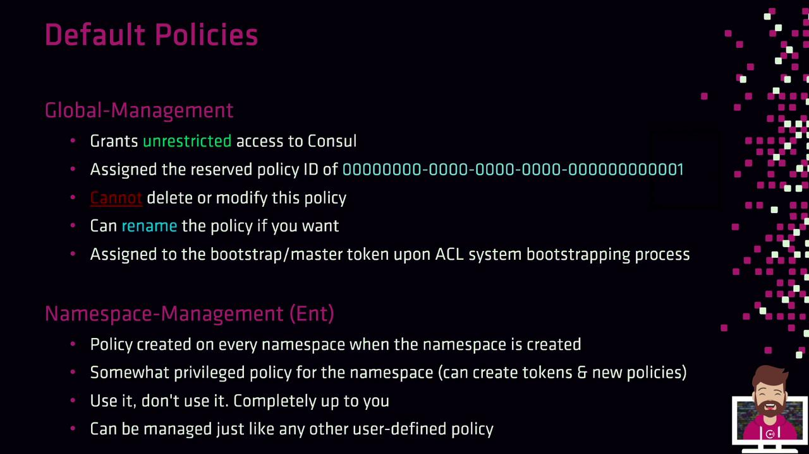
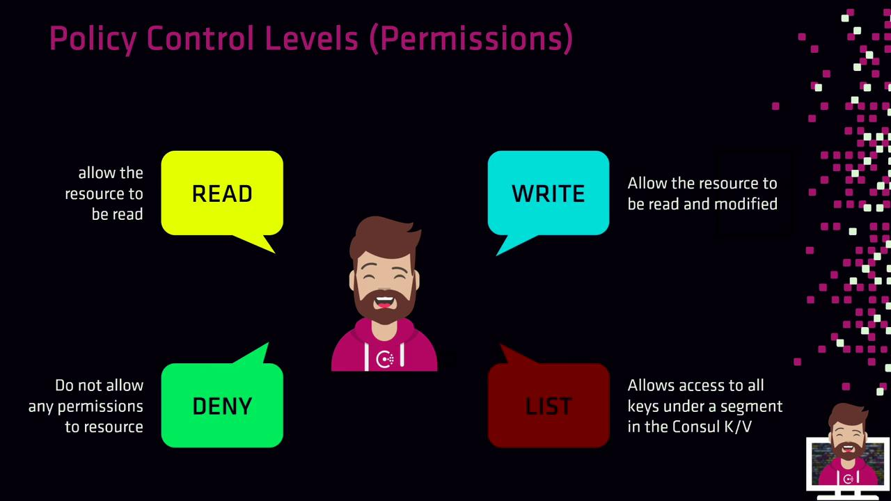

# Creating ACL Policies

Source: https://notes.kodekloud.com/docs/HashiCorp-Certified-Consul-Associate-Certification/Secure-Services-with-Basic-ACLs/Creating-ACL-Policies/page

Learn to define and manage ACL policies in HashiCorp Consul for fine-grained access control and enhanced security.

Learn how to define and manage ACL policies in HashiCorp Consul to enforce fine-grained access control and enhance security.

## What Is a Policy?

An ACL policy in Consul is a named collection of rules that govern the permissions of one or more tokens. Policies are:

* **Reusable**: Attach the same policy to multiple tokens.
* **Composable**: A token’s effective permissions are the union of all its policies.
* **Modular**: In production, you might create distinct policies for:
  * Each Consul server node
  * Different client applications
  * The Consul Snapshot Agent (for backups)
  * Any other process interacting with Consul

Each policy includes:

* **ID**: Auto-generated, immutable public identifier
* **Name**: Unique within the Consul cluster
* **Description** (optional): Human-readable notes
* **Rules**: HCL or JSON granting or denying permissions
* **Datacenters** (optional): Scopes where the policy applies
* **Namespace** (Enterprise only): Limits policy to a namespace

## Default Consul Policies

When you bootstrap Consul’s ACL system, two built-in policies are created by default:

<Frame>
  
</Frame>

1. **Global-Management**
   * Policy ID: `00000000-0000-0000-0000-000000000001`
   * Unrestricted access to the entire cluster
   * Cannot be deleted or modified (rename allowed)
   * Auto-assigned to the bootstrap master token

2. **Namespace-Management** (Enterprise only)
   * Created per namespace
   * Manages policies and tokens within its namespace
   * Behaves like a user-defined policy

## Policy Control Levels

Control levels determine how rules interact with resources. Consul supports four levels:

| Control Level | Description                                      |
| ------------- | ------------------------------------------------ |
| read          | Retrieve resource data                           |
| write         | Modify or create resources and read them         |
| deny          | Block access regardless of other policies        |
| list          | Enumerate keys or resources under a given prefix |

<Frame>
  
</Frame>

## ACL Resource Types

Consul ACL rules apply to various resource types. Below is a breakdown of **common** and **advanced** resources:

| Resource Type                                    | Description                              | Use Case           |
| ------------------------------------------------ | ---------------------------------------- | ------------------ |
| `key`, `key_prefix`                              | KV store operations                      | Common             |
| `node`, `node_prefix`                            | Node registration and catalog            | Common             |
| `service`, `service_prefix`                      | Service discovery and health checks      | Common             |
| `acl`, `agent`, `event`, `keyring`               | ACL management, agent operations, events | Advanced scenarios |
| `operator`, `query`, `session`, `prepared_query` | Cluster control, queries, and sessions   | Advanced scenarios |

<Frame>
  
</Frame>

## Exact vs. Prefix Matching

### Exact Match

Grant permissions on a single, named resource:

```hcl theme={null}
key "kv/apps/web-app-01" {
  policy = "write"
}

service "customer-db" {
  policy = "read"
}
```

* Only the key at `kv/apps/web-app-01` is writable.
* Only the service `customer-db` is readable.

### Prefix Match

Cover multiple resources under a common prefix:

```hcl theme={null}
key_prefix "kv/" {
  policy = "read"
}

service_prefix "" {
  policy = "read"
}
```

* Any key under `kv/` is readable.
* All services (empty prefix) are readable.

## Full Policy Example

Below is a complete policy granting specific rights to a web server and application:

```hcl theme={null}
