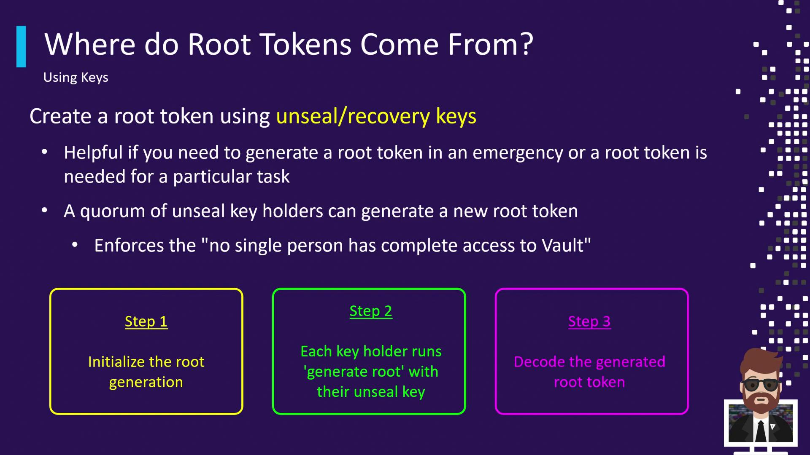

# ...
Initial Root Token: s.<initial-root-token>
# ...
```

### 2. Creating from an Existing Root Token

If you already have a root token, log in and issue a new one:

```bash theme={null}
$ vault login s.<existing-root-token>
Success! You are now authenticated.

$ vault token create
Key                Value
---                -----
token              s.<new-root-token>
token_duration     ∞
token_policies     ["root"]
policies           ["root"]
```

### 3. Emergency Recovery with Unseal/Recovery Keys

In critical scenarios where Vault’s normal auth is down, you can regenerate a root token using a quorum of recovery keys.

<Frame>
  
</Frame>

#### Step 1: Initialize Root Generation

Generate a nonce and one-time password (OTP):

```bash theme={null}
$ vault operator generate-root -init
Nonce        5b6e3831-2a45-4695-7757-5810074d36c8
Started      true
Progress     0/3
Complete     false
OTP          E87jF6ZeJo8NjJwytl7mvKLER
OTP Length   26
```

#### Step 2: Submit Unseal Keys

Each key holder submits their unseal key. Repeat until the threshold is met (e.g., 3/3):

```bash theme={null}
$ vault operator generate-root
Root generation operation nonce: 5b6e3831-2a45-...
Unseal Key (will be hidden):
Progress   1/3
Complete   false
```

#### Step 3: Decode the Root Token

Once the threshold is reached, use the OTP to decrypt the encoded token:

```bash theme={null}
$ vault operator generate-root \
    -otp="E87jF6ZeJo8NjJwytl7mvKLER" \
    -decode="G2NeKUZgXTsYYxILAC9ZFBguPw9ZBovFAs"
Root token: s.<recovered-root-token>
```

After resolving the emergency, **revoke** the recovered root token:

```bash theme={null}
$ vault token revoke s.<recovered-root-token>
Success! Revoked token (if it existed)
```

## Key Takeaways

* Root tokens have unlimited privileges and no default expiration.
* Restrict use to initial setup, testing, or emergency recovery only.
* Always revoke root tokens immediately after use.
* Generate root tokens via initialization, an existing root token, or a quorum of unseal keys.

## References

* [Vault Authentication Methods](https://www.vaultproject.io/docs/auth)
* [Vault Operator Commands](https://www.vaultproject.io/docs/commands/operator)
* [HashiCorp Vault Best Practices](https://learn.hashicorp.com/collections/vault/best-practices)

<CardGroup>
  <Card title="Watch Video" icon="video" href="https://learn.kodekloud.com/user/courses/hashicorp-certified-vault-associate-certification/module/ffb53470-4115-4c47-aade-cb572b6b574f/lesson/59fe1273-e723-427c-9475-728705cf6c03" />
</CardGroup>


# Service Tokens with Use Limits

Source: https://notes.kodekloud.com/docs/HashiCorp-Certified-Vault-Associate-Certification/Assess-Vault-Tokens/Service-Tokens-with-Use-Limits/page

Service Tokens with Use Limits enable short-lived Vault tokens that expire after a TTL or a set number of uses, enhancing security and control over API calls.

Service Tokens with Use Limits allow you to issue short-lived Vault tokens that not only expire after a specified TTL but also revoke automatically once they’ve been used a set number of times. This provides fine-grained control over API calls and enhances your security posture.

## How Use-Limit Tokens Work

A Use-Limit Token behaves like a standard token—honoring both its `ttl` and `max_ttl`—but also tracks how many times it can be used. Vault will revoke the token when **either** of these conditions is met first:

* The token’s time-to-live (TTL) elapses
* The token’s allowed use count reaches zero

<Callout icon="lightbulb">
  Revoking on use limits protects against token replay and limits the blast radius if a token is exposed.
</Callout>

### Example Timeline

Imagine you create a token with:

* TTL: 24 hours
* Use limit: 3

| Time Elapsed | TTL Remaining | Uses Remaining | Status  |
| ------------ | ------------- | -------------- | ------- |
| 0 hours      | 24 hours      | 3              | Active  |
| 3 hours      | 21 hours      | 2              | Active  |
| 10 hours     | 14 hours      | 1              | Active  |
| 11 hours     | 13 hours      | 0              | Revoked |
| 24 hours     | 0 hours       | –              | Revoked |

* At \~11 hours, after the **third use**, the token is revoked immediately—even though it still had TTL left.
* If you waited the full 24 hours but used the token only once, Vault would revoke it on TTL expiry despite remaining uses.

## Creating a Service Token with Use Limits

Use the `-use-limit` flag when generating a token:

```bash theme={null}
vault token create \
  -policy="training" \
  -ttl="24h" \
  -use-limit=3
```

Example output:

```bash theme={null}
Key                Value
---                -----
token              s.abc123xyz
token_policies     [ "training" ]
ttl                24h
num_uses           3
...
```

This command issues a token with:

* **Policy**: `training`
* **TTL**: 24 hours
* **Maximum Uses**: 3

## Inspecting the Token

To check the remaining uses and TTL, run:

```bash theme={null}
vault token lookup s.abc123xyz
```

Example response:

```bash theme={null}
Key           Value
---           -----
id            s.abc123xyz
issue_time    2021-12-25T18:35:08.004652-08:00
ttl           23h59m
num_uses      3
```

The `num_uses` field shows how many times this token can still be used before Vault revokes it.

## Simulating Token Usage

Each time the token is used for an operation—such as reading a secret—Vault decrements the `num_uses` count. After the final allowed use, the token is revoked immediately.

```bash theme={null}
