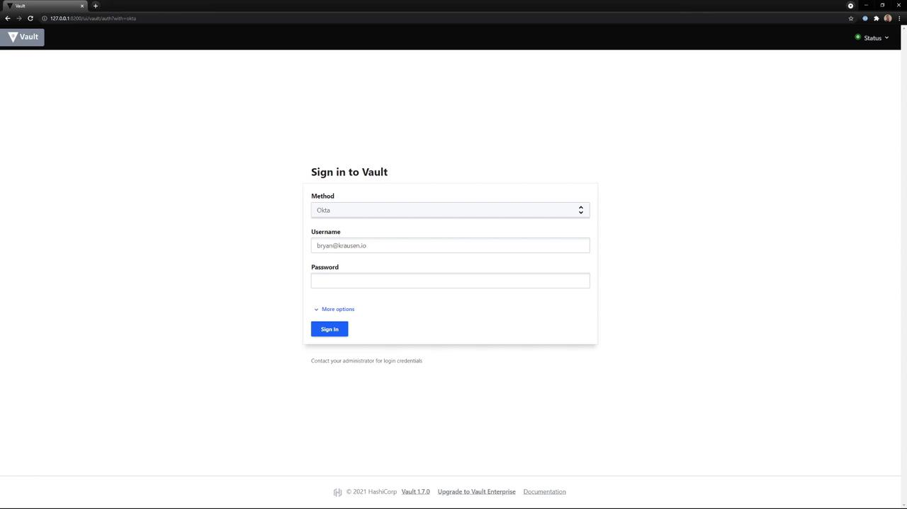
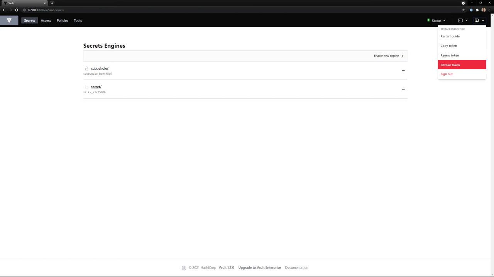

# Demo Vault Authentication using the UI

Source: https://notes.kodekloud.com/docs/HashiCorp-Certified-Vault-Associate-Certification/Compare-Authentication-Methods/Demo-Vault-Authentication-using-the-UI/page

This guide demonstrates how to authenticate to HashiCorp Vault using the Vault UI and switch to the CLI.

This guide demonstrates how to authenticate to HashiCorp Vault using the [Vault UI][vault-ui-docs]. You’ll learn how to log in with your preferred method, retrieve your client token, and switch to the CLI.

## Prerequisites

Ensure the following authentication methods are enabled in your Vault cluster:

| Auth Method | Description                 | Documentation                        |
| ----------- | --------------------------- | ------------------------------------ |
| token       | Static token authentication | [Token Auth][vault-token-docs]       |
| userpass    | Username/password login     | [Userpass Auth][vault-userpass-docs] |
| Okta        | Single sign-on with Okta    | [Okta Auth][vault-okta-docs]         |

## Step 1: Access the Vault UI

Open your browser and navigate to:

```text theme={null}
http://<your-vault-address>:8200
```

You will see the login screen where only the enabled methods appear in the dropdown.

<Callout icon="lightbulb">
  Only methods enabled on your Vault server will show up in the dropdown. Contact your administrator if you need a new auth method enabled.
</Callout>

## Step 2: Select and Authenticate

1. From the dropdown, choose **Okta** (or any enabled method).
2. Enter your **Username** and **Password**.
3. Click **Sign In**.

<Frame>
  
</Frame>

After successful authentication, Vault redirects you to its home screen.

## Step 3: Explore the Vault Home Screen

On the UI home screen, you can:

* Browse **Secret Engines** (e.g., `cubbyhole`, `secret`)
* View and manage **Tokens**
* Configure **Policies**

Click the user menu in the top-right corner to copy the client token issued during login.

<Frame>
  
</Frame>

## Step 4: Use Your Token in the CLI

Once you have your token, you can authenticate the Vault CLI:

```console theme={null}
