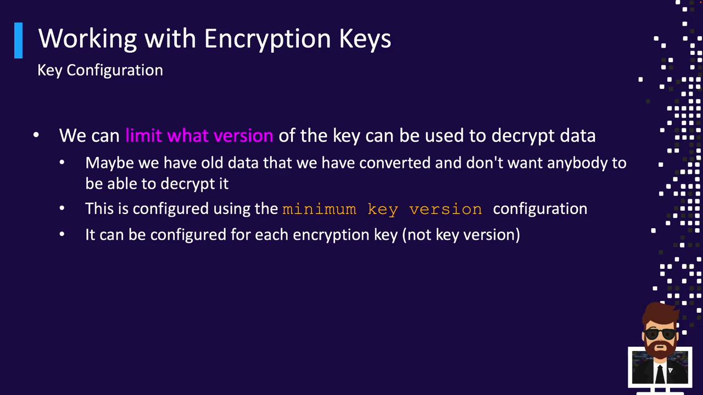
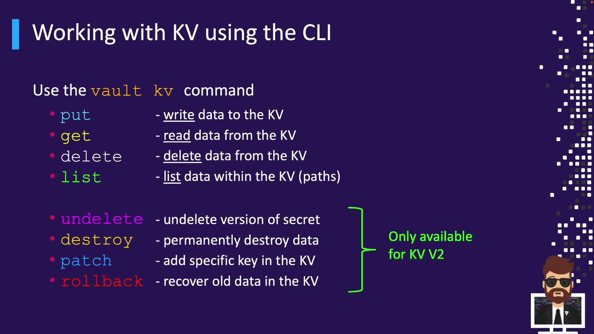
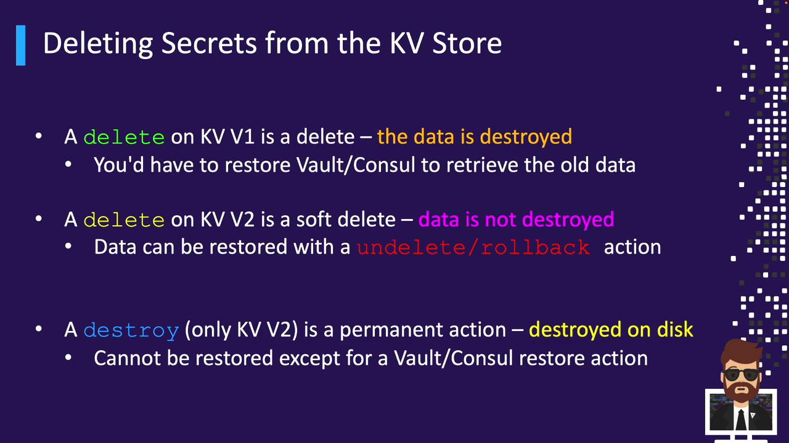

# Success! Enabled the transit secrets engine at: transit/
```

To use a custom path, append `-path`:

```bash theme={null}
vault secrets enable -path=custom-transit transit
# Success! Enabled the transit secrets engine at: custom-transit/
```

***

## 2. Create an Encryption Key

Every Transit operation requires a named key. Create `vault_training`:

```bash theme={null}
vault write -f transit/keys/vault_training
# Success! Data written to: transit/keys/vault_training
```

To specify a key type (e.g., RSA-4096):

```bash theme={null}
vault write -f transit/keys/training_rsa type="rsa-4096"
# Success! Data written to: transit/keys/training_rsa
```

### Supported Key Types

| Key Type               | Description                        |
| ---------------------- | ---------------------------------- |
| aes256-gcm96 (default) | AES-GCM symmetric encryption       |
| chacha20-poly1305      | ChaCha20-Poly1305 symmetric cipher |
| rsa-2048               | 2048-bit RSA asymmetric key        |
| rsa-3072               | 3072-bit RSA asymmetric key        |
| rsa-4096               | 4096-bit RSA asymmetric key        |

***

## 3. Encrypt Data

Vault expects Base64-encoded plaintext. Encrypt the string `Getting Started with HashiCorp Vault`:

```bash theme={null}
vault write transit/encrypt/vault_training \
  plaintext=$(base64 <<< "Getting Started with HashiCorp Vault")
```

Response:

```text theme={null}
Key          Value
---          -----
ciphertext   vault:v1:Fpyph6C7r5MUILiEiFhCoJbxelQbsGeEahal15LhDPSoN6HkTOhwn79DCwt0mctlttLokqikArOPAopzm2jQAKJg=
key_version  1
```

* `ciphertext`: Encrypted data with key version prefix (`vault:v1:`)
* `key_version`: Version of the key used

<Callout icon="lightbulb">
  You can use `base64 -d` to decode any Base64 output from Vault.
</Callout>

***

## 4. Decrypt Data

Pass the ciphertext back to Vault to decrypt:

```bash theme={null}
vault write transit/decrypt/vault_training \
  ciphertext="vault:v1:Fpyph6C7r5MUILiEiFhCoJbxelQbsGeEahal15LhDPSoN6HkTOhwn79DCwt0mctlttLokqikArOPAopzm2jQAKJg="
```

Response:

```text theme={null}
Key        Value
---        -----
plaintext  R2V0dGluZyBTdGFydGVkIHdpdGggSGFzaGlDb3JwIFZhdWx0Cg==
```

Decode to reveal the original message:

```bash theme={null}
echo "R2V0dGluZyBTdGFydGVkIHdpdGggSGFzaGlDb3JwIFZhdWx0Cg==" | base64 -d
# Getting Started with HashiCorp Vault
```

***

## 5. Rotate Encryption Keys

Regular key rotation enhances security. To rotate `vault_training`:

```bash theme={null}
vault write -f transit/keys/vault_training/rotate
# Success! Data written to: transit/keys/vault_training/rotate
```

Inspect all key versions:

```bash theme={null}
vault read transit/keys/vault_training
```

```text theme={null}
Key                    Value
---                    -----
keys                   map[1:1620000000 2:1620003600 3:1620007200]
latest_version         3
min_decryption_version 1
...
```

***

## 6. Configure Minimum Decryption Version

To prevent decryption with older keys, set `min_decryption_version`:

```bash theme={null}
vault write transit/keys/vault_training/config \
  min_decryption_version=4
# Success! Data written to: transit/keys/vault_training/config
```

Reading the key:

```bash theme={null}
vault read transit/keys/vault_training
```

<Frame>
  
</Frame>

```text theme={null}
Key                        Value
---                        -----
min_decryption_version     4
keys                       map[4:1620010800]
latest_version             4
...
```

Any ciphertext with versions below `4` will be rejected.

<Callout icon="triangle-alert">
  After raising `min_decryption_version`, older ciphertext **cannot** be decrypted. Plan rotations accordingly.
</Callout>

***

## 7. Rewrap Ciphertext

Rewrapping updates existing ciphertext to the newest key version without exposing plaintext:

```bash theme={null}
vault write transit/rewrap/vault_training \
  ciphertext="vault:v1:Fpyph6C7r5MUILiEiFhCoJbxelQbsGeEahal15LhDPSoN6HkTOhwn79DCwt0mctlttLokqikArOPAopzm2jQAKJg="
```

Response:

```text theme={null}
Key          Value
---          -----
ciphertext   vault:v4:RFzplkMpjtUIiS+6qxrNjIEdPqCepFUa2ivr70...
key_version  4
```

Vault decrypts with version `1` internally and re-encrypts with version `4`.

<Callout icon="lightbulb">
  Rewrap is ideal when you need to enforce new key policies on legacy data.
</Callout>

***

## Links and References

* [Vault Transit Secrets Engine](https://www.vaultproject.io/docs/secrets/transit)
* [Vault CLI Documentation](https://www.vaultproject.io/docs/commands)
* [Base64 Manual](https://linux.die.net/man/1/base64)

<CardGroup>
  <Card title="Watch Video" icon="video" href="https://learn.kodekloud.com/user/courses/hashicorp-certified-vault-associate-certification/module/cb962cde-84d3-4b26-8875-e8f093d77244/lesson/fea3f659-ec9e-4df9-a616-7974b619aa02" />
</CardGroup>


# Working with KV Secrets Engine

Source: https://notes.kodekloud.com/docs/HashiCorp-Certified-Vault-Associate-Certification/Compare-and-Configure-Secrets-Engines/Working-with-KV-Secrets-Engine/page

Learn to manage secrets with Vault’s KV Secrets Engine using the `vault kv` CLI, covering core and version-specific commands for automation.

In this guide, you’ll learn how to manage secrets with Vault’s Key/Value (KV) Secrets Engine using the `vault kv` CLI. We’ll cover KV version 1 and version 2 operations:

* Core commands: `put`, `get`, `delete`, `list`
* KV V2–only versioning commands: `undelete`, `destroy`, `patch`, `rollback`

Master these commands to automate secrets management in scripts and CI/CD pipelines.

## KV CLI Command Overview

Use `vault kv <subcommand>` to perform KV operations. The table below summarizes each subcommand:

| Subcommand | Description                               |
| ---------- | ----------------------------------------- |
| put        | Write or update secrets                   |
| get        | Read secrets                              |
| delete     | Remove latest version (soft delete in V2) |
| list       | List child keys                           |
| undelete   | Restore deleted version (KV V2 only)      |
| destroy    | Permanently delete specific versions      |
| patch      | Merge fields into an existing version     |
| rollback   | Revert to a previous version (KV V2)      |

<Frame>
  
</Frame>

***

## Writing Data with `vault kv put`

Use `vault kv put` to store or update secrets. The syntax is:

```bash theme={null}
vault kv put <mount-path>/<secret-path> key1=value1 key2=value2 ...
```

* `<mount-path>/<secret-path>`: The mount and path for your secret
* `key=value`: Each key/value pair becomes a field in the secret

### KV Version 1 vs. Version 2

#### KV V1 Example

```bash theme={null}
$ vault kv put kv/app/db pass=123
Success! Data written to: kv/app/db
```

#### KV V2 Example

```bash theme={null}
$ vault kv put kv/app/db pass=123
Key            Value
---            -----
creation_time  2022-12-15T04:35:56.395821Z
deletion_time  n/a
destroyed      false
version        1
```

On KV V2, `put` returns extra metadata (creation time, deletion time, destroyed flag, and version).

### Writing Multiple Pairs or JSON Files

Inline multiple pairs:

```bash theme={null}
$ vault kv put kv/app/db pass=123 user=admin api=a8ee4b50cce124
Success! Data written to: kv/app/db
```

<Callout icon="lightbulb">
  You can also read key/value pairs from a JSON file:

  ```bash theme={null}
  $ vault kv put kv/app/db @secrets.json
  ```

  `secrets.json` example:

  ```json theme={null}
  {"pass":"123","user":"admin","api":"a8ee4b50cce124"}
  ```
</Callout>

***

## Reading Data with `vault kv get`

Retrieve secrets in table or JSON format.

### Table Output

#### KV V1

```bash theme={null}
$ vault kv get kv/app/db
====== Data ======
Key    Value
----   -----
pass   123
user   admin
api    a8ee4b50cce124
```

#### KV V2

```bash theme={null}
$ vault kv get kv/app/db
===== Metadata =====
Key             Value
---             -----
creation_time   2022-12-15T04:35:56.395821Z
deletion_time   n/a
destroyed       false
version         1

===== Data =====
Key    Value
---    -----
pass   123
user   admin
api    a8ee4b50cce124
```

### JSON Output for Automation

```bash theme={null}
$ vault kv get -format=json kv/app/db
```

Pipe to [jq](https://stedolan.github.io/jq/) for CI/CD automation:

```bash theme={null}
vault kv get -format=json kv/app/db | jq '.data.data'
```

### Reading Specific Versions (KV V2)

* Default (latest): `vault kv get kv/app/db`
* Specific: `vault kv get -version=3 kv/app/db`

If the latest version is soft‐deleted, only metadata is returned.

***

## Updating Secrets

### Overwrite with `put`

A full `put` replaces all fields:

```bash theme={null}
$ vault kv put kv/app/db api=new-api-key
Key            Value
---            -----
version        2
```

Existing fields are lost; only the new `api` remains in version 2.

### Revert Changes with `rollback` (KV V2)

```bash theme={null}
$ vault kv rollback -version=1 kv/app/db
Key            Value
---            -----
version        3
```

This creates version 3 with data from version 1.

### Merge Fields with `patch` (KV V2)

```bash theme={null}
$ vault kv patch kv/app/db user=bryan
======= Metadata =======
Key            Value
---            -----
version        4
```

`patch` adds or updates fields without removing existing data.

***

## Deleting Secrets

<Frame>
  
</Frame>

### Soft Delete with `delete`

* KV V1: Permanently removes data
* KV V2: Marks the latest version as deleted (soft delete)

```bash theme={null}
$ vault kv delete secret/app/database
Success! Data deleted (if it existed) at: secret/app/database
```

#### After Delete

KV V1:

```bash theme={null}
$ vault kv get secret/app/database
No value found at secret/app/database
```

KV V2:

```bash theme={null}
$ vault kv get secret/app/database
===== Metadata =====
Key            Value
---            -----
version        3
deletion_time  2022-12-15T17:42:03.369955Z
destroyed      false
