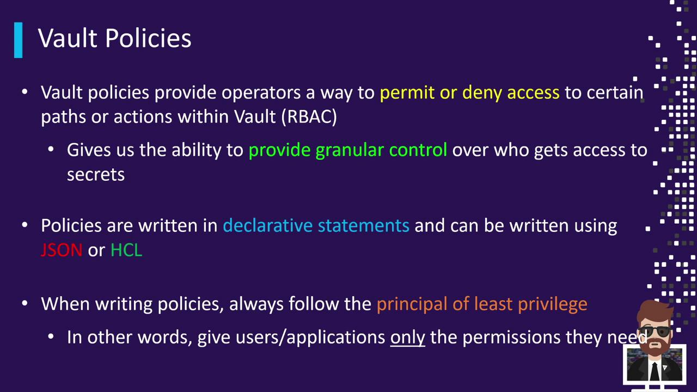
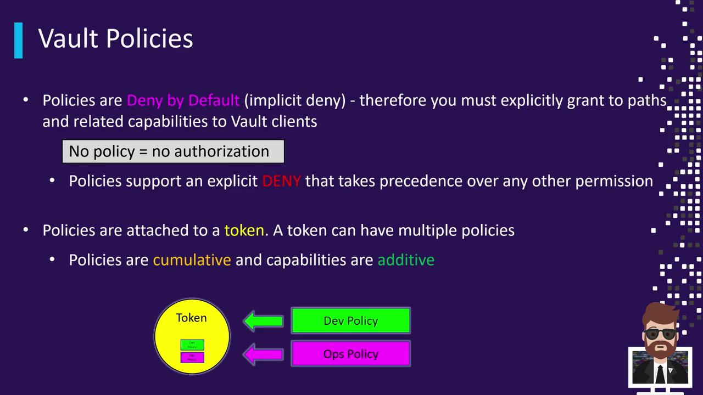
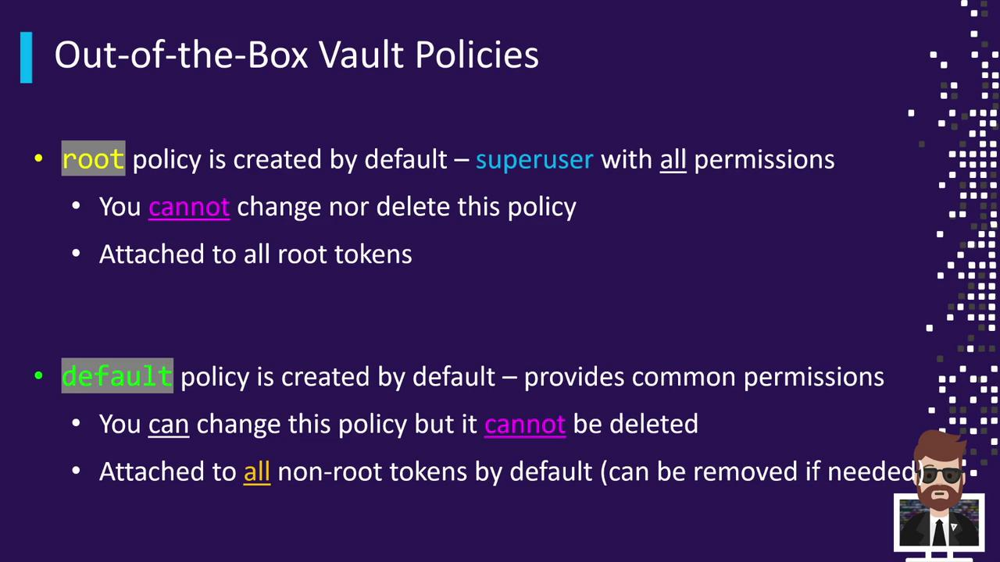

# Intro to Vault Policies

Source: https://notes.kodekloud.com/docs/HashiCorp-Certified-Vault-Associate-Certification/Create-Vault-Policies/Intro-to-Vault-Policies/page

This article explains Vault Policies in HashiCorp Vault, focusing on authorization, permissions, and the principle of least privilege.

Vault Policies are the core mechanism for enforcing authorization in HashiCorp Vault. By defining fine-grained permissions on Vault paths and operations, policies uphold the principle of least privilege. This ensures that diverse clients—DBAs creating dynamic database credentials, Packer builds pulling secrets, reporting applications querying data, CI/CD pipelines provisioning cloud resources, and administrators performing routine tasks—receive only the access they need.

<Frame>
  
</Frame>

## Why Use Vault Policies?

* Enforce Role-Based Access Control (RBAC)
* Segregate duties across automation tools and human operators
* Protect sensitive paths and actions
* Minimize blast radius by granting minimal required capabilities

<Callout icon="lightbulb">
  Always follow the principle of least privilege: grant only the permissions necessary for each client.
</Callout>

Vault supports policies authored in JSON or HCL (HashiCorp Configuration Language). HCL is more human-readable and is the community’s preferred choice for most configurations.

<Callout icon="lightbulb">
  For detailed syntax and examples, see the official [Vault Policy Syntax documentation](https://www.vaultproject.io/docs/concepts/policies).
</Callout>

Vault Policies operate under three fundamental rules:

| Feature         | Description                                                                                  |
| --------------- | -------------------------------------------------------------------------------------------- |
| Deny by Default | Any access not explicitly granted is automatically denied.                                   |
| Explicit Deny   | You may override allow rules by explicitly denying specific paths or capabilities.           |
| Cumulative      | A token can have multiple policies attached; its effective permissions are the union of all. |

<Frame>
  
</Frame>

When a client authenticates, Vault issues a token. Policies attached to that token determine the client’s capabilities. If multiple policies are attached, their permissions merge together.

Vault ships with two built-in policies:

| Policy Name | Description                                                | Modifiable | Attached To         |
| ----------- | ---------------------------------------------------------- | ---------- | ------------------- |
| `root`      | Grants unrestricted access to all Vault paths and actions. | No         | All root tokens     |
| `default`   | Allows basic token operations (lookup, renew, revoke).     | Yes        | All non-root tokens |

<Frame>
  
</Frame>

<Callout icon="triangle-alert">
  The `root` policy is implicit and **cannot** be viewed, modified, or deleted.
</Callout>

To list all available policies in your Vault server:

```bash theme={null}
vault policy list
